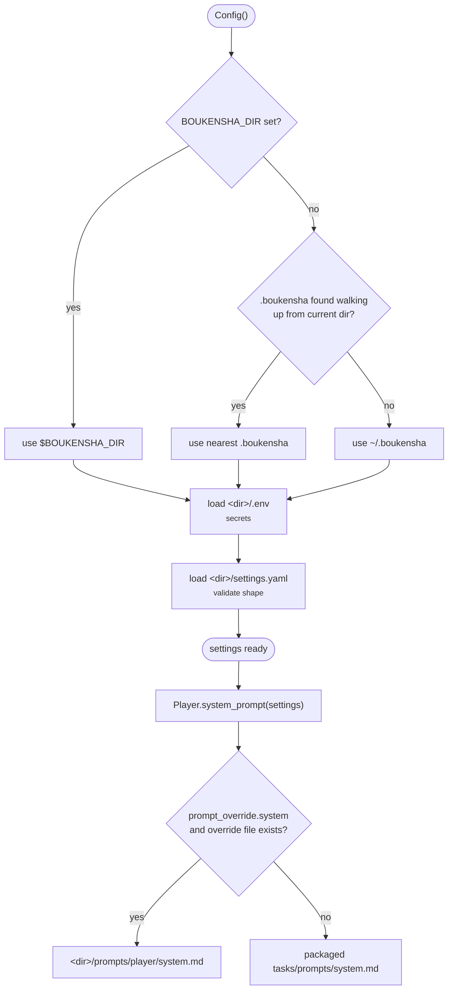

# Step 00 · Config plan

## Goal

The configuration layer: a single class, `Config`, as the source of truth for
all settings and secrets, and a small `Task` layer that resolves a task's
provider, model, and system prompt. Every later component reads its
configuration through this. Configuration is organised by **task**, a role in
the agent bound to its own model. This step drives a single `player` task, and
the structure allows more tasks later.

## Deliverables

The step package:

```
week1_baseline/agent/00_config/
├── pyproject.toml            # uv project: pinned Python, dependencies
├── README.md                 # written from the built step
├── boukensha/
│   ├── __init__.py
│   ├── config.py             # Config
│   └── tasks/
│       ├── base.py           # Task: provider / model / prompt resolution
│       ├── player.py         # Player(Task)
│       └── prompts/
│           └── system.md     # default system prompt, shipped with the package
└── examples/
    └── example.py            # runnable smoke test
```

The launcher:

```
week1_baseline/bin/00_config   # runs the example from week1_baseline/
```

The config directory, shipped at the repo root:

```
.boukensha/
├── settings.yaml             # non-secret settings, in the repo
├── .env                      # secrets, local only, gitignored
├── .env.example              # template of required keys, in the repo
└── prompts/
    └── player/system.md      # per-task system-prompt override
```

## Design

**`Config`.** Loads the config directory once at construction: `.env` first
(secrets into the environment), then `settings.yaml`. Settings are a nested
tree, read through a single nested-lookup helper. Public accessors are thin
calls over it with defaults. Directory resolution, in order:

1. `BOUKENSHA_DIR`: explicit override, points at any directory.
2. The nearest existing `.boukensha/` walking up from the current directory to
   the filesystem root, a project-local config works with no environment
   setup, like git's repo discovery.
3. `~/.boukensha`: the default outside any project tree.

Resolution runs before `.env` loads, so `BOUKENSHA_DIR` cannot be set from
within `.env`. The trade discovery accepts: resolution depends on where you
run, and the found directory's `.env` is loaded, so you trust the tree you run
in.

**Tolerant to absence, strict on malformation.** A missing `settings.yaml` or
`.env` is not an error: the agent runs on defaults, so a fresh install works.
If `settings.yaml` is present but malformed (not a mapping, or a task entry
that is not a mapping), `Config` raises an error naming the offending key and
the expected shape, rather than surfacing a confusing failure later.

**Secrets.** Secrets live only in `.env` and load into the environment;
`settings.yaml` holds none. `ANTHROPIC_API_KEY` and the MUD password
(`MUD_PASSWORD`) come from `.env`. `.env.example` documents the required keys
and is committed. The real `.env` is not.

**`Task` / `Player`.** `Task` is stateless: class methods over a task's
settings dict, no instances. `Player` is the only concrete task. `provider`
and `model` are required and raise a clear error naming the task when absent.

**System prompt resolution.** Per task, in order:

1. `.boukensha/prompts/<task>/system.md`: used when the task's
   `prompt_override.system` is `true` and the file exists.
2. `boukensha/tasks/prompts/system.md`: the default shipped inside the
   package, resolved via `importlib.resources` so it works installed as well
   as from source.

Path ownership: `Config` owns every path under the user's directory
(`user_prompt_path`). The tasks package owns the assets it ships.



**Idiom.** `pathlib` for paths, `@property` for attribute-style accessors,
type hints on the public surface, PyYAML for parsing (the standard library has
no YAML parser), `python-dotenv` for `.env`.

## Settings schema

```yaml
tasks:
  player:
    provider: anthropic
    model: claude-haiku-4-5
    prompt_override:
      system: true
mud:
  host: localhost
  port: 4000
  username: dummy
```

- `tasks.<name>.provider` / `model`: required per task.
- `tasks.<name>.prompt_override.system`: when `true`, use the task's prompt
  override file.
- `mud.host` / `port` / `username`: MUD connection (non-secret). The password
  is `MUD_PASSWORD` in `.env`.
- More characters later are additive: a list of identities under `mud:`, each
  password resolved as `MUD_PASSWORD_<USERNAME>` from `.env`, and nothing in this
  schema changes.

## Verification

```bash
bin/00_config          # from week1_baseline/; wraps:
uv run examples/example.py
```

The example first demonstrates the component offline: it prints the resolved
configuration (directory, tasks, provider/model, resolved system prompt, MUD
target, API-key presence), then walks the guarantees visibly, directory
resolution across the three branches, an empty directory running on defaults,
the malformation guard's message, and override-vs-default prompt resolution.
Compact assertions follow:

1. the resolved system prompt is non-empty (guards the default-prompt path);
2. walking up from the step directory finds the repo's `.boukensha`;
3. `BOUKENSHA_DIR` overrides discovery when set;
4. a missing `settings.yaml` runs on defaults rather than raising;
5. a malformed `settings.yaml` raises `ConfigError`.

## Done when

The launcher runs the example successfully against the repo-root `.boukensha`,
the assertions pass, a missing `settings.yaml`/`.env` still runs on defaults,
`settings.yaml` contains no secrets, and the step README is written from the
built step.
