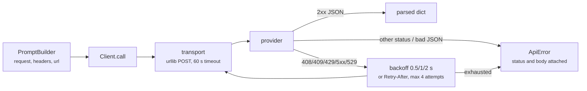

# Step 04 · API client plan

## Goal

Send the request the `PromptBuilder` assembles and hand back the provider's
raw parsed response. One HTTP POST, one response, with retries for the
failures every provider documents as transient. No tool loop and no response
normalization yet: this step proves the round trip.

## Scope

- The client posts, retries, and parses JSON. Interpreting the response
  (stop reason, content blocks, tool calls) is the agent loop's job, added in
  step 05 where the first reader of a response lives.
- Assertions run offline with an injected transport, no network and no API
  keys. A live round trip exists in the example behind an explicit
  `BOUKENSHA_LIVE=1` flag and is never part of the assertion path.
- The packaged default `prompts/system.md` is unchanged: the live prompt is
  the `.boukensha/prompts/player/` override, so the shipped default stays a
  provider-neutral fallback rather than game-specific wording.

## Deliverables

The step package carries step 03 forward and adds:

```
week1_baseline/agent/04_api_client/
├── pyproject.toml
├── README.md
├── boukensha/
│   ├── client.py              # Client: POST, retry, parse
│   ├── errors.py              # gains ApiError
│   └── ...                    # rest carried forward unchanged
├── examples/
│   └── example.py
```

The launcher: `week1_baseline/bin/04_api_client`.

## Design



### Client

`Client(builder, transport=None, sleep=None)` binds the one thing a call
needs, the `PromptBuilder`, plus two injection points for verification:

- `transport`: a callable `(url, headers, body) ->
  (status, body_text, response_headers)`. The response headers are in the
  contract so the retry loop can read `Retry-After`. The default posts with
  `urllib.request` from the standard library, so the HTTP call stays visible
  and the step adds no dependency.
- `sleep`: the delay function used between retries, `time.sleep` by default,
  injectable so assertions verify the backoff schedule without waiting.

`call(max_output_tokens=1024, thinking=None)` builds the request through the
bound builder, posts it, and returns the parsed JSON as a dict. `thinking`
passes through to `build_request`, the same optional dial the builder already
exposes.

### Transport

- The default transport POSTs `builder.url()` with `builder.headers()` and
  the JSON-encoded request body.
- TLS uses the standard library's default SSL context, which finds system
  certificates on every platform.
- The default transport sets a 60 second timeout, since `urllib` has none and
  a hung socket would otherwise block forever.
- An HTTP error status is a response, returned as
  `(status, body, headers)`. An
  `OSError` from the transport is a transient failure, which covers
  connection, timeout, DNS, and SSL errors.
- A connection that closes mid-response raises `http.client.IncompleteRead`
  (an `http.client.HTTPException`) or a bare `EOFError`. Neither is an
  `OSError`, and both escape `urllib` unwrapped. The retry loop treats
  `http.client.HTTPException` and `EOFError` as transient alongside `OSError`,
  so a truncated or cut connection retries instead of crashing.

### Retry policy

| Rule | Behavior |
|---|---|
| retryable statuses | 408, 409, 429, 500, 502, 503, 504, 529 |
| transient exceptions | any `OSError`, `http.client.HTTPException`, or `EOFError` raised by the transport |
| attempts | at most 4: the initial call plus 3 retries |
| backoff | 0.5 s, then 1.0 s, then 2.0 s (doubling from a 0.5 s base) |
| `Retry-After` | a numeric `Retry-After` on a retryable response replaces that wait, capped at 60 s (a defensive bound, the provider sets none) |
| exhaustion | `ApiError` naming the attempt count and the last status and body, or the last exception |
| non-retryable status | `ApiError` immediately, no retry, naming the status and body |

529 is retryable because Anthropic documents `overloaded_error` (529) as a
retry-with-backoff condition, and a numeric `Retry-After` is honored because
the provider documents its SDKs doing so. The 60 s cap is this project's
defensive bound, since the documentation specifies none.

### Errors

- `ApiError` joins the family in `boukensha/errors.py` and is exported at the
  package root.
- A non-2xx outcome always surfaces as `ApiError` with the status and body,
  never as a `None` or partial result.
- A 2xx body that is not valid JSON raises `ApiError` with a body preview,
  so a broken proxy or HTML error page fails with the evidence attached.
- An unsupported model needs no client-side error: the catalog already raises
  `ConfigError` at backend construction, before a client exists.

### What the response looks like

`call` returns the provider's response parsed and otherwise untouched. The
shapes differ per provider (Anthropic `content` blocks, OpenAI Responses
`output` items, Gemini `candidates`, Ollama `message`), and normalizing them
is deliberately left to the step that must read them.

### Sequencing per provider

The client itself is provider-blind: URL, headers, and body all come from the
builder, so one client serves all five backends. The offline example builds a
client per provider against a stub transport and checks each posts to its own
endpoint with its own auth form, the same walk the builder assertions pinned,
now through the client.

## Verification

Launcher: `bin/04_api_client`. The default run is offline: it prints the built
request, then checks the invariants below over a scripted transport with an
injected sleep, no keys, no network. The real round trip is gated behind
`BOUKENSHA_LIVE=1` and is never asserted.

| # | Offline invariant |
|---|---|
| 1 | a 429 then a 200 returns the parsed reply on the second attempt, after one 0.5 s sleep |
| 2 | a persistent 429 sleeps 0.5, 1.0, 2.0 over 4 attempts, then raises `ApiError` naming the status |
| 3 | a 401 raises `ApiError` on the first attempt with no sleep, status and body named |
| 4 | a numeric `Retry-After` replaces the backoff wait and is capped at 60 s |
| 5 | a 2xx body that is not JSON raises `ApiError` with a body preview |
| 6 | a connection cut mid-response (a bare `EOFError`, not an `OSError`) is transient: retried, then returns |
| 7 | each of the five backends posts to its own endpoint with its own auth form |

## Done when

The launcher runs the example, the offline invariants pass, prior steps still
pass, and the step README is written from the built step.
