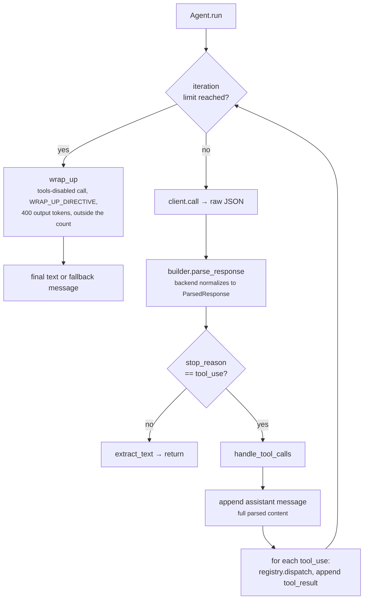

# Step 05 · Agent loop plan

## Goal

The agentic loop: the component that drives a turn. It calls the model, reads a
normalized response, dispatches every tool call the model makes back through the
registry, feeds the results into the conversation, and repeats until the model
signals it is done or a turn ceiling is reached. This is the first reader of a
provider response, so response normalization lands here too: each backend gains
a `parse_response` that turns its raw reply into one common typed shape the loop
understands, independent of provider.

## Scope

- `Agent.run` owns one turn: model call, tool dispatch, result feedback, stop
  detection, and a bounded wind-down when the iteration ceiling is hit.
- Response normalization: every backend implements `parse_response`, returning a
  `ParsedResponse` of typed content blocks and a stop reason. The reverse
  direction (typed blocks to each provider's wire messages) already exists in
  the backends from step 04, so this step only adds the read path.
- Assertions run offline. A scripted transport replays provider-shaped responses
  so the loop, the wind-down, and each backend's `parse_response` are checked
  with no network and no keys. A live turn stays behind `BOUKENSHA_LIVE=1` and is
  never asserted.
- Reasoning blocks are not part of the normalized shape. `parse_response`
  emits only text and tool_use, the loop consumes only those, and no reasoning
  block type exists in the data model. This is a deliberate scope line, not a
  deferral.
- `LoopError` is added to the error family but is not raised in this step. The
  loop winds down instead of raising. It is caught by the REPL from step 08
  onward, so it is introduced here for parity and export, unraised.

## Deliverables

The step package carries step 04 forward and adds:

```
week1_baseline/agent/05_agent_loop/
├── pyproject.toml
├── README.md                 # written from the built step
├── boukensha/
│   ├── agent.py              # NEW: Agent, the turn loop
│   ├── errors.py             # gains LoopError
│   ├── message.py            # gains ParsedResponse (typed normalized shape)
│   ├── prompt_builder.py     # gains parse_response, delegates to the backend
│   ├── client.py             # gains for_builder, a rebound client sharing transport/sleep
│   ├── tasks/base.py         # gains max_iterations, max_output_tokens
│   ├── backends/anthropic.py # gains parse_response
│   ├── backends/openai.py    # gains parse_response (Responses API shape)
│   ├── backends/gemini.py    # gains parse_response
│   ├── backends/ollama.py    # gains parse_response (OllamaCloud inherits it)
│   └── ...                   # rest carried forward unchanged
├── examples/
│   └── example.py            # offline loop + wind-down + parse checks, live turn gated
```

The launcher: `week1_baseline/bin/05_agent_loop`.

## Design



### The normalized shape

Five providers reply in five formats. Rather than teach the loop each one, every
backend converts its raw reply into one shape:

- `ParsedResponse(stop_reason: str, content: tuple[Block, ...])`, a frozen
  dataclass in `message.py`.
- `stop_reason` is `"tool_use"` or `"end_turn"`.
- `content` holds `TextBlock` and `ToolUseBlock` instances, the same typed
  blocks the data model already uses, so the loop builds an assistant `Message`
  from `content` directly with no dict-to-block step.

Normalization returns typed blocks, not plain dicts. The repo's data model is
typed content blocks with construction-time validation, and returning typed
blocks keeps the loop inside that model instead of reintroducing stringly-typed
dicts.

`PromptBuilder.parse_response(raw)` delegates to `backend.parse_response(raw)`.
`Client` is unchanged: it still returns the raw parsed
JSON, and normalization is the builder's and backend's job.

### parse_response per provider

Each backend reads its own reply. The reverse serialization it already ships in
step 04 fixes the field names each row must produce.

| Provider | text source | tool call source | call id | stop_reason == tool_use when |
|---|---|---|---|---|
| Anthropic | `content[]` blocks `type=="text"` | `content[]` blocks `type=="tool_use"` (`id`, `name`, `input`) | block `id` | `stop_reason == "tool_use"` |
| OpenAI | `output[]` message items, text content | `output[]` items `type=="function_call"` (`call_id`, `name`, `arguments` JSON string) | `call_id` | any `function_call` item present |
| Gemini | `candidates[0].content.parts[].text` | same parts `.functionCall` (`name`, `args`) | name reused | any `functionCall` part present |
| Ollama / OllamaCloud | `message.content` | `message.tool_calls[].function` (`name`, `arguments`) | name reused | `tool_calls` non-empty |

- OpenAI parses the Responses API shape (`output` items, `function_call`,
  `call_id`). The step-04 OpenAI backend speaks the Responses API, so the read
  path matches the write path.
- `OllamaCloud` inherits `parse_response` from `Ollama`: identical wire format,
  auth and URL are the only differences.
- Empty text yields no `TextBlock`. `arguments` that arrive as a JSON string
  (OpenAI) are parsed to a dict for `ToolUseBlock.input`.

### Call ids for keyless providers

Gemini, Ollama, and OllamaCloud assign no call id. Their `parse_response` reuses
the tool `name` as `ToolUseBlock.id`, and the loop sets `ToolResultBlock`'s
`tool_use_id` and `tool_name` both to that name, which is exactly what those
backends match a result back to a call by. Accepted limitation: a single
response with two calls to the same tool would collide on the shared id. This is
the provider's own matching constraint, not one we introduce. Anthropic and
OpenAI assign real ids, so they do not collide.

### Turn limits are trigger thresholds, not hard caps

- `Agent.MAX_ITERATIONS = 25` is the default ceiling. The enforced value comes
  from the constructor, which resolves in order: an explicit `max_iterations`
  argument, then the task's `max_iterations(settings)`, then the constant.
- A ceiling of `0` (or `None`) disables the limit.
- `iteration_limit_reached` is `max_iterations > 0 and iteration >=
  max_iterations`. Each work iteration increments the counter and prints
  `[iteration N/max]`.
- On reaching the ceiling the loop does not raise. It makes exactly one
  tools-disabled wind-down call, `wrap_up`, and returns its text. `wrap_up` runs
  outside the counted loop: it never rechecks the limit and never increments the
  counter, so it cannot re-trigger.

### wrap_up

- Appends a user message, `WRAP_UP_DIRECTIVE` (do not call tools, summarize what
  was done, what is unfinished, and the single next action).
- Issues one call with the toolset disabled and `WRAP_UP_OUTPUT_TOKENS = 400`.
- Returns the model's text, or a deterministic `fallback_message` naming the
  limit and reason when the reply is empty or the call raises `ApiError`.

The tools-disabled call carries no `tools` override parameter on `Client.call`.
Instead the agent builds a wrap-up `PromptBuilder` with an empty toolset and
issues the call through `Client.for_builder(wrap_builder)`, a new client bound to
that builder and sharing the original's transport and sleep. This keeps the
step-04 `call` signature intact, keeps the agent self-sufficient (it derives the
wind-down from what it holds), and stays offline-testable since the shared
transport is the injected one.

### Task ownership of the limits

`Task` gains two class methods over its settings dict:

- `max_iterations(settings)`: `int`-coerced, default 25.
- `max_output_tokens(settings)`: `int`-coerced, default 1024.

The agent reads these from the task it is handed, not from `Context`.
`Context` owns the system prompt and message history only, so the agent receives
the task and its settings directly and resolves the limits itself.

### Threading the thinking level

The agent is the sole originator of `client.call` from this step on, and
`Client.call` is the only path that reaches each backend's `build_request`, the
sole consumer of the thinking dial. So the agent must resolve and pass thinking
or the whole dial is inert.

- The constructor resolves `thinking` alongside the two limits, same order:
  explicit `thinking` argument, then `task.thinking(settings)`, then `None`.
- `None` means unset: `_call_opts` omits the field, `build_request` sends
  nothing, and the model default applies.
- A set level is passed on every work-iteration call, so a user who sets
  `tasks.player.thinking: high` gets it honored, not silently dropped.
- Budget models and the output cap: Anthropic counts thinking tokens toward
  `max_tokens` and rejects a request unless `budget_tokens < max_tokens`. Every
  budget (1024/4096/16384) sits at or above the default `max_output_tokens`
  (1024), so a work-iteration call with thinking set would be a 400 if the cap
  were sent as `max_tokens` unchanged. The Anthropic backend treats
  `max_output_tokens` as the response allowance and sets wire
  `max_tokens = budget_tokens + max_output_tokens`, so the budget always fits
  and the requested response room is preserved on top of it. The lift lives in
  the backend, where the wire constraint and the budget table are, not in the
  agent, which does not know provider budget sizes.
- The wind-down call deliberately does not carry thinking. It is a short, cheap
  summary bounded to `WRAP_UP_OUTPUT_TOKENS` (400), and spending a thinking
  budget on it defeats that purpose. The model default applies to the wind-down
  instead.

### handle_tool_calls

- Appends the assistant `Message` carrying the full parsed content (text and
  tool_use blocks) before any tool result. The assistant tool_use must precede
  its tool_result in history or the provider rejects the next request.
- Iterates every `ToolUseBlock` in the response, dispatching each through
  `registry.dispatch(name, input)` and appending a `ToolResultBlock` message with
  `tool_use_id` and `tool_name` set from the call and `content` set to
  `str(result)`. Multiple calls in one response are all handled before the next
  model call.

### Agent surface

| Member | Kind | Purpose |
|---|---|---|
| `Agent(context, registry, builder, client, *, task=None, task_settings=None, max_iterations=None, max_output_tokens=None, thinking=None)` | constructor | binds the turn's collaborators, resolves the limits and thinking level |
| `run()` | public | runs the turn, returns the final text |
| `MAX_ITERATIONS`, `WRAP_UP_OUTPUT_TOKENS`, `WRAP_UP_DIRECTIVE` | constants | ceiling default and wind-down settings |

Everything else (`wrap_up`, `handle_tool_calls`, `extract_text`, limit
resolution, `iteration_limit_reached`) is private.

### Example wiring

- Tools are registered on the `Registry` (single owner). The `PromptBuilder`
  receives `tuple(registry.tools.values())` as its request-time view, so the
  request schema and dispatch read the same tools without `Context` holding any.
- The example leads with a real run: the agent explores a small MUD world with
  `look` and `move`, driving the loop live against the configured provider. It
  is gated behind `BOUKENSHA_LIVE=1` and never asserted, since its text varies
  with the model.
- A lean offline block backs it over a scripted transport and an injected sleep:
  an Anthropic-shaped tool_use reply then an end_turn reply exercise dispatch and
  history order, a small `max_iterations` forces the wind-down, per-provider
  `parse_response` is checked against one scripted reply per shape, and the limit
  and thinking resolution ride a full scripted call.

## Verification

Launcher: `bin/05_agent_loop`. The default run is offline: the invariants below
use a scripted transport and an injected sleep, no keys, no network. The real run
is gated behind `BOUKENSHA_LIVE=1` and is never asserted.

| # | Offline invariant |
|---|---|
| 1 | a tool_use reply then an end_turn reply: the loop dispatches the tool and returns the final text |
| 2 | after a tool call the history is user, assistant (with the tool_use), tool_result, and the tool_result carries the call's `tool_use_id` and `tool_name` |
| 3 | two tool_use blocks in one reply are both dispatched before the next model call |
| 4 | reaching `max_iterations` winds down once with tools disabled and returns its text |
| 5 | a wind-down whose reply is empty returns the fallback message naming the limit |
| 6 | every backend normalizes its tool call into a `ToolUseBlock`, and OllamaCloud inherits Ollama's parse |
| 7 | the constructor resolves the iteration limit: explicit arg over task setting over the `MAX_ITERATIONS` default (25) |
| 8 | a task `thinking` level reaches the request body as a provider-valid block (budget model: enabled block with `budget_tokens < max_tokens`, response allowance preserved), and an unset setting sends no thinking field |
| 9 | `LoopError` is exported from the package root and is an `Exception` |

## Done when

The launcher runs the example, the offline invariants pass, prior steps still
pass, and the step README is written from the built step.
