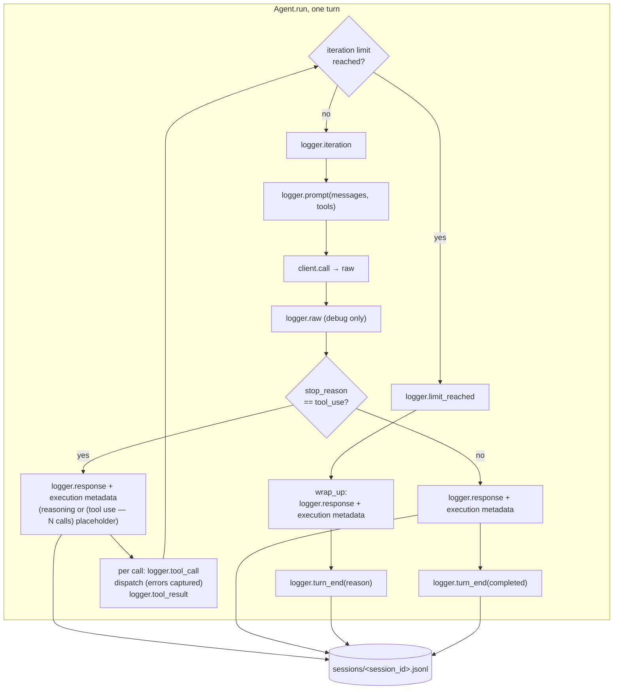

# Step 06 · The Logger plan

## Goal

A structured recorder for each turn. `Logger` writes one JSON Lines file per
session under the config directory's `sessions/` folder, one complete JSON
object per line, each tagged with `session_id`, `at`, and `phase`. This is a
file logger for machine reading and `tail`/`grep`, not user-facing display.
The agent's bare `print` calls from step 05 become logger phase events, and the
response event carries execution metadata: the active task, provider, model,
normalized token counts, and an estimated USD cost when the model has per-token
pricing.

## Scope

The session logger and its step-06 agent wiring. Every public method and data
element is described below.

- Constructor `Logger(session_id=None, dir=None, log=None, snapshot=None,
  debug=False)`: resolves `session_id` (generated when absent) and `path`
  (`log` verbatim, else `<dir or default_dir>/<session_id>.jsonl`), creates the
  parent directory, opens the file in append mode, and writes a `session_start`
  line merged with `snapshot`.
- Read-only `session_id` and `path`.
- One method per phase, each writing one line:
  - `iteration(n, max)`: loop counter.
  - `limit_reached(kind, n, max)`: the ceiling trigger.
  - `turn_end(reason, iterations, tokens=None)`: the turn's terminal line.
  - `prompt(messages, tools)`: `message_count`, serialized `messages`,
    `tool_count`, and `tools` (the tool names).
  - `tool_call(name, args)`.
  - `tool_result(name, result, ok=True, error=None)`: `result` stringified.
  - `response(text, usage=None, stop_reason=None, task=None, backend=None)`:
    `text` stripped, `usage`, `stop_reason`, plus the execution-metadata block.
  - `raw(data)`: emitted only when the logger is in debug mode.
  - `close()`: closes the file handle.
- Line assembly `write_log`: merges `session_id` and `at` (an ISO 8601
  timestamp) into every event, writes one JSON line, flushes.
- `generate_session_id`: `<UTC %Y%m%dT%H%M%SZ>-<4-byte hex>`.
- `serialize_message`: `{role, content}` with content as explicit block dicts.
- Execution metadata: `execution_metadata(task, backend, usage)` builds
  `{task, provider, model, usage_unit, usage_level, input_tokens,
  output_tokens, cost_usd}` and drops null entries. Returns empty when task,
  backend, and usage are all absent. Helpers: `task_name`, `provider_name`,
  `usage_tokens`, `first_integer`, `estimate_cost`.
- Agent changes for this step:
  - the constructor takes a `logger`.
  - the loop emits `iteration`, `prompt`, `raw`, `limit_reached`, `turn_end`,
    `tool_call`, `tool_result`, and `response`.
  - tool dispatch is wrapped so a raising tool becomes an
    `ERROR: <type>: <message>` result logged `ok=False`.
  - `log_response` and `normalized_usage` feed the response event.

### The real run and the offline block

The example leads with a real turn: the agent explores a small MUD world with a
logger attached, then prints the session log it wrote, phase by phase, on real
tokens and cost. It is gated behind `BOUKENSHA_LIVE=1`, logs to a temp directory,
and is never asserted.

The offline block runs with no network and no keys. It constructs loggers
pointed at a temporary directory (or an explicit `log=` file) and asserts on the
emitted JSONL, and drives full stubbed agent runs for the phase ordering. The
default-directory path is checked by pointing `BOUKENSHA_DIR` at a temp
directory, so no run ever writes into the repo's `.boukensha/sessions/`.

## Deliverables

The step package carries step 05 forward and adds:

```
week1_baseline/agent/06_the_logger/
├── pyproject.toml
├── README.md                 # written from the built step
├── boukensha/
│   ├── logger.py             # NEW: Logger
│   ├── agent.py              # phase events replace step 05's prints
│   ├── __init__.py           # exports Logger
│   └── ...                   # rest carried forward unchanged
├── examples/
│   └── example.py            # real run (gated) + offline logger invariants
```

The launcher: `week1_baseline/bin/06_the_logger`.

## Design



### The session file

- One file per `Logger`, one JSON object per line, appended and flushed as each
  event is written so a crash leaves a complete prefix.
- Path: `log` when given verbatim, else `<dir or default_dir>/<session_id>.jsonl`.
- Default directory: `Config.resolve_dir() / "sessions"`. The logger depends on
  the pure path resolver, not on a `Config` instance or a global, so it finds
  the same `.boukensha/` every other component does without owning config state.
- Every line carries `session_id`, `at`, and `phase`. `at` is a timezone-aware
  ISO 8601 timestamp in the local zone. `session_id`, when generated, is
  `<UTC YYYYMMDDTHHMMSSZ>-<8 hex chars>`: UTC and collision-resistant.

### Message and tool serialization

`serialize_message` emits `{role, content}` where `role` is the role's string
value and `content` is a list of explicit block dicts:

- `TextBlock` → `{"type": "text", "text": ...}`
- `ToolUseBlock` → `{"type": "tool_use", "id", "name", "input"}`
- `ToolResultBlock` → `{"type": "tool_result", "tool_use_id", "tool_name",
  "content"}`

Message content is typed frozen blocks, so the logger serializes them to these
dicts for the JSONL form.

`prompt` logs the tool names from the Registry (the owner), reached through the
agent. Context owns the system prompt and message history only, so the tool view
comes from the Registry.

### Execution metadata on the response event

`response` fires once per model round-trip, not only on the final text
iteration. On a tool-use iteration the agent emits `response` before the
`tool_call`/`tool_result` events, carrying the reasoning text (or the synthetic
`(tool use — N calls)` placeholder when reasoning is empty) plus the metadata
block below. The final text iteration and `wrap_up` emit it the same way. This
is the point of the step: every model call, including intermediate tool-use
turns, records its provider, model, token counts, and cost, not just the last
answer.

`response` attaches a metadata block so a session log states exactly which model
answered and what it cost:

| Field | Source | Notes |
|---|---|---|
| `task` | `task.task_name` else `str(task)` | `player` for the player task |
| `provider` | `backend.provider_name` | the backend's declared name |
| `model` | `backend.model` | |
| `usage_unit` | `backend.usage_unit` | `tokens`, `local_compute`, or `subscription` |
| `usage_level` | `backend.usage_level` | subscription burn tier, often null |
| `input_tokens` | `usage_tokens(usage)[input]` | first present across provider keys |
| `output_tokens` | `usage_tokens(usage)[output]` | first present across provider keys |
| `cost_usd` | `backend.estimate_cost(...)` | null when the model has no per-token price |

Null fields are dropped, so an unknown cost is absent rather than reported as
zero. When task, backend, and usage are all absent the block is empty.

`provider`, `usage_unit`, `usage_level`, and `cost_usd` read the backend's
existing accessors directly, with no `respond_to?`-style guards: the `Backend`
base always defines them (defaults `tokens` / null / price-or-null) and the
model catalog is their single source, established in steps 00–04.

### Normalized token counts

`usage_tokens` reads the first present integer across each provider's field
names, so one metadata shape covers every backend:

| Direction | Keys tried in order |
|---|---|
| input | `input_tokens`, `prompt_tokens`, `promptTokenCount`, `prompt_eval_count` |
| output | `output_tokens`, `completion_tokens`, `candidatesTokenCount`, `eval_count` |

`first_integer` coerces with `int(...)` and yields null on a missing or
non-integer value rather than raising. `estimate_cost` runs only when both token
counts are present. The key list matches the
response objects verified in step 05 (Anthropic `usage.input_tokens/output_tokens`,
OpenAI Responses `usage.input_tokens/output_tokens`, Gemini
`usageMetadata.promptTokenCount/candidatesTokenCount`, Ollama
`prompt_eval_count/eval_count`). On the agent side `normalized_usage` selects the
raw usage object from the response: `usage`, else `usageMetadata`, else the two
top-level Ollama counts, else null.

### Debug gates raw

`raw` records the full provider response only when the logger is in debug mode.
Debug is a per-`Logger` constructor flag. The logger is the single owner of
whether it records raw events, and a per-instance flag avoids global mutable
module state. The global `quiet`/`loud`/`debug` module toggles are out of scope
here.

### Tool-dispatch error capture

The agent wraps
`registry.dispatch` so a raising tool no longer propagates. Instead the result
becomes `ERROR: <ExceptionType>: <message>`, that string is fed back to the
model as the tool result so the turn continues, and the `tool_result` event is
logged with `ok=False` and the error message. Ported as parity, stated here as
behavior so it is a decision, not an accident.

### Logger construction and the agent default

The agent's `logger` parameter defaults to `None`, and the constructor builds a
`Logger` when none is passed, rather than a def-time default, to avoid Python's
mutable-default pitfall and one shared file across agents. Constructing a
default `Logger` opens a session file immediately, so the example injects
temp-directory loggers on every agent it builds and never relies on the default
in a loop.

## Verification

Launcher: `bin/06_the_logger`. The default run is offline: the invariants below
use temp directories or explicit `log=` paths and scripted transports, no keys,
no network. The real run is gated behind `BOUKENSHA_LIVE=1` and is never
asserted, its printed session log is the demonstration, not a check.

| # | Offline invariant |
|---|---|
| 1 | a logger with `dir=<tmp>` composes `<tmp>/<session_id>.jsonl`, its `session_start` line merges the `snapshot`, and every line is valid JSON carrying `session_id` and an ISO-8601-parseable `at` |
| 2 | an explicit `log=` path is used verbatim, overriding `dir` composition |
| 3 | `iteration`, `limit_reached`, `turn_end` write their phase and fields (iteration `n`/`max`, limit_reached `kind`, turn_end `reason`/`iterations`/`tokens`) |
| 4 | `prompt` writes `message_count`, `tool_count`, the registry tool names, and messages serialized to text/tool_use/tool_result block dicts |
| 5 | `tool_call` logs name and args, `tool_result` logs the stringified result `ok=True`, and a raising tool yields `ok=False`, the error, and a result beginning `ERROR:` |
| 6 | `response` writes stripped text, `usage`, and a metadata block with `context_window`, a computed `cost_usd` for a priced model, while a null-price model omits `cost_usd` and marks `usage_unit=subscription` |
| 7 | `usage_tokens` picks input/output across each provider's key names, and a missing, non-integer, or bool count drops to null |
| 8 | `raw` writes nothing when debug is off and one `raw` line with `data` when debug is on |
| 9 | a full stubbed run writes the ordered phases `session_start, iteration, prompt, response, tool_call, tool_result, iteration, prompt, response, turn_end`, with `response` preceding the `tool_call`/`tool_result` on the tool-use iteration, ending `reason=completed` |
| 10 | a wind-down run writes `limit_reached` (with its `kind`), then the `wrap_up` `response`, then `turn_end(reason=max_iterations)` |
| 11 | the default directory resolves to `Config.resolve_dir()/sessions` under a temp `BOUKENSHA_DIR`, never the repo |
| 12 | `session_start` carries `schema`, and a tool-use `id` pairs a `tool_call` to its `tool_result` through a full run |
| 13 | a value that fails to serialize is recorded as a `log_error` line and the logger keeps writing |

## Design improvements (this rework)

Beyond the reference logger, this step adds: resilience (a serialize or write
failure is recorded as `log_error`, never raised, so logging cannot crash the
turn; unknown block types are recorded, not raised), a `schema` version on
`session_start`, tool-use `id`/`tool_use_id` pairing on `tool_call`/`tool_result`,
and `context_window` in the response metadata. It also matches the reference's
`bool`/`OverflowError` guard on token coercion. The `Logger` defines its full
vocabulary here (`turn`, `subscribe` with a guarded broadcast, `compaction`,
`reasoning`, `plan`), so `logger.py` stays one shared file across steps; those
methods' first consumers arrive in the REPL, TUI, and context-management steps.

`subscribe` is the headline: a callback receives every event the moment it is
written, so the REPL feed, the TUI activity pane, and the log viewer all read one
stream with no polling and no second code path. The rework also adds `duration_ms`
on `response`, the turn's summed tokens/cost/duration on `turn_end`, a `retry`
event per transient-failure retry, and a `PHASES` constant, so a log reader has
per-call and per-turn timing, totals, retry visibility, and the vocabulary to
route by without re-summing or hard-coding.

## Done when

The launcher runs the example, the offline invariants pass, prior steps still
pass, and the step README is written from the built step.
