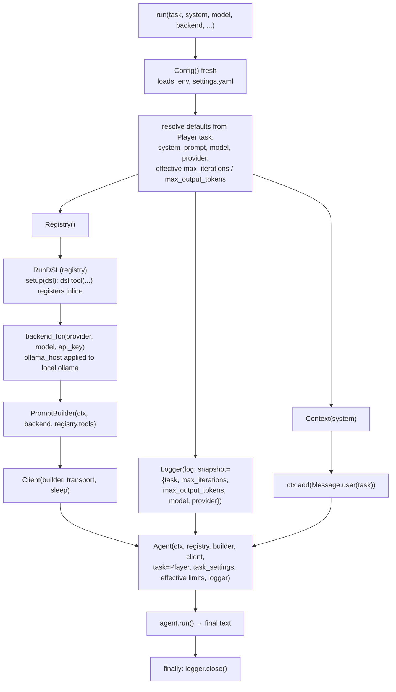

# Step 07 · The run DSL plan

## Goal

One top-level entry point that hides every primitive. `run(task=..., setup=...)`
resolves configuration, builds the `Context`, `Registry`, backend,
`PromptBuilder`, `Client`, `Logger`, and `Agent`, seeds the task as the first
user message, runs one turn, and returns the final text. `RunDSL` is the small
host passed to `setup`, exposing only `tool` so a caller registers ad-hoc tools
inline without reaching internal state. Every prior step required assembling the
whole chain by hand; this step reduces that to describing what to do.

## Scope

Full parity with the reference `Boukensha.run` and `Boukensha::RunDSL`, adapted
to this codebase's established ownership rules and its offline assertions.
Every public method, option, and data element of the
reference step is ported or accounted for below.

Ported:

- `run(task, *, system=None, model=None, backend=None, api_key=None,
  ollama_host="http://localhost:11434", log=None, max_output_tokens=None,
  setup=None, transport=None, sleep=None)` — the entry point.
- `RunDSL(registry)` with a single public method `tool(name, *, description,
  parameters=None)`.
- The `Logger` snapshot data element: `{task, max_iterations,
  max_output_tokens, model, provider}` written on `session_start`.
- Effective-value resolution for `max_iterations` and `max_output_tokens`, used
  both in the snapshot and in the `Agent`.
- The `ollama_host` option, applied to the local `ollama` backend only.

Accounted for, not reintroduced here:

- Module toggles `quiet!/loud!/quiet?/debug!/debug?` from the reference's
  top-level module. Out of scope until the REPL and TUI steps that consume them,
  per the step-06 decision that debug is a per-`Logger` flag and global mutable
  module state is avoided. `run` needs none of them.
- The reference's memoized `Boukensha.config`. Diverged: `run` reads a fresh
  `Config()` per call (see Design), so no module-global config state exists.

## Deliverables

The step package carries step 06 forward and adds:

```
week1_baseline/agent/07_the_run_dsl/
├── pyproject.toml
├── README.md                 # written from the built step
├── boukensha/
│   ├── run_dsl.py            # NEW: run() entry point and RunDSL host
│   ├── __init__.py           # exports run, RunDSL
│   └── ...                   # rest carried forward unchanged
├── examples/
│   └── example.py            # real gated run() + offline run-wiring invariants
```

The launcher: `week1_baseline/bin/07_the_run_dsl`.

## Design



### The entry point and the block

The reference uses `instance_eval(&block)` so `self` inside the block is the
`RunDSL`. Python has no `instance_eval`. `run` takes a `setup` callable and
passes the `RunDSL` to it explicitly: `setup(dsl)`. The honest, non-magical
port keeps the DSL surface to `tool` only, and the host object is visible rather
than swapped in behind the caller's back. `setup=None` runs a turn with no
ad-hoc tools.

### RunDSL: one method

`RunDSL(registry)` stores the registry privately and exposes exactly one public
method, `tool(name, *, description, parameters=None)`, which delegates to
`Registry.tool` (the decorator this codebase already uses for inline
registration). A caller writes:

```python
def setup(dsl):
    @dsl.tool("read_file", description="Read a file",
              parameters={"path": {"type": "string"}})
    def read_file(path):
        return Path(path).read_text()

run(task="Summarise the README", setup=setup)
```

The registry is the tool owner (established architecture); `RunDSL` is a
narrowing wrapper over it, not a second owner. Its only public attribute is
`tool`, so a caller cannot reach the registry, context, or backend through it.

### Configuration resolution

`run` reads a fresh `Config()` each call rather than a memoized module global.
Reason: a module-level cached `Config` is global mutable state (the same reason
step 06 made the logger debug flag per-instance), and it would cache a stale
`.env`/`settings.yaml` across calls that vary `BOUKENSHA_DIR`. `Config()` is a
cheap file read and `load_dotenv` is idempotent.

Defaults come from the `Player` task's settings, mirroring the reference, using
this codebase's task accessors:

| Option | Default source |
|---|---|
| `system` | `Player.system_prompt(task_settings, override_path=cfg.user_prompt_path(Player.task_name))` |
| `model` | `Player.model(task_settings)` |
| `backend` | `Player.provider(task_settings)` (a string, not a Ruby symbol) |
| `api_key` | filled by `backend_for` from the backend's `api_key_env` |
| `max_iterations` | argument if given, else `Player.max_iterations(task_settings)` |
| `max_output_tokens` | argument if given, else `Player.max_output_tokens(task_settings)` |

Each override is applied only when its argument `is None`, so an explicit
empty-string `system` is honored rather than replaced (matching Ruby `||=` on a
truthy empty string, and avoiding `or` swallowing a deliberate value).

### Wiring order and ownership

The established ownership rules reshape the reference's assembly:

- `Context(system)` holds the system prompt and history only; the task class is
  not stored on it. The task goes to the `Agent` as `task=Player`, so the
  response event's execution metadata still reports `task=player`.
- `Registry()` takes no context (tools are owned by the registry, never by
  context). `setup` runs against the registry through `RunDSL` before the
  builder is built.
- `PromptBuilder(ctx, backend, tuple(registry.tools.values()))` carries the
  toolset, so the DSL must register every tool before the builder is
  constructed. The `Agent` still receives the registry for dispatch.

### Backend selection and keys

`run` calls `backend_for(provider, model, api_key=api_key)`. The factory owns
provider-to-backend selection (step 03) and fills a missing key from the
backend's named environment variable, so `run` does not repeat the reference's
inline `case`/`ENV[...]` block. An unknown provider raises `ValueError` from the
factory, replacing the reference's hand-written `ArgumentError`. Building a
backend never requires a key, so an absent key does not block offline
assertions; a real request would fail at call time, not at construction.

### The ollama_host option

`ollama_host` is applied through `Backend.configure_host(host)`, a polymorphic
hook: a no-op on the base class, overridden by `Ollama` to set its `BASE_URL`
(which `url()` reads), and overridden back to a no-op on `OllamaCloud` to keep
its fixed hosted URL. `run` calls `be.configure_host(ollama_host)`
unconditionally, so the DSL no longer branches on the provider name or reaches
into a backend's class attribute from outside the backends package. The
reference and our prior code both special-cased ollama here; this removes it. It
also keeps the `backend_for` factory signature host-free, so a provider-specific
connection detail stays in the backend that owns it.

### Effective limits and the snapshot

`run` resolves the effective `max_iterations` and `max_output_tokens` once, each
as explicit arg > task setting > `Task` default, passes them explicitly to the
`Agent`, and writes them into the `Logger` snapshot, so the session-start line
records the same limits the loop enforced.
The snapshot carries `{task: Player.task_name, max_iterations,
max_output_tokens, model, provider}`, matching the reference's snapshot keys.
Thinking is a `run` option (`thinking=`), resolved explicit over task setting in
the `Agent`, symmetric with the two token caps. When it is unset, the level flows
from `task_settings` because `run` passes `task_settings` to the `Agent`, which
resolves it. This adds an override the reference does not expose.

### Logger lifecycle

`run` closes the logger in a `finally`, guarded so a failure before the logger
exists does not raise a second error. This mirrors the reference's `ensure
logger&.close`. When `log` is omitted the logger writes under
`Config.resolve_dir()/sessions`; the offline example passes an explicit `log=`
temp path so no assertion writes into the repo's `.boukensha/sessions/`.

### Offline verification seam

`run` builds the `Client` internally, so with no seam its only code path is a
live call needing a network and a key, which the assertion path avoids. `run`
therefore accepts optional `transport` and `sleep` arguments, defaulting to
`None` (the live `default_transport` and `time.sleep`), passed straight to the
`Client`. The offline example injects a `StubTransport` scripted with
provider-shaped JSON, so the full end-to-end wiring is asserted with no network
and no key. This is the same injection pattern steps 04–06 use on the `Client`,
chosen over monkeypatching `default_transport`, which is fragile and invisible.
The default path is unchanged for real use.

## Verification

Launcher: `bin/07_the_run_dsl`. The default run is offline: each invariant drives
`run` over a stub transport and a temp `log=`, no network, no keys. The real run
is gated behind `BOUKENSHA_LIVE=1` (one `run()` call with MUD tools, logged to the
real `.boukensha/sessions/`) and is never asserted.

| # | Offline invariant |
|---|---|
| 1 | one `run()` over `[tool_use, end_turn]` returns the final text and writes the ordered phases `session_start, iteration, prompt, response, tool_call, tool_result, iteration, prompt, response, turn_end(completed)` |
| 2 | with `system`/`model`/`backend`/limits unset, the `session_start` snapshot reads `task=player`, `model=claude-haiku-4-5`, `provider=anthropic`, `max_iterations=25`, `max_output_tokens=1024` |
| 3 | tools registered inside `setup` via `dsl.tool` are exactly the registry tools on the `prompt` line |
| 4 | a `RunDSL`'s only public attribute is a callable `tool`; the registry, context, and backend are not reachable through it |
| 5 | explicit `model`, `backend`, `max_iterations`, and `max_output_tokens` override the snapshot |
| 6 | the seeded task text is the first user message on the `prompt` line |
| 7 | `run(backend="nope")` raises `ValueError` naming the unknown provider |
| 8 | `setup=None` runs a turn with zero tools (`tool_count=0`) |

## Design improvements (this rework)

- `max_iterations` joins `max_output_tokens` as a call-site override on `run`
  (and `repl`), resolved explicit arg > task setting > `Task` default and threaded
  to the `Agent` and the log snapshot. Previously only `max_output_tokens` was
  overridable, an asymmetry for two identically-handled caps.
- `Backend.configure_host(host)` replaces the `if backend == "ollama":
  be.BASE_URL = ...` special-case (see the ollama_host section), removing a
  string branch and a cross-package attribute reach-in.

Everything else in the DSL was kept as built: it already improves on a basic
wire-up with the `backend_for` factory (over an inline provider-to-class dict),
`api_key` resolution via the backend's `api_key_env` (over an inline
provider-to-env dict), and a deliberately narrow one-method `RunDSL`.

## Done when

The launcher runs the example, the offline invariants pass, prior steps still
pass, and the step README is written from the built step.
