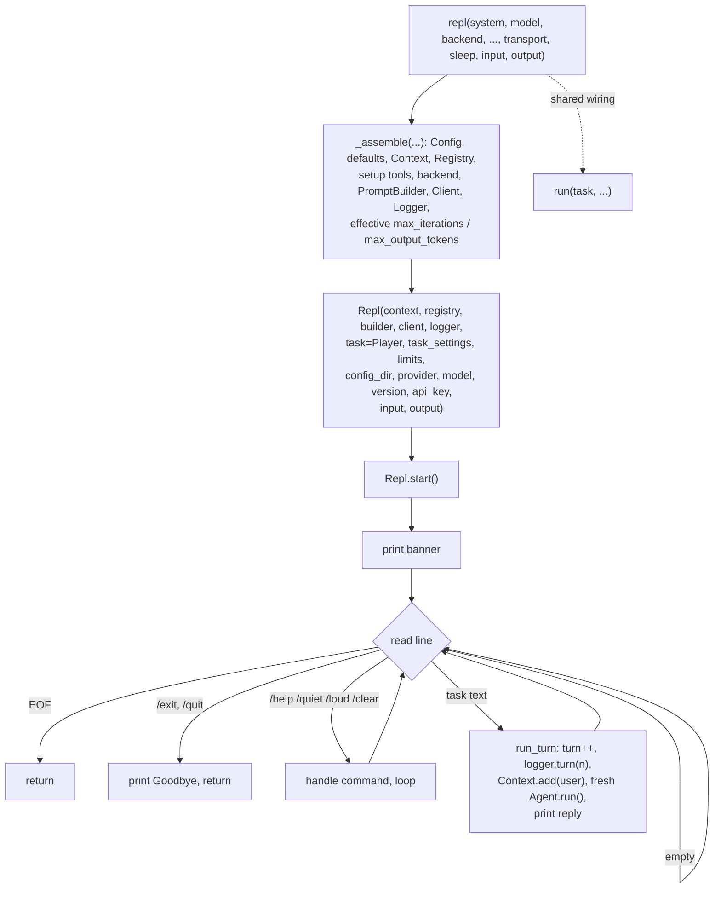

# Step 08 · The REPL loop plan

## Goal

An interactive session that stays alive across turns. `repl(...)` wires the same
primitives as `run`, then hands them to a `Repl` that reads a task from the user,
runs the agent, prints the reply, and loops back to the prompt. One `Context` is
shared across every turn so the agent sees the full transcript each time. The
turn loop also gains a built-in command set (`/help`, `/quiet`, `/loud`,
`/clear`, `/exit`, `/quit`) that never reaches the agent. A module version string
is introduced for the banner.

## Scope

Full parity with the reference `Boukensha::Repl`, `Boukensha.repl`,
`Boukensha::VERSION`, and the step-08 edits to `Agent`, `Client`, `Context`, and
`Logger`, adapted to this codebase's ownership rules and its offline assertions.
Every public method, behavior, and data element of the
reference step is ported or accounted for below.

Ported:

- `Repl` class: constructor holding the assembled primitives plus banner data
  (`config_dir`, `provider`, `model`, `version`, `api_key`), a `start` loop, the
  built-in commands, the banner, and per-turn agent execution.
- `repl(*, system=None, model=None, backend=None, api_key=None,
  ollama_host="http://localhost:11434", log=None, max_output_tokens=None,
  setup=None, transport=None, sleep=None, input=None, output=None)` — the
  interactive entry point, options identical to `run` minus `task`.
- `__version__ = "0.8.0"` module constant, the banner's version source.
- Agent change: the final assistant text is persisted to `Context` on the
  completed branch and on both wind-down terminal paths.
- Client change: an HTTP `401` raises `ApiError` with an authentication-specific
  message.
- Context change: `clear_messages()` drops history, keeping the system prompt.
- Logger change: a `turn(n)` phase event, whose first consumer is the REPL.

Accounted for, not reintroduced here:

- Module toggles `Boukensha.quiet!/loud!/quiet?` as global mutable state. The
  reference's `quiet?` has zero readers in this step (its `Logger` writes only to
  a file, never to the terminal); the flag becomes a `Repl` instance field. See
  Design.
- `Logger#subscribe(&block)`. Present in the reference logger since an earlier
  step, consumed only by the TUI (step 11). No reader in step 08, so it stays out
  of scope.
- The reference's `config.rb` cwd-discovery edit. This codebase's `Config`
  already walks up from the current directory, of which "`.boukensha/` in the
  current directory" is the first case, so the reference change is already
  subsumed. No `Config` edit.

## Deliverables

The step package carries step 07 forward and adds or edits:

```
week1_baseline/agent/08_the_repl_loop/
├── pyproject.toml            # version bumped to 0.8.0
├── README.md                 # written from the built step
├── boukensha/
│   ├── repl.py               # NEW: Repl
│   ├── run_dsl.py            # EDIT: repl() entry + shared _assemble() helper
│   ├── agent.py             # EDIT: persist final assistant text to Context
│   ├── client.py            # EDIT: 401 → ApiError
│   ├── context.py           # EDIT: clear_messages()
│   ├── logger.py            # EDIT: turn(n) event
│   ├── version.py           # NEW: __version__ constant
│   ├── __init__.py           # EDIT: export repl, Repl, __version__
│   └── ...                   # rest carried forward unchanged
├── examples/
│   └── example.py            # offline scripted-REPL assertions
```

The launcher: `week1_baseline/bin/08_the_repl_loop`.

## Design



### `repl` and the shared assembler

`repl` mirrors `run`'s options exactly, minus the required `task` (the user
supplies tasks interactively). Both entry points build the same chain, so the
wiring block is factored into a private `_assemble(...)` returning the assembled
pieces, and `run` and `repl` each call it. This is one divergence from the
reference, which copies the whole wiring verbatim between `run` and `repl`
(improved: one home for the wiring, so a future change to defaults resolution or
backend selection updates a single place). `_assemble` carries the offline seam
(`transport`, `sleep`) into the `Client` just as `run` does today.

`repl` closes the logger in a `finally` and catches `KeyboardInterrupt` around
`Repl.start()`, printing `Interrupted.`, matching the reference's `rescue
Interrupt` / `ensure logger&.close`.

### The `Repl` class

`Repl` holds the assembled primitives (`context`, `registry`, `builder`,
`client`, `logger`), the values needed to run a turn (`task=Player`,
`task_settings`, `max_iterations`, `max_output_tokens`), and the banner data
(`config_dir`, `provider`, `model`, `version`, `api_key`). It owns a `turn`
counter starting at 0 and a `quiet` flag starting `False`. `start` is the only
public method; the banner, the command handling, and `run_turn` are private.

The reference's `Repl` receives `task` implicitly through `Context.task`; this
codebase's `Context` holds no task (established ownership), so the `Repl` stores
`task=Player` and passes it to each `Agent`, keeping the response event's
execution metadata reporting `task=player`.

### The loop and I/O

`start` prints the banner, then loops:

- Write `PROMPT` (`"boukensha> "`) to the output stream and read one line from
  the input stream.
- End-of-input (an empty read) ends the loop cleanly, mirroring the reference's
  `break unless input` on `gets` returning nil.
- Strip the line; skip when empty.
- Dispatch a built-in command, or run a turn.

I/O is through injectable `input` and `output` streams, defaulting to
`sys.stdin` and `sys.stdout`. The reference reads `$stdin`/`$stdout` directly.
The `Repl` is inherently interactive and its turns hit a live API, so without
injectable streams and the forwarded stub transport there is no deterministic,
key-free assertion path, which the offline assertions require.
The default streams are unchanged for real use.

### Built-in commands

Each command is handled in the loop and never sent to the agent, matching the
reference behavior exactly:

| Command | Behavior |
|---|---|
| `/help` | print the command list, continue |
| `/quiet` | set the instance `quiet` flag, print `(logging suppressed — type /loud to re-enable)`, continue |
| `/loud` | clear the `quiet` flag, print `(logging enabled)`, continue |
| `/clear` | `Context.clear_messages()`, reset the turn counter to 0, print `(conversation history cleared)`, continue |
| `/exit`, `/quit` | print `Goodbye.`, end the loop |

`/quiet` and `/loud` set a `Repl` instance flag rather than a module-global
`Boukensha.quiet?`. In the reference the flag has no reader in this step (its
logger writes only to a file), so the commands are cosmetic here, and this
codebase already rejected module-global logging flags in step 06 (debug is a
per-`Logger` field). The instance flag preserves the exact user-visible behavior
(both messages print, the state flips) and gives the display front-end that
consumes it later (the TUI) an owner without reintroducing global state.

### Per-turn execution

`run_turn(input)` mirrors the reference:

- Increment the turn counter and log `logger.turn(n=<turn>)`.
- `Context.add(Message.user(input))`.
- Build a fresh `Agent` for the turn from the stored primitives, passing
  `task=Player`, `task_settings`, and the effective limits, then call
  `agent.run()`. A new `Agent` per turn resets the per-turn iteration counter,
  which is exactly why the reference constructs one inside `run_turn`.
- Print a blank line and the reply to the output stream. The reply prints
  outside any logging path so it is always visible.
- Catch `ApiError` and `LoopError`, print `[error] ...`, and continue the loop
  so one failed turn does not end the session.

### The assistant-persist agent change

The reference's step-08 `Agent` adds the final assistant text to `Context` in
three places: the completed branch of `run`, the successful wind-down, and the
wind-down's `ApiError` fallback. This codebase's `Agent` already persists the
assistant message that carries a `tool_use` (needed before its `tool_result`),
but not the terminal text. Step 08 adds `self._context.add(Message.assistant(
text))` on those three terminal paths.

This is load-bearing for the REPL: without it, the next turn's request would omit
the previous assistant reply, so history would not accumulate and providers that
require the assistant turn to be present would reject the follow-up. The change
is also correct for `run` (the message is added just before returning, then the
process ends), so the behavior is uniform across both entry points.

### The Client 401 change

An HTTP `401` is not retryable and today falls through to the generic non-2xx
`ApiError`. Step 08 special-cases it to raise `ApiError("authentication failed
(401) — check your API key")`, matching the reference, so the most common
misconfiguration gets a message that names the cause instead of echoing the raw
body. Other non-2xx statuses keep the existing generic message.

### The banner and version

`__version__ = "0.8.0"` lives in `boukensha/version.py` (the Python idiom for the
reference's `Boukensha::VERSION`, kept in its own module so the REPL wiring reads
it without importing the package root, which would be a cycle) and is re-exported
from `boukensha/__init__.py`. `pyproject.toml`'s version is aligned to `0.8.0`. The banner reads
`__version__`, the resolved `config_dir` (with a `directory not found` marker
when it is absent), the `provider`/`model`, and an api-key status line (`api key
set` / `api key not set`) derived from the resolved key. The Repl reads the
resolved key from the backend (`backend.api_key`, filled by `backend_for` from
the backend's named environment variable) so the banner reports the same key the
turns would use. The status line is displayed, not asserted: whether a key is
set is the environment's state, not the loop's behavior.

## Verification

Launcher: `bin/08_the_repl_loop`. The default run is offline: the invariants
below script sessions through an in-memory input stream, capture the output,
inject a `StubTransport` scripted with provider-shaped JSON, and pin
`BOUKENSHA_DIR` and a temp `log=`, so no key, network, or writes into the repo's
`.boukensha/sessions/`. The real interactive session is gated behind
`BOUKENSHA_LIVE=1` and is never asserted.

| # | Offline invariant |
|---|---|
| 1 | the banner prints first, carrying the version `0.8.0`, provider/model, config dir, and the tools line |
| 2 | plain lines run turns: the reply is written, the next turn's `prompt` carries the prior exchange, and each turn logs one `turn` and one `iteration` |
| 3 | `/help` is generated from the command table (lists `/quit`, the aliased exit) |
| 4 | an unknown `/word` is rejected with no turn; `//` sends a literal `/line` to the agent |
| 5 | the live feed shows tool calls, and `/quiet` suppresses it |
| 6 | `/cost` and `/tokens` accumulate across turns |
| 7 | Ctrl-C aborts one turn, the loop continues, and history stays well-formed |
| 8 | an unexpected error is isolated and the session continues |
| 9 | `/undo` drops the last turn; `/retry` drops and reruns it |
| 10 | `/model` switches the backend mid-session (the request goes to the new backend) |
| 11 | `/clear` wipes history and resets the counter to 1 |
| 12 | `/exit` and `/quit` end the loop, later lines unprocessed |
| 13 | a `401` turn surfaces the error and the loop continues |

## Design improvements (this rework)

The reference REPL is a banner plus six commands. This step keeps that baseline
and adds, all net-new over the reference: a command-dispatch table (generated
`/help`, no if/elif drift), `//` escape and unknown-command rejection, Ctrl-C
per-turn abort with a well-formed history, broad per-turn error isolation, a live
activity feed via `logger.subscribe` (making `/quiet`/`/loud` real), running
`/cost`/`/tokens`, and the commands `/tools` `/system` `/history` `/undo`
`/retry` `/save` `/mud` `/reasoning` `/model` (mid-session backend switch via
`Client.for_builder`). readline history and tab completion are wired in `repl()`'s
real-stdin branch, leaving the offline seam intact. The `Repl` exposes a public
API (`banner`, `handle_command`, `run_turn`, `on_output`, plus read accessors) so
the TUI step drives the same logic with its own I/O. Input is a logical line, not
a physical one: a line ending in a backslash continues on the next (with a
continuation prompt), so a pasted block or a long instruction is one turn. `run`
and `repl` also carry a `thinking` override, symmetric with the two token caps.

## Done when

The launcher runs the example, the offline invariants pass, the step 07 launcher
still passes untouched, and the step README is written from the built step.
