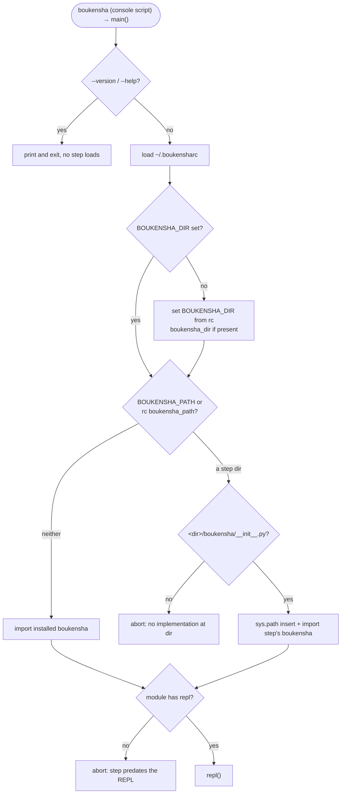

# Step 09 · Global executable plan

## Goal

Make `boukensha` a command you can run from anywhere, and make that command a
thin wrapper that can boot either the bundled implementation or any step folder
you point it at. This step adds no agent capability. It adds a packaging entry
point and a small loader that resolves which implementation to run and which
config directory to use, then starts the REPL.

## Scope

The reference packages the library as a gem: a `boukensha.gemspec` declaring the
`bin/boukensha` executable, a `bin/boukensha` shebang script, a
`lib/boukensha_loader.rb`, and a `Boukensha::VERSION` bump. Ported to Python:

- The gem executable maps to a console-script entry point installed by the
  package (`[project.scripts]`), the idiomatic Python equivalent. The hand-
  written `bin/boukensha` logic moves into `main()`, the entry-point target.
- The loader (`BoukenshaLoader`) ports to `boukensha/loader.py` with the same
  resolution rules and messages, adapted to the Python import model and this
  repo's package layout (a `boukensha/` package per step, no `lib/` folder).
- `VERSION` bumps to `0.9.0` in `boukensha/version.py` and `pyproject.toml`.

No reference functionality is deferred. The loader ships whole this step.

## Deliverables

Step 08 carried forward, plus:

```
week1_baseline/agent/09_global_executable/
├── pyproject.toml            # version 0.9.0; adds [project.scripts] boukensha
├── README.md                 # written from the built step
├── boukensha/
│   ├── loader.py             # NEW: resolution + boot, the entry point's target
│   ├── version.py            # bumped to 0.9.0
│   ├── __init__.py           # re-exports main from loader
│   └── ...                   # rest carried forward from step 08
├── examples/
│   └── example.py            # gated live boot + offline loader assertions
└── uv.lock
```

The launcher: `week1_baseline/bin/09_global_executable` (bash, `cd` + `uv run
examples/example.py`), consistent with existing launchers.

The installed command: after `uv pip install` (or `uv run boukensha`), the
console script `boukensha` runs `boukensha.loader:main`.

## Design

### Two runnables, two jobs

- The repo launcher `bin/09_global_executable` runs the example, the offline
  assertion vehicle. This is how the step is verified, same as every prior step.
- The console script `boukensha` is the shipped global command. Its target is
  `main()`, which calls `load_and_start_repl()`. It boots the interactive REPL,
  so it needs a terminal and a key. It is not on the assertion path.

### The gemspec maps to a console-script entry point

`pyproject.toml` gains:

```toml
[project.scripts]
boukensha = "boukensha.loader:main"
```

The installer generates the `boukensha` executable on `PATH` from this entry
point. This replaces the reference's `boukensha.gemspec` (`spec.executables`,
`spec.bindir`) and the hand-written `bin/boukensha` shebang script, which Python
does not need because the installer writes the wrapper.

### Independent resolution: implementation and config directory

Two settings are resolved independently, each in the same three-tier order as
the reference:

| Setting | First priority | Second priority | Default |
|---|---|---|---|
| Implementation | `BOUKENSHA_PATH` env | `boukensha_path` in `~/.boukensharc` | bundled (installed) package |
| Config directory | `BOUKENSHA_DIR` env | `boukensha_dir` in `~/.boukensharc` | `Config`'s own resolution |

An explicit environment variable always wins over the rc file. The config
directory is applied by setting `os.environ["BOUKENSHA_DIR"]` before the
implementation loads, and only when the env var is unset, so `Config` inside the
loaded step reads it. This is the reference's exact side-effect ordering.

### `~/.boukensharc`

- A YAML mapping: `boukensha_path` and/or `boukensha_dir` keys.
- A bare string: treated as `boukensha_path` (the original single-path format,
  kept for backward compatibility, parity with the reference).
- Empty or absent: no rc settings, `{}`.
- Any other YAML shape (a list, a number): abort naming the file and the
  expected shape.
- Invalid YAML: abort naming the file and the parser message.

Parsed with `yaml.safe_load`, which constructs no arbitrary Python objects. Rc
paths are expanded relative to the rc file's directory (the home directory),
matching the reference's `File.dirname(rc_file)`. An env `BOUKENSHA_PATH` is
expanded relative to the current directory, since it is a value the user typed
where they stand, again matching the reference.

### Resolving the implementation, Python-style

The reference `require`s an arbitrary `lib/boukensha.rb` file path. Python
imports a package by name, so the mechanism differs while the effect matches:

- Bundled (no `BOUKENSHA_PATH`, no `boukensha_path`): import the installed
  `boukensha` package normally. `resolve()` returns `None` to signal this, in
  place of the reference's `BUNDLED_LIB` path constant.
- A step folder: `resolve()` returns that directory. A valid step folder
  contains `boukensha/__init__.py` (this repo's layout), the check that replaces
  the reference's `lib/boukensha.rb` existence test. Missing: abort naming the
  directory and the two places to check (`BOUKENSHA_PATH`, the rc file).
- To load a resolved step, its directory is inserted at the front of `sys.path`
  and any cached `boukensha` module is dropped, so the step's own package
  shadows the installed one on a fresh import. This is the import-model analog
  of the reference's file-path `require`.

### Boot and the REPL guard

`load_and_start_repl()`:

1. `resolve()` the implementation (applies the `BOUKENSHA_DIR` side effect).
2. If `BOUKENSHA_DEBUG` is set, print `[boukensha] loading from: <dir>` to
   stderr. For the bundled case the directory is the installed package's own
   location.
3. Import the implementation.
4. If the loaded module has no `repl` attribute, abort with a message telling
   the user this step predates the REPL (added in step 08 here) and how to run
   its example instead, or to point `BOUKENSHA_PATH` at step 08 or later. The
   guard is real: steps 04 through 07 in this port expose no `repl`.
5. Call the implementation's `repl()`.

`KeyboardInterrupt` during the session prints `Interrupted.` and exits cleanly,
parity with the reference's `rescue Interrupt`.

Aborts write the message to stderr and exit with status 1, the semantics of
Ruby's `abort`.



### Offline verification seam

The offline assertions run with no network and no API key. The loader's resolution
and boot logic are pure enough to assert directly, but `load_and_start_repl` ends in
`repl()`, which is interactive and live. So `load_and_start_repl(repl_runner=...,
out=..., err=...)` accepts an injected runner and streams: the example pins a temporary
`HOME` with crafted `~/.boukensharc` files and step-shaped directories, drives
resolution and boot with a stub runner, and asserts the outcomes. One assertion goes
further and boots this step's *own* package through the loader against a stub transport,
so the shadowed module runs a real turn offline, proving the boot produces a working
agent and not just a dispatch. `main()` and the default runner keep the real behavior
for the installed command, exercised by the gated `BOUKENSHA_LIVE=1` headline.

### Version

`__version__` bumps to `0.9.0` in `boukensha/version.py`, and `pyproject.toml`'s
`version` matches. The REPL banner reads it, so the running command reports
`v0.9.0`.

## Divergences from the reference

Each is functionality-preserving unless marked, with its one-line reason.

- changed: gemspec + `bin/boukensha` shebang → `[project.scripts]` console
  script targeting `loader:main`. The idiomatic Python packaging equivalent.
- changed: `require <path>/lib/boukensha.rb` → `sys.path` insert plus a fresh
  `boukensha` import. Python imports packages by name, not files, so the loader
  shadows the installed package on the path instead of requiring a file.
- changed: valid-step check `lib/boukensha.rb` → `<dir>/boukensha/__init__.py`.
  This repo's steps hold a `boukensha/` package directly, with no `lib/` folder.
- changed: `BUNDLED_LIB` path constant → `resolve()` returns `None` for bundled.
  Bundled means "import the installed package by name," which needs no path.
- improved: rc parse errors and non-mapping shapes abort naming the file and the
  expected shape, matching this repo's fail-loudly-naming-the-thing convention.
- improved: an rc mapping with an unknown key aborts naming the offending key, so
  a typo like `boukensha_pth` fails loudly instead of being silently ignored.
- improved: the missing-step abort names the single source of the bad path rather
  than telling the user to check both env and rc.
- improved: `main()` answers `--version`/`--help` before any step loads and
  rejects unknown flags, so the installed command has a real CLI surface and a
  typo does not reach the REPL as a first line.
- changed (offline seam): `load_and_start_repl` accepts an injected
  `repl_runner` and output streams, so the interactive, live boot path is
  assertable with no network or key. Real command path unchanged.
- changed: `BOUKENSHA_DEBUG` diagnostic to stderr; the reference prints it with
  `puts` (STDOUT). Kept off stdout so a user piping the command's stdout gets a
  clean stream, the debug line staying on stderr where diagnostics belong.
- added: `python -m boukensha` via a `boukensha/__main__.py` that targets the
  same `loader:main` as the console script, so a checkout runs without installing
  the console script and the two paths never diverge.

## Behavior settled this step

Stated as behavior so the decisions are checkable against the text rather than
re-derived:

- The console-script entry point is `boukensha.loader:main`.
- `~/.boukensharc` accepts a YAML mapping (`boukensha_path`, `boukensha_dir`) or
  a bare string (legacy, equals `boukensha_path`). Empty or absent means no
  settings. Any other shape or invalid YAML aborts.
- Rc-file paths expand relative to the home directory. An env `BOUKENSHA_PATH`
  expands relative to the current directory.
- `BOUKENSHA_DIR` from the rc file is applied only when the env var is unset,
  and before the implementation loads.
- `BOUKENSHA_PATH` names a step directory that contains `boukensha/__init__.py`.
  Absent that file, the loader aborts naming the directory and where to look.
- No implementation selected means the installed `boukensha` package is used.
- A selected step directory is imported by inserting it at the front of
  `sys.path` and dropping a cached `boukensha` module, so it shadows the
  installed package.
- An implementation without a `repl` attribute aborts with guidance; steps 04
  through 07 in this port have none, step 08 onward do.
- The missing-step abort names the single source that set the bad path (the
  `BOUKENSHA_PATH` env var, or `boukensha_path in <rc file>`), so the user knows
  which knob to turn rather than being told to check both.
- An rc mapping with a key other than `boukensha_path`/`boukensha_dir` aborts,
  naming the offending key and the allowed keys, so a typo fails loudly.
- `main()` answers `--version` (the installed command's version) and `--help`
  before any step resolves, and rejects an unknown flag rather than forwarding it
  to the REPL as a first typed line.
- `BOUKENSHA_DEBUG` set prints `[boukensha] loading from: <dir>` to stderr.
- A `KeyboardInterrupt` during the session prints `Interrupted.` and exits
  cleanly. Other aborts print to stderr and exit 1.

## Verification

Launcher: `bin/09_global_executable`.

| # | Assertion |
|---|---|
| 1 | rc with `boukensha_path` and `boukensha_dir` resolves the step directory and sets `BOUKENSHA_DIR` to the home-relative expansion |
| 2 | env `BOUKENSHA_PATH` and `BOUKENSHA_DIR` each override their rc counterpart |
| 3 | the legacy bare-string rc format resolves as `boukensha_path` |
| 4 | an empty or absent rc resolves to bundled (`resolve()` returns `None`) |
| 5 | a `BOUKENSHA_PATH` pointing at a directory without `boukensha/__init__.py` aborts, naming the directory |
| 6 | a non-mapping rc (a YAML list) aborts, naming the file and the expected shape |
| 7 | invalid YAML in the rc aborts, naming the file |
| 8 | rc paths expand relative to home; an env path expands relative to the current directory |
| 9 | boot dispatches to the resolved implementation's `repl` via the injected runner |
| 10 | an implementation with no `repl` attribute aborts with the step-08 guidance and never calls the runner |
| 11 | `BOUKENSHA_DEBUG` set prints `[boukensha] loading from: <dir>` |
| 12 | `__version__` is `0.9.0` and equals the `pyproject.toml` version |
| 13 | booting this step's own package through the loader against a stub transport yields a different module object, config crossing the boundary (the MUD host from the injected `BOUKENSHA_DIR`), and a completed turn |
| 14 | an rc naming an unknown key aborts, naming the offending key and the allowed keys, before any implementation loads |
| 15 | `boukensha --version` reports the version and exits without booting |

The headline is a gated real boot: with `BOUKENSHA_LIVE=1` and a provider key the
example points `BOUKENSHA_PATH` at this step, shadow-imports it, and runs one live REPL
turn, the exact path the installed command takes.

## Done when

The launcher runs the example, all assertions pass, prior steps' launchers still
pass, the console script `boukensha` is installable and boots the bundled REPL,
and the step README is written from the built step.
