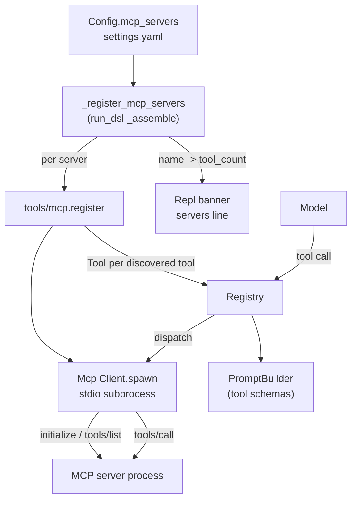

# Step 10 · Standard tool library plan

## Goal

Turn boukensha into an MCP host. The agent ships no tools of its own: every
tool it can call arrives from an MCP server declared in `settings.yaml`'s
`mcp_servers:` block. This step adds a minimal MCP-over-stdio client, a generic
host layer that registers a server's discovered tools into the registry, config
parsing for `mcp_servers:`, the wiring that spawns those servers at startup, and
a REPL banner line reporting what tools the agent actually has. Swapping what the
agent can do becomes a config edit, not a code change.

## Scope

The reference step originally shipped three built-in tool modules
(`Tools::FileSystem`, `Tools::Shell`, `Tools::Mud`). That code was deleted and
replaced by the MCP-host rewrite before this step's reference reached its final
form. The directory keeps its `10_standard_tool_library` name only so step
ordering resolves. This port builds the MCP-host design, which is what the
reference step actually contains. There are no built-in tool modules to port,
because none exist in the reference at this step.

Ported at parity:

- `Boukensha::Mcp::Client` → `boukensha/mcp/client.py`: spawn a server over
  stdio, initialize handshake, `tools/list`, `tools/call`.
- `Boukensha::Tools::Mcp` → `boukensha/tools/mcp.py`: register a server's tools
  into the registry, optional name prefixing, collision detection.
- `Config#mcp_servers` → `Config.mcp_servers`: parse the block, apply defaults.
- `Boukensha.register_mcp_servers` → a private helper in `run_dsl.py`, called
  from the shared assembly path before the prompt builder snapshots the tools.
- The REPL banner's servers line, reporting `name (tool_count)` per server.
- `VERSION` bumps to `0.10.0`.

Nothing is deferred to a later step.

## Deliverables

Step 09 carried forward, plus:

```
week1_baseline/agent/10_standard_tool_library/
├── pyproject.toml            # version 0.10.0
├── README.md                 # written from the built step
├── boukensha/
│   ├── mcp/
│   │   ├── __init__.py       # NEW
│   │   ├── transport.py      # NEW: Transport protocol + StdioTransport (reader thread, timeout)
│   │   └── client.py         # NEW: Client, the MCP protocol over a transport
│   ├── tools/
│   │   ├── __init__.py       # NEW
│   │   └── mcp.py            # NEW: the generic MCP host layer
│   ├── errors.py             # + McpError, McpToolCollisionError, McpServerError, McpTimeoutError
│   ├── tool.py               # + explicit `required` set (honest schema, see design)
│   ├── config.py             # + mcp_servers() with timeout, + _validate_mcp_servers
│   ├── run_dsl.py            # + _register_mcp_servers, wired into _assemble
│   ├── repl.py               # + servers banner line
│   ├── version.py            # bumped to 0.10.0
│   ├── __init__.py           # export the host layer and the four MCP errors
│   └── ...                   # rest carried forward from step 09
├── examples/
│   ├── example.py            # Ruby-interop headline (no LLM) + narrated offline demo
│   ├── mcp_stub_server.py    # NEW: a generic offline MCP server (env-gated failure modes)
│   └── mcp_mud_server.py     # NEW: a tiny MUD as a real MCP server (offline fixture)
├── tests/                    # NEW: the guarantees as a unittest suite (34 tests)
│   ├── helper.py             # shared fixtures (stub spawn, config_from, srv)
│   ├── test_mcp_client.py    # client + transport + respawn + domain server
│   ├── test_tools_mcp.py     # host layer: registration, schemas, collisions, allow/deny
│   └── test_mcp_servers_config.py  # config, startup wiring, banner, version
└── uv.lock
```

The launcher: `week1_baseline/bin/10_standard_tool_library` (bash, `cd` + `uv run
examples/example.py`), consistent with existing launchers.

## Design

### The transport and the client

The connection and the protocol are two layers, the same split the HTTP client
(`boukensha/client.py`) uses: `StdioTransport` (`boukensha/mcp/transport.py`)
owns the process and moves messages, `Client` (`boukensha/mcp/client.py`) speaks
JSON-RPC over an injected transport. Both are server-agnostic; `command`, `args`,
and `env` are the standard stdio transport config.

`StdioTransport(command, args=(), env=None)`:

- `subprocess.Popen` in text mode, line-buffered, stdin/stdout pipes, stderr
  inherited (never an undrained pipe that would backpressure-deadlock a chatty
  server). Extra `env` is merged over `os.environ`, so a server still finds `PATH`.
- One background reader thread drains stdout and routes each response to the
  caller waiting on its request id, through a per-id queue guarded by a lock. That
  thread is what a blocking read loop cannot give: a per-call timeout, and prompt
  exit-code-aware failure when the server crashes or closes the pipe, waking every
  blocked caller at once.
- `request(message, id, timeout)` registers the waiter before writing (so a fast
  response is never missed), blocks up to `timeout`, and raises `McpTimeoutError`
  on overrun. `notify(message)` is fire-and-forget. `close(timeout)` closes stdin,
  waits-then-kills, joins the reader. `closed` / `exit_code` report the state.
- A spawn of a nonexistent command raises `FileNotFoundError` at construction.

`Client`, the protocol over the transport:

- `Client.spawn(command, args=(), env=None, timeout=DEFAULT_TIMEOUT)` → a
  connected client (`DEFAULT_TIMEOUT` is 30 s). `server_info` and `tools` come
  from the handshake and `tools/list`; discovery is the server's word.
- `call_tool(name, arguments=None)` → `{"text": str, "error": bool}`: content
  `text` joined with newlines, `isError` becomes `error` (a tool-level failure is
  data, not an exception). `close()` / `closed` proxy the transport.
- Every exchange goes through one `_request` method: it assigns the id, applies
  the timeout, fires a best-effort `notifications/cancelled` on timeout, and
  rejects a JSON-RPC `error` response (or one with neither `result` nor `error`)
  by raising `McpError`. So a handshake or discovery failure surfaces instead of
  degrading to a silently empty client, and a crash raises an exit-code-aware
  `McpError`, not a hang. `PROTOCOL_VERSION = "2025-06-18"`,
  `clientInfo = {"name": "boukensha", "version": __version__}`.

### The host layer: `boukensha/tools/mcp.py`

Point it at any MCP server and that server's tools become boukensha tools.
Module-level functions, since it owns no state (the client and registry are
passed in):

- `register(registry, command, args=(), env=None, prefix=None, timeout=...)` →
  spawns a `Client` (forwarding the per-call `timeout`), registers an `atexit`
  hook to close it on process exit, registers the client's tools, and returns it.
- `register_client(registry, client, prefix=None)` → registers an
  already-spawned client's tools, returning the count. Used directly by tests
  and by `register`.
- `prefixed(name, prefix)` → `f"{prefix}{SEPARATOR}{name}"` when a non-blank
  prefix is given, else the bare name. `SEPARATOR = "__"`.
- `to_boukensha_params(input_schema)` → each property keeps its full JSON Schema
  fragment (an array's `items`, an object's nested `properties`, a `format` or
  bounds), not just `type` and `description`, so a structured parameter reaches
  the model intact. An `enum` stays a real schema key (backends pass it to the
  wire, so the provider enforces it) and is also appended to the description.

Registration builds a `Tool` per discovered tool with a `**kwargs` handler that
calls `client.call_tool(remote_name, string_keyed_args)` and returns the text, or
`f"error: {text}"` when the result carries `error`. The remote (bare) name is
captured in the closure, so the server always sees its own name on the wire even
when the agent-side name is prefixed.

Name prefixing is agent-side policy supplied by config. The module applies
whatever prefix it is handed and never puts it on the wire.

### Collision detection is a hard error

Two tools claiming one agent-side name is a config contradiction, never
excused, because silently dropping the loser is the expensive failure to debug.
Before registering each tool, the host checks the name against the registry's
current tool names and the names it has registered so far in this call. A clash
raises `McpToolCollisionError` naming the tool and telling the user to give the
server a distinct `prefix:`. This covers both cases the reference tests pin:

- Two servers whose tools resolve to the same prefixed name.
- A server's tool colliding with a tool boukensha already holds (an inline tool,
  or another server's tool).

The registry's own duplicate-name guard (a plain `ValueError`) would also fire,
but the host's pre-check gives the actionable, prefix-aware message first.

### Honest required-ness in generated schemas

This is the one place the port deliberately diverges from the reference's
behavior rather than its mechanism, so it is called out here.

The reference marks every parameter of an MCP-derived tool as required in the
wire schema, even optional ones. Its own README flags this under Technical
Considerations: "The backends advertise every listed parameter as required,
which is wrong for third-party servers with genuinely optional params. Fixing
it means plumbing `inputSchema["required"]` through `Boukensha::Tool`." Marking
optional parameters required misleads the model into always supplying them. In
this port the wire schema's `required` list comes from `Tool.required_parameters`,
which today derives required-ness from the handler's signature. An MCP handler
is `**kwargs` (it accepts anything), so signature-derived required-ness would
mark every parameter required. That reproduces the defect.

The fix: `Tool` gains an optional explicit `required` field (a frozenset of
parameter names, default `None`).

- When `None`, `required_parameters` derives from the handler signature exactly
  as before, so every existing tool is unchanged.
- When set, `required_parameters` returns the declared parameters that are in
  the set, in declared order. Construction validates the set is a subset of the
  declared parameters, failing at construction and naming any required name not
  shown to the model (never-valid data: the model cannot supply a parameter it
  was never told about).

The host passes `frozenset(input_schema["required"])` (intersected with the
declared properties) as the explicit required set. Optional MCP parameters are
still listed as properties, so the model can supply them, but they are no longer
falsely marked required. This is strictly more honest than the reference: the
model is told exactly which parameters it must supply and which it may omit.

### Config: `mcp_servers`

`Config.mcp_servers` returns
`{name: {command, args, env, prefix, required, timeout}}` with defaults applied:

- `command`: stringified, default `""`.
- `args`: list of strings, default `[]`.
- `env`: string→string dict, default `{}`. YAML integers (a port number) are
  stringified, since the spawn environment accepts only strings.
- `prefix`: string or `None`, default `None`.
- `required`: boolean, default `True`. `required: false` lets a server fail to
  spawn without taking the agent down.
- `timeout`: per-call ceiling in seconds, default `DEFAULT_TIMEOUT` (30), so one
  hung tool call cannot hang the agent.

An absent `mcp_servers:` block yields `{}`, and a bare `name:` (no body) means all
defaults. A malformed entry is rejected at load by `_validate_mcp_servers`, naming
the server and the field: `args` as a bare string, `env` as a list, a
list/dict `command`/`prefix`, or a non-positive `timeout` fails loudly rather than
mangling silently or crashing deep in spawn, the same fail-loudly-naming-the-thing
voice the `tasks` block already uses.

### Startup wiring: `_register_mcp_servers`

A private helper in `run_dsl.py`, called from `_assemble` after the registry is
created and before the prompt builder snapshots `registry.tools`, so MCP tools
are present in the request. It runs before the `setup` callable, so an inline
tool registered in `setup` collides against an MCP tool exactly as two servers
would.

For each server in `Config.mcp_servers`:

- Spawn and register via the host layer. Record `{name: tool_count}`.
- A `McpToolCollisionError` always propagates: it is a config contradiction, not
  an unreachable server, and `required: false` does not excuse it.
- Any other spawn failure raises `McpServerError` naming the server when the
  server is required, or prints a warning to the err stream and continues when
  it is optional.

It returns the `{name: tool_count}` summary. The helper takes an injectable
`err` stream (default `sys.stderr`) so the optional-server warning is capturable
in the offline assertions, the same seam pattern the prior steps use for
interactive output.

The summary flows through `_Assembled` to the `Repl`, which renders it in the
banner.

### The banner's servers line

`Repl` gains a `servers` parameter (the `{name: tool_count}` summary) and a
banner line:

- With servers: `servers:   mud (26)  filesystem (11)`.
- Empty or `None`: `servers:   none`,
  since without a server the agent can only talk.

### `working_dir` is not ported

The reference carries a `working_dir:` keyword on `run` / `repl` that it stores
on the `Context` and expands, but nothing reads it: it "registers nothing," and
the filesystem/shell tools that once used it were deleted in this same rewrite.
A grep across the reference step confirms `working_dir` has no consumer beyond
being stored. This port never added it (the tools that would have used it were
never ported), and adding a keyword that silently does nothing is a misleading
interface. Dropped with evidence, recorded as a divergence.

### Structure



## Divergences from the reference

Each is functionality-preserving unless marked, with its one-line reason.

- changed: `Tools::Mcp` Ruby module of module-functions → module-level functions
  in `boukensha/tools/mcp.py`. Python's idiom for a stateless helper namespace.
- changed: `registry.tool(name, ...) do |**kwargs|` block registration → build a
  `Tool` with a `**kwargs` handler closure and `registry.register(tool)`. This
  repo's `Registry.tool` is a decorator and the registry owns the tool table
  directly (established architecture), so the host builds the `Tool` and hands it
  over.
- improved: MCP-derived tools mark only genuinely-required parameters as required
  in the wire schema, via a new explicit `required` field on `Tool`. The
  reference marks all of them required, which its own README flags as wrong for
  servers with genuinely optional params. Evidence: the MCP
  `inputSchema.required` array names the required subset. Honoring it stops the
  model being misled into always supplying optional parameters.
- improved: the server subprocess's stderr is inherited by the host rather than
  captured in an undrained pipe. The reference keeps a stderr pipe it never
  reads, which backpressure-deadlocks a chatty server once the pipe buffer
  fills. Inheriting avoids the deadlock and surfaces server diagnostics.
- improved: `close()` waits with a timeout and kills an overrunning server. The
  reference blocks on `@wait.value` indefinitely, so a server that never exits
  hangs host shutdown.
- improved: the client/transport split reads on a background thread, giving a
  per-call `timeout` (`McpTimeoutError`, connection left open) and exit-code-aware
  crash detection that wakes blocked callers at once. The reference blocks on one
  `read_until` with no timeout, so a hung tool call hangs the whole agent turn and
  a crash is discovered only on the next dead read.
- improved: `_request` raises on a JSON-RPC `error` response for every method, so
  a rejected handshake or a failed `tools/list` surfaces as an error. The
  reference checks only `tools/call`, treating a handshake/discovery error as a
  silently empty client.
- improved: a discovered parameter keeps its full JSON Schema fragment (`items`,
  nested `properties`, `enum` as a real key), not flattened to `{type,
  description}`. The reference drops structure, so an array parameter reaches the
  model as a bare string.
- improved: `mcp_servers` entries are validated at load (`_validate_mcp_servers`),
  so a malformed `args`/`env`/`timeout` fails loudly naming the field. The
  reference coerces silently, mangling a string-as-args or crashing deep in spawn.
- improved: a non-text content block (an image, an embedded resource) renders as a
  described placeholder (`[image: <mime>]`, `[resource: <uri>]`) rather than being
  dropped to an empty string, so the model sees what came back. The reference (and
  our prior code) kept only text blocks.
- improved: a crashed server is respawned with exponential backoff (capped) and the
  failed `tools/call` retried once, so a mid-session crash does not permanently lose
  the server's tools. The reference has no recovery. A crash is terminal for that
  server. (Decision A2.)
- improved: per-server `allow`/`deny` tool lists scope which of a server's tools
  register, so a constrained (read-only) variant is config, not code. Ahead of the
  reference, where tool permissions are a flagged forthcoming feature. (Decision A2.)
- changed: `CollisionError < ArgumentError` and `Client::Error < StandardError`
  → `McpToolCollisionError` and `McpError` in `boukensha/errors.py`, per the
  established single-home errors family.
- changed: required-server spawn failure raises `McpServerError` (a new member of
  the errors family) rather than the reference's bare `RuntimeError` string.
  Same fatal outcome, named type, message still naming the server.
- changed: the optional-server warning and the startup helper take an injectable
  `err` stream so the warning path is assertable offline. The default is
  `sys.stderr`, the real behavior unchanged.
- changed (test fixtures): this repo ships no MUD MCP daemon, and the client and
  host are server-agnostic by design, so the offline assertions spawn
  `examples/mcp_stub_server.py`, a minimal generic MCP server whose env-gated
  modes drive every path (an `enum` parameter, an `isError` result, a JSON-RPC
  handshake error, a slow call, a mid-call crash). `examples/mcp_mud_server.py`,
  a tiny MUD served as a real MCP server, is round-tripped by the offline block
  as the domain-shaped fixture, no network.
- dropped: `working_dir` on `run` / `repl` and `Context`. Zero consumers across
  the reference step (it "registers nothing"); the tools that once read it were
  deleted in this rewrite and never existed in this port. A keyword that does
  nothing is a misleading interface.

## Behavior settled this step

Stated as behavior so the decisions are checkable against the text rather than
re-derived:

- `Mcp.Client` speaks JSON-RPC 2.0 over the child's stdin/stdout: `initialize`
  (protocolVersion `2025-06-18`, clientInfo name `boukensha`), then
  `notifications/initialized`, then `tools/list`; `tools/call` on demand.
- `call_tool` returns `{"text", "error"}`; content `text` blocks joined by
  newlines; `isError` maps to `error`. A tool-level failure is data, not an
  exception, so the agent loop can continue.
- Extra `env` is merged over `os.environ`; the server's stderr is inherited by
  the host. A nonexistent command raises `FileNotFoundError` at spawn.
- A call that outlives its `timeout` raises `McpTimeoutError`, fires a best-effort
  `notifications/cancelled`, and leaves the connection open. A server crash or a
  JSON-RPC error (including on the handshake or discovery) raises `McpError`; a
  crash names the exit code and marks the client `closed`, so a later call on it
  fails fast.
- A discovered parameter keeps its full JSON Schema; `enum` is both a real schema
  key and appended to the description. Each server has a per-call `timeout`
  (default 30 s), and a malformed `mcp_servers` entry is rejected at load naming
  the field.
- The agent-side tool name is `prefix + "__" + name` when a non-blank prefix is
  configured, else the bare name. The prefix is never sent on the wire.
- Every property in a tool's `inputSchema` becomes a declared parameter. Only the
  members of `inputSchema.required` are marked required in the wire schema. An
  `enum` is appended to the parameter description.
- A tool-name collision (agent-side) raises `McpToolCollisionError` naming the
  tool and the `prefix:` fix. `required: false` never excuses a collision.
- `Config.mcp_servers` applies defaults: `command=""`, `args=[]`, `env={}`
  (values stringified), `prefix=None`, `required=True`. An absent block is `{}`.
- At startup each server is spawned in config order. A required server that fails
  to spawn raises `McpServerError` naming it. An optional one warns to the err
  stream and the agent continues without its tools. The startup helper returns
  `{name: tool_count}`.
- The REPL banner shows a `servers:` line: `name (count)` per server, or
  `none` when there are none.
- `__version__` is `0.10.0`.

## Verification

Launcher: `bin/10_standard_tool_library` (runs the example, then the test suite).
The guarantees live in `tests/` as a stdlib unittest suite (34 tests, one per
guarantee, split reference-style into `test_mcp_client.py`, `test_tools_mcp.py`,
`test_mcp_servers_config.py`), spawning the same fixture servers the example
uses. The example itself stays a readable headline plus narrated demo, no assert
wall.

| # | Guarantee (pinned by a test) |
|---|---|
| 1 | the client handshake exposes the stub server's `server_info` (name, version) |
| 2 | `tools` is discovered from `tools/list` and lists the stub server's tool names |
| 3 | `call_tool` reaches the server and returns its text |
| 4 | a tool-level failure comes back as data (`error` True), not an exception |
| 5 | spawning a nonexistent command raises `FileNotFoundError` |
| 6 | `register` populates the registry from discovery. A dispatched tool returns the server's text |
| 7 | a `prefix` is applied agent-side (`p__name` registered, bare name absent) and the server still receives the bare name on dispatch |
| 8 | a `None` prefix yields bare names |
| 9 | an `enum` schema value is surfaced in the parameter description |
| 10 | only `inputSchema.required` members are marked required in the generated schema. An optional parameter is not |
| 11 | a colliding agent-side name raises `McpToolCollisionError` naming the tool and mentioning `prefix` |
| 12 | a collision against a pre-existing non-MCP tool also raises |
| 13 | `Config.mcp_servers` parses entries, stringifies env values, and applies defaults (`args`, `env`, `prefix`, `required`) |
| 14 | an absent `mcp_servers:` block yields `{}` |
| 15 | a required server that fails to spawn raises `McpServerError` naming it |
| 16 | an optional server that fails to spawn warns to the err stream and continues with zero tools |
| 17 | `required: false` does not excuse a collision |
| 18 | the startup helper returns `{name: tool_count}` for servers that came up |
| 19 | the REPL banner shows the `servers:` line, and the empty case shows the no-tools message |
| 20 | `__version__` is `0.10.0` and equals the `pyproject.toml` version |
| 21 | a tool result over the size cap is truncated with a stated char count |
| 22 | a JSON-RPC error on the handshake raises, not a silently empty client |
| 23 | a call past its timeout raises `McpTimeoutError`; the connection survives |
| 24 | a mid-call crash raises an exit-code error, closes the client, and a later call fails fast |
| 25 | a structured (array) parameter keeps its full schema, not flattened to a string |
| 26 | `enum` stays a real JSON-schema field, not only description text |
| 27 | `Config.mcp_servers` gives each server a per-call `timeout`, defaulting and coercing it |
| 28 | a malformed `mcp_servers` entry is rejected at load, naming the field |
| 29 | a non-text content block renders as a described placeholder, not dropped |
| 30 | a crashed server is respawned with backoff and the call recovers |
| 31 | a server that crashes every call is respawned to the cap, then fails, no hang |
| 32 | `allow`/`deny` scope which of a server's tools register |

The headline is real cross-language interop, no LLM and no key: the Ruby
mud-manager daemon (`week0_explore/mud_manager`, run directly as `ruby <bin>
--mcp`) auto-boots its own FakeMud, then our host handshakes, discovers its 26
tools, and dispatches a real `look`. It skips cleanly when ruby (>= 3.0) or the
in-repo gem is absent. Step 10's subject is the host layer underneath the model,
so its real run is a real foreign server. Playing the MUD with a live model is
the installed `boukensha` command, not a step-10 test.

## Done when

The launcher runs the example, all assertions pass, prior steps' launchers still
pass, and the step README is written from the built step.
