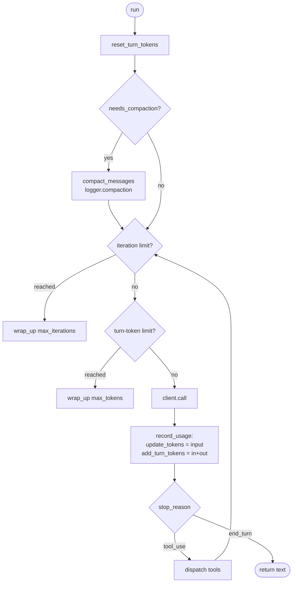

# Step 12 · Context management: plan

## Goal

Make the agent responsible for its own context window. Calling an LLM directly
means no auto-compaction happens for you: the input can grow past the model's
window and the next call fails. This step adds accurate token tracking, a second
per-turn circuit breaker measured in spend, automatic and manual compaction, and
a colour-coded context indicator, on top of the MCP-host tool model and the TUI
carried forward from steps 10 and 11.

The headline is structure-aware compaction. When the window fills, the naive fix
drops the oldest messages, losing whatever scrolled off. The session is parsed
into a `JourneyState` (rooms, exits, trail, goal, findings, vitals) for the
observatory, so the context manager keeps, compresses, or drops history by
meaning and distils what it must shed into a deterministic memory note from that
state. The same parser that draws the UI is the agent's memory, so a compaction
no longer makes the agent forget it already explored the bakery.

## Scope

This step adds the context-management cluster: token and window state on
`Context`, turn-start auto-compaction and a `max_turn_tokens` breaker in
`Agent`, a `compaction` log event, a `/compact` command, the TUI context
indicator, and a `context_window` keyword on `run`/`repl`.

Already shipped in earlier steps, so nothing is added here:

- OpenAI backend on `/v1/responses` (step 04): `input` items, top-level
  `instructions`, `function_call_output` matched by `call_id`.
- `Logger.subscribe` fan-out and the execution-metadata (`provider`, `model`,
  token counts, `cost_usd`) on the `response` event (step 06, step 11).
- The MCP-host tool model and the catalog metadata (steps 03, 10).

Built here (see Design · Reasoning-block round-trip):

- Reasoning-block normalization at the message level: a `ReasoningBlock` typed
  block, every backend's `parse_response` surfacing provider thinking output
  into it, and the signature-preserving round-trip that echoes the block back
  unchanged on the providers that require it (Anthropic thinking signature,
  Gemini `thoughtSignature`). Without this, a thinking + tool_use turn drops
  the thinking block on the follow-up request and Anthropic returns a 400.

The headline (see Design · Structure-aware compaction):

- A structure-aware compaction pipeline driven by `JourneyState`, least-lossy
  first: compress old tool-result bodies to one-line stubs (keeps the turn
  skeleton and the tool_use/tool_result pairing, so it is wire-safe by
  construction), drop the oldest whole turns if still over budget, then distil
  whatever was shed into one deterministic journey-state memory note merged into
  the first surviving user turn. The token budget accounts for the fixed
  overhead (system prompt plus tool schemas) that rides on every call and is not
  in the message list, and `tests/` covers tokens reclaimed, messages preserved,
  and wire-validity.

Also built here:

- The top-level `agent:` settings block (decision A4a), layered: agent-wide
  defaults for `max_iterations`, `max_output_tokens`, `max_turn_tokens`, and
  `compaction_threshold`, with per-task overrides retained.

Deferred to a later step with a trigger (journal, no silent exclusion):

- Cross-session persistent memory (the week0 `.mud_memory.json` lineage), an
  adaptive compaction threshold, and an LLM-summarised rolling summary for
  non-MUD use. Trigger: the web visualizer or a persistence layer.

Deliberately not here:

- A standalone `Models.context_window` module. The backend catalog answers
  window sizing as one source of truth, so a new model needs no separate table.

## Deliverables

The step package carries step 11 forward and changes:

```
week1_baseline/agent/12_context/
├── pyproject.toml                 # version 0.12.0
├── README.md                      # written from the built step
├── boukensha/
│   ├── compaction.py              # NEW: the structure-aware pipeline and the memory note
│   ├── context.py                 # token + window state, delegates compaction, owns the journey parser
│   ├── agent.py                   # turn-start compaction, max_turn_tokens breaker, usage recording, cancellation
│   ├── logger.py                  # compaction event, prompt event carries context_window
│   ├── repl.py                    # /compact command, accepts max_turn_tokens and forwards it to the per-turn Agent
│   ├── tui.py                     # context indicator, command cards, /help in the placeholder
│   ├── journey/present.py         # command card kind, clear() for /clear
│   ├── run_dsl.py                 # context_window keyword, sizes Context from the backend catalog, resolves the agent-block limits
│   ├── config.py                  # the top-level agent: block accessor
│   ├── tasks/base.py              # max_turn_tokens, compaction_threshold accessors
│   ├── backends/ollama.py         # parses message.thinking into a ReasoningBlock
│   ├── version.py                 # 0.12.0
│   └── ...                        # rest carried forward
├── examples/
│   └── example.py                 # launcher: opens the TUI, --window N to force compaction
└── tests/
    ├── helper.py                  # hermetic assembly over a stub transport
    ├── tui_helper.py              # a FakeRepl for pure front-end tests
    ├── test_compaction.py         # pipeline contract, measured-prefix budget, over_budget
    ├── test_multi_turn_compaction.py  # a second turn compacts after the first fills the window
    ├── test_turn_limits.py        # both breakers, usage normalization, wind-down pressure
    ├── test_reasoning.py          # parse and echo directions per provider
    ├── test_stop_reason.py        # a turn always states why it ended
    ├── test_commands_in_tui.py    # command results render as results, /clear clears the screen
    └── test_agent_config.py       # layered agent: block resolution
```

The launcher: `week1_baseline/bin/12_context`.

## Design

### Context token and window state

`Context` gains window and token state alongside the message history it already
owns. Tools stay with the registry (established ownership), so `Context` holds
conversation state only, never a tool map.

| Element | Kind | Meaning |
|---|---|---|
| `context_window` | ctor arg, reader | The model's maximum input capacity, sized at assembly. |
| `compaction_threshold` | ctor arg, reader, default `0.85` | Fraction of the window at which auto-compaction fires. |
| `current_tokens` | mutable, default `0` | Input tokens of the most recent API response: what the next call will send. |
| `turn_tokens` | reader, default `0` | Cumulative input+output tokens processed this turn: the WORK budget, which caching does not move. |
| `update_tokens(n)` | method | Set `current_tokens` from a response's input-token count. |
| `reset_turn_tokens()` | method | Zero `turn_tokens` at the top of a turn. |
| `add_turn_tokens(input, output)` | method | Add one call's input+output to `turn_tokens`. |
| `usage_fraction()` | method | `current_tokens / context_window`, `0.0` when the window is not positive. |
| `usage_pct()` | method | `round(usage_fraction() * 100)`. |
| `needs_compaction(threshold=compaction_threshold)` | method | True when `usage_fraction() >= threshold`. |
| `compact_messages(keep_recent=2, overhead=0)` | method | Delegate to the compaction pipeline, passing the window and the caller-measured prefix so the budget accounts for what compaction cannot shrink. Compress old tool-result bodies, drop the oldest whole turns if still over budget, merge a journey memory note, always end on a `user` turn, reset `current_tokens` to 0, return the dropped count. |
| `clear_messages()` | method | Existing, and now also resets `current_tokens` to 0. |

Settled behavior:

- `compact_messages` runs the pipeline against a token budget, not a fixed
  fraction of the message count: compress old tool-result bodies, then drop the
  oldest whole turns while the estimated history still exceeds the budget, then
  merge the memory note. Every cut lands on a `user` message so the surviving
  prefix begins with a real user turn. Two or fewer messages drop nothing.
  `current_tokens` resets to 0, so the next response's `input_tokens` reports the
  true post-compaction size.
- The budget is the target fraction of the window minus the fixed overhead. The
  overhead is MEASURED from the objects that own it, `prefix_tokens(system,
  tools)`, because the system prompt and the tool schemas ride on every call and
  are not in the message list. Sizing the budget against the list alone
  under-compacts: the trigger fires on the true prompt size while the budget sees a
  small history, so the pipeline stops early and the window keeps filling.
- The overhead is not inferred by subtracting a history estimate from a past
  call's reported size. Those are two different prompts, since the caller appends
  the new user turn before compaction runs, and a user message larger than the true
  overhead drives the subtraction negative, floors it to zero, and silently removes
  all overhead accounting. Tool schemas are measured as the JSON a provider is
  sent, since that wrapping is most of a schema's size.
- With no window (`0`) the pipeline falls back to a wire-safe count-based cut of
  the oldest 40 percent, so the call is always safe to make.
- The wind-down call records spend but never window pressure. It is sent with
  tools disabled, so its input is much smaller than a normal call's, and letting
  it set the pressure hides the real occupancy from the next turn's check.
- The result carries `over_budget`, so a caller can tell "freed enough" from "did
  everything allowed and the prompt is still too big". The second happens when the
  un-shrinkable prefix alone exceeds the budget, or when `keep_recent` stops the
  loop. It reaches the `compaction` log event and the TUI card, so a person sees
  the honest outcome rather than an implied success.
- Advancing the cut to a user turn is a correctness requirement: a raw front
  count can leave either an orphaned `tool_result` or a leading `assistant`
  message, and either 400s the next call. The assistant `tool_use` message and each
  `tool_result` are separate list entries (`agent.py` adds
  `Message.assistant(content)` then `Message.tool_result(...)`), so a raw front
  cut can split a turn and leave either shape at the front. Both 400 the next
  call: a `tool_result` whose matching `tool_use` was dropped is orphaned, and
  Anthropic and Gemini require the first message to use the `user` role. This
  covers the skill's listed known defect ("compaction that can split a tool_use
  from its tool_result") and the leading-assistant variant of the same failure
  class. Advancing to the next `user` message drops whole exchanges to a safe
  turn boundary, and validity beats the "keep at least 2" floor, so the advance may
  drop below 2 when the tail holds no further user turn. The boundary is read
  from `Role`, no content scan.
- A stub transport passes even with a raw front cut, because it never issues the
  follow-up live call that would 400. A dedicated test guards the
  invariant directly so the defect cannot slip back in silently.
- `current_tokens` is window pressure (last input size), and `turn_tokens` is turn
  spend (running input+output). They are distinct and neither derives from the
  other.
- `usage_fraction` guards against a non-positive window so an odd catalog value
  cannot divide by zero.

### Sizing the context window

The window comes from the configured model. Our port already exposes it as
`backend.context_window`, which reads the model's catalog entry, so `_assemble`
builds the backend first and sizes `Context(system, context_window=...)` from
`backend.context_window`. An explicit `context_window=` keyword on `run`/`repl`
overrides it (default `None` means "use the model's window").

- No standalone `Models.context_window(model)` module is added: the catalog
  accessor on the backend already answers this, so metadata consumers read the
  catalog through the backend accessors that exist.
- An unknown model raises `ConfigError` at backend construction (established),
  naming the fix, rather than silently assuming a conservative default window.

### The turn loop with two breakers and compaction

`Agent.run` resets the turn spend counter and compacts if needed before the
loop, then stops on whichever breaker trips first: `max_iterations` (tool-call
count) or `max_turn_tokens` (turn spend). Both are trigger thresholds, not hard
caps: reaching one makes exactly one tools-disabled wind-down call, which is
counted in tokens but not as another iteration.



Settled behavior:

- `max_turn_tokens` default is `60_000`, and `0` disables the breaker.
  `token_limit_reached` is `max_turn_tokens > 0 and turn_tokens >= max_turn_tokens`.
- The token breaker is evaluated on pre-wind-down spend, and the wind-down call's
  tokens still count toward the `turn_tokens` reported to `turn_end`.
- `limit_reached` logs `kind="max_tokens"` with `n=turn_tokens`, and the existing
  `max_iterations` path is unchanged.
- Token accounting uses the same cross-provider usage normalization already used
  for the `response` log event, so `current_tokens`/`turn_tokens` are correct on
  Gemini (`usageMetadata`) and Ollama (`prompt_eval_count`/`eval_count`), not
  only on the Anthropic/OpenAI `usage.input_tokens` shape.

### Structure-aware compaction (the innovation)

A naive compactor drops the oldest 40 percent blind. This pipeline is driven by
a `JourneyState`, each stage reclaiming tokens before the next is needed, so the
least-lossy option always runs first:

```
occupancy >= threshold at turn start ->
  budget       target fraction of the window MINUS the fixed overhead. The
               system prompt and the tool schemas ride on every call and are
               not in the message list, so the budget is set against the true
               prompt size, measured by `prefix_tokens`. A budget at or
               below zero means the overhead alone fills the window.
  1. COMPRESS  replace OLD tool-result bodies with a one-line stub, keeping the
               turn and the tool_use/tool_result pairing intact  (wire-safe)
  2. DROP      if still over budget, shed the OLDEST whole turns, never a part
               of one, so a tool_result is never orphaned
  3. SUMMARISE distil whatever was shed into ONE deterministic memory note from
               JourneyState, merged into the first surviving user turn
  always: end at a valid wire start (a user-role turn)
```

Not built here, and not claimed: deduplicating repeated room observations,
salience or goal-relevance ranking inside DROP (it takes the oldest turns), and
a predictive trigger that compacts before a projected overflow. The memory note
already carries what was shed, so these are refinements rather than gaps. They
sit in the deferred list at the end of this plan.

Where the structured state comes from: the `JourneyParser` (from the journey
package) is fed the same tool_call/tool_result the agent already dispatches, so
the agent owns a live `JourneyState` at compaction time. This is the deliberate
promotion of the parser from a TUI helper to the agent's memory engine.

Best practices: an overhead-aware token budget, so the part of the prompt
compaction cannot shrink is counted before deciding how much history to shed,
wire-safety by construction (compress in place, drop whole turns), and a tested
contract in `tests/` covering tokens reclaimed, messages preserved, the exactness
of the dropped count, and wire validity.

### The log and the notice

Auto-compaction and `/compact` both emit one `compaction` event, so a manual
compaction is visible to the log, not only printed:

```json
{"phase": "compaction", "before": 172000, "dropped": 12, "compressed": 5, "summarized": true, "context_window": 200000}
```

`before` is `current_tokens` at the moment of compaction. The TUI renders it as
a compaction card in the Feed and a notice on the Dashboard, so a user watching
the journey sees memory being freed rather than history silently vanishing.

### Settings resolution

The four agent-wide limits (`max_iterations`, `max_output_tokens`,
`max_turn_tokens`, `compaction_threshold`) resolve layered (decision A4a): a
top-level `agent:` section supplies agent-wide defaults, and a task may still
override any of them under `tasks.<name>.*`. Resolution order is explicit arg,
then the task value, then the `agent:` value, then the code default
(`25 / 1024 / 60_000 / 0.85`). A value of `0` disables a breaker.

- These are agent-wide circuit breakers, not per-task tuning, so the agent level
  is their natural home. The task-level accessors stay as overrides, so nothing
  that worked before breaks.
- Ownership is unchanged: `compaction_threshold` is owned by `Context`
  (window-pressure policy), `max_turn_tokens` by `Agent` (spend policy).

Wiring, threaded so the work breaker fires in every front-end, not only in
one-shot `run`:

- `_assemble` resolves both via `Player.max_turn_tokens(task_settings)` and
  `Player.compaction_threshold(task_settings)`, passes `compaction_threshold`
  into `Context(...)`, and returns `max_turn_tokens` on the assembled chain.
- `run` passes `max_turn_tokens` to the single `Agent` it builds.
- `repl` passes `max_turn_tokens` to `Repl`, which stores it and forwards it to
  the fresh `Agent` it constructs in `run_turn`, alongside `max_iterations` and
  `max_output_tokens`.
- Without this, `Repl.run_turn` would build its per-turn `Agent` with only
  `max_iterations`/`max_output_tokens`, so `token_limit_reached` would never
  trip in the REPL or TUI, the front-ends the product actually runs, and the
  step's headline work breaker would fire only in `run`.

### `/compact` command

`Repl.handle_command` gains `/compact`: it runs the pipeline through
`context.compact_messages`, prints what happened (dropped, compressed, whether a
memory summary was kept), and emits the same `compaction` log event
auto-compaction does, so a manual compaction is visible to the log, not only
printed. The TUI routes the same command through `handle_command`, so the effect
happens once for both front-ends. `/compact` is in the help text and the banner.

### TUI context indicator and compaction card

The header shows `current_tokens / context_window` as a percentage, read from
the shared `Context` (never a cumulative sum), with a warning marker at high
usage. A `compaction` event renders a compaction card in the Feed (`context
compacted, dropped N, compressed M, kept a memory summary`) and flashes a
dashboard notice, so a watcher sees memory being freed rather than history
silently vanishing.

### Commands are visible as commands

A slash command's output is not the agent speaking, and presenting it as such hides
it where nobody looks. Three pieces of behavior:

- Command output and command errors render as a `command` card, titled with the
  command that produced it. Routing them into the thinking view meant a person who
  ran `/tokens` saw nothing where a result belongs, and a rejected command read as
  the model's own reasoning, which teaches distrust of the panel that shows what the
  agent is thinking.
- The result also toasts, because the Feed card is on a tab the person may not be
  standing on. The card is the record and the toast is what reaches whoever typed
  it, the same pattern already used for a compaction and an MCP failure. Output too
  long for a notification (`/history`, `/tools`, `/system`) is announced by its
  first line plus where the full text went, rather than truncated mid-content, and
  a rejection toasts at error severity.
- `/clear` clears the Feed and the live panels through `Presenter.clear`, not only
  the model's history. Dropping the history while leaving the cards on screen leaves
  the display and the model disagreeing about what was said, which is worse than a
  command that appears to do nothing. Ctrl+L is the same action.
- The input placeholder leads with `/help`. Key bindings are discoverable by
  pressing keys, a slash command is not, so the command surface needs advertising
  inside the running application and not only in the README.

### Reasoning-block round-trip

Thinking is a first-class setting in this baseline: `tasks.player.thinking`
sets a level, the catalog carries a thinking mode for every model, and the
agent's purpose is tool use, so thinking + tools is a mainstream configuration,
not a corner. A model that thinks and then calls a tool must have its thinking
block returned to the API on the follow-up request that carries the tool
result. Anthropic verifies the latest assistant turn arrives unmodified and
rejects a dropped or rebuilt thinking block with a 400 `invalid_request_error`,
"thinking or redacted_thinking blocks in the latest assistant message cannot be
modified". Gemini requires every thought block and the `thoughtSignature` on
the function call resent unchanged in stateless mode.

The port keeps the block round-tripping at the message level:

- `ReasoningBlock(text, signature=None, redacted=False)` is a fourth frozen
  typed block, allowed only in an assistant message. `text` is the reasoning,
  `signature` is an opaque provider token carried only for the echo, `redacted`
  marks Anthropic `redacted_thinking` whose payload rides in `signature`.
  `ToolUseBlock` gains an optional `signature` for Gemini's per-call token.
- Every backend's `parse_response` surfaces its thinking output into a
  `ReasoningBlock`, in the provider's emission order so a leading thinking block
  stays first: Anthropic `thinking`/`redacted_thinking`, Gemini `thought`
  parts, Ollama `message.thinking`, OpenAI `reasoning` summary.
- Rebuilding the assistant turn re-emits the block for its provider. Anthropic
  writes `thinking`/`redacted_thinking` with the signature intact, Gemini writes
  the `thought` part and the `thoughtSignature` beside the function call. Ollama
  and OpenAI drop it: neither requires it echoed and both leave reasoning out of
  the assistant turn on the wire.

Wire values (the 400 text, the signature and `thoughtSignature` echo
requirements) are verified against the provider docs, listed in the example
header.

### Surfacing reasoning in the REPL and TUI

The reasoning and plan events the loop logs are shown live, so a user watching
the agent sees its thinking as it works, not only in the JSONL. The REPL prints
them muted under `/loud`, distinct from the reply, and `/quiet` suppresses them.
The TUI writes them to the conversation pane on the `reasoning` and `plan`
events, a redacted block marked `(thinking hidden)`. Live reasoning serves the
goal of watching how the agent decides.

### Deferred and deliberately not here (no silent exclusion)

Deferred to a later step, journaled with a trigger:

- Cross-session persistent memory (the week0 `.mud_memory.json` lineage) so a new
  session resumes knowing what was learned, an adaptive compaction threshold, and
  an LLM-summarised rolling summary for non-MUD use. Trigger: the web visualizer
  or a persistence layer. The structure-aware pipeline built here is the local,
  in-session foundation these extend.

Deliberately not here:

- A standalone `Models.context_window` module: the backend catalog accessor
  answers window sizing (see Sizing the context window), so a new model needs no
  separate table.
- Full salience retention (keeping an old event-bearing turn verbatim over old
  navigation) and a predictive cold-start trigger. The memory note already
  captures older events, so nothing important is lost, and these stay
  refinements.

Rendered reasoning stays as it is: the reasoning and plan events are logged and
the TUI already surfaces them as thinking cards. `working_dir` as a registered
capability remains dropped (metadata only), unchanged from the earlier port.

## Verification

Guarantees live in `tests/`, hermetic (no network, no key, no live server), and
the example is a thin launcher of the real TUI, matching the step-11 approach.
Launcher: `bin/12_context`.

Test coverage, one home for every systematic check:

- Compaction contract (`test_compaction.py`): the memory note reflects the journey
  state, compression happens before dropping and its stubs survive when the budget
  allows, the surviving prefix starts on a user turn, no `tool_result` is orphaned
  from its `tool_use`, the memory note survives a drop, a compaction reduces the
  history in tokens rather than only in message count, the no-window path falls
  back to a wire-safe count-based drop, messages skipped to reach a user turn are
  counted in `dropped`, and `over_budget` reports honestly in both directions.
- The measured prefix (`test_compaction.py`): `prefix_tokens` counts the system
  prompt and the tool schemas as the JSON a provider is sent, accepts a mapping or
  a sequence, and a user message larger than the prefix cannot erase the overhead,
  which is the failure the earlier inferred version had.
- Compaction across turns (`test_multi_turn_compaction.py`): compaction is
  evaluated at the start of a turn, so it can only be shown across turns. Two turns
  run over the real chain, the first leaving the window over threshold, the second
  compacting before it calls, and occupancy resetting afterwards so it does not
  then fire on every later turn.
- Breakers and accounting (`test_turn_limits.py`): each breaker trips on its own
  quantity and winds the turn down rather than raising, `0` disables either, a
  configured limit reaches the running Agent through the assembly path, usage
  normalization records both counters on every provider's usage shape, the
  wind-down call records spend but not window pressure, the logged stop reason is
  the normalized one, and `drop_last_turn` works (the crash `/undo` and `/retry`
  used to hit).
- Reasoning (`test_reasoning.py`): Ollama parses `message.thinking` into a leading
  `ReasoningBlock` and drops it on rebuild, Anthropic echoes `thinking` and
  `redacted_thinking` with signatures intact and ahead of the tool call, Gemini
  echoes the thought part and the function call with `thoughtSignature`, and an
  absent thinking field produces no block.
- Turn endings (`test_stop_reason.py`): a turn always states why it ended, a
  ceiling names itself with its numbers, a completed turn needs no card, and a
  stale limit cannot leak into the next turn.
- Commands in the TUI (`test_commands_in_tui.py`): a command's output renders as a
  command card and never as the agent's thinking, an agent reply is still a thinking
  card, a rejected command (the case a person actually hits) renders as a command
  result with the thinking view left untouched, and `/clear` empties the Feed and
  the live panels along with the model's history.
- The `agent:` block (`test_agent_config.py`): layered resolution (task value, then
  the `agent:` default, then the code default) and `Config.agent_setting` reading
  the block.

## Done when

The launcher boots the TUI (or the plain REPL without a TTY) and the test suite
is green, prior steps still pass, and the step README is written from the built
step.
