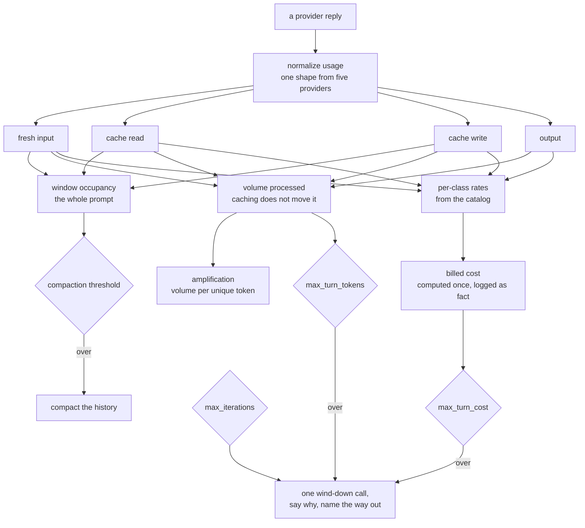

# Step 13 · Context economics: caching, cost, and honest token metrics: plan

## Goal

Make the agent cheap to run and honest about what it spends. Step 12 taught it to
stay inside the context window. This step teaches it to stop paying repeatedly for
the same tokens, to measure spend in the four quantities that actually differ, and
to show its ceilings while it plays.

The headline is prompt caching across all five backends, and the metric that makes
its value visible: an amplification ratio of unique tokens against tokens
processed. A measured session sent 73,043 input tokens to do about 7,000 tokens of
genuinely new work, roughly ten to one, and the tool schemas alone were about
41,700 of it. Caching is the lever: it addresses the price of that repetition,
while the tool surface itself stays whole.

## Scope

Built here:

- Prompt caching on every backend that supports it, with no Anthropic-only
  asymmetry: Anthropic explicit `cache_control` with its minimum-length rules,
  OpenAI automatic caching reporting `cached_tokens`, Gemini implicit caching plus
  its explicit API, and Ollama documented as having none.
- Usage normalization widened from two counts to four classes: fresh input, cache
  read, cache write, and output, across all five providers.
- Four metrics, each answering a different question, none derived from another.
- `current_tokens` sized from the full prompt rather than fresh input, shipped in
  the same change as caching (see Design, the caching precondition).
- Per-class pricing as data in `models.yaml`, with cost computed once where the
  model, the usage, and the rates are all in hand.
- Both circuit breakers retained, with `max_turn_tokens` accounting corrected.
- Ceiling visibility in the TUI header, showing current against limit.
- The static prefix measured, not estimated: the system prompt plus all twenty-six
  tool schemas, recorded as the before-and-after baseline that shows caching
  landed.
- Recovery from a tripped ceiling: `/continue` to resume the cut-short turn,
  `/limits` to see and change every ceiling, and stop messages that name the way
  out. A limit a person cannot reach is a dead end.

Deliberately not here:

- Retiring `max_turn_tokens`. It was proposed and rejected. The problem was its
  calculation, not its existence, and the corrected metric is stable under
  caching. See Design, the two breakers.
- Token streaming. A committed separate pass after the log viewer.
- Cross-session persistent memory, an adaptive compaction threshold, and
  LLM-summarised compaction, all carried in the journal for a later step.
- Trimming the tool surface. Rejected on the arithmetic, see Design, the tool
  surface stays whole.

Read by the log viewer, which renders this step's cost and metric fields from the
log, so this step is built before it. It reads them as a FILE and imports nothing from
here, and this is the last step that carries the agent forward.

## Deliverables

The step package carries step 12 forward and changes:

```
week1_baseline/agent/13_context_economics/
├── pyproject.toml                 # version 0.12.1
├── README.md                      # written from the built step
├── boukensha/
│   ├── usage.py                   # NEW: the four-class usage record and the metrics
│   ├── pricing.py                 # NEW: per-class rates to money, one place
│   ├── backends/base.py           # cache directives and four-class parsing contract
│   ├── backends/anthropic.py      # cache_control breakpoints, cache_* usage fields
│   ├── backends/openai.py         # cached_tokens from the Responses API
│   ├── backends/gemini.py         # implicit cache reporting, explicit cache API
│   ├── backends/ollama.py         # documented as no caching, reports zeros
│   ├── models.yaml                # cost_per_million gains the cache classes, plus cache_min_tokens per model
│   ├── agent.py                   # four-class recording, corrected turn_tokens, amplification
│   ├── context.py                 # current_tokens from full prompt size
│   ├── logger.py                  # per-class usage and the metric block on response
│   ├── tui.py                     # header shows current against each ceiling
│   └── ...                        # rest carried forward
├── examples/
│   └── example.py                 # launcher, carried forward unchanged from step 12
└── tests/
    ├── test_usage.py              # four-class normalization per provider shape
    ├── test_pricing.py            # per-class money, unknown rates, free-by-nature
    ├── test_caching.py            # capability-driven: declared support, per-model minimums
    ├── test_metrics.py            # the four metrics, amplification, the cost ceiling
    ├── test_cold_vs_warm.py       # live-gated: the step's headline evidence
    ├── test_limits.py             # /limits reporting and setting, /continue recovery
    └── ...                        # step-12 suites carried forward
```

The launcher: `week1_baseline/bin/13_context_economics`.

## Design

One response, four classes, and everything this step measures downstream of them:




### Why caching is the headline

A stateless chat API re-sends the whole conversation on every call, so a turn that
takes eleven tool calls pays for its history eleven times. Measured on a real
session of fourteen calls:

| Quantity | Tokens |
|---|---|
| Input processed across all calls | 73,043 |
| Tool schemas, re-sent on each tool-enabled call | about 41,700 |
| Genuinely new content across the whole session | about 7,000 |

A provider that recognises an unchanged prefix charges a reduced rate to read it, so
the measurement has to separate volume from money, which is what the four metrics
below do.

### The four metrics

Each answers a different question, and none is derived from another. Collapsing
them is what made the step-12 counter misleading.

| Metric | Question | Source |
|---|---|---|
| Volume processed | how much work did this turn do | all input classes plus output |
| Billed cost | what did this turn cost | the same classes at their own rates |
| Window occupancy | how full is the context | the largest single prompt |
| Amplification | how much of the volume was genuinely new | unique against processed |

Amplification is new and is the health signal for caching. Expressed as a ratio,
the measured session reads about ten to one, which turns a surprising bill into a
single readable number instead of something inferred after the fact.

Settled behavior:

- Volume processed counts every input class, so enabling caching does not move it.
  The same tokens are still processed, only their price changes. This is the
  correction to step 12's `turn_tokens`, which counted fresh input only and
  therefore appeared to change meaning when caching was enabled.
- Unique tokens are counted once per distinct prompt component across the turn:
  the system prompt and the tool schemas once each, plus each new message.
- Amplification is reported as a ratio and is undefined, not zero, for a turn with
  no unique content.

### The caching precondition

Caching and the `current_tokens` fix ship together, never one without the other.

Anthropic reports `input_tokens` excluding cached tokens. `needs_compaction()`
reads `current_tokens / context_window`, and step 12 sets `current_tokens` from
`input_tokens`. So enabling caching alone would drop measured occupancy to near
zero permanently: compaction would never fire again and history would grow until
the provider hard-errors on a genuinely oversized prompt.

Settled behavior: `current_tokens` is the full prompt size, the sum of fresh
input, cache read, and cache write. Cached tokens still occupy the window: caching
changes their price, never their presence.

### Per-class pricing as data

`models.yaml` already carries `cost_per_million` with `input` and `output` per
model, each value cited from that model's own provider page. It gains the cache
classes:

```yaml
cost_per_million: {input: ..., output: ..., cache_read: ..., cache_write_5m: ..., cache_write_1h: ...}
```

Settled behavior:

- Rates are data, never a multiplier applied to the input rate. A multiplier
  encodes one provider's economics: Anthropic prices two cache lifetimes
  differently, OpenAI discounts cached input with no write cost, and Gemini bills
  explicit caching partly by storage time.
- Cost is computed once, where the model, the usage, and the rates are all known,
  and is logged as a fact with its class breakdown. Nothing downstream
  recomputes it, so the viewer renders and never re-derives.
- A model with no rates reports cost unavailable, never `$0.00`. Zero and unknown
  are different facts.
- A free-by-nature model, local Ollama, carries explicit zero rates, so its cost
  is a known zero rather than an absence.
- Every rate added here is fetched from the provider's own pricing page at
  implementation and cited in `models.yaml` alongside the existing values.

### The two breakers

Both are kept. They cap different things and neither subsumes the other.

| Breaker | Caps | Holds when |
|---|---|---|
| `max_iterations` | steps in a turn | always |
| `max_turn_tokens` | work processed | always, including unpriced models |
| `max_turn_cost` | money | rates are known |

Settled behavior:

- `max_turn_tokens` counts volume processed, so its meaning survives caching. This
  is the whole correction: step 12's version counted fresh input, which is why
  enabling caching would have silently changed what the setting meant.
- `max_turn_cost` is a new agent-level ceiling in dollars, stable across models
  where a token count is not.
- When rates are unknown, `max_turn_cost` cannot bind, and `max_turn_tokens` plus
  `max_iterations` still do. No boot failure is needed, because a guard remains.
- `0` disables any of the three, consistent with the existing convention.
- All three resolve through the layered `agent:` block from step 12: explicit
  argument, then the task value, then the agent-wide value, then the code default.

### A ceiling is a pause, not a dead end

Hitting a ceiling currently leaves no way forward but destroying the conversation,
because the ceilings are fixed at construction, usage is reported with no ceiling
beside it, and the only recovery is `/clear` or a restart.

Four changes, and the third is the one that matters:

- `/limits` shows every ceiling with current usage against it, in one place. Today
  the numerator is available and the denominator is not.
- `/limits <name> <value>` sets one at runtime for turn spend, iterations, cost, and
  the window, saying so when a value of `0` disables that ceiling.
- `/continue` resumes a turn a ceiling cut short. The history is intact and the
  agent already recorded why it stopped, so making the person retype their
  instruction is a design failure. It resets the per-turn counters and runs a fresh
  turn on the existing context.
- Every stop message names the way out, not only the cause: the ceiling that fired,
  its numbers, and `/continue or /limits turn_tokens N` beside them.

Settled behavior:

- `/continue` appends a short, visible continuation instruction rather than
  pretending a turn can resume mid-flight. Providers require the last message to be
  a user turn, and the wind-down leaves an assistant message, so something has to
  be added. It is written into the transcript like any other instruction rather than
  hidden, because an invisible injected message is worse than a visible one.
- `/continue` on a turn that ended normally is not an error. It carries on from
  where the agent left off, which is what a person asking to continue means.
- Raising a ceiling with `/limits` applies from the next turn. A turn already
  wound down is finished, and `/continue` is how it is picked up.
- `/continue` alone can trip the same ceiling again when the ceiling is the binding
  constraint, which is why the stop message offers both it and the limit change
  rather than implying one is sufficient.

### Caching is a per-model capability that fails silently

A provider caches nothing below a minimum prompt length and returns NO error, so a
prompt under it produces no cache hits and no explanation. The figure is a per-model
catalog fact spanning an eightfold range on one provider alone, so nothing may
assume a model, and the five providers differ enough that nothing may assume a
provider either.

Settled behavior:

- `Backend.caches` declares whether caching exists at all, so a provider without it
  says so rather than appearing to support something the server ignores.
- `cache_min_tokens` comes from the catalog per model.
- `cache_status(prompt_tokens)` returns the reason in words: `on`, `not supported by
  this provider`, or `prompt N below this model's M minimum`.
- Any code, test, message, or document that names a provider or a model in a
  conditional, or states one minimum as though it were global, is the defect. Read
  the declared capability instead.

### The tool surface stays whole

Tool schemas were about 41,700 of the 73,043 measured tokens, so trimming the tool
list looks like a saving. It is not a worthwhile one. Savings scale with schema
SIZE, not tool count, and the tools a player rarely calls carry small schemas, so
removing them buys a fraction of that 41,700 while giving up real capability.
Equipping, practising and fleeing are exactly the actions whose absence produces
the journey defects this agent exists to find.

So all twenty-six tools stay, and caching is the whole lever. Two consequences:

- The cold-versus-warm comparison is the only evidence this step worked, which
  raises the bar on it. It is the headline of the verification below, not a
  footnote.
- The static prefix is still measured and recorded, the system prompt plus all
  twenty-six schemas, counted rather than estimated. It costs nothing, it is the
  baseline that proves caching landed, and it is a finding in itself: a fixed
  prefix that is the majority of every single call.

### Ceiling visibility

A limit that stops a turn must be visible before it does. Step 12 added the stop
reason in the footer and a Feed card. This step adds the header half:

- Every ceiling reads as current over limit, never bare: `iter 11/125`,
  `$0.08/$0.25`, `ctx 2%`.
- Whichever ceiling is closest to tripping is highlighted.
- Iterations tick live during a turn.
- Amplification appears alongside, since it is the number that explains a
  surprising bill.

### Verification

The example is a launcher, unchanged from step 12: it starts the application and
hands over control, scripts nothing, and asserts nothing. `--window N` carries
forward, and caching adds no flag a person has to know about, since it is on by
default where the provider supports it.

Every check lives in `tests/`, including the step's headline evidence.

The cold-versus-warm comparison is a LIVE-GATED TEST, not an example block. Caching
is the whole lever here, so this comparison is the only thing that shows the step
worked, and it has to run automatically rather than depend on someone playing. It
plays one scripted exchange twice against the same provider, cold then warm, and
asserts what caching does and does not change: tokens processed hold steady, cache
reads appear on the second run, and billed cost falls. Skipped with a notice when
the key is absent, the same gate the launcher uses, so a keyless suite stays green.
This is the move `test_multi_turn_compaction.py` already made when the
deterministic compaction proof came out of the example.

Hermetic tests, the load-bearing guarantees no single live run can give:

- Four-class normalization on each provider's usage shape, including a provider
  that reports no cache fields.
- Volume processed is unchanged when the same tokens arrive as cache reads instead
  of fresh input, which is the caching-invariance property and the reason the
  corrected `max_turn_tokens` survives caching.
- `current_tokens` counts cached tokens, so compaction still fires under caching.
  Without this the window reads near empty forever and history grows unchecked.
- Per-class cost arithmetic, an unknown-rate model reporting unavailable, and a
  free-by-nature model reporting a known zero.
- Each breaker trips on its own quantity, and `0` disables it.
- Cache directives are attached per the provider's documented rules, including
  the minimum cacheable length.
- `/continue` after each kind of ceiling produces a valid request, so the resumed
  turn is not rejected for ending on an assistant message, and it carries the
  conversation rather than restarting it.
- `/limits` reports each ceiling with its usage, and setting one changes what the
  next turn enforces, including `0` to disable.

## Done when

- The launcher starts the application and hands over control, scripting and
  asserting nothing.
- The suite is green and owns every check, including the live-gated cold-versus-warm
  comparison, which skips with a notice rather than failing when the key is absent.
- Caching is exercised on all five backends, with Ollama documented as unsupported
  rather than silently absent.
- `current_tokens` counts cached tokens, shipped with caching in one change.
- The four metrics are logged per response and rendered in the header.
- Both token and cost breakers work, resolve through the `agent:` block, and are
  visible as current over limit.
- The static prefix is measured and recorded in the README, counted rather than
  estimated, with the cold and warm figures beside it.
- A tripped ceiling is recoverable without losing the conversation: `/limits` shows
  and sets every ceiling, `/continue` resumes a cut-short turn, and the stop message
  names both.
- Every new rate in `models.yaml` cites its provider pricing page.
- README written from the built step, with a diagram and real pasted output.
