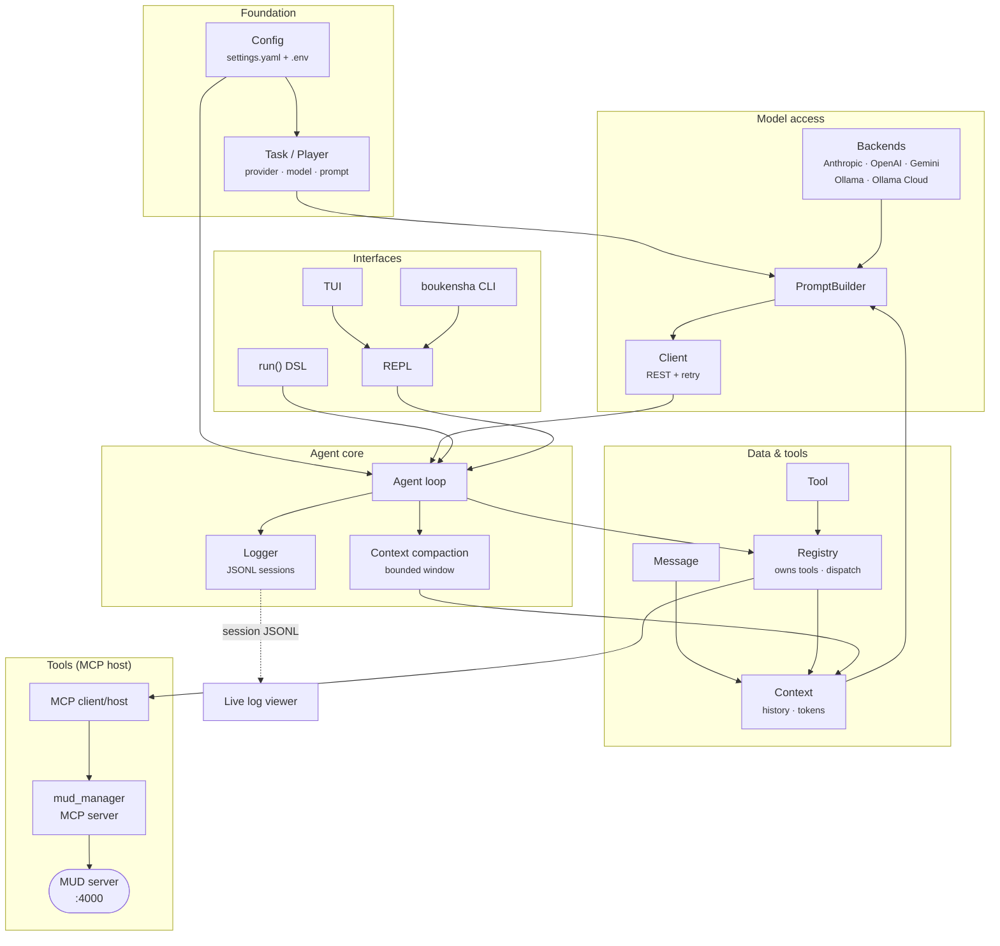
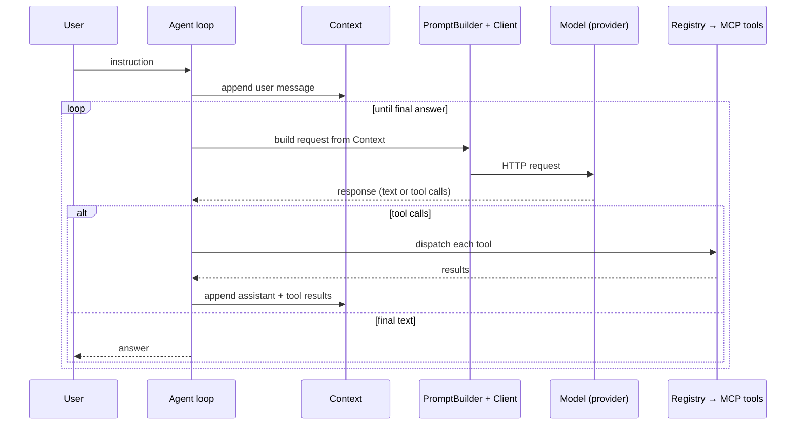

# Week 1 · Baseline agent — architecture

boukensha is a Python agent that plays a MUD game server under natural-language
instruction. This week builds the **baseline**: the foundational agent — the
minimal, complete machinery an agent needs to run — on which more capable
behavior is built later. It is intentionally simple: it acts only on the
instructions it is given, and holds no memory or model of the world beyond the
current conversation.

This document describes the system, its components, how a turn flows through
them, and the order in which they are built. Each build step has its own plan
and README with the finer detail.

## Component map

## Components

**Foundation**
- **Config** — loads settings and secrets from the config directory; the single
  source every other component reads configuration from.
- **Task / Player** — resolves a task's provider, model, and system prompt. A
  *task* is a role in the agent bound to a model; the baseline runs one, the
  `player`.

**Data & tools**
- **Message** — one entry in the conversation: role, content, and any tool
  linkage.
- **Tool** — a callable capability: name, description, parameter schema, and a
  handler.
- **Context** — the live conversation state: system prompt, message history,
  registered tools, and token counts.
- **Registry** — holds the available tools and dispatches a model's tool call
  to the right handler.

**Model access**
- **Backends** — one adapter per provider (Anthropic, OpenAI, Gemini, Ollama,
  Ollama Cloud), each normalizing that provider's request and response formats
  behind a common interface.
- **PromptBuilder** — turns the Context into a provider-specific request payload
  and parses the provider's response into a common shape.
- **Client** — performs the HTTP request to the provider API, retrying on
  transient failures.

**Agent core**
- **Agent loop** — the core cycle: send the context to the model, dispatch any
  tool calls, append their results, and repeat until the model returns a final
  answer.
- **Context compaction** — keeps the conversation within the model's context
  window as it fills.
- **Logger** — records each session as structured JSONL: calls, tool use, token
  usage, and cost.

**Interfaces**
- **run() DSL** — a programmatic entry point for running a single task.
- **REPL** — an interactive multi-turn session from the terminal.
- **CLI** — the installed `boukensha` command.
- **TUI** — a full-screen terminal interface over the REPL.

**Tools (MCP host)**
- **MCP host / client** — connects to MCP servers over stdio and exposes their
  tools to the agent.
- **mud_manager MCP server** — provides the MUD interaction tools and holds the
  connection to the MUD server.

**Observability**
- **Live log viewer** — a browser view of a session, reading the logger's JSONL.

## How a turn flows

Context compaction runs as the history approaches the model's window, and the
Logger records every call and tool result throughout.

## Build path

The system is assembled one component per step. Each step is a self-contained,
runnable package under `agent/` that carries the previous step forward and
documents itself in its own README.

| # | Step | Adds |
|---|------|------|
| 00 | config | configuration: settings, secrets, prompts |
| 01 | struct skeleton | the `Message`, `Tool`, `Context` data structures |
| 02 | registry | the tool registry: registration and dispatch |
| 03 | prompt builder | per-provider request/response across five backends |
| 04 | api client | the REST transport with retry |
| 05 | agent loop | the call/dispatch/repeat loop |
| 06 | logger | JSONL session logging |
| 07 | run DSL | the programmatic `run()` entry point |
| 08 | repl | the interactive multi-turn session |
| 09 | executable | the installed `boukensha` command |
| 10 | tool library | the MCP host and the `mud_manager` connection |
| 11 | tui | the terminal user interface |
| 12 | context | context compaction within the model window |

## Constraints

- The agent's mechanics — the loop, tool dispatch, per-provider prompt
  construction, the REST calls, context handling — are implemented directly,
  without an agent framework, so each is explicit and inspectable.
- Provider calls use the REST APIs directly, giving full access to each
  provider's feature set and making the differences between them visible.
- The standard library is preferred; dependencies are kept minimal.
