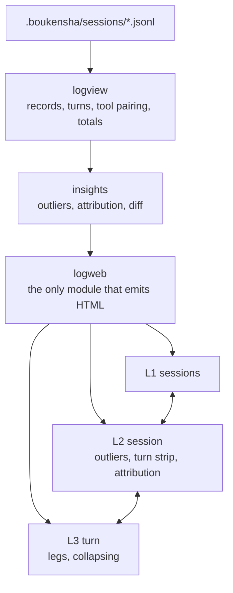

# Step 13 · Log viewer: plan

## Goal

Make a session readable and searchable, completely. Every step so far writes a JSONL
log carrying the whole of what the agent did, and step 11 kept that trace out of the
TUI so the journey view stays readable. This step owns it, in a browser.

The question it answers is WHAT HAPPENED. A person opens a log because something is
puzzling: the agent did something odd, a tool came back wrong, a turn stopped, a run
took longer or cost more than expected. All of that is already in the file and most of
it is shown nowhere.

The bar is that it must ANSWER rather than merely display. Rendering everything in one
chronological scroll, however neatly, leaves the reader to work out what mattered. But
the answer is about the run, not only its bill. Cost is one dimension among many and
keeps its place without taking the headline.

## The requirement, and the test every screen faces

Professional, comprehensive, and easy to use, which here means one thing: a person
opens a session and finds what they need WITHOUT SCROLLING AND WITHOUT KNOWING WHERE TO
LOOK.

That is the test for every screen, not a feature list. Stated as requirements:

- EVERY VIEW IS URL-ADDRESSABLE. A turn, an iteration, a lens, or a filtered set is a
  link that can be kept and shared.
- CONTROLS ARE VISIBLE, AND SHORTCUTS ARE FOR WHAT A BROWSER CANNOT DO. It already
  scrolls and already opens a disclosure triangle, without being taught, so binding keys
  for those states the binding without stating a reason. Two are bound because they are
  beyond it, searching this record and jumping to what went wrong, and both are buttons
  that print their own shortcut. A control you can see needs no legend.
- PROGRESSIVE DISCLOSURE. Collapsed by default, expandable to the full value, with the
  raw record always one step away.
- ONE VISUAL LANGUAGE for entity kinds, so a tool call, a reply, an error, MUD output
  and a compaction are distinguishable before any label is read.
- ABSENT STATED AS ABSENT. A session with no reasoning shows no reasoning line rather
  than an empty one, and an unpriced session says unavailable rather than showing a
  zero.
- NOTHING HIDDEN. Any rendering is checkable against the raw record from the same
  screen.

## Scope

### Three levels, then seven lenses on the session

- L1 SESSIONS. Which run. When, what model, how it ended, the configuration it ran
  under, and badges for failures, tripped ceilings and outliers.
- L2 SESSION. What happened, with the seven lenses below as tabs over the same
  session, plus what stands out and where the time and money went.
- L3 TURN or LEG. Everything the log recorded about one turn, and about one call
  within it, down to the raw record.

Drill down and up moves between the three, and the lenses re-read L2 without leaving
it. A lens is a view, not a filter: each is addressable and each answers something the
others hide.

### The completeness rule

EVERY FIELD THE LOGGER WRITES HAS A PLACE IN THE VIEWER. Where one is deliberately not
surfaced it is named here with a reason. The rule matters more than any list, because
the log will gain fields and a viewer that quietly omits them stops being a record.

Audited against all 20 sessions on disk, 2,957 events. Twelve phases, and every field:

| phase | events | fields, all of which have a home below |
|---|---|---|
| `session_start` | 20 | `system`, `schema`, `model`, `provider`, `task`, `context_window`, `max_iterations`, `max_output_tokens`, `max_turn_tokens`, `rates`, `caches`, `cache_min_tokens` |
| `turn` | 49 | `n`, `attempt` when a number is reused |
| `iteration` | 551 | `n`, `max` |
| `prompt` | 551 | `messages`, `tools`, `message_count`, `tool_count`, `context_window` |
| `response` | 568 | `text`, `usage`, `stop_reason`, `cost_usd`, `duration_ms`, `model`, `provider`, `task`, `usage_unit`, `context_window` |
| `tool_call` | 535 | `name`, `args`, `id` |
| `tool_result` | 535 | `name`, `result`, `ok`, `error`, `tool_use_id` |
| `plan` | 75 | `text` |
| `compaction` | 2 | `before`, `dropped`, `compressed`, `summarized`, `over_budget`, `context_window`, `trigger` |
| `retry` | 5 | `attempt`, `status`, `wait`, `error` |
| `limit_reached` | 17 | `kind`, `n`, `max` |
| `turn_end` | 49 | `reason`, `iterations`, `tokens`, `input_tokens`, `output_tokens`, `cost_usd`, `duration_ms`, `usage`, `unique_tokens`, `amplification` |

Two things every event carries and nothing currently shows: `at`, a timestamp on all
2,957 events, and `session_id`. And `usage` NESTS seven keys on all 568 responses:
`input_tokens`, `output_tokens`, `cache_read_input_tokens`,
`cache_creation_input_tokens`, `cache_creation`, `service_tier`, `inference_geo`.

### Three standing checks, because the same failures keep happening

The audit above is a snapshot. These two are checks that keep applying.

DERIVE OR LOG, NEVER RECONSTRUCT. A figure the viewer cannot derive from the record is
logged by the writer or shown as absent. It is never rebuilt from something adjacent.
Amplification is the case that proves it: its denominator is the count of distinct
things sent, which the agent tracks and the message stream does not record, so a viewer
computing its own would be inventing a number. It is a logged field.

A SUMMARY REPLACING A SET OF FIELDS IS A REGRESSION, EVEN WITH NOTHING FAILING. Three
field losses happened at one rewrite boundary and every suite stayed green through all
three, because a plausible value was still present each time:

| Lost | How it looked |
|---|---|
| `duration_ms` on every response | the field simply stopped appearing |
| `duration_ms` on the wind-down call | timed everywhere except the call after a ceiling trips |
| `input_tokens`, `output_tokens`, `cost_usd` on `turn_end` | replaced by one summed `tokens`, which a reader cannot take apart again |

None of them failed a test, because a test asserting a value cannot notice a field that
is gone. So the guard is a test that a field EXISTS, asserted against the written file
rather than against what the agent passed. Those two are not the same question, and the
difference is where a logger drops something on the way through.

PRESENT IS NOT THE SAME AS SURFACED, AND ADDING A VIEW NEVER REMOVES ONE. The raw lens
prints whole records, so technically nothing is invisible. A field that appears only as
raw JSON has all the discoverability of not being logged: a reader chasing why a turn died
on `max_tokens` should not have to find the ceiling by reading a record.

So the rule is a test. `tests/test_field_coverage.py` collects every field the fixtures
carry and fails when one is named by no renderer. `RAW_ONLY` is the escape hatch and it
works like the import allowlist: a field goes in with a REASON, which makes leaving
something raw a decision somebody makes visibly rather than an omission nobody notices.
Its first run found twelve, four of them the run's own ceilings.

The other half of the rule is that new angles are ADDITIVE. Nothing already reachable
stops being reachable, and the drill-down to a single record is a property of every view
rather than a view of its own.

Made mechanical in `tests/test_log_vocabulary.py`: every phase in the writer's own
vocabulary is written to a real file, read back through the reader this viewer uses, and
checked field by field. Three things it enforces that no earlier test could:

- A phase the WRITER can emit that the READER does not know about fails, so the reader
  cannot silently fall behind the log it reads.
- A field named in the audit table above that never reaches the file fails, so the table
  and the writer cannot drift apart.
- `at` and `session_id` are on every record, asserted for every phase rather than
  sampled.

### Seven lenses, each a first-class view rather than a filter

Innovation here is several ways to read one session, not one screen done well. Each
lens answers a question the others hide.

1. NARRATIVE. The conversation as it ran: instruction, reasoning, replies, tool calls
   paired with results in full, MUD output as a terminal with ANSI preserved,
   compactions in sequence, and how the turn ended.
2. TIMELINE. A time axis, one block per call, width by `duration_ms`, colour by
   outcome. Where the wall clock went, and a slow call against the session's median.
3. CONTEXT. The prompt at each iteration and the DIFF against the previous one. See
   below, this is the most explanatory view available.
4. TOOLS. Grouped by tool rather than by time: every call to one tool with its
   arguments, results, failure rate and latency spread. Answers what a tool did all
   session, which time-ordering hides.
5. JOURNEY. Rooms in visit order, the trail, deaths and level-ups, from the parser
   this project already owns. The game read out of the log.
6. ERRORS. Retries with their `attempt`, `status`, `wait` and `error`, failed tool
   results, tripped ceilings and cancellations, in one place with their context.
7. RAW. The JSONL itself, filtered and searchable. This is what makes the
   completeness claim checkable, because a reader can always drop to the record and
   confirm any rendering against it.

### The context diff, and why it is the best view here

`prompt.messages` is logged on all 551 prompt events, so the viewer holds the exact
payload sent at every iteration. That makes it possible to show what CHANGED between
iteration N and N+1 rather than only that the prompt grew.

Verified on a real session, iterations 1 to 3 of `20260725T161502Z-124c0722`:

```
 iteration 1 -> 2     1 message -> 3
   + assistant/text+tool_use   "I'll help you find the menu at the bakery. First, let me che…"
   + tool_result               "The Temple Of Midgaard   You are in the souther…"

 iteration 2 -> 3     3 messages -> 5
   + assistant/text+tool_use   "Now let me check the exits and explore to find the bakery. L…"
   + tool_result               "Nah... You feel too relaxed to do that.."
```

That answers why a prompt ran from 15,352 to 19,380 tokens across a turn in the
agent's own words rather than as a number. No generic log viewer can do it, because no
generic logger keeps the payload.

Settled behavior:

- The diff shows additions, and removals when a compaction shrinks the context. NOTE,
  measured: no session on disk has a compaction that shrank a prompt, message counts
  run monotonically upward in all 20, so the removal case is built from the compaction
  event's own `dropped` and `compressed` counts and cannot yet be shown from a real
  log. That is stated rather than implied so nobody mistakes it for tested-on-real-data.
- The system prompt and the tool schemas are shown once, at the session level, since
  they are identical on every call and repeating them per iteration is what makes the
  payload unreadable.

### Kept from what exists, because it is right

- MUD output rendered as a terminal, with the game's ANSI colours preserved. It reads
  like the game, and a viewer that stripped them would be worse.
- A dense per-call chip carrying context, output and cost.
- Tool calls as their own labelled element directly above their result.

### Already shipped, so nothing is added here

- The event vocabulary and the file format (step 06). No event is added and no schema
  changes. This is the only thing the viewer depends on, and it depends on it as a FILE
  rather than as an import.
- Per-class usage, cost and metrics (step 13), read from the record and never
  recomputed. `unique_tokens` and `amplification` were added to `turn_end` for exactly
  this reason: they cannot be derived from the record, so a viewer would have to invent
  them. `rates`, `caches` and `cache_min_tokens` were added to `session_start` for the
  same reason: the caching counterfactual needs per-class prices, and a viewer owning
  its own price table would be a second cost calculation, which is the one thing it
  must never have. `trigger` was added to `compaction` for the third time on the same
  reasoning: an automatic compaction and a `/compact` asked for by hand wrote an
  identical record, so a compaction at four percent of the window read as a broken
  threshold and the record could not say otherwise.
- `JourneyParser` (steps 11 and 12), for the journey lens. This is the ONE dependency
  ahead of us and it is not free: taking it means either a single named entry on the
  import allowlist with a reason, or moving the parser somewhere both programs can
  depend on. Which of the two is a decision for when the lens is built, not an
  assumption now.

`Logger.subscribe` is deliberately NOT reused, although the TUI drives its live view
from it. It is an in-process callback inside the agent, and this program is not in that
process. Reading the file serves a finished session and a running one with one
implementation, which is the better mechanism anyway.

### Deliberately not here

- A second cost calculation. Cost is computed once where the model, the usage and the
  rates are in hand, and logged as a fact. Recomputing invites disagreeing with the
  bill.
- Editing or redacting a session. The log is a record.
- A charting library or any CDN asset. Charts are inline SVG we generate, so the page
  works offline and adds no dependency.
- RANKING ALTERNATIVE MODELS, which this program cannot do under its own rules. Pricing
  the same recorded tokens on another model needs THAT model's rates, and the log records
  only the rates the session was billed at. The two ways to get them are both wrong here:
  owning a price table would put a second cost calculation in the one program that must
  never disagree with the bill, and logging every catalog model's rates into every
  session would bloat the record to serve one panel. So the caching counterfactual ships,
  which needs only the session's own rates, and the model comparison lands with the week 2
  observability component that owns the catalog. The trap the panel design surfaced is
  recorded in the journal rather than lost: a naive cheapest-first ranking returns local
  models at a known zero and nothing useful, because a local model is not a like-for-like
  swap for a hosted one.
- Authentication or remote exposure. It binds to localhost and reads local files.

Three further ANGLES are built, under the standing direction that enrichment never
removes. Each is additive and none replaced anything:

- SPATIAL, the map. Rooms drawn on a grid with the route walked over them, shaded by how
  often the agent was there, refusals marked. It needs the world's own files, because
  titles cannot identify rooms: 1,878 rooms and 241 titles shared by more than one,
  counted case-insensitively because two rooms differing only in case are one title to a
  reader. The files are DATA, read the way the log is read, so the import boundary is
  untouched, and where they are absent the lens says so rather than drawing a path from
  titles.
- THE PLAYER, the brief's own four words computed. Confused, blocked, bored and
  overpowered, plus stuck and drained where the game states them outright. Every finding
  names the count that triggered it and the page prints every threshold, so a reader
  argues with a number rather than trusting a label.
- PRESSURE OVER TIME. Prompt size per call with compactions as cuts, scaled to the DATA
  rather than to the window: a 200,000 window against a 7,600 peak draws a flat line and
  says the window is large. The window is drawn only when the data reaches it.

Deferred to week 2, which carries its own observability component, so each is named
rather than dropped:

- Cost per tool, spend over time across sessions, and cross-session analytics
  generally. That is an analytics platform, and week 2 carries an observability
  component for it.
- Live follow of a running session. Reading a finished log is the job here, and
  following adds a refresh mechanism whose value is smaller than it looks while the
  TUI already shows a run as it happens.

## Design

### Medium: a browser. Settled, not revisited.

This is a web app. A terminal tool cannot beat a browser on the things this viewer
exists for: drilling into a turn, expanding a long tool payload, comparing two runs
side by side, and reading cost and outliers as shapes rather than columns. Proposing a
terminal was proposing a downgrade with a tidy rationale attached. ANSI in MUD output
is not an argument for it either, since converting ANSI to HTML is a solved problem.

### Stack: a browser, and still no new dependency

The server is Python's standard-library `http.server`, and the pages are HTML with
inline CSS and inline SVG this package generates. No web framework, no template
engine, no JavaScript bundle, no CDN.

A framework would add dependencies to route a handful of local pages, and a CDN chart
library would break offline and add a supply chain. Inline SVG is enough for a turn
strip, stacked bars, and a line chart, and this project already generates sparklines
for the TUI.

Interactivity is what HTML gives natively, `details` and `summary` for collapsing and
links for navigation, plus a small amount of inline JavaScript for filtering. That
keeps the page inspectable and printable.

### An independent program, which is why this step breaks the project's pattern

Every step so far is a full copy of the one before it plus a delta, so each is a
runnable snapshot of THE AGENT. This step is not another version of the agent. It is a
different program that reads the agent's output, so it does not carry the agent
forward and it does not live under `agent/`. That divergence is deliberate rather than
an oversight, and it is stated here so a reader does not spend time looking for the
missing copy.

The code settled this before the packaging did. `logview` imports `json`,
`dataclasses`, `pathlib` and `typing`, and nothing else. `sessions` imported exactly
one symbol from the agent, `Config`, to find a directory. That single import was the
entire coupling, and everything else that shipped beside these two modules was dead
weight for them: the agent, the backends, the client, compaction, the context, MCP,
the prompt builder, the registry, the REPL, the tasks, the tools, the TUI.

The last thread is cut by taking the sessions directory as an ARGUMENT. `default_dir`
resolves the conventional location by the same three documented rules the writer uses,
reimplemented rather than imported, so a log written by a version whose config module
has since moved is still readable. A reader meant to outlive its writer cannot depend
on the writer to find its own input.

```
week1_baseline/
  agent/          every agent step, 00 to 13
  log_viewer/     this, a separate program
    pyproject.toml    no dependencies, declared and asserted
    logviewer/
      __init__.py     the whole public surface
      logview.py      records, turns, tool pairing, totals
      sessions.py     which run, and where the logs are
      insights.py     outliers, attribution, diffs
      logweb.py       the only module that emits HTML
      cli.py          the launcher's entry point
    tests/
      fixtures/every_phase.jsonl   a real log carrying every phase
    examples/example.py            launches the server, hands over control
  bin/log_viewer                 runs it
```

The boundary is enforced, not intended. `tests/test_independence.py` parses every
module and fails on any import that is not the standard library or this package, and
it separately poisons the agent's name in `sys.modules` before importing, so passing
cannot depend on the agent happening to be installed. The allowlist for third-party
imports is EMPTY, and its emptiness is the point: adding a name is a decision somebody
makes visibly rather than a line somebody adds.

The one legitimate dependency ahead is the journey parser, for the journey lens. When
it lands it is a single named entry on that allowlist with a reason beside it, never a
licence to reach into the agent generally. If sharing it properly is the better answer,
the parser moves somewhere both programs can depend on rather than this one depending
on the agent.

Testing follows the same line. The writer's half of the log contract is tested where
the writer lives, in `13_context_economics/tests/test_log_vocabulary.py`, which drives
every phase to a real file. The reader's half is tested here against
`fixtures/every_phase.jsonl`, a genuine log produced by the real writer and checked in.
Neither test imports the other program.

The WRITER publishes that fixture, via `13_context_economics/tests/make_fixture.py`,
which keeps the dependency pointing the right way: a reader asking the writer for a sample of
its format is a file dependency, while a reader importing the writer to build one is
not. And the fixture is checked in BOTH directions, so a field it carries that the tests
do not claim fails, and a field the writer gains cannot pass through unnoticed.

A second fixture holds the claim that matters most for a reader meant to outlive its
writer. `fixtures/legacy_step11.jsonl` is one complete turn lifted verbatim from a
genuine session recorded before three of today's fields existed: `tokens` present as
null from when it was written unconditionally, and the four token classes,
`unique_tokens` and `amplification` absent entirely. Only the prompt bodies were
trimmed, with the counts left intact and a marker in their place so the trim is not
mistaken for the writer's behaviour. What it asserts is that MISSING MEANS MISSING: a
viewer defaulting an absent field to zero would report that session as free, as having
no repetition, and as having processed nothing, and two tests fail the moment it does.

### The shape



Everything except `logweb` is medium-independent and unit-tested without a browser,
so the data layer stays honest and the rendering stays thin.

### L1 · Sessions

```
 SESSIONS                       20 sessions · $5.4020 · today 7 · $0.2833
 ┌────────────────────────────────────────────────────────────────────────┐
 │ ▂▆▆▂·█▅▅·▂  spend by session, newest right, · is unpriced not zero     │
 └────────────────────────────────────────────────────────────────────────┘
 filter: [all ▾] [has failures] [tripped a ceiling] [cost > $0.50]   search ▢

 when          model            turns  iters   cost      cache  flags
 07-26 06:26   claude-haiku-4-5     2     14   $0.0131    82%  ⚠ max_tokens, 1 failure
 07-26 05:16   claude-haiku-4-5     0      0   ·            ·  no turns
 07-26 03:12   claude-haiku-4-5     6     18   $0.1178      ·  2 compactions, 1 failure
 07-25 16:15   claude-haiku-4-5     7     89   $1.1794      ·  ⚠ 5 failures
                                                                 ^ click through
```

Settled behavior:

- Sessions are newest first. The list states spend, turns, iterations, cache hit rate
  and flags: tripped ceilings, failure count, and outlier count.
- A session with no turns says "no turns" and reports cost as absent, never `$0.00`.
- The cache column reads `·` on a session logged before caching existed and a real share
  on one logged after. Of the 20 sessions on disk exactly one carries cache activity, at
  63,022 read and 6,571 written against 7,246 fresh, so the mixed case is the normal
  case and a blank there means not recorded rather than no hits.
- Filters are additive and are links, so a filtered view is a URL that can be kept.

### L2 · Session, the level that does the most work

```
 ← sessions      SESSION 20260725T161502Z-124c0722              completed
 find the menu at the bakery                     7 turns · 91 calls · 2m 40s
 ┌─ WHAT STANDS OUT ──────────────────────────────────────────────────────┐
 │ turn 5: 3 transient failures retried                       [jump]      │
 │ turn 5 tripped max_iterations at 25/25                     [jump]      │
 │ turn 2 tripped max_iterations at 25/25                     [jump]      │
 │ turn 5 cost 28x turn 4, carrying 54 inherited tool results [jump]      │
 │ slowest call 10.3s against a 1.4s median                   [jump]      │
 └────────────────────────────────────────────────────────────────────────┘

 TURNS   width by calls · colour by outcome · click to open
 ┌────┐┌──────────────────┐┌───────────────┐┌─┐┌────────────────────┐┌─┐┌────┐
 │ 1  ││ 2      TRIPPED   ││ 3             ││4││ 5  TRIPPED · 3 RETRY││6││ 7  │
 └────┘└──────────────────┘└───────────────┘└─┘└────────────────────┘└─┘└────┘
   what the agent did, per turn, derived from its tool calls
   1 look, move down, set_position stand, move south, move west
   2 track fido, move south, move east, move down, move up
   3 move south, move west, move north, move east, consider fido

 PROGRESS                TIME                    WINDOW
 20 rooms discovered     2m 40s total            peak prompt 21.2k of 200k
 47 trail steps          median call 1.4s        compactions 0
 1 death                 slowest 10.3s (turn 3)  never compacted

 SPEND  $1.1794            search this session ▢   filter [tools][errors][reasoning]
 turn 5 $0.4479 is the largest, and 26% of the session would have
 been saved by caching the re-sent prefix                    [how]
```

Settled behavior:

- The instruction that started the session is the title, because that is how a person
  recognises a run.
- WHAT STANDS OUT leads and every line is a link to the leg it describes. Failures come
  first, then tripped ceilings, then cost and time outliers, because that is the order
  someone opens a log in.
- Outliers compare against THIS session's own median, never a fixed threshold, so a
  cheap session and an expensive one both surface what is unusual in them. A session
  with too few turns to have a distribution says so rather than calling an ordinary turn
  unusual.
- The turn strip carries a one-line summary of what the agent DID in each turn, derived
  from the tool calls, so the shape of the run is readable before any turn is opened.
- Progress, time, window and spend sit as peers. Cost does not head the page.
- Attribution and counterfactuals are behind [how] rather than occupying the summary,
  since they answer a question the reader has to ask first.

### L3 · Turn, everything the log holds

```
 ← session · turn 5 of 7            25 calls · $0.4479 · 48s · ceiling not hit
 filter [all][tools][errors][reasoning][mud]        search in this turn ▢
 ─────────────────────────────────────────────────────────────────────────
 ▾ 1   assistant · 1.9s · ctx 15.4k · out 72 · $0.0177
       plan        I'll check my current location and surroundings.
       says        Heading north.
       → tbamud__move  {"direction": "north"}                    [expand]
       ← On The Bridge                                journey
         You are standing on the stone bridge...      moved north
         [ Exits: n s ]                               On The Bridge
                                                      HP 24 · 100M · 84V
 ▸ 2   assistant · 2.1s · ctx 15.6k · out 55 · $0.0178
 ▾ 3   assistant · 10.3s · ctx 15.9k · out 61 · $0.0179      SLOWEST CALL
       → tbamud__examine  {"target": "gate"}
       ← ERROR  You do not see that here.                       FAILED
 ▸ 4   assistant · 1.6s · ctx 16.1k · out 58 · $0.0180
 ...
 ▾ compaction   dropped 12 · compressed 5 · memory note kept · still over budget
```

Settled behavior:

- Iterations collapse. An iteration containing a failure, a retry, or the turn's slowest
  call is EXPANDED by default and marked, so nobody hunts for what broke.
- Tool arguments and results are shown in full on expansion, never truncated away. A 21k
  token result is one line until it is wanted, and then it is all there.
- Reasoning is shown as its own line, distinct from what the agent said. The line above
  is derived from a real session, `20260726T041105Z-6f6f228f`, which carries 12 `plan`
  records. Across all 20 sessions, seven carry `plan` records and thirteen carry none,
  and no session on disk carries a `reasoning` record at all. So BOTH states are
  ordinary rather than one being the exception: the layout is specified for the field
  present and for the field absent, a session with none shows no reasoning line rather
  than an empty one, and neither case is the afterthought.
- MUD output keeps its ANSI colours in a terminal-styled block.
- Each iteration carries duration, context, output and cost together, so slow and
  expensive are separable at a glance.
- The journey column is derived and clearly derived. A session whose tools are not MUD
  tools has an empty column rather than an error.
- Compaction appears in sequence where it happened, with what it dropped and whether it
  was still over budget afterwards.
- A visual language separates the kinds before any label is read: a reply, a tool call,
  a tool result, MUD output, an error, and a compaction each look different.

### Session diff, side by side

```
 DIFF                20260725T161502Z        20260726T041105Z
 model               claude-haiku-4-5        claude-haiku-4-5     same
 turns               7                       1                    -6
 iterations          89                      12                   -87%
 cost                $1.1794                 $0.0702              -94%
 peak prompt         21.2k                   6.3k                 -70%
 failures            5                       1                    -4
 ended               completed               max_tokens           different
 amplification       ·                       ·                    not recorded
```

Settled behavior:

- Reports direction and size, calls out a changed model, and reports a field one side
  lacks as missing rather than as zero.
- Every row is READ from a `turn_end` record, never re-summed from responses. The
  amplification row in particular could not be computed by a reader at all: its
  denominator is the count of distinct things sent, which the agent tracks and the
  message stream does not record. It is a logged field, and the sessions on disk that
  predate it show the row as missing rather than as a guess.

### Counterfactuals, and the trap in ranking them

Settled behavior:

- A counterfactual states what the SAME recorded tokens would have cost under different
  pricing. It never re-simulates the run, because a different model would not have made
  the same calls and pretending otherwise would be fiction.
- WHAT SHIPS is the caching counterfactual, which needs only the rates this session was
  billed at, and `session_start` records them for exactly that reason.
- WHAT DOES NOT is ranking alternative models. It needs other models' rates, which the
  log has no reason to carry, and the alternatives are both worse than waiting: a price
  table here would be a second cost calculation, and logging the whole catalog into every
  session would bloat the record for one panel. Named under "Deliberately not here" with
  the trap its design surfaced, so the reasoning is not lost.
- Where a session lacks per-class usage, or lacks rates, the answer names which part is
  unavailable rather than reporting a partial figure as whole.

### The contract is the file

Settled behavior:

- A line that does not parse is reported as malformed with its line number, not
  skipped and not fatal.
- A truncated final line means the writer is mid-append, so it reads as in progress
  and the next read picks it up whole.
- An unknown phase renders generically with its fields, so a log from a newer step
  stays readable.
- Records keep file order.
- A TURN IS IDENTIFIED BY ITS POSITION IN THE FILE, never by the number the writer
  recorded. `/retry` and `/undo` step the turn counter back, so a redone turn keeps the
  number it had and a log can legitimately carry four turns all labelled 3. Addressing
  them by that number reaches the first and silently hides the rest. The recorded number
  is shown as DATA, and where it disagrees with the position the page says so: with the
  writer's `attempt` field it was a deliberate redo, and without it the log simply did
  not record which. A reader that trusts a log to be well formed cannot report on a run
  that went wrong, which is the only kind of run anyone opens it for.

### The command surface

```
bin/log_viewer                    # start it and open the session list
bin/log_viewer latest             # start it on the most recent session
bin/log_viewer 20260726T08        # or on any unambiguous prefix
bin/log_viewer --list             # print the sessions and exit, without serving
bin/log_viewer --dir PATH         # read a sessions directory elsewhere
bin/log_viewer --port N           # bind another port, localhost only
bin/log_viewer --no-open          # do not launch a browser
```

Every view is a URL, which is the whole of the addressability requirement:

| URL | What it is |
|---|---|
| `/` | the session list |
| `/s/<id>` | one session, narrative lens |
| `/s/<id>/<lens>` | one of the seven lenses |
| `/s/<id>/raw?page=<n>` | a page of the record |
| `/s/<id>/turn/<n>` | one turn, everything the log holds about it |
| `/s/<id>/event/<line>` | one record in full, by line number |
| `/diff?a=<id>&b=<id>` | two sessions side by side |

Settled behavior:

- `latest` names the most recent session, because that is what someone asks for after
  a run that surprised them.
- A BUSY PORT IS NOT AN ERROR. A second copy of a log reader is an ordinary thing to
  want, so it moves to the next free port and says where it went. `--port` stays for
  choosing one deliberately, and only a whole range being taken is a failure, which says
  another viewer is probably already running rather than raising a socket error at
  someone.
- ANYTHING A LAUNCHER PRINTS FOR A PERSON IS FLUSHED AS IT IS PRINTED. Python buffers
  stdout when it is not a terminal, so with output redirected the URL appeared only when
  the process exited, which is the moment it stopped being useful. The URL is the only
  thing a launcher has to deliver.
- Binds to localhost. Reading a log is not publishing it.
- No provider key and no network call.

The two in capitals were learned by running the launcher rather than by testing it, and
they sit here rather than under Verification because they are behaviour a reader looks up,
not a check. The next launcher in this project will have the same two problems.

### Verification

The launcher starts the viewer on the real sessions directory and hands over,
scripting nothing and asserting nothing.

Every check lives in `tests/`, hermetic, over fixture logs written in the test. The
data layer is tested without a browser, and the HTML is tested by parsing what the
renderer emits:

- Discovery: newest first, an empty directory, a file with no `session_start`.
- Parsing: every phase, an unknown phase, a malformed line reported by line number, a
  truncated final line read as in progress, and a follow-up read completing that line
  without duplicating it.
- Pairing: a call matched to its result by id, and an unpaired call still rendered.
- Outliers: a session with one expensive turn names that turn, a flat session names
  none, and a session too small to judge says so.
- Attribution: a turn's split adds up to its logged cost, and a session lacking the
  fields reports unavailable.
- Rendering: every level emits well-formed HTML, escapes untrusted log text so a MUD
  result containing markup cannot break the page, links each level to the next and
  back, and quotes the logged cost.
- Cause linkage: a turn whose cost rose names the inherited history and call count
  behind it, and a turn with no such cause says nothing rather than inventing one.
- Counterfactuals: caching savings computed from recorded tokens, and a session lacking
  per-class usage or lacking rates reporting exactly which part is unavailable.
- Work per token: rooms discovered, tokens and cost per room, and a session with no MUD
  tools reporting no progress metric rather than dividing by zero.
- Time: total, median and slowest call, and a turn flagged when it is slow but cheap.
- COMPLETENESS, asserted mechanically: a fixture log containing every phase and every
  field renders with no field silently dropped. The test enumerates the fields present
  in the fixture and fails if one appears nowhere in any lens, so a field added to the
  logger later cannot go unnoticed.
- The context diff: additions between consecutive prompts are identified, the system
  prompt and tool schemas are shown once rather than per iteration, and a shrinking
  context is reported from the compaction record.
- The tools lens: calls grouped by tool with failure rate and latency spread, and a
  tool called once rendering without dividing by zero.
- The raw lens: every event reachable, searchable, and matching the file byte for byte
  in content.
- ANSI in a tool result becomes styled HTML rather than escape characters on screen,
  and a result with no ANSI renders unchanged.
- Diff: direction and size reported, a changed model called out, a field missing on one
  side reported as missing.
- The journey column renders for a MUD session and is empty, not broken, for a session
  whose tools are something else.
- Serving: each route returns 200 for a real id and 404 naming the directory for an
  unknown one, and the server binds to localhost.

## Done when

- Opening a session leads with what stands out, and the turn strip shows where the
  tokens and the trouble are.
- A turn's cost is attributed to prefix, history and new work, or honestly reported as
  unavailable.
- Drill down and up works across all three levels, with iterations collapsing and a
  failing iteration open by default.
- The headline figures keep cumulative spend and window occupancy apart.
- Every panel states something a reader could not have worked out by scrolling. A panel
  that only rearranges the same facts is removed before the step closes.
- The four answers are present: cause linked to effect, counterfactuals, work per token,
  and time alongside money.
- All seven lenses are present and addressable, and no field the logger writes is absent
  from every one of them.
- The raw lens makes the completeness claim checkable from the interface itself.
- Two sessions can be opened side by side.
- The journey column renders beside the trace for a MUD session and is empty, not
  broken, otherwise.
- No new dependency is added, and the page works with no network.
- The suite is green and owns every check, and the launcher opens the viewer.
- README written from the built step, with a diagram and real pasted output.
