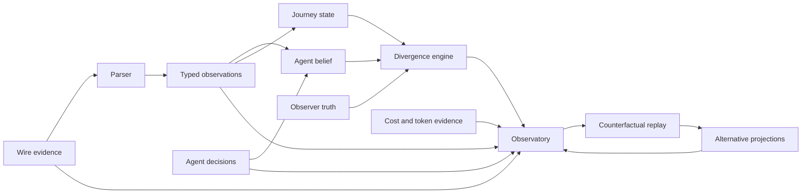
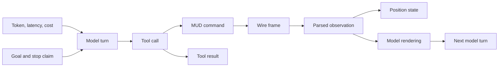
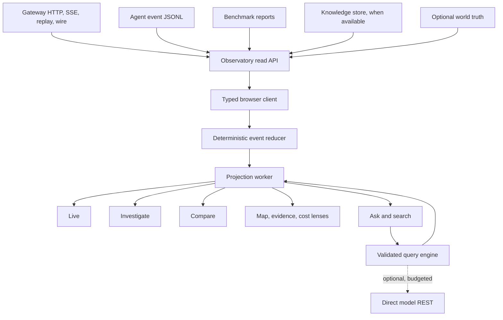

# Observatory

The observatory is a flight recorder, debugger, and experiment studio for an
agent acting in a persistent world. It should explain not only what happened,
but what the agent believed, what evidence supported that belief, where the
belief diverged from reality, and what the divergence cost.

The reference monitor and the Week 0 visualizer set a useful floor. They do not
set the architecture or product ceiling.

## Product vision

The observatory should make three difficult questions easy to answer:

- What is happening now?
- Why did the agent make this decision?
- What would have happened with a different parser, rendering, or tool surface?

Three signature capabilities define the product.

### Belief versus reality

The primary diagnostic view compares three distinct layers:

- Agent belief: the state and objective implied by the context and actions.
- Parsed inference: the gateway's typed interpretation, with confidence.
- Observer truth: optional world data and verified outcomes, never fed to the
  agent.

A divergence is a first-class event. False completion, stale position,
duplicate-room ambiguity, and unsupported certainty become visible states
instead of conclusions hidden in a transcript.

The layers must remain visibly and technically separate. Observer truth can
grade and diagnose an agent, but it cannot leak into agent-facing state.

### Evidence-backed time travel

One scrubber controls the whole interface. Selecting any moment reconstructs:

- the room and journey map
- the agent's latest known belief
- parser output and unresolved ambiguity
- active goal and recent decisions
- tool, command, and wire activity
- token, latency, and cost accumulation

Every derived fact links back to its evidence. A room title, exit, health value,
or completion claim can be opened to reveal its confidence, method, parser
version, trace, and exact redacted wire range.

Live mode and replay mode use the same event reducer. Pausing the view never
pauses ingestion. Returning to live catches up without duplicate or missing
events.

### Counterfactual experiment studio

Recorded wire evidence can be replayed through alternative deterministic
components without calling the model or touching the MUD:

- parser version
- model-facing rendering policy
- tool profile
- position resolver
- diagnostic rule set

The studio compares actual and counterfactual projections side by side. It
shows which observations changed, where confidence moved, how many bytes or
tokens the agent would have received, and which conclusions would no longer be
supported.

A model-backed experiment remains a separate paid operation with an explicit
budget and ledger.



## Design principles

- Evidence before assertion: every conclusion opens to its source.
- Uncertainty stays visible: ambiguity is information, not a rendering defect.
- One causal model: wire, parser, tool, model, cost, and state are correlated by
  stable identifiers.
- Live equals replay: both paths produce the same projection for the same event
  prefix.
- Progressive disclosure: the first screen stays calm, detail is one action
  away.
- Local first: core inspection and deterministic analysis work without cloud
  services.
- Spend last: common analysis is deterministic before an LLM is considered.
- Read-only by default: the observatory cannot issue game commands.
- Configuration is explicit: unavailable data produces an honest capability
  state, not an empty chart.
- Observer truth is quarantined: it cannot enter an agent prompt or tool result.
- Unknown data survives: new event kinds remain searchable and inspectable.

## Experience north star

The product should feel like one instrument with three modes, not a collection
of dashboards. Map, timeline, evidence, cost, and diagnostics are coordinated
lenses inside the same workspace.

The hierarchy is:

1. Live: understand the current run in seconds.
2. Investigate: explain one moment or failure with evidence.
3. Compare: decide which system variant performs better.

Ask and search are available everywhere. They do not become separate
destinations.

The interface succeeds when these workflows feel obvious:

- A diagnostic appears during live play. One click pauses at the triggering
  moment, frames the affected journey segment, and opens supporting evidence.
- A false completion shows the agent's claim beside the unmet objective and the
  last reliable world state.
- Selecting a room paints its visits on the timeline and selecting a turn paints
  its position on the map.
- Comparing two runs jumps first to their first meaningful divergence, not to
  two unrelated transcript timestamps.
- Asking "why did it stop?" returns a concise answer whose cited claims open the
  exact evidence.

### Anti-goals

- No homepage made of unrelated metric cards.
- No raw JSON as the primary reading experience.
- No separate page for every event or log source.
- No chart without a decision or investigation question.
- No permanent three-column squeeze on narrow screens.
- No hidden uncertainty behind a confident icon.
- No decorative animation, 3D world, or game-like chrome.
- No assistant answer without inspectable evidence.
- No feature included only because Week 0 or the reference had it.

## Information architecture

The interface is organized by investigation task, not by storage file. Mode
changes preserve the selected run, time, room, trace, and evidence.

### Live

Live answers "what is happening now?"

- live causal activity stream
- current room, vitals, position confidence, goal, and agent status
- journey map with recent path and unresolved location candidates
- cost, context, latency, and token burn
- instrumentation health and connection freshness
- automatic diagnostic cards

The opening state prioritizes the world and current intent. Secondary measures
stay quiet until they change or cross a meaningful threshold.

### Investigate

Investigate answers "why did this happen?"

- trace waterfall from model turn to tool call, command, wire, parse, and state
- belief versus reality comparison
- evidence inspector for raw, parsed, rendered, and believed forms
- goal and completion-claim audit
- parser misses, low-confidence facts, and stale evidence
- loop, stall, retry, and correction analysis

Investigation begins from a selected fact, diagnostic, map location, timeline
range, or question. The workspace keeps that subject in focus while the user
moves between causal, spatial, and evidence lenses.

### Compare

Compare answers "which design performs better?"

- two or more runs aligned by semantic milestones
- rendering, parser, model, and tool-profile differences
- success and final-state correctness
- cost, calls, latency, invalid calls, and corrections
- observation and belief divergence
- path efficiency and information gained

Alignment uses room transitions, tool calls, objective milestones, and verified
state changes. Wall-clock alignment is available, but it is not the default.

### Ask and search

Ask is a grounded investigation copilot embedded in every mode. It answers
natural-language questions about the evidence without becoming a second source
of truth. Structured search uses the same entry point and remains fully usable
when model access is disabled.

Example questions:

- Why did the agent believe the journey was complete?
- Where did position confidence first fall below 0.7?
- Which rooms consumed the most model cost without producing progress?
- Compare raw and full rendering after the third room transition.
- Show every claim supported only by a low-confidence parser result.
- What changed between these two runs before their paths diverged?

Each answer includes:

- a visible query plan
- cited events, traces, wire references, rooms, and runs
- confidence and missing-data notices
- links that open the relevant timeline range and panels
- token and cost accounting when a model is used

The copilot has three execution tiers:

1. Saved questions and local aggregations answer common requests with no model.
2. A deterministic query builder maps supported phrases and filters to a typed
   observatory query.
3. An optional model translates open-ended language into the same typed query
   and summarizes returned evidence.

The model never receives database access or executes arbitrary code. It emits a
query abstract syntax tree that is schema-validated, permission-checked, and
shown before execution when the request is broad or costly. Summaries may only
cite returned evidence. Unsupported claims are labeled as hypotheses.

Model use is opt-in per installation and per request. Redaction, maximum input
size, allowed evidence fields, model, and spend cap are configurable. The model
backend uses the repository's direct REST convention, without a vendor SDK or
agent framework.

## Experience design

The visual character should feel like a purpose-built instrument, not an admin
template. It should be quiet at rest and precise under pressure.

### Investigation workspace

The default desktop layout has four coordinated regions:

```text
┌ Session, mode, clock, data health, profile, search ───────────────────────┐
│                                                                         │
│  World and belief canvas        │  Current state and diagnostic stack   │
│                                 │                                       │
├ Causal timeline and cost curve ─┴───────────────────────────────────────┤
│ Evidence drawer: raw | parsed | rendered | believed | observer truth    │
└ Command palette, keyboard help, live/replay status ──────────────────────┘
```

Any panel can focus, dock, or collapse. A selected event, trace, room, or time
range is reflected across every panel and encoded in the URL.

The narrow layout becomes a focused sequence rather than a squeezed dashboard:

1. status and active diagnostic
2. map or timeline
3. evidence and details

### Visual grammar

- State uses a restrained neutral foundation with semantic accents.
- Confidence uses text, shape, border treatment, and pattern, not color alone.
- Actual, inferred, believed, and counterfactual data have stable visual forms.
- Cost overlays never obscure causal ordering.
- Motion communicates transition only and respects reduced-motion settings.
- Dense and comfortable display modes support different investigation styles.
- Typography distinguishes prose, evidence, identifiers, and numeric measures.
- Empty, stale, unavailable, reconnecting, and incomplete are distinct states.

Dark is the primary operator theme. A high-contrast light theme supports
daylight use and print. Theme is separate from semantic color so meaning remains
stable.

### Interaction model

- Space pauses and resumes the visual clock.
- Left and right step by causal event.
- Shift plus left or right steps by model turn.
- `/` opens global evidence search.
- `Cmd/Ctrl+K` opens the command palette.
- `E` opens provenance for the selected fact.
- `B` bookmarks an incident moment.
- `C` starts a comparison from the current selection.
- `?` opens contextual help.

Keyboard and pointer operations have equivalent outcomes. Focus remains visible
and is restored when drawers close.

## Diagnostic intelligence

Diagnostics are deterministic detectors with evidence, severity, and a
resolution state. They never silently rewrite the session.

Initial detectors include:

- False completion: the agent stops without objective evidence.
- Belief divergence: agent belief conflicts with parsed or verified state.
- Position ambiguity: multiple room candidates remain unresolved.
- Confusion loop: a path or action sequence repeats without new information.
- Progress stall: cost grows without objective, map, or state progress.
- Parse degradation: misses or low-confidence observations spike.
- Corrective-call cluster: invalid or ineffective calls trigger retries.
- Stale action: a decision relies on evidence older than a configured horizon.
- Context churn: repeated context contributes cost without changing action.
- Instrumentation gap: sequence, trace, source, or clock evidence is incomplete.

Each diagnostic card answers:

- What was detected?
- Why does it matter?
- Which evidence triggered it?
- What alternative explanations remain?
- What should an investigator inspect next?

Rules are versioned and replayable. Thresholds are configurable. The UI exposes
why a rule fired instead of presenting an unexplained score.

## Causal and evidence model

The gateway event envelope remains the session evidence contract:

- `seq`
- `session`
- `at`
- `kind`
- `trace_id`
- `data`

The observatory builds immutable projections from this stream. It does not
replace the gateway journal.

### Causal graph

Known event relations form a typed graph:



`trace_id` is the principal cross-layer correlation key. Event sequence remains
the authoritative session order. Additional parent and link fields may enrich
the graph without changing the envelope.

The vocabulary should follow OpenTelemetry concepts where they fit, especially
trace, span, event, resource, links, and attributes. Domain events remain
domain-specific rather than being forced into generic telemetry.

### Evidence lens

The lens presents one fact through five possible forms:

| Form | Purpose |
| --- | --- |
| Wire | Redacted bytes or text received from the MUD |
| Parsed | Structured observation and parser metadata |
| Rendered | Exact model-facing representation |
| Believed | State inferred from subsequent agent behavior |
| Truth | Optional observer-only world or verified outcome |

Missing forms remain visibly absent. The interface never synthesizes a value to
fill a gap.

### Attention economics

Cost is connected to progress rather than displayed only as a total:

- cost and tokens per verified state change
- cost per new room or resolved ambiguity
- cost per successful action
- cost spent in loops and corrections
- context bytes or tokens repeated without decision impact
- information gain per turn
- cached and uncached input separately
- marginal cost after the last objective milestone

These measures make preprocessing and rendering experiments testable. A smaller
payload is not called cheaper unless total journey evidence confirms it.

## World and journey visualization

The map has three semantic zoom levels.

### Journey

A compact graph shows the current run, recent trail, frontier, loops, hazards,
and unresolved candidate positions. This level favors clarity over geographic
completeness.

### Neighbourhood and zone

The current candidate set expands into nearby known rooms and exits. Differences
between belief, inference, and truth are overlaid without collapsing duplicate
titles.

### Atlas

The optional CircleMUD world source enables zone and world exploration. A full
atlas may contain more than twelve thousand rooms, so it must use a measured
Canvas or WebGL renderer and level-of-detail aggregation. It must not create one
DOM node per room.

The Week 0 visualizer contributes useful interaction and adapter ideas:

- current-room emphasis
- recent trail and frontier
- room graph and directional exits
- hazards, deaths, darkness, and unknown position
- compact cockpit information

It does not contribute its demo data adapters, committed build output, terminal
emulation, voice behavior, or assumption of one consolidated state object.

The CircleMUD parser may provide observer-only rooms, exits, zones, doors,
mobiles, objects, and shops. Its data is visually marked as truth-layer data and
is isolated from all agent-facing paths.

## Run comparison

Comparison is a first-class workspace, not a collection of charts.

The alignment engine identifies:

- common starting evidence
- shared room or state milestones
- first behavioral divergence
- converged or divergent outcomes
- unmatched segments

The comparison view includes:

- synchronized journey maps
- stacked causal timelines
- belief and position confidence
- rendered observation differences
- tool and command distributions
- cumulative and marginal cost
- latency and corrective calls
- diagnostics unique to each run

An investigator can pin a divergence and ask the copilot to explain the evidence
available to each run at that moment.

## Search and investigation language

Structured search remains available without the copilot.

Examples:

```text
kind:parse_miss
confidence:<0.70
trace:77aea1e50d7540f8
room:"The Entrance To The Newbie Zone"
diagnostic:false_completion
cost:>0.01 after:milestone("entered newbie zone")
run:a differs:run:b field:position
```

The query language produces stable URLs and saved views. Autocomplete is driven
by the event schema and detected data-source capabilities.

## Incident capsules

An incident capsule is a portable, sanitized investigation:

- selected event and time range
- relevant causal subgraph
- bookmarks and investigator notes
- parser, profile, model, and rendering versions
- repository revision
- diagnostic results
- redacted evidence references
- optional comparison run

Capsules are local files by default. Export validates redaction again and never
includes credentials. A capsule can reproduce the projection without contacting
the live MUD or model provider.

## Architecture

The observatory is a read-only product surface over existing evidence sources.



### Package shape

```text
week2_capable/observatory/
  observatory_api/
    app.py
    capabilities.py
    sources/
    queries/
    redaction/
  web/
    src/
      app/
      contracts/
      features/
      projections/
      visualization/
      workers/
  tests/
  pyproject.toml
  package.json
  README.md
week2_capable/bin/observatory
```

The exact split may change during the scaffold spike. Responsibilities must not
collapse into a single application module.

### Read API

A thin local Starlette API provides:

- same-origin access to gateway SSE and replay
- source capability discovery
- read-only aggregation across session, agent, benchmark, and knowledge data
- validated observatory queries
- incident-capsule export
- optional copilot mediation and spend policy
- static frontend serving for the installed launcher

The API does not duplicate or mutate session truth. It consumes gateway HTTP and
SSE instead of opening the gateway journal directly.

### Browser client

The client uses React, Vite, and strict TypeScript. Public contracts are
schema-generated or checked against one canonical schema to avoid handwritten
Python and TypeScript drift.

The event reducer:

- orders by `seq`
- deduplicates by `(session, seq)`
- detects gaps
- fills gaps through replay
- retains unknown event kinds
- produces the same state from live and replay input

Long replay, derived projections, layout, and comparison alignment run in Web
Workers. Disposable IndexedDB caches may accelerate reopening a session. Cache
keys include session, final sequence, schema version, and projection version.
The journal remains authoritative.

Markup is built with components. MUD and model text is always rendered as text
or tokenized ANSI components. Raw HTML injection is prohibited.

### Visualization engine

Two render paths are expected:

- SVG for small causal and journey graphs where rich interaction matters.
- Canvas or WebGL for atlas-scale graphs.

Sigma.js and Graphology are candidates for the atlas because they target
WebGL rendering of large graphs. Adoption depends on a measured spike using the
actual world size, keyboard and screen-reader fallbacks, bundle impact, and
maintenance status. The plan does not choose a graph library from a screenshot.

### Configuration and capabilities

Configuration controls:

- enabled data sources
- available workspaces and overlays
- diagnostic rules and thresholds
- retention and local cache
- redaction policy
- model access, evidence allowlist, and spend cap
- observer-truth visibility
- experimental features

Capabilities are reported at runtime. A disabled or unavailable source produces
an explanation and setup action. Feature configuration is fixed for an
investigation export so results remain reproducible.

### Live-delivery prerequisite

The current gateway event hub receives callbacks from the `Journal` instance in
its own process. The MCP server and HTTP API can create separate journal
instances, which means SQLite replay may work while cross-process live delivery
does not.

Before observatory live work begins, a gate must prove that an event written by
the active MCP session reaches the API subscriber without polling races. The
implementation should either:

- host MCP and the event API with a shared journal and event hub, or
- make the API tail committed journal events safely across processes.

This is a correctness dependency, not an observatory workaround.

## Instrumentation health

The observatory must observe its own evidence quality.

The global status surface reports:

- connection state and last event age
- sequence gaps and replay recovery
- duplicate events
- subscriber drops
- unknown schemas and event kinds
- missing trace or wire references
- clock skew or unavailable duration
- source version and capability digest
- redaction failures
- stale projections

Charts display completeness alongside values. A cost curve with missing usage
events cannot look identical to a complete curve.

## Security and privacy

- Bind locally by default.
- Require explicit configuration for non-loopback access.
- Keep all sources and actions read-only.
- Redact at ingestion boundaries and again during export.
- Never expose MUD, model, or admin credentials to the browser.
- Treat model prompts, tool arguments, wire text, and player communication as
  potentially sensitive.
- Use allowlists for copilot evidence and query operations.
- Record copilot model, policy, token use, cost, and cited evidence.
- Apply a strict content security policy.
- Escape all untrusted text.

## Accessibility and performance

The target is WCAG 2.2 AA for product workflows.

- Meaning never depends on color alone.
- Focus is visible and never hidden by overlays.
- Every graph has a keyboard path and structured tabular alternative.
- Reduced motion removes animated travel and chart transitions.
- Screen-reader labels state uncertainty, source layer, and selection.
- Zoom does not hide essential controls.
- High-density views retain readable text and touch targets.

Performance budgets are defined before implementation:

- live event to visible update at p95
- replay events processed per second
- interaction frame time during long sessions
- initial bundle size
- memory after a full J2 replay
- atlas pan and zoom frame rate at actual world size

Virtualization, workers, level of detail, and incremental projection are used
only where measured budgets require them.

## Verification strategy

### Contract and reducer tests

- live and replay prefixes produce identical projections
- reconnect produces no gaps or duplicates
- unknown event kinds survive
- missing and partial evidence stays explicit
- observer truth cannot enter agent-facing projections
- source versions invalidate derived caches

### Component tests

Vitest and React Testing Library cover:

- workspace coordination
- evidence citations
- diagnostic explanations
- unavailable and stale states
- keyboard navigation
- reduced motion
- copilot query-plan review
- malicious text and ANSI rendering

### End-to-end tests

Playwright covers:

- start from a fresh clone
- connect to a replay and a live session
- pause, scrub, inspect evidence, and return to live
- recover from a dropped SSE connection
- investigate a false completion
- compare two runs at their first divergence
- ask a deterministic and a model-disabled question
- export and reopen an incident capsule

UI work is verified from rendered pages at desktop, narrow, high-contrast, and
reduced-motion settings.

### Performance and visual tests

- replay the longest recorded session
- render the actual CircleMUD world scale
- profile main-thread blocking and memory
- capture stable visual states for key workspaces
- test with intentionally incomplete and contradictory evidence

## Incremental build plan

Each increment ends with tests, a rendered UI check, an accurate package README,
and a journal entry only when the work yields an instructor-worthy lesson.

### Increment 0: Evidence and live-delivery gate

- prove active MCP events reach SSE subscribers
- freeze the event and capability contracts
- define projection and query schemas
- create fixtures for complete, partial, ambiguous, and unknown evidence

Exit gate: one fixture and one active session produce gap-free, equivalent live
and replay prefixes.

### Increment 1: Product shell

- scaffold the read API and strict TypeScript client
- add the installed launcher and fresh-clone setup
- implement capability discovery and source health
- establish tokens, typography, layout, accessibility, and themes
- render the investigation workspace with representative fixtures

Exit gate: a fresh clone launches one polished read-only shell and accurately
reports available capabilities.

### Increment 2: Live and time travel

- session selector and global clock
- causal activity timeline
- pause, scrub, bookmarks, and return to live
- current state, journey, cost, and instrumentation health
- URL-addressable selection

Exit gate: every panel reconstructs the same state at every selected sequence.

### Increment 3: Investigate and diagnostics

- causal waterfall
- evidence lens
- belief-versus-reality workspace
- false-completion, ambiguity, loop, stall, and parse diagnostics
- structured search and saved views

Exit gate: the recorded J2 false completion can be diagnosed from claim to exact
evidence without reading raw files.

### Increment 4: Living world

- journey and neighbourhood views
- belief, inference, and truth layers
- uncertainty and parse-miss overlays
- duplicate-room and candidate-position interaction
- atlas renderer spike at actual world size

Exit gate: duplicate room titles remain separate and the selected candidate set
is explainable from exits and neighbourhood evidence.

### Increment 5: Compare and counterfactual replay

- semantic run alignment
- first-divergence workflow
- synchronized maps and timelines
- parser and rendering counterfactual projections
- attention-economics measures

Exit gate: the raw, minimal, and full J1 experiments can be compared without
manually joining reports or aligning turns.

### Increment 6: Grounded investigation copilot

- deterministic saved questions
- typed observatory query language
- visible query plans and evidence citations
- optional direct-REST model translation and summary
- redaction, permissions, and spend controls
- copilot accuracy and cost evaluation corpus

Exit gate: every answer is reproducible from its query and citations. Disabling
the model preserves the core investigation workflow.

### Increment 7: Knowledge and incident workflow

- knowledge overview, frontier, entities, player, and progression
- incident capsules
- investigator annotations
- sanitized export and offline reopen
- diagnostic history across sessions

Exit gate: a session investigation can be handed to another person without the
live MUD, credentials, or undocumented local state.

### Increment 8: Product hardening

- performance budgets and optimization
- accessibility audit
- failure injection for gaps, corruption, and unavailable sources
- responsive and high-contrast polish
- feature-flag and configuration coverage
- reference-floor audit

Exit gate: all required workflows pass end-to-end, rendered, accessibility, and
performance gates.

## Scope and priority

The recommended Week 2 priority is:

1. Make the evidence path trustworthy and live.
2. Build Live, time travel, Investigate, and belief-versus-reality.
3. Add the living journey map and automatic diagnostics.
4. Build Compare because it closes the loop on current experiments.
5. Add the deterministic query engine and a narrow grounded copilot.
6. Expand knowledge and atlas features as their data source becomes ready.
7. Harden and polish continuously, with a final focused pass.

The full atlas, generalized cross-session intelligence, and broad copilot are
larger than the observability core. They should not block the first useful
product, but adjacent foundations should be built now when deferral would force
a contract or storage rewrite.

The flagship experience is not negotiable: belief-versus-reality, causal
evidence, and time travel must arrive before the product is called an
observatory.

## Table stakes to cover

The instructor reference was inspected from its current source at commit
`54ce7324fea32c25b8e38db3fc2f430888018fa2`. These features are a floor, not the
navigation model.

### Confirmed reference capabilities

- dashboard
- sessions and session detail
- live transcript through SSE
- timing, duration, tokens, context, cost, model, and tool counts
- operation spans
- test reports, pass rates, failure modes, cost, and calls
- manager and Telnet logs
- errors
- change log
- health
- player and profile selection
- knowledge overview
- rooms and map
- entities and frontier
- player sheet and progression
- belief, provisional, one-way, unwalked, displaced, and player-position map
  states
- dropped-output ratio

### Unconfirmed or stale reference claims

- The initial reference plan mentions dedicated diff and reshaped views, but a
  current dedicated route was not confirmed.
- The initial plan mentions standalone ground-truth world pages, while the
  current application exposes a knowledge map.
- Production authentication, multi-user access, and remote deployment posture
  were not confirmed.

The observatory should cover the operational questions behind these features
through its unified evidence model. It should not reproduce the reference's
framework, log-file boundaries, or page taxonomy.

## Quality bar

| Requirement | Plan |
| --- | --- |
| Best practice | Evidence-first, typed, read-only, accessible architecture |
| One responsibility per module | Sources, queries, projections, diagnostics, and visualization are separate |
| Typed public interfaces | Python type hints, canonical schemas, strict TypeScript |
| No markup concatenation | React components and tokenized safe text rendering |
| UI rendered for verification | Every UI increment includes rendered checks |
| Pinned dependencies | Each adopted dependency is pinned and justified |
| New Python tests | Pytest |
| Observatory tests | Vitest, React Testing Library, and Playwright |
| No committed build output | Frontend build and caches remain ignored |
| Documents match disk | README follows implementation, this file describes future work |

## Design influences

- OpenTelemetry trace and semantic-convention concepts guide correlation and
  vocabulary: <https://opentelemetry.io/docs/concepts/>
- Grafana trace-to-log correlation demonstrates evidence navigation across
  signals: <https://grafana.com/docs/grafana/latest/datasources/tempo/configure-tempo-data-source/configure-trace-to-logs/>
- Sigma.js provides a candidate WebGL path for large graph rendering:
  <https://www.sigmajs.org/docs/>
- WCAG 2.2 guides color-independent meaning and visible interaction state:
  <https://www.w3.org/TR/WCAG22/>
