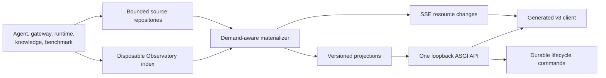
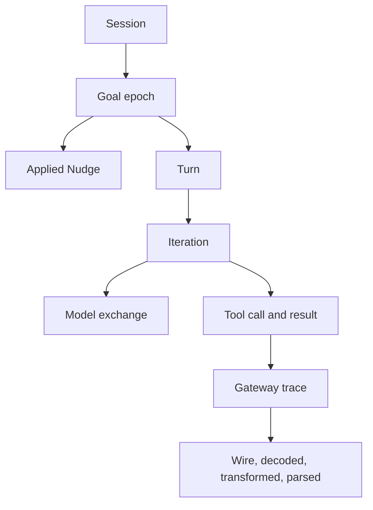
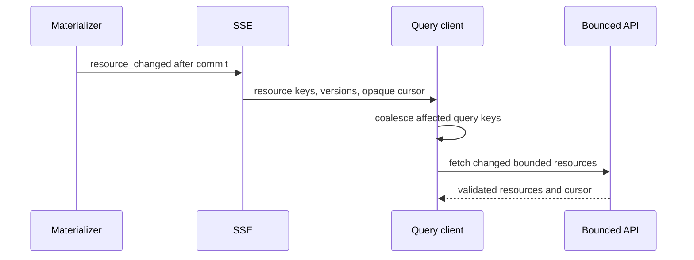

# Observatory backend architecture plan

## Goal

Build one bounded, typed, restart-aware backend for Live, Sessions,
Experiments, and Knowledge.

The canonical backend is built under:

```text
week2_capable/observatory_v3/backend
```

The frontend lives beside it under:

```text
week2_capable/observatory_v3/web
```

The older `observatory` and `observatory_v2` packages remain temporary
executable references. Their source is not copied, imported, or executed by
v3. The v3 build, tests, and runtime must continue to work after both are
deleted.



## Authority and boundaries

This document is the backend delivery authority for Observatory v3.

All production implementation described here lands under
`week2_capable/observatory_v3/backend`. Comparison tooling may execute an old
package as a separate process, but it is not a production dependency.

It covers:

- storage ownership and schema migration
- direct session discovery and source readers
- stable session hierarchy identity
- the disposable session index
- composite source cursors
- incremental materialization
- bounded read projections
- Live resource partitions
- generated public contracts
- SSE change notification and recovery
- lifecycle commands and minimum restart reconciliation
- experiment execution and canonical session correlation
- performance, concurrency, and migration gates

It does not define visual composition. Product interaction and visual contracts
remain in `product_spec.md`, the feature plans, and the accepted mockups.

## Fixed architecture

### Application boundary

- One Starlette ASGI application serves the read and control APIs.
- Uvicorn serves the application on loopback by default.
- Production browser calls are same-origin.
- Vite development uses a same-origin proxy.
- Read capabilities and control capabilities remain distinct.
- Control tokens, process credentials, and environment secrets never enter a
  public response.
- HTTP handlers own transport only.
- Repositories own storage reads.
- Projectors own domain meaning.
- The lifecycle service owns commands and process reconciliation.

### Retained evidence

The source artifacts remain authoritative.

| Artifact | Owner | Rule |
| --- | --- | --- |
| `registry.db` | runtime launcher | canonical runtime session and lifecycle identity |
| `agent.jsonl` | agent | append-only model, reasoning, prompt, tool, cost, and control evidence |
| `gateway.db` | gateway | append-only wire, parser, observation, position, and knowledge evidence |
| `operator-messages.json` | agent control | durable Goal revision and Nudge evidence |
| knowledge stores | gateway knowledge | player learned state and provenance |
| benchmark ledgers | benchmark | immutable attempt outcome and configuration |
| Observatory index | Observatory | disposable derived summaries, offsets, search, and projection metadata |

The Observatory can rebuild its index from retained evidence. It never rewrites
source evidence.

### Schema ownership

Each database owner performs its migrations once at startup.

- The runtime launcher migrates `registry.db`.
- The gateway migrates `gateway.db`.
- The Observatory migrates its own index and cache.
- Request handlers never execute `ALTER TABLE`.
- Read paths never use repeated `PRAGMA table_info` as version negotiation.
- Every owned database records an explicit schema version.
- The Observatory refuses an unsupported future source schema without mutating
  it.

### Work scheduling

- Synchronous SQLite, filesystem, projection, and serialization work stays off
  the event loop.
- A bounded worker pool serves synchronous read and projection work.
- SSE connections do not consume the worker pool while idle.
- Per-session single-flight advancement prevents duplicate work.
- Superseded requests are cancelled before publication.
- Cache and queue sizes are bounded for a single-user local tool.
- Multiple browser tabs share materialized state.

## Session identity and hierarchy

Every direct, REPL, TUI, Live, and experiment run uses one canonical runtime
session identity.



Identity rules:

- Stable ids derive from retained identity and sequence, not array position.
- An initial objective creates the first Goal epoch.
- An applied revision creates a new Goal epoch.
- A Nudge belongs to the active Goal and does not create a Goal.
- Turn and Iteration ancestry remains stable across pagination.
- Trace ids correlate agent, model, tool, gateway, parser, wire, and MUD
  evidence.
- Experiment samples link to their canonical runtime session ids.
- Existing ids never change when later evidence arrives.

## Composite source cursor

A gateway sequence alone cannot describe session freshness.

The internal cursor includes:

```text
gateway sequence
agent byte offset
operator revision
lifecycle revision
knowledge revision when required by the projection
```

Rules:

- The server owns the cursor encoding.
- Browser clients treat cursor values as opaque.
- A projection names the complete cursor used to derive it.
- A response distinguishes freshness from completeness.
- A partial trailing JSONL record is held until complete.
- File replacement, truncation, or identity change creates a capture fault.
- Stopped-session caches key on the complete immutable cursor.

## Disposable session index

The Observatory index makes catalog and hierarchy reads bounded.

It stores:

- direct session lookup fields
- catalog summary fields
- current composite cursor
- source offsets and source schema versions
- Goal, Nudge, Turn, and Iteration summary rows
- stable evidence identity and ancestry
- structured and full-text search fields
- experiment and sample correlation
- projection version and cache provenance

It does not store canonical copies of:

- wire bodies
- model requests or responses
- reasoning
- source event payloads
- control credentials
- lifecycle evidence

Index rebuild is explicit. Exact source evidence remains readable while a
derived projection is rebuilding.

## Demand-aware materialization

One service advances each demanded session from its last checkpoint.

Demand sources are:

- an active browser subscription
- a requested API projection
- an active experiment job
- terminal session finalization

Materialization behavior:

- No demand produces no repeated expensive projection work.
- Catalog indexing can update lightweight lifecycle and summary fields.
- Rapid changes coalesce by session and resource key.
- The newest complete source cursor is preserved.
- Multiple demand sources share one advancement.
- A delayed consumer can receive a useful checkpoint while bounded catch-up
  continues.
- Session termination schedules one final immutable materialization.
- A projector-version change rebuilds only incompatible derived state.
- One failed session cannot block other sessions.

Publication order is fixed:

1. Read complete retained source records.
2. Advance and validate affected projections.
3. Commit projection values and resource versions.
4. Commit the session composite cursor.
5. Publish the SSE resource notification.

## Public contract

Pydantic models remain the canonical public schema.

- The backend publishes a versioned OpenAPI-compatible schema.
- Generated TypeScript types cover every browser-visible request and response.
- Generated runtime validators cover read, control, error, and SSE envelopes.
- Generated output is reproducible.
- CI detects schema and generated-client drift.
- Real sanitized fixtures test semantic fidelity.
- Internal Python interfaces remain handwritten and typed.
- Frontend-only form state remains handwritten and typed.

The first versioned resource namespace is:

```text
/api/v1
```

Legacy unversioned routes remain available until the replacement gate.

## Read resources

No endpoint returns a complete investigation tree.

| Resource | Useful initial content | Growth boundary |
| --- | --- | --- |
| session catalog | players and recent session summaries | cursor pagination |
| session summary | identity, lifecycle, Goals, totals, completeness, cursors | fixed |
| Goal page | Goal, Nudges, Turn summaries, outcome, cost, and duration | cursor pagination |
| Turn page | Turn and Iteration summaries | cursor pagination |
| Iteration page | model, tool, gateway, and transformation child summaries | cursor pagination |
| evidence children | one causal level | cursor pagination |
| evidence record | fields, ancestry, provenance, source, and related ids | fixed |
| trace | bounded correlated records across subsystems | cursor pagination |
| wire body | one integrity-checked sanitized body | fixed size limit |
| map prefix | graph, position, path, and source cursor | bounded graph contract |
| cost range | response-owned cost and token contributors | explicit scope |
| search | stable evidence matches and navigation targets | cursor pagination |
| experiment catalog | immutable definitions and job summaries | cursor pagination |
| experiment detail | arms, queue, aggregates, samples, and session links | paginated samples |
| knowledge summary | player totals, conflicts, and freshness | fixed |
| knowledge detail | bounded facts, entities, rooms, and provenance | cursor pagination |

Every response includes:

- stable resource identity
- resource version
- composite source cursor
- completeness
- continuation cursor when cardinality can grow
- capture gaps
- source references

## Live partitions

Live uses stable bounded resources from the first landing.

The architecture audit confirms the final partition list from measured update
cadences. The initial candidates are:

- identity, lifecycle, objective, and freshness
- world graph and map presentation
- position and recent path
- thought, belief, and activity
- vitals and combat
- usage, cost, and context economics
- controls and capabilities
- attention and instrumentation diagnostics

Each partition has:

- stable node ids
- an independent resource version
- the complete source cursor used to derive it
- explicit completeness
- deterministic replacement semantics

Typed projection deltas are deferred until measurements show that bounded
partition replacement cannot meet the Live rendered-frame budget.

## SSE notification

SSE reports committed resource changes. It does not carry the canonical domain
projection by default.



Notification rules:

- Event ids use `<server-epoch>:<change-counter>`.
- `Last-Event-ID` resumes inside the current server epoch.
- Epoch mismatch triggers one bounded resource reconciliation.
- A reconnect never requests a complete investigation.
- Notifications identify affected resource keys.
- Terminal lifecycle, control receipt, and capture-fault changes never drop.
- Raw retained events stream only for explicit raw trace and evidence views.

Client coalescing rules:

- One request can be in flight per query key.
- Repeated invalidations merge into one trailing refresh.
- The newest cursor received for the resource is preserved.
- A newer cursor received during a request schedules one additional refresh.
- Cancellation occurs only when the result cannot satisfy the selected route
  or cursor.

## Lifecycle commands

Lifecycle commands use the same browser origin and a separate public contract.

Start behavior:

1. Validate the command.
2. Persist its command id and idempotency key.
3. Spawn the runtime without holding the HTTP request open.
4. Return `202 Accepted`.
5. Reconcile command state with the canonical registry.
6. Publish starting, running, or terminal failure.

Minimum restart reconciliation is required:

- Discover active sessions from the canonical registry.
- Validate runtime layout and authenticated operator socket.
- Restore guide, revise, pause, resume, and cooperative stop.
- Reconcile an interrupted start with a created session.
- Unblock replacement-session handling when the retained process is terminal.

Forced-kill recovery after an API restart can follow later. The API reports it
as unavailable unless process identity can be proven safely.

Control rules:

- Every mutation has an idempotency key.
- Session mutations include the expected composite cursor.
- The selected player and session are validated server-side.
- Cooperative control uses the authenticated local socket.
- Receipts are retained and visible through the event stream.
- A stale mutation returns a typed conflict with the current cursor.

## Experiment execution

Experiments use the same runtime and session evidence contract as direct runs.

- Definitions remain immutable and versioned.
- Feature options come from a typed capability registry.
- Unsupported runner bindings remain visible and unavailable.
- Sample identities remain deterministic.
- Each sample stores its canonical session id.
- Execution commands persist before process launch.
- Active jobs create materializer demand.
- Setup failure stops the queue before another paid sample.
- Stop and resume preserve stable sample identity.
- Spend ceilings remain explicit and confirmed.
- API restart reconciles durable job, sample, registry, and process state.
- No paid call occurs in validation or test gates.

Sessions remains independent from Experiments. An experiment opens the same
session resource used by a direct run.

## Typed error contract

Every operation returns one versioned error shape.

It includes:

- stable code
- safe detail
- retryability
- affected resource
- request id
- current cursor when relevant
- corrective action when one exists

Loading, stale, incomplete, unavailable, unauthorized, conflict, and malformed
evidence remain distinct states.

## Backend landing sequence

```mermaid
flowchart LR
    B0["B0 · Baseline and fixtures"] --> B1["B1 · Source ownership"]
    B1 --> B2["B2 · Public contracts"]
    B2 --> B3["B3 · Index and identity"]
    B3 --> B4["B4 · Materializer"]
    B4 --> B5["B5 · Bounded resources"]
    B5 --> B6["B6 · SSE"]
    B6 --> B7["B7 · Lifecycle"]
    B7 --> B8["B8 · Experiments"]
    B8 --> B9["B9 · System gate"]
```



### B0. Baseline and deterministic fixtures

Build:

- Move the performance harness into the maintained backend test tooling.
- Add a sanitized many-session registry fixture.
- Add a sanitized session with at least 2,000 gateway events.
- Add agent, operator, lifecycle, stopped-session, and partial-line cases.
- Record storage work, projection time, serialization time, payload, and
  browser-readiness markers.
- Render the measured current path in the development architecture gallery.

Gate:

- The harness reproduces the unrelated-session scan, full-history fold, and
  unbounded payload failure modes.
- Results include p50 and nearest-rank p95.
- Fixture provenance and schema versions are recorded.
- No credentials, runtime artifacts, or invented evidence enter the fixtures.

Quality bar:

- deterministic tests
- evidence provenance
- rendered verification
- no paid calls

### B1. Schema ownership and direct repositories

Build:

- Move source schema migration to each source owner.
- Remove schema mutation and repeated schema discovery from request paths.
- Split catalog, direct lookup, event, agent, operator, lifecycle, and control
  repository responsibilities.
- Implement direct indexed registry lookup for one session.
- Add bounded worker-pool execution for synchronous storage work.

Gate:

- A selected session read opens no unrelated session journal or log.
- Request handlers perform no source migration.
- Unsupported source schema fails without mutation.
- Event-loop delay stays within the approved budget under concurrent reads.
- Repository tests cover cancellation, malformed data, and path identity.

Quality bar:

- one responsibility per module
- typed Python boundaries
- event-loop safety
- security preservation
- pytest coverage

### B2. Canonical public contracts

Build:

- Define the `/api/v1` resource, command, error, and SSE models in Pydantic.
- Publish the canonical versioned schema.
- Select a maintained generator from current official documentation.
- Pin and justify the generator.
- Generate TypeScript types and runtime validators into v3.
- Add drift and sanitized-fixture contract tests.

Gate:

- Every browser-visible read and control shape is generated.
- The generator produces identical output from the same source.
- CI fails on uncommitted schema drift.
- No feature component defines an independent transport interface.
- Unsupported prior and future contract versions fail explicitly.

Quality bar:

- one canonical public interface
- runtime validation
- strict TypeScript
- pinned justified dependency
- contract tests

### B3. Disposable index and stable identity

Build:

- Add the Observatory-owned versioned index.
- Store direct catalog summaries and composite source checkpoints.
- Project stable Goal, Nudge, Turn, Iteration, record, trace, and experiment
  correlation ids.
- Add structured and full-text search indexes.
- Implement explicit per-session rebuild.

Gate:

- Catalog work depends on the returned page, not total retained history.
- Later evidence never changes an existing hierarchy id.
- Goal revision and Nudge semantics match retained application boundaries.
- An experiment sample resolves to its canonical session.
- Index removal followed by rebuild reproduces the same derived identities.

Quality bar:

- disposable derived data
- stable typed identity
- deterministic rebuild
- bounded storage access
- pytest coverage

### B4. Composite cursor and materializer

Build:

- Implement the composite source cursor.
- Read agent JSONL incrementally from a retained offset.
- Handle partial records, truncation, replacement, and identity faults.
- Advance demanded sessions with per-session single-flight work.
- Coalesce rapid source changes.
- Finalize terminal sessions into immutable projections.
- Bound worker, queue, cache, and retry behavior.

Gate:

- Steady-state work is proportional to new evidence.
- No steady-state read reparses a complete file or starts at gateway sequence
  zero.
- Multiple consumers cause one advancement.
- A malformed source creates a capture fault without corrupting prior state.
- A terminal session performs no recurring refresh work.

Quality bar:

- incremental correctness
- bounded concurrency
- explicit lifecycle
- deterministic recovery
- pytest coverage

### B5. Bounded read resources and Live partitions

Build:

- Implement useful catalog, summary, hierarchy, evidence, trace, map, cost,
  search, experiment, and knowledge resources.
- Split Live by measured update cadence.
- Add cursor pagination and explicit size limits.
- Preserve timestamps, durations, tokens, cost, provenance, and exact source
  routes at their owning levels.
- Keep raw wire bodies behind explicit integrity-checked requests.

Gate:

- No route returns a complete investigation tree.
- Initial Live, Sessions, Experiments, and Knowledge responses answer their
  primary product question.
- A user can reach every retained non-secret value through bounded drill-down.
- Live resource replacement meets the server and payload budgets.
- Pagination preserves stable ordering and identity.

Quality bar:

- progressive disclosure
- semantic fidelity
- bounded payloads
- runtime validation
- pytest contract coverage

### B6. SSE notification and coalescing

Build:

- Publish `resource_changed` only after projection commit.
- Add server epoch and monotonic change counter.
- Support `Last-Event-ID` inside one epoch.
- Add bounded epoch-mismatch reconciliation.
- Add server and Query-client cursor-aware coalescing.
- Keep raw event streams separate from projection notification.

Gate:

- Notification targets are readable before delivery.
- Rapid evidence produces bounded fetches without losing the newest cursor.
- Multiple tabs do not multiply materialization.
- Epoch restart performs one bounded reconciliation.
- Disconnect tears down the subscriber without stopping shared demanded work.
- Terminal, receipt, and capture-fault changes always arrive.

Quality bar:

- reconnect correctness
- bounded request lifecycle
- no overlapping refreshes
- typed transport
- browser and pytest coverage

### B7. Durable lifecycle commands

Build:

- Replace the v2 lifecycle HTTP server with services inside the canonical API.
- Persist command ids and idempotency state.
- Return `202 Accepted` for start.
- Publish command progress through bounded resources and SSE.
- Reconcile active registry sessions and authenticated operator sockets.
- Restore cooperative control after API restart.
- Preserve safe process-group verification for forced stop.

Gate:

- Start returns promptly and reaches a visible running or terminal state.
- Repeating an idempotent command cannot launch or apply twice.
- API restart preserves cooperative control of a valid active session.
- A stale expected cursor cannot mutate the session.
- One player's command cannot target another player's session.
- Forced stop cannot signal an unverified process group.

Quality bar:

- durable command semantics
- security
- restart recovery
- typed errors
- pytest and Playwright scenarios

### B8. Experiments and canonical sessions

Build:

- Move experiment execution behind the durable command and supervisor boundary.
- Reconcile definitions, jobs, samples, sessions, and spend after restart.
- Link every sample to one canonical session.
- Drive supported configuration from the typed registry.
- Materialize active samples and finalize terminal samples.

Gate:

- A model-free dry run proves command construction and stable sample identity.
- API restart does not lose retained job or sample state.
- Samples open through the canonical Sessions resources.
- Unsupported options cannot execute.
- Stop and resume preserve queue identity and spend accounting.
- No acceptance test makes a paid call.

Quality bar:

- immutable definitions
- durable execution
- budget safety
- canonical identity
- pytest and browser coverage

### B9. End-to-end backend and browser-readiness gate

Build:

- Run cold, warm, concurrent, reconnect, long-session, and stopped-session
  measurements.
- Reconcile new semantic projections against retained reference fixtures.
- Record storage, projection, serialization, transport, validation, and render
  timing.
- Expose the accepted measurements in the development architecture gallery.

Gate:

- Every budget below passes at p50 and p95.
- No request path performs unrelated-session work.
- No live path performs full-history work.
- No unbounded response remains.
- No internal navigation or server-state consumer requires a legacy endpoint.
- Derived caches can be deleted and rebuilt without source loss.

Quality bar:

- measured performance
- migration fidelity
- production-build browser verification
- complete automated suite
- truthful documentation

## Performance budgets

Measurements use a production build, deterministic fixtures, one excluded
warm-up, at least 20 measured runs, and nearest-rank p95.

### Server budgets

| Path | p50 | p95 | Maximum payload |
| --- | ---: | ---: | ---: |
| catalog, warm | 50 ms | 100 ms | 64 KiB per page |
| catalog, cold | 100 ms | 200 ms | 64 KiB per page |
| direct session summary, warm | 20 ms | 50 ms | 64 KiB |
| direct session summary, cold | 50 ms | 100 ms | 64 KiB |
| hierarchy page, warm | 50 ms | 150 ms | 256 KiB |
| hierarchy page, cold | 100 ms | 250 ms | 256 KiB |
| evidence record or bounded children | 50 ms | 150 ms | 256 KiB |
| Live partition replacement, warm | 40 ms | 100 ms | 128 KiB |
| epoch-mismatch reconciliation | 200 ms | 500 ms | bounded changed resources |

### System budgets

| Measurement | p50 | p95 |
| --- | ---: | ---: |
| retained commit to SSE notification | 40 ms | 100 ms |
| SSE notification to validated resource | 75 ms | 150 ms |
| retained commit to rendered Live frame | 150 ms | 250 ms |
| event-loop delay under concurrent large-session reads | 10 ms | 25 ms |

Additional invariants:

- unrelated session journal opens per selected-session request: `0`
- duplicate in-flight requests per query key: `0`
- overlapping refresh requests per query key: `0`
- stopped-session recurring refreshes: `0`
- full-document reloads for internal navigation: `0`
- full-investigation responses: `0`

Any budget change requires measured evidence and explicit approval. A test
fixture or implementation cannot silently weaken a gate.

## Measurement fixtures

The maintained harness includes:

- at least 38 session registry rows
- one session with at least 2,000 gateway events
- a large agent log
- multiple Goal revisions and Nudges
- a running session
- a stopped immutable session
- an interrupted start
- an experiment sample
- a partial JSONL record
- malformed and unsupported source schema cases
- an SSE epoch restart
- concurrent readers

Measurements record:

- machine and operating system
- Python and browser versions
- fixture digest and schema versions
- cold or warm cache state
- request count
- source rows and bytes read
- projection and serialization duration
- response and compressed bytes
- validation time
- main-thread work
- p50 and p95

## Out of scope

The backend plan does not add:

- Next.js or server rendering
- WebSockets
- GraphQL
- a message broker
- multi-tenant scheduling
- a second backend package
- a separate browser control origin
- a hypothetical local CLI
- typed Live deltas before measurements require them
- forced-kill recovery after API restart without safe process proof
- grounded Session Ask before its separate contract is approved

## Completion

The backend is ready for product routes when:

- B0 through B9 pass
- the generated client is current
- the v3 server-state layer uses only versioned bounded resources
- lifecycle control survives an API restart cooperatively
- experiment samples use canonical session identity
- the large-session and many-session fixtures meet every budget
- the development architecture gallery shows the accepted measured path
