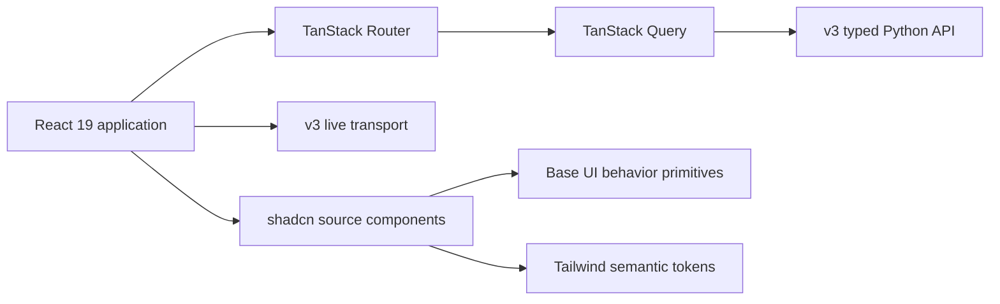

# Observatory v3 Frontend Stack

Observatory v3 uses the current supported React and Vite toolchain. The
foundation follows official generators and consumes the typed API and live
transport owned by the v3 backend.



## Runtime and Core Toolchain

| Layer | Version | Purpose |
| --- | ---: | --- |
| Node.js | `24.18.0` LTS | Supported production runtime |
| npm | Node 24 bundled version | Package management and exact lockfile |
| React | `19.2.8` | Component runtime |
| React DOM | `19.2.8` | Browser renderer |
| Vite | `8.2.0` | Development server and production build |
| React Vite plugin | `6.0.5` | React transformation and Fast Refresh |
| TypeScript | `6.0.3` | Strict static type checking |
| Oxlint | `1.76.0` | JavaScript, TypeScript, React, and accessibility linting |
| Tailwind CSS | `4.3.3` | Zero-runtime utility styling |
| Tailwind Vite plugin | `4.3.3` | Tailwind integration with Vite |
| shadcn CLI | `4.16.1` | Component source generation |
| Base UI | `1.6.0` | Accessible interaction primitives |
| Lucide | Current compatible release | Tree-shakeable icons |

The official Vite React TypeScript template defines the compatible core family:
React 19.2, Vite 8.2, TypeScript 6.0, React plugin 6, and Oxlint.

Node 24 is the active LTS runtime. It also satisfies the current Vite,
Playwright, ESLint, and jsdom engine requirements.

## Application Architecture

| Responsibility | Selection |
| --- | --- |
| URL routing | TanStack Router `1.170.18` |
| Route generation and code splitting | TanStack Router plugin `1.168.23` |
| Server state | TanStack Query `5.101.4` |
| Local interface state | React state and context |
| API transport | Native `fetch` through typed boundaries |
| Live updates | v3 SSE transport |
| Component behavior | Base UI through shadcn-generated source |
| Component styling | Tailwind utilities and semantic variables |
| Icons | Lucide React |

TanStack Router owns navigation and URL state. TanStack Query owns request
caching, cancellation, invalidation, refresh policy, and request lifecycle.
Components do not implement independent polling loops.

## Framework Boundary

Observatory v3 remains a client application over its Python backend in
`observatory_v3/backend`.
It does not introduce:

- a Node application server
- Next.js API routes
- React Server Components
- server actions
- a second backend contract
- server rendering for search indexing

Vite, TanStack Router, and TanStack Query provide routing, route-level code
splitting, server-state management, and Fast Refresh without duplicating the
backend.

TanStack Start is excluded while its official release remains a release
candidate.

## Component and Styling Policy

The shadcn configuration uses:

- Vite template
- Base UI base
- Nova source preset
- neutral base color
- CSS variables
- Lucide icons
- pointer cursor behavior
- client-side React
- a single package rather than a monorepo

Nova supplies the initial component source structure. Observatory semantic
tokens replace its visual defaults before product components are built.

Base UI owns behavior such as focus management, keyboard navigation, ARIA roles,
menu interaction, and dialog interaction. Base UI is unstyled. Tailwind and the
Observatory semantic variables own the rendered appearance.

Shared components have one implementation. Page context may hide or expose
capabilities, but Live, Sessions, and Experiments do not receive separate
versions of the same header or selector.

The frontend does not use:

- Radix
- CSS Modules
- page-specific copies of shared components
- raw browser navigation for internal routes
- handwritten dropdown or dialog behavior
- broad legacy stylesheet imports
- dependency overrides
- forced peer dependency installation
- copied v2 dependencies or generated components

## Official Scaffold

The target directory must be empty before scaffolding.

```bash
cd /Users/ibnout/Developer/Claude/ccc-clean/week2_capable/observatory_v3

npx shadcn@4.16.1 init \
  --template vite \
  --base base \
  --preset nova \
  --name web \
  --no-monorepo \
  --css-variables \
  --pointer \
  --yes
```

The exact CLI version makes the generated foundation reproducible.

## Untouched Scaffold Gate

The generated project is verified before its source or dependency declarations
are changed.

```bash
cd web

node --version
npm --version
npm ls
npm audit --audit-level=high
npm run lint
npm run build
npm run dev
```

The scaffold passes only when:

- installation has no engine warnings
- installation has no peer dependency warnings
- `npm ls` reports no missing or extraneous packages
- no dependency overrides exist
- the production build succeeds
- Oxlint succeeds
- Vite starts without a full application build
- React Fast Refresh preserves document state
- the generated application renders in a browser

An engine, peer, build, or runtime failure stops the landing. The relevant
official documentation and declared compatibility ranges determine the fix.
Versions are not forced, downgraded, or overridden to bypass a failure.

## Router and Server-State Installation

The routing and server-state layer is added only after the untouched scaffold
passes.

```bash
npm install --save-exact \
  @tanstack/react-router@1.170.18 \
  @tanstack/react-query@5.101.4

npm install --save-dev --save-exact \
  @tanstack/router-plugin@1.168.23
```

The TanStack Router Vite plugin precedes the React plugin:

```ts
import { tanstackRouter } from "@tanstack/router-plugin/vite"
import react from "@vitejs/plugin-react"
import { defineConfig } from "vite"

export default defineConfig({
  plugins: [
    tanstackRouter({
      target: "react",
      autoCodeSplitting: true,
    }),
    react(),
  ],
})
```

## Formatting

Prettier and the official Tailwind class-ordering plugin are installed locally
at exact versions.

```bash
npm install --save-dev --save-exact \
  prettier@3.9.6 \
  prettier-plugin-tailwindcss@0.8.1
```

Generated route trees and generated build outputs are excluded from formatting.

## Test Toolchain

| Tool | Version | Scope |
| --- | ---: | --- |
| Vitest | `4.1.10` | Unit and component tests |
| React Testing Library | `16.3.2` | User-visible component behavior |
| Testing Library DOM | `10.4.1` | DOM queries and assertions |
| jest-dom | `7.0.0` | Accessible DOM matchers |
| user-event | `14.6.1` | Realistic input behavior |
| jsdom | `30.0.1` | Node-based browser environment |
| Playwright | `1.62.1` | End-to-end browser verification |
| axe Playwright | `4.12.1` | Automated accessibility checks |
| Storybook React Vite | `10.5.5` | Isolated visual component states |

Vitest and component-test dependencies:

```bash
npm install --save-dev --save-exact \
  vitest@4.1.10 \
  @testing-library/react@16.3.2 \
  @testing-library/dom@10.4.1 \
  @testing-library/jest-dom@7.0.0 \
  @testing-library/user-event@14.6.1 \
  jsdom@30.0.1
```

Playwright is generated through its official initializer:

```bash
npm init playwright@latest
```

The resolved Playwright version is recorded before accepting the generated
files.

Storybook is added when the first shared primitives exist:

```bash
npm create storybook@latest
```

Storybook output and browser-test artifacts remain ignored.

## Component Installation

Components are installed only when a product contract requires them.

```bash
npx shadcn@4.16.1 add button
npx shadcn@4.16.1 add dropdown-menu
npx shadcn@4.16.1 add dialog
```

Each generated component becomes repository-owned source. It is inspected,
tested, and styled through the shared semantic tokens before use.

## Dependency Rules

- npm is the only package manager for this package.
- The lockfile is committed.
- Direct additions use exact versions.
- `node_modules` and generated outputs remain untracked.
- No global frontend package is required.
- No package is copied from Observatory v2.
- No dependency override is accepted without a documented upstream need.
- A compatibility failure is investigated before any version changes.

## Official Sources

- [Node.js releases](https://nodejs.org/en/about/previous-releases)
- [React application setup](https://react.dev/learn/build-a-react-app-from-scratch)
- [Vite getting started](https://vite.dev/guide/)
- [Vite React TypeScript template](https://raw.githubusercontent.com/vitejs/vite/main/packages/create-vite/template-react-ts/package.json)
- [Tailwind with Vite](https://tailwindcss.com/docs/installation/using-vite)
- [Tailwind editor and Prettier setup](https://tailwindcss.com/docs/editor-setup)
- [shadcn Vite installation](https://ui.shadcn.com/docs/installation/vite)
- [shadcn theming](https://ui.shadcn.com/docs/theming)
- [shadcn Base UI](https://ui.shadcn.com/docs/components/base)
- [TanStack Router with Vite](https://tanstack.com/router/latest/docs/installation/with-vite)
- [TanStack Query installation](https://tanstack.com/query/latest/docs/framework/react/installation)
- [Vitest getting started](https://vitest.dev/guide/)
- [Testing Library setup](https://testing-library.com/docs/react-testing-library/setup/)
- [Playwright installation](https://playwright.dev/docs/intro)
- [Storybook React with Vite](https://storybook.js.org/docs/get-started/frameworks/react-vite)
- [Prettier installation](https://prettier.io/docs/install.html)
