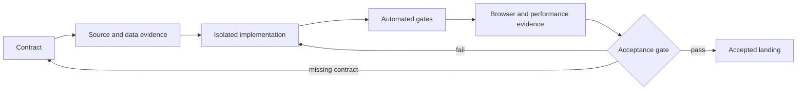

# Observatory · Frontend verification

## Goal

Rebuild the Observatory frontend one accepted landing at a time. Each landing
must prove modern architecture, accurate data behavior, measured performance,
accessibility, and exact reproduction of accepted visual properties.

The isolated rebuild package is:

```text
week2_capable/observatory_v3/web
```

The package remains independent from `observatory` and `observatory_v2`.
Legacy source is temporary executable evidence and cannot become a runtime
dependency. All new backend and frontend production code lives inside
`observatory_v3`.

## Reference boundary

The accepted reference revision is:

```text
3acf11678b46c2dc90836d405f0ff550ae01b984
```

The reference provides:

- exact source markup and component behavior
- CSS literals, tokens, assets, and responsive rules
- browser computed styles and geometry
- rendered states and screenshots

The reference does not provide an architecture to copy. Legacy routing, data
fetching, polling, feature ownership, and styling boundaries remain quarry
until separately accepted.

Every visual gate records the baseline source commit, build artifact digest,
and deterministic fixture. Missing provenance blocks visual approval.

## Continuous visual validation

The rebuild remains available as one cumulative application with hot module
replacement. Accepted landings are not replaced by disposable demonstrations.
A component workshop keeps isolated visual and interaction states available.

Before product routes exist, a development-only review gallery exposes:

- foundation and build identity
- measured system architecture and request-path evidence
- semantic token specimens
- primitive states and variants
- accessibility and responsive test states

Each accepted state remains available for later regression comparison. A
landing is blocked when its required visual state is unavailable.
Production performance measurements use a separate production build, not the
development server.

The production build proves that the review gallery is neither routable nor
reachable from the production module graph.

## Landing flow



## Component acceptance record

Every component or vertical slice has one acceptance record:

| Area | Required evidence |
|---|---|
| purpose | user task and accepted behavior |
| ownership | module, dependencies, and reuse boundary |
| data | source field, runtime schema, derivation, and provenance |
| lifecycle | load, empty, partial, stale, error, reconnect, and unmount |
| freshness | cache, invalidation, cancellation, retry, backoff, and cursor |
| interaction | pointer, keyboard, focus, disabled, and recovery behavior |
| visual | source literals, computed styles, geometry, themes, and breakpoints |
| performance | timing, requests, payload, main-thread work, median, and p95 |
| tests | component, contract, accessibility, end-to-end, and visual |

Every field is completed or marked `not applicable` with a specific rationale
and evidence. An unexplained field, action, timer, request, or visual value
blocks the landing.

## Rebuild sequence

```mermaid
flowchart LR
    A["1 · Empty package and gates"] --> B["2 · Backend contract and baseline"]
    B --> C["3 · Backend landings"]
    C --> D["4 · Extracted tokens"]
    D --> E["5 · Canonical primitives"]
    E --> F["6 · Router and app shell"]
    F --> G["7 · Frontend server state"]
    G --> H["8 · Header and context"]
    H --> I["9 · Live"]
    I --> J["10 · Sessions"]
    J --> K["11 · Experiments"]
    K --> L["12 · Knowledge"]
    L --> M["13 · Replacement"]
```



### 1. Empty package and gates

- Isolate the rebuild from legacy feature code and styles.
- Pin and justify dependencies from current official documentation.
- Enable full-source type, lint, format, architecture, test, accessibility,
  bundle, and browser gates for the isolated rebuild package.
- Scan legacy quarry for forbidden imports into the rebuild.
- Prove hot reload and production build.
- Expose the development-only foundation review state.

Gate: the empty application cannot import legacy code or bypass full-source
checks within the rebuild package. The cumulative development application must
remain available.

### 2. Backend contract and measured baseline

Backend scope and delivery are governed by
`backend_architecture.md`.

- Trace retained evidence from capture and persistence through backend
  projection, API serialization, transport, client state, and rendering.
- Inventory backend components, endpoints, schemas, caches, timers, blocking
  work, concurrency, and ownership.
- Measure real catalog, summary, detail, live-update, and reconnect scenarios.
- Record server CPU, memory, storage work, latency, payloads, request counts,
  browser parsing, validation, main-thread work, and useful-content timing.
- Complete backend landing B0 and confirm the fixed API, projection,
  materialization, lifecycle, transport, and performance contracts.
- Show the measured request path in the development-only architecture review
  state without fabricating product data.

Gate: backend landing B0 passes. Every system layer and important data
transformation has evidence, ownership, measurements, and an approved target
contract. No feature work begins from an assumed API.

### 3. Backend landings

Implement B1 through B9 from `backend_architecture.md` in order.

- Stop after each backend landing for its independent gate.
- Keep the development architecture gallery current with measured evidence.
- Do not start a dependent frontend landing before its backend resource passes.
- Keep legacy unversioned routes available until the replacement gate.

Gate: B1 through B9 pass. Deterministic scenarios meet the server, transport,
request, payload, browser-readiness, and retained-commit to rendered-frame
budgets.

### 4. Extracted tokens

- Inventory accepted values from frozen source.
- Confirm each value through computed browser styles.
- Group repeated values under semantic names.
- Cover dark, light, responsive, and interaction states.
- Render every token category in the review gallery.

Gate: every token maps to extracted evidence. No visual approximation or
route-named token passes.

### 5. Canonical primitives

- Build one primitive at a time.
- Use Tailwind CSS v4 over semantic tokens.
- Follow shadcn component ownership conventions.
- Own typed variants in canonical components.
- Select and pin one behavior primitive provider from current official
  documentation.
- Keep provider imports inside `components/ui`.
- Render every state independently.
- Keep isolated states available in the component workshop.
- Verify keyboard, focus, accessibility, computed style, and pixels.

Gate: exact accepted values and modern ownership are proven. An unapproved
provider inherited from rejected code blocks this landing.

### 6. Router and application shell

- Build one persistent root shell.
- Validate route and search state.
- Use typed links and navigation.
- Preserve the document and shell across internal transitions.

Gate: internal route reload count is zero and the transition budget passes.

### 7. Frontend server state

- Define the typed data-access boundary.
- Validate every response at runtime.
- Own cache, deduplication, cancellation, invalidation, retry, and backoff.
- Define retained cursors and incremental recovery.
- Keep projections on the server.

Gate: presentation components make no requests and repeated full-investigation
polling is impossible.

### 8. Header and context

- Build one header component tree.
- Build one player and session context component over the accepted server-state
  boundary.
- Let selected-session capability control lifecycle actions.
- Keep route-specific actions explicit and typed.

Gate: the same selected session has the same context presentation in every
space, with complete loading, stale, error, reconnecting, and capability
behavior.

### 9. Live

- Rebuild login, session lifecycle, objective, message, control, telemetry, and
  learned-world flows.
- Reuse the canonical header, context, primitives, routes, and server state.
- Preserve the accepted map geometry, controls, room inspection, agent
  position, and thinking presentation.
- Consume retained updates incrementally without rebuilding full projections.
- Distinguish connecting, checking, running, stopping, stopped, reconnecting,
  stale, empty, and error states.
- Trace every visible value and action to its contract and retained source.
- Re-measure the complete backend-to-render path for the feature.
- Compare accepted source values, computed styles, geometry, pixels, pointer
  interactions, and keyboard interactions.

Gate: complete Live scenarios pass code, browser, contract, accessibility,
performance, responsive, theme, and visual evidence. No legacy runtime import
or full-document navigation remains.

### 10. Sessions

- Rebuild the session catalog with the latest five sessions, goals, lifecycle,
  search, and the complete session browser.
- Represent sessions independently from experiments.
- Organize each session as goals, nudges, turns, iterations, model exchanges,
  tool activity, gateway processing, Telnet traffic, raw MUD text,
  transformations, rendered text, observations, and retained evidence.
- Preserve complete transcripts, available model reasoning, timestamps,
  durations, tokens, cost, provenance, and raw payloads.
- Let the user expand and collapse each hierarchy level.
- Keep selection, story position, details, evidence, playback, and map state
  correlated.
- Rebuild the map with accepted Live geometry and relevant controls, goal and
  iteration navigation, room inspection, path progression, and position
  highlighting.
- Provide cost exploration at every level where cost exists.
- Define search as deterministic evidence retrieval with navigation to exact
  matches.
- Keep natural-language session analysis outside this landing until its
  separately approved model-backed contract exists.
- Measure catalog, initial story, drill-down, map, search, and retained-update
  paths independently.

Gate: the user can start from a session, choose any goal, follow the complete
story, drill to raw evidence, correlate the map, and return without losing
context. Data is complete, sourced, progressively disclosed, and within the
approved budgets.

### 11. Experiments

- Rebuild experiment creation as explicit A/B configuration.
- Discover experimentable gateway, agent, model, transport, and runtime options
  from typed configuration metadata.
- Preserve provenance for defaults, overrides, versions, fixtures, scenarios,
  and randomization.
- Define variants, repetitions, concurrency, stop conditions, and expected
  statistical treatment before execution.
- Run each variant for the requested number of sessions.
- Keep each experiment linked to its generated sessions.
- Compare success, behavior, cost, tokens, duration, tool use, world progress,
  errors, and configured metrics.
- Distinguish descriptive results from statistically supported conclusions.
- Expose individual runs and raw evidence behind every aggregate.
- Handle queued, running, partial, cancelled, failed, and completed states.
- Re-measure creation, monitoring, incremental results, comparison, and
  drill-down paths.

Gate: the user can define two meaningful configurations, run repeated sessions,
monitor progress, compare supported outcomes, and inspect the exact sessions
and evidence behind every result.

### 12. Knowledge

- Rebuild player learned-state summaries, rooms, entities, facts, conflicts,
  provenance, and recovery states.
- Consume the canonical bounded Knowledge resources.
- Keep learned evidence separate from current session observation and atlas
  truth.
- Link every fact and conflict to its retained source.
- Preserve player context while omitting session controls that do not apply.
- Re-measure summary, detail, provenance, search, and recovery paths.

Gate: the user can understand what the selected player has learned, inspect its
provenance and conflicts, and distinguish learned state from current session
evidence and configured truth.

### 13. Replacement

- Run the full application suite against identical retained data.
- Verify deep links, route transitions, live updates, reconnects, and stopped
  sessions.
- Remove legacy code only after its replacement passes.
- Apply full-source and repository gates to the complete frontend.

Gate: every landing satisfies its acceptance criteria and no legacy runtime
dependency remains.

## Cross-cutting landing checks

Every landing proves the areas it touches:

| Concern | Required proof |
|---|---|
| architecture | ownership and dependency graph remain within approved boundaries |
| backend | requested projection performs only bounded relevant work |
| transport | contract version, payload, pagination, compression, and cursor behavior |
| frontend data | validation, caching, cancellation, invalidation, and recovery |
| rendering | progressive readiness, stable selection, and bounded main-thread work |
| visual | source values, computed styles, geometry, states, and pixel comparison |
| interaction | pointer, keyboard, focus, history, refresh, and deep-link behavior |
| accessibility | semantics, announcements, contrast, zoom, reduced motion, and alternatives |
| performance | request count, payload, server time, client time, median, and p95 |
| documentation | plan, package README, and journal remain true to implemented evidence |

## Acceptance budgets

Initial local budgets:

| Measurement | Maximum |
|---|---:|
| Internal route shell transition | 100 ms |
| Header and selected context stability | 200 ms |
| Useful uncached feature content | 1 s |
| Cached revisit | 250 ms |
| Retained live update to rendered UI | 250 ms |
| Internal navigation document reloads | 0 |
| Duplicate in-flight requests per cache key | 0 |
| Overlapping refresh requests | 0 |
| Stopped-session background refreshes | 0 |

Every performance result records mode, machine, browser, route, payload bytes,
request count, median, and p95.

The measurement protocol is:

- production build served locally
- one named deterministic fixture with a recorded manifest
- recorded Chromium, operating system, viewport, scale factor, and zoom
- no network throttling or competing Observatory activity
- one excluded warm-up followed by at least 20 measured runs
- nearest-rank p95

Required markers:

| Measurement | Start | End |
|---|---|---|
| shell transition | trusted navigation event | destination shell visible on the next frame |
| context stability | trusted navigation event | final context and capabilities visible |
| useful uncached content | trusted navigation event with empty cache | feature-specific useful-content marker |
| cached revisit | trusted navigation event with named warm cache | feature-specific useful-content marker |
| live update | retained server commit | exact cursor rendered on the next frame |

Each landing names its marker, cache condition, fixture, and payload. Undefined
measurement semantics block approval.

## Accessibility gate

Applicable landings verify:

- semantic structure, roles, names, and descriptions
- keyboard operation and visible focus
- focus order, trap, and restoration
- loading, error, status, and live-update announcements
- text and non-text contrast
- 200 percent browser zoom
- reduced motion
- nonvisual equivalents for maps, charts, timelines, and color-coded state
- axe results and manual accessibility-tree inspection

## Done when

- Every landing satisfies its documented acceptance gate.
- Accepted visual properties match source, computed, and rendered evidence.
- Every visible value has a typed, validated source.
- Internal navigation preserves the application shell.
- Live evidence updates incrementally with retained recovery.
- Performance budgets pass in production mode.
- No frontend feature depends on legacy code or styles.
