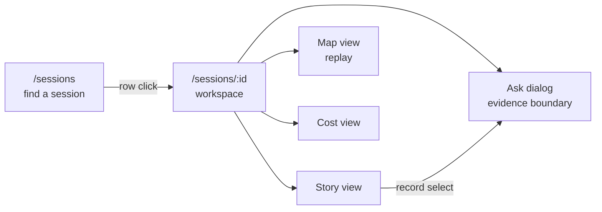

# Sessions screen

The recorded session reader: one route for finding a session, one for
reading its complete story, replaying its map, and attributing its cost.

## Structure

## Method

- The reference is the frozen Sessions screen. Three inventories record
  its structure, computed styles, data, and behavior element by element
  before any build: the shell and picker, the story view with its
  projection algorithm, the map replay and cost views.
- Algorithms and behavior port faithfully. Styling is rebuilt on the
  three layer architecture: tokens and utility classes, no module
  stylesheets.

## Routes

- `/sessions?player=` lists the player's sessions, searchable over
  goal, state, date, and id, newest first. A row opens the session.
- `/sessions/{id}?view=story|map|cost&turn=&iteration=&event=&goal=`
  carries the full reading position in the URL, so any position is a
  shareable link. The reference kept identity in query params with
  `replaceState`; the route params and search schema carry the same
  state through the router.

## Data

- `GET /api/v1/sessions/{id}/investigation` serves the complete
  recorded story: the reference projection (records, run, cost, world,
  diagnostics, lens) wrapped in the bounded resource envelope. The
  projection already lived in the backend, the route makes it a typed
  v1 resource like the live view.
- The map replay reads `GET /api/v1/live/{id}/view?through=N`, the
  pinned prefix that produced each iteration's world state.
- The catalog feeds the list and the workspace identity.
- A live session's investigation refreshes on the reference 2 second
  cadence. Ended sessions never refetch.

## Views

- Story: the chronological record grouped by goal, turn, and iteration,
  with the reference projection algorithm and filter.
- Map: the Live map replayed per iteration with a transport and
  scrubber. The prefix bound is the highest gateway sequence at or
  before the iteration's last record, the reference rule.
- Cost: every amount attributed, with the bar chart, token composition,
  reconciliation, and the twelve most expensive responses.

## Deviations

- The session finder is a routed page, not the reference header picker
  with a modal. The v3 header already carries the context switcher,
  which owns quick switching, so the reference picker would duplicate
  it. The finder page keeps the modal's search semantics and row form.
- Wire evidence expansion in the story is deferred: the v1 wire route
  is digest keyed, the reference fetched by sequence. The expander
  renders disabled until a v1 sequence path lands.
- The Ask dialog on this screen queries the live space. The v3 engine
  retired runtime session queries in the sessions space, and the
  restored live space answers retained sessions whether running or
  ended, with the same deterministic handlers.
- The map replay reuses the Live map as is: full scale, live toolbar
  hidden behind the replay bar. The reference's 0.8 scale session
  variant and its dedicated toolbar land as a follow up.
- The chart list ARIA of the reference cost view (list items carrying
  button state) was invalid and is dropped, labels and pressed state
  stay.
- URL write back goes through the router, not `replaceState`.
- The view bar scrolls with the page. The reference pinned it under its
  fixed header, but the v3 header scrolls away, and a lone floating bar
  mid page reads as detached.

## Quality bar

- Typed public interfaces: the investigation resource is a generated
  validated contract, all components strictly typed.
- One responsibility per module: projection, cost model, and views are
  separate modules with their own tests.
- UI verified by rendering against the running frozen reference.
- Styling is tokens and utilities only.
