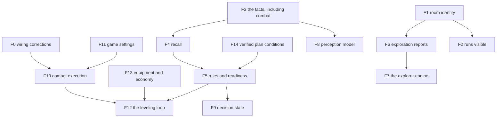

# Week 3 · The features, one at a time

Every feature that stands between the agent and the mission, as a
separate step. Each one is switchable on its own, testable on its own,
and measured on its own against the mission that matters: find the
minotaur and kill it.

Ordering is proposed here, not decided, and nothing is cut for time.
Each feature lands in its own commit with its tests, its README, and its
journal observation.

The agent has issued 994 moves, 388 sweeps, and zero attacks across 31
recorded missions, while `attack`, `consider`, `shop`, `equip_item`,
`get_item` and `practice` have existed and been reachable the whole
time. Features F10 to F14 exist because the plan previously described
knowing about play without ever executing it.

## How every feature is judged

The same measurement applies to each, so features can be compared
against each other rather than described:

| Measure | Why |
| --- | --- |
| target sighted, target killed | the mission, and nothing substitutes for it |
| levels gained, gold held and banked, kills, equipment worn | did it play the game at all |
| distinct rooms reached, share of entries onto known ground | did exploration work |
| model calls and dollars per attempt | what it cost |
| deaths and hazard events | did it survive |

Measurement is per configuration unit, not per code change. A unit is
what one switch turns on, so features that only work together are
measured together and named as one unit.

Every unit is measured the same way, and no unit is finished before it
is:

- a baseline batch with the unit off, and a batch with it on, everything
  else equal, same journey, same caps, same model
- the difference reported per measure above, with the attempt count and
  the spread, since a single run proves nothing
- the verdict stated plainly, including no effect and worse. A feature
  that improves cost while leaving mission progress unchanged is
  reported as exactly that, never as success
- a unit that cannot be measured yet says so and names what it waits
  for, rather than being called done

The order of work is therefore: implement, review until approved, then
measure against baseline, then the next unit.

## Isolation rules that apply to every feature

- One switch per feature in settings, defaulting off. Numbers are
  settings under the feature, never new switches.
- Off means unchanged: a recorded baseline mission replays identically.
- One integration point per feature where possible, named in its step.
- Tests that run without a MUD and without a model: the decision logic
  is pure functions over inputs, and the wiring is tested with fixtures.
- No feature is declared done from aggregates. One full transcript is
  read, and the Observatory is used as a person uses it.

## F1. Room identity

The blocker. Rooms have no identity across runs, so the map never joins,
coverage is undefined, and travelling to a place by name is guesswork.

- Rule: a candidate key of title, exits, and description proposes
  matches, the graph decides them, contradictions block a match, and
  matching iterates until stable. Same-session duplicates are evidence
  against matching, not a prohibition, because the position tracker
  re-mints a room when it loses track.
- Identity lives in its own layer, so a wrong match is undone by
  recomputing rather than by editing evidence.
- Judged by: at least half of aliases joining, the maze rooms staying
  separate, the Armory's sixteen identities becoming one, replaying a
  mission twice giving the same rooms, and the joined map being one
  connected piece rather than many.
- The measurement script ships with it.

## F2. Runs visible and watchable

Every experiment writes ordinary sessions with ordinary journals. They
are invisible only because each run writes into its own private root
that the Observatory never reads.

- Decision to record: either the Observatory reads those roots, or
  experiments stop isolating and write ordinary sessions with an
  experiment tag. The second is simpler and makes live watching
  automatic. The first keeps runs from touching the main knowledge
  store.
- Live watching needs nothing beyond whichever choice is made, since
  the Live view already follows a running session's journal.
- The runner records the mission verdict beside cost, so a list of
  sixteen failed minotaur attempts reads as sixteen failures.
- Judged by: opening a running batch in Live and watching it play, and
  finding any past attempt by suite and goal.

## F3. The facts the agent lacks

The store holds room titles, exits, and sightings. Everything that
decides play is missing: darkness, shop stock, monster appraisals, door
states, hunger, aggression, area names.

What the character has to show for playing is read from the numbers the
game reports, never from prose: experience, level and gold each keep
their history in the store, so a gain is the step between two readings
and the pace of gains says whether the current hunting ground has been
outgrown. A kill itself is prose and waits for the perception model,
which is what that feature is for.

One recorded fact is also wrong rather than missing. A room's stored
description sometimes carries what was happening in the room, a combat
line, loot on the ground, a mob standing there, so the same room reads
differently on different visits. Measured cost: it falsely proves 27
pairs of places to be different rooms and holds apart 188 pairs that
observer truth says are the same, which is most of the identity recall
currently lost. The description fact becomes the static room text, and
what was happening becomes its own observations.

- Each fact type has a source, a shape, and a provenance, per the
  knowledge contract.
- Judged by: after a mission, the store answers what a player would
  remember, and each answer traces to its evidence.

## F4. Recall, so the agent can read what it knows

Today the model sees a four-line count summary. Storing without reading
is the defect the audit found.

- One tool with a small set of typed questions: this room, creatures,
  services, a named target, unexplored ground, myself.
- Judged by: a transcript showing the model asking and then acting on
  the answer, and mission measures against recall being off.

## F5. Rules and readiness, the feature that plays the game

Knowledge does not kill anything. This is the layer that turns facts
into play, and it was the week 0 agent's whole advantage.

- Rules are configuration, one file, each rule with an id, a text, an
  on switch, and the settings carrying its numbers. Editing a rule
  never touches code, and any rule can be turned off to measure it.
- The model sees every enabled rule in its standing context. The model
  decides, always.
- Gates advise from typed facts and never act: no weapon or armour, a
  level below the floor, gold below the floor, a forbidden appraisal.
  The model may override with a stated reason, and both the advice and
  the override are journaled with the rule id.
- Two mechanical exceptions, both safe by nature: the game's own
  auto-flee threshold, and standing up before walking.
- Judged by: engagements preceded by an appraisal, preparation before
  hunting, gold banked, and above all whether the agent fights anything
  at all. Rules-off versus rules-on is the headline comparison of the
  week.

## F6. Exploration that reports experience

Sweeps report steps, rooms, frontier, and a stop reason, so the model
cannot steer, notice, or judge. Twenty-seven identical thoughts followed.

- Reports name the rooms walked, the creatures and objects seen and
  where, area changes, and refusals.
- A sighting of the mission target stops the sweep immediately and says
  where.
- The model can bias direction or area. Posture is checked before
  stepping.
- Judged by: the model changing course because of a report, and the
  share of entries onto known ground falling.

## F7. The explorer engine

Coverage is a guarantee, so it belongs in code. Judgement stays with the
model.

- Areas are taken in order, each explored to a budget, then the agent
  moves on. Ordering prefers cheap and promising ground, and no area is
  starved.
- Evidence defers an area: deaths, flees, forbidden appraisals, danger
  warnings. Deferral records the level at which it hurt, and lifts when
  the character outgrows it.
- The agent aborts the plan when the target appears or danger demands.
- Whether the scout is a second agent with a disposable context or a
  routine with small local calls is settled by measurement, not by
  argument. Both are described, one is built first.
- Judged by: rooms per model call, share of entries onto known ground,
  steps to reach a target, and contacts with deferred areas.

## F8. The perception model in the loop

A trained classifier reads a reply block and reports typed flags, so
behaviour never depends on matching phrases.

- Three states: off, shadow, and acting. Shadow predicts and journals
  and changes nothing, which is how an honest accuracy number is earned
  on text the training never saw.
- Only labels that hold up are consumed, chosen one by one.
- The runtime is optional. Absent runtime with the feature off changes
  nothing, and with the feature on it fails loudly at startup.
- Judged by: reviewed per-label agreement on fresh text first, then the
  mission measures with it acting.

## F9. Decision state

Each decision is taken from an assembled state of roughly fixed size
rather than from the whole conversation.

- The state carries where I am, what I am, what I already tried, what I
  am in the middle of, how long I have been trying, and what I know
  that matters here.
- How much recent conversation is kept is a setting, so the full
  transcript, a short window, and none are one mechanism at three
  values.
- Judged by: tokens per decision against mission progress, plus
  oscillation and repetition, which are the failure this risks.

## F10. Combat execution

Fighting is a loop, not a command. The game sends the first round in
reply and the rest unsolicited, so something must own the exchange.

- Engage after an appraisal, poll rounds until an outcome, and return a
  typed result: killed, fled, died, interrupted, target gone.
- The outcome carries what happened: rounds, damage taken, experience
  awarded, what the corpse holds.
- Flee is bounded by the survival thresholds already built, and the
  model decides re-engagement.
- Judged by: a fight completed end to end in a transcript, and the
  first non-zero kill count in this project's benchmark history.

## F11. Game settings the agent sets for itself

The game can do work the agent would otherwise pay a model call for.

- At session start, the agent sets the game's own conveniences: loot and
  gold collected automatically on a kill, exits shown with each room,
  the auto-flee threshold already built.
- Every setting is configurable and every one is measured, since each is
  a small experiment in moving work out of the model.
- Judged by: a kill leaving nothing valuable on the floor, and the model
  calls per fight falling.

## F12. The leveling loop

Nothing in the system ever makes a fight happen. This does.

- Choose prey from appraisals and level, fight, loot, rest, repeat, with
  a stopping condition expressed as a goal (a level, an amount of gold,
  a number of kills).
- Grinding ground is remembered as a service like any other place, and
  experience per kill falling moves the agent on.
- Judged by: levels gained per attempt and per dollar, and deaths.

## F13. Equipment and economy execution

Advice about buying is not buying.

- Collect obvious free equipment, buy what the rules recommend when gold
  allows, wear and wield it, and bank the surplus above the carried
  ceiling.
- Every threshold is a setting.
- Judged by: equipment worn, gold banked, and gold surviving a death.

## F14. Verified plan conditions

Week 0's one text-layer mechanism that provably changed behaviour: a
plan step carries a condition that code checks, so the agent cannot
believe it is ready when it is not.

- The agent writes steps with machine-checkable conditions (an item
  held, a level reached, an amount of gold, a place known).
- Conditions are evaluated by code and their state is shown in the
  standing context, so a plan cannot drift from the facts.
- Judged by: a transcript where a false condition stops the agent from
  proceeding, which is the week 0 behaviour this restores.

## Benchmarks that can produce a non-zero number

Every mission attempt so far scores zero, so no feature can be ranked
against another. Intermediate missions fix that.

- Reach a level, from a fresh character.
- Kill a number of creatures and bank the proceeds.
- Equip a weapon and armour from nothing.
- Find a named place already known to exist.

Each is a benchmark journey with an evidence-based verdict, run the same
way as the mission, so a feature's worth is visible before the full
mission is solvable.

## What each feature needs before it can start

| Feature | Needs |
| --- | --- |
| F0 | nothing, it repairs what is broken |
| F1 | nothing |
| F2 | a decision on isolation versus tagging |
| F3 | nothing |
| F4 | F3 |
| F5 | F3 for the gates, F14 for conditions |
| F6 | F1 for honest coverage numbers |
| F7 | F1 and F6, and F3 for hazard evidence |
| F8 | a decision on where the switch lives |
| F9 | F3, F4, and F5, since state replaces what the transcript carried |
| F10 | F0, since a fight cannot be judged through broken wiring |
| F11 | nothing |
| F12 | F10 and F11, and F5 to choose prey sanely |
| F13 | F3 for shop and equipment facts |
| F14 | nothing |

## F0. Wiring corrections

Known defects that make every measurement noise. Not new scope, repair.

- The agent unwraps the gateway result envelope, so the mission line and
  the state block stop arriving as JSON noise and "None rooms".
- The per-response state line is withdrawn, since a required text line
  conflicts with tool use and was ignored on 27 of 27 iterations. Its
  fields move to the note tool.
- Routines check posture before stepping, so a sweep never walks a
  resting character into three refusals and a setback limit.
- Judged by: a transcript where the mission line renders real values,
  and a sweep from a resting start that stands and walks.

## Decisions waiting

- F2: isolated runs the Observatory reads, or ordinary tagged sessions.
- F8: whether perception is a sixth capability, a setting group under
  knowledge, or a gateway device outside capabilities.
- The order of work.
