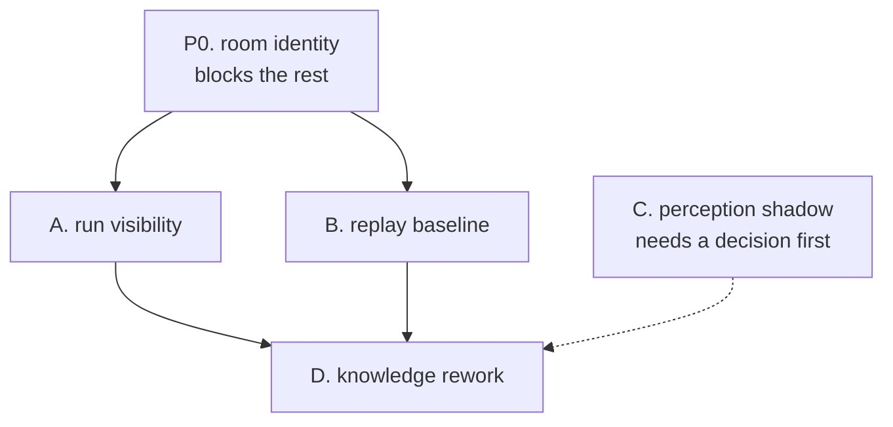

# Week 3 · Run visibility, room identity, and the exploration lab

Three tracks with one purpose: make what the agent does visible and
measurable before changing how it decides. The
[knowledge rework](knowledge_rework.md) states what the agent must know
and how it should explore. This plan states how that work is watched,
tried cheaply, and proven.

It was reviewed against the code before any step was taken, and the
review overturned three of its assumptions. Those corrections are
carried below as stated facts, not as history.

## P0. Room identity, the blocker under everything

Measured on the main store: 478 place ids, 114 distinct titles, 588 exit
links, and zero links that cross a session. Place ids are minted per
session (`place:{session}:{seq}:{n}`), so the same room becomes a new
place in every run and the map never joins.

Consequences, all previously misread as other problems:

- A warm map does not accumulate. Five runs produce five disconnected
  partial copies, not one larger map.
- Frontier arithmetic counts unexplored exits of aliases, so "rooms
  known" overstates knowledge.
- Re-tread rate, travel by title, and any coverage measure are undefined
  until identity is defined.

This is a knowledge-rework concern and lands there, but nothing in this
plan is measurable before it does. Identity rule to decide there: title
plus exit signature plus link consistency, with aliasing recorded rather
than discarded.

- Success: after the rule lands, replaying two recorded missions over
  the joined store yields one connected map, and the count of distinct
  rooms is stable when a mission is replayed twice.
- Failure: any rule that merges two genuinely different rooms sharing a
  title, which is common in mazes and corridors. A merge must be
  evidenced by exits, not by title alone.

## Branch and commit policy

| Track | Branch | Merges |
| --- | --- | --- |
| P0, A, C | week3/capable | yes, one commit per landed step |
| B | week3/explore-lab, throwaway | never as written: only a validated policy is rewritten onto the working branch with its own tests |

The lab branch carries the replay harness and the sweeps. None of it is
product code. Its numbers are quoted in reports, its code is not merged.

## Track A: a run you can watch and re-watch

Every benchmark attempt runs under its own `BOUKENSHA_DIR`, a complete
runtime layout with its own registry and session directories. The
Observatory reads only the main runtime root, so every measured
experiment is invisible to the app built to inspect experiments.

The review corrected the intended mechanism. Registering attempts in the
shared registry would trip the one-live-character unique index and be
rejected by the session-directory guard, and would be the contamination
this plan forbids. The change is read-side only.

### A1a. The Observatory discovers overlay roots

- Change: session sources accept multiple runtime roots, discovering
  `benchmarks/*/attempts/*/registry.db` and validating each session
  directory against its own overlay root. No writer changes anywhere.
- Success: for every overlay attempt holding a registry, its sessions
  appear through the sessions API, and no attempt session resolves
  against the main root.
- Failure: any write to the main registry or store from a benchmark run,
  or a session that lists but cannot open.
- Tests: a source test over a fixture overlay tree, a path-guard test
  that an overlay session cannot escape its root.
- Cost note: the sessions API recomputes per request, so discovery must
  bound its scan. Ended attempts are read once and cached by their last
  sequence.

### A1b. Attempts are findable as experiments

- Change: suite and attempt id, derived from the overlay path, carried
  on the session row, with the goal taken from the ledger journey or the
  recorded session objective. Warm suites share one overlay, so the
  attempt-to-session mapping rule is stated: the session whose start
  falls inside the attempt's window.
- Success: the finder filters by suite and by goal, and a warm suite's
  attempts each resolve to exactly one session.
- Failure: an attempt resolving to zero or several sessions.
- Tests: Vitest on the finder filters, a mapping unit test over a warm
  fixture.

### A2a. The runner records a verdict

- Change: the evidence-based judge writes its verdict into the ledger
  row (sighted, killed, died, capped, error) beside cost and stop
  reason. The Observatory renders that verdict and never re-judges.
- Success: every ledger row carries a verdict, and a sampled attempt's
  verdict matches what its transcript shows on a full read.
- Failure: a verdict contradicted by its transcript, or prose matching
  reintroduced on the Observatory side.
- Tests: judge unit tests per verdict from fixture journals.

### A2b. The list states the outcome

- Change: session rows show the verdict and cost.
- Success: every failed attempt reads as a failure at a glance in the
  list, without opening it.
- Tests: Vitest on the row projection.

### A3. Watching a run live

Cheaper than assumed: the Live view already polls the session journal
file read-only, so watching needs no control socket and no new stream.

- Change: a running attempt is selectable in Live through the same
  discovery as A1a. The operator channel stays disabled for attempts, so
  watching cannot perturb a measured run.
- Success: appending events to a fixture journal while attached advances
  the rendered story, and a real batch is watched once and recorded in
  the report.
- Failure: any attempt state changed by watching.
- Tests: a Playwright test that appends to a fixture journal and asserts
  the view advances.
- Scope: timeboxed. It is a demonstration, not audit evidence, and is
  dropped first if the week tightens.

## Track B: replay first, simulation only when the facts exist

The review dismantled the original premise. There is no 235-room
recorded map to simulate over: those were session-scoped aliases. The
store also holds no refusals, no door states, and no hazards, so it
cannot yield the typed outcomes a walking simulator needs. Building a
policy simulator on it would model a different game, which is this
plan's own definition of failure.

### B1. The journal replay harness

- Change: replay a recorded mission from its gateway journal, which does
  hold the real sequence: observations, positions, refusal text, vitals.
- Success: replaying a retained mission reproduces its room sequence
  step for step, and produces the re-tread and oscillation baseline
  under an explicitly stated room-identity rule.
- Failure: replay disagreeing with the journal, which means the harness
  models something else.
- Tests: two retained missions asserted step for step.
- This is the only part of track B that runs before P0 lands, and its
  numbers are provisional until identity is defined.

### B2 to B4. Policy sweeps, deferred

Area partitioning, queue order, hazard deferral, and the settings sweep
need joined room identity and hazard facts. Both come from the knowledge
rework. These steps are deferred behind it by design, and the dependency
is stated rather than discovered late.

## Track C: perception in shadow, pending one decision

### C0. The decision this needs first

`capabilities.perception` does not exist and is rejected by validation in
three packages. The project's binding architecture is five capabilities
with one master flag each, so adding a sixth is an architecture change,
not a plan detail. The options, for Ibnou:

- a sixth capability block, changing the stated five-capability rule
- a `perception` settings group under `knowledge`, since its output
  becomes knowledge facts
- a gateway surface setting outside `capabilities`, as a perception
  device rather than an agent capability

Nothing in track C is built before this is answered.

### C1. The capability and its modes

- Change: the master flag stays boolean, as the architecture requires,
  and the mode is a validated setting under the block: `enabled: false`
  by default, `mode: shadow | active` when enabled. Wiring runs from
  settings through session construction into the observation pipeline,
  which is the single choke point per reply frame.
- Success: with the flag off, a recorded mission's journal is unchanged.
  In shadow, every reply block carries a prediction event and no command
  sent to the game differs from the off run.
- Failure: any behavioural difference in shadow, or a gateway that fails
  to start when the flag is off.
- Runtime: onnxruntime is an optional extra, imported only when the mode
  is not off, and a missing runtime or artifact fails loudly at startup,
  never mid-mission and never by silently reverting to off.
- The artifact version is pinned by name in settings, since several
  manifests exist, and the inference protocol comes from the manifest
  rather than from constants in code.
- Tests: an off-mode baseline comparison, a shadow-mode test asserting
  prediction events and identical commands, a fixture test of the
  windowing protocol against manifest values, and a gate that refuses to
  consume any label listed below floors.

### C2. An honest accuracy number

- Change: shadow predictions are exported as a review file with the raw
  block beside the predicted labels. No Observatory feature is built for
  this yet.
- Success: a review pass over fresh blocks produces a per-label
  agreement table, which becomes the number quoted from then on.
- Failure: reviewed accuracy materially below the frozen-set numbers,
  which confirms the adaptivity concern and returns those labels to
  training.

### C3. Activation, per label

Only labels whose reviewed accuracy holds are consumed, chosen per label
in settings. The decision and its numbers are recorded.

## Cross-cutting rules

- Success criteria are predicates over current data, never fixed counts.
  Counts move, predicates hold.
- Verification is transcript level and app level: at least one full
  transcript read per landed step, and the Observatory used as a person
  uses it, scrolled and clicked.
- Mission metrics are game progress first: levels, gold, kills,
  equipment, sightings. Call counts and cost never stand alone.
- Any measurement taken while tuning against the same data is labelled
  optimistic, and the perception numbers currently are.
- One commit per landed, verified step, with the touched README and the
  week 3 journal in the same series.

## Sequencing under the deadline

| Order | Work | Why |
| --- | --- | --- |
| 1 | P0 room identity | everything else is unmeasurable without it |
| 2 | A1a, A1b, A2a, A2b | the evidence for every later claim |
| 3 | B1 replay baseline | pins re-tread honestly, cheap |
| 4 | knowledge rework body | the audit-critical work |
| 5 | A3 live watching | a demonstration, timeboxed |
| 6 | C, after its decision | matters once labels are consumed |

## Reporting

Progress is appended to `docs/reports/week3_visibility_progress.md` as
each step lands or fails, with numbers and run identifiers. A failed
step is recorded as plainly as a passing one.
