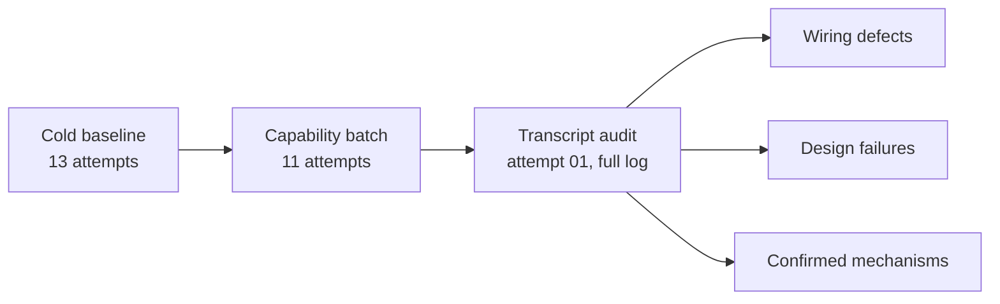

# Week 3 capability audit

This report records what the transcript-level audit of the capability
runs established: which mechanisms worked as evidenced, which were
defective, and which design assumptions failed. Runtime evidence stays
under `.boukensha/benchmarks/` and is excluded from Git. Session
references name the attempt ledgers there.

## Measurements that stand

| Measure | Baseline | Capabilities on |
| --- | ---: | ---: |
| Model calls per attempt | 86.3 ± 21.4 | 28.5 ± 0.5 |
| Deaths | 3 of 13 | 0 of 11 |
| Target sightings | 0 | 0 |

The call collapse and its variance are real, with two bounds stated: the
per-attempt cost ceilings differed (0.20 versus 0.25 dollars), and the
number measures walking efficiency, not game competence. The warm series
accumulated 235 distinct rooms across five runs against roughly 35 for
one cold attempt, and the map persists.

Mechanisms confirmed by the transcripts: bounded navigation routines with
typed stops and per-step journaling, the survival reflexes (the auto-flee
threshold set once per attempt, rest fired 25 times across the batch),
and the compact routine reports that replaced per-room prose in model
context. The zero hazard signatures in the capability cohort carry a
bound of their own: bounded sweep patterns avoid hazardous ground by
shape, so the reflexes are not the only explanation.

## Wiring defects

- The agent-side fetchers for the state block and the mission readiness
  consumed the gateway's full result envelope instead of its inner text.
  The mission-phase line therefore rendered every readiness field as
  "None" and prescribed exploration on every call, and the state block
  reached the model wrapped in JSON noise.
- The required end-of-response state line was ignored on 27 of 27
  iterations with the contract verifiably present in the system prompt.
  Responses that call tools carry little or no text, so a mandatory text
  line per response conflicts with tool use structurally. The mechanism
  needs a different carrier.
- A sweep walked a resting character. The game refused each step ("You
  feel too relaxed to do that"), the executor read the refusals as
  blocked exits, and the routine ended on its setback limit after four
  steps. Routines do not check posture before stepping.
- The knowledge page cannot scroll past the first viewport: the Live
  shell's fixed-viewport page state was never overridden for the route.

## Design failures

- The store holds the structural skeleton only: room titles,
  descriptions, exit lists and links, sighted creature and object names,
  own vitals. Everything qualitative or requiring a second action never
  becomes a fact: shop inventories, signs, darkness, monster appraisals,
  door and key semantics. It lives only in the session logs.
- The model cannot read the store. Its whole window is a four-line count
  summary. Sightings, services, and beliefs are stored but unreachable
  by the component that decides.
- Exploration reports geometry only: steps, rooms, frontier, stop
  reason. Nothing about shops passed, creatures seen, or area character,
  so the model cannot steer exploration or notice opportunities. The
  recorded thoughts show the consequence: 27 near-identical resolutions
  to keep sweeping.
- No sighting alarm exists. Sweeps do not stop when the mission target
  is seen and their reports omit creatures; the intended alarm through
  the readiness line was disabled by the envelope defect. A swept-past
  target would be recorded silently.
- No game strategy is implemented. The phase gate evaluates health and
  sighting only; level, equipment, skills, and gold gate nothing. The
  preparation planner, authored rules, consider ladder, and grinding
  grounds from the plan were not built. The week 0 play skill already
  expressed the needed strategy in prose and has no carrier in this
  system.
- The economy routines were never reachable in any run: no kill, no
  loot, no gold, so custody and purchasing remain unexercised code.
- The knowledge page presents subject-predicate storage rows rather than
  synthesized knowledge: rooms, a character sheet, and beliefs with
  their evidence.
