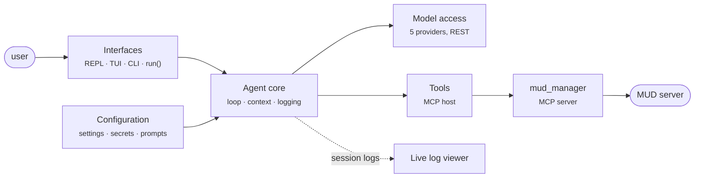

# Week 1 · Baseline MUD agent (boukensha)

boukensha is a Python agent that plays a MUD game server under natural-language
instruction. This week builds the **baseline** — the foundational agent, the
minimal complete machinery an agent needs to run. It is deliberately simple: it
acts on the instructions it is given and keeps no memory or world model beyond
the current conversation. Later work builds more capable behavior on top of it.



The agent is assembled one component per step, each in its own runnable package
under `agent/`. See [architecture](../docs/plans/week1_baseline/architecture.md)
for the full component map, the flow of a turn, and the build path.

## Setup

Configuration and secrets live in a `.boukensha/` directory, set up as
described in the [config step](agent/00_config/README.md).

## Running

Each step has a launcher in `bin/` that runs its example from this folder:

```bash
bin/00_config
```

Each step's README documents what its example does and the underlying command.

Each step is a self-contained [`uv`](https://docs.astral.sh/uv/) project with
its own environment: the steps are versions of the same package, which cannot
share one env, and uv's lazy creation and cache hardlinks keep the cost near
zero.

## Organization

```
week1_baseline/
├── README.md              this file
├── agent/                 the agent, one folder per step (00_config … 12_context)
│   └── NN_name/README.md  each step's own documentation
└── bin/                   launcher scripts
```

## Where to go next

- [Architecture](../docs/plans/week1_baseline/architecture.md) — the system in
  detail and the build path.
- Each `agent/NN_name/README.md` — that step's design and usage.
