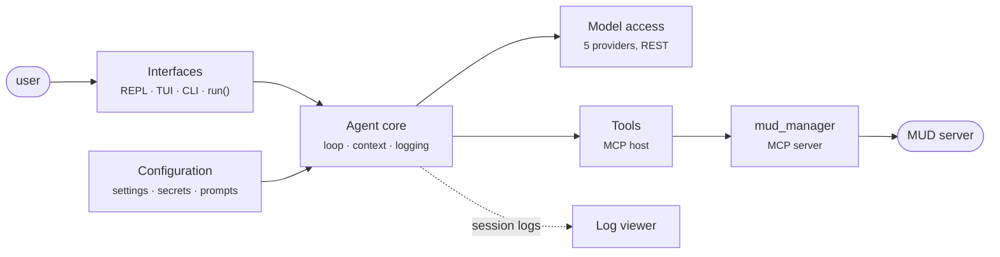

# Week 1 · Baseline MUD agent (boukensha)

boukensha is a Python agent that plays a MUD game server under natural-language
instruction. This week builds the **baseline**: the foundational agent, the
minimal complete machinery an agent needs to run. It is deliberately simple: it
acts on the instructions it is given and keeps no memory or world model beyond
the current conversation. Later work builds more capable behavior on top of it.


```mermaid
flowchart LR
    User(["user"]) --> Iface["Interfaces<br/><small>REPL · TUI · CLI · run()</small>"]
    Iface --> Core["Agent core<br/><small>loop · context · logging</small>"]
    Cfg["Configuration<br/><small>settings · secrets · prompts</small>"] --> Core
    Core --> Model["Model access<br/><small>5 providers, REST</small>"]
    Core --> Tools["Tools<br/><small>MCP host</small>"]
    Tools --> MM["mud_manager<br/><small>MCP server</small>"] --> MUD(["MUD server"])
    Core -.session logs.-> Viewer["Log viewer"]
```

The agent is assembled one component per step, each in its own runnable package
under `agent/`. See [architecture](../docs/plans/week1_baseline/architecture.md)
for the full component map, the flow of a turn, and the build path.

## Setup

Configuration and secrets live in a `.boukensha/` directory, set up as
described in the [config step](agent/00_config/README.md).

## Configuration

Everything is in `.boukensha/settings.yaml`, which is self-documenting: active
values are set, every optional key is shown commented with its default. Secrets
live in `.boukensha/.env`. The full reference:

`tasks.<name>` (the agent plays the `player` task):

| Key | Default | Meaning |
|---|---|---|
| `provider` | (required) | `anthropic`, `gemini`, `openai`, `ollama`, or `ollama_cloud` |
| `model` | (required) | a model in the catalog (`boukensha/models.yaml` or a `.boukensha` override) |
| `prompt_override.system` | `false` | use `prompts/<task>/system.md` when present |
| `thinking` | unset | reasoning effort: `none`, `minimal`, `low`, `medium`, `high`, `xhigh`, `max`. Unset takes the model's default |
| `max_iterations` | `25` | tool-call rounds per turn (`0` disables) |
| `max_output_tokens` | `1024` | per-call output-token cap |
| `max_turn_tokens` | `60000` | per-turn WORK ceiling: every input class plus output, so caching does not move it (`0` disables) |
| `max_turn_cost` | disabled | per-turn MONEY ceiling in dollars, applies when the model has rates |
| `compaction_threshold` | `0.85` | window fraction that triggers auto-compaction |

`agent` (agent-wide defaults for the five limits above). Resolution is the
per-task value first, then the `agent:` value, then the code default.

`mcp_servers.<name>` (every tool the agent has comes from an entry here):

| Key | Default | Meaning |
|---|---|---|
| `command` | (required) | an executable on PATH |
| `args` | `[]` | arguments passed to it |
| `env` | `{}` | environment for the spawned server |
| `prefix` | none | agent-side tool-name prefix (`tbamud__look`) |
| `required` | `true` | `true` stops boot on a failed spawn, `false` warns and continues |
| `timeout` | `30` | per-call ceiling in seconds |
| `allow` | none | if set, only these tool names register |
| `deny` | `[]` | tool names to drop |

`mud` (optional, feeds only the `/mud` info command's readout). The real MUD
connection is `mcp_servers.mud.env`.

Secrets in `.boukensha/.env`, one per provider you use plus the MUD password:

| Variable | For |
|---|---|
| `ANTHROPIC_API_KEY` | the anthropic provider |
| `GEMINI_API_KEY` | the gemini provider |
| `OPENAI_API_KEY` | the openai provider |
| `OLLAMA_API_KEY` | the ollama_cloud provider (local ollama needs none) |
| `MUD_PASSWORD` | the MUD character password |

The context window is not a setting: it is a model fact read from the catalog,
overridable per call by the `context_window` keyword on `run`/`repl`.

## Running

Each step has a launcher in `bin/` that runs its example from this folder:

```bash
bin/00_config
```

Each step's README documents what its example does and the underlying command.

Each step is a self-contained [`uv`](https://docs.astral.sh/uv/) project with
its own environment: the steps are versions of the same package, which cannot
share one env, and uv's lazy creation and cache hardlinks keep the cost near
zero.

## Organization

```
week1_baseline/
├── README.md              this file
├── agent/                 the agent, one folder per step (00_config … 13_context_economics)
│   └── NN_name/README.md  each step's own documentation
├── log_viewer/            the log viewer, a separate program
└── bin/                   launcher scripts
```

The log viewer has no number because it is not a step. It reads the session logs the
agent writes and imports nothing from it, so it is its own package with its own tests,
and it does not carry the agent forward the way the numbered steps do.

## Where to go next

- [Architecture](../docs/plans/week1_baseline/architecture.md): the system in
  detail and the build path.
- Each `agent/NN_name/README.md`: that step's design and usage.
- [Log viewer](log_viewer/): reads a session log and makes it answerable.
