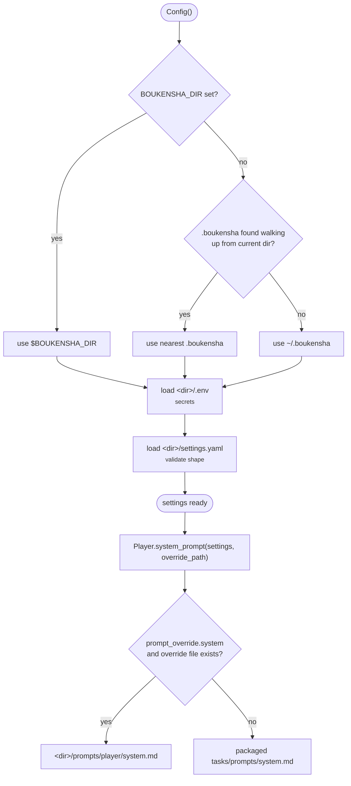

# 00 · Configuration

A single class, `Config`, is the source of truth for all settings and secrets;
a small `Task` layer resolves a task's provider, model, and system prompt.
Every later component reads its configuration through this. Configuration is
organised by **task** — a role in the agent bound to its own model. This step
drives one task, the `player`.

## Run

From `week1_baseline/`:

```bash
bin/00_config
```

or directly (this folder is a [`uv`](https://docs.astral.sh/uv/) project):

```bash
uv run examples/example.py
```

The example prints the resolved configuration and asserts that the system
prompt resolves non-empty, that walking up from the step directory finds the
repo's `.boukensha`, and that `BOUKENSHA_DIR` overrides discovery when set:

```
=== boukensha · step 00: configuration ===

Config dir:      /path/to/repo/.boukensha
Tasks:           player

-- player task --
Provider:        anthropic
Model:           claude-haiku-4-5
Prompt override: True
System prompt:   # Role ...

MUD target:      localhost:4000 as dummy
API key set?     True
MUD password?    True

assertions passed ✓
```

## Files

```
00_config/
├── pyproject.toml            # uv project: dependencies (PyYAML, python-dotenv)
├── boukensha/
│   ├── config.py             # Config, ConfigError
│   └── tasks/
│       ├── base.py           # Task: provider / model / prompt resolution
│       ├── player.py         # Player(Task)
│       └── prompts/
│           └── system.md     # default system prompt, shipped with the package
└── examples/
    └── example.py            # runnable smoke test
```

Path ownership is deliberate: `Config` owns every path under the user's
`.boukensha/` directory; the tasks package owns the assets it ships (its
default prompt, resolved via `importlib.resources`, so it works installed as
well as from source).

## Config directory

`Config` reads a `.boukensha/` directory, resolved in order:

1. `BOUKENSHA_DIR` — explicit override, points at any directory.
2. The nearest existing `.boukensha/` found walking up from the current
   directory to the filesystem root — so a project-local config works with no
   environment setup, like git's repo discovery.
3. `~/.boukensha` — the default outside any project tree.

The trade this accepts: resolution depends on where you run, and the found
directory's `.env` is loaded into the environment — so you trust the tree you
run in.

```
.boukensha/
├── settings.yaml       # non-secret settings — in the repo
├── .env                # secrets — local only, gitignored
├── .env.example        # template of required keys — in the repo
└── prompts/
    └── <task>/system.md   # optional per-task prompt override
```

A missing `settings.yaml` or `.env` is not an error — everything falls back to
defaults, so a fresh install runs. A malformed `settings.yaml` raises
`ConfigError` naming the offending key:

```
ConfigError: settings.yaml: 'tasks.player' must be a mapping (provider, model, ...), got str
```

## Secrets

Secrets live only in `.env` and load into the environment; `settings.yaml`
holds none. `ANTHROPIC_API_KEY` and the MUD password (`MUD_PASSWORD`) come from
`.env`. Copy `.env.example` to `.env` and fill in the values — the real `.env`
is gitignored.

## Resolution flow



## Tasks

`Task` is stateless: class methods over a task's settings dict, no instances.
`Player` is the only concrete task.

```python
from boukensha import Config, Player

config = Config()
settings = config.tasks("player")
Player.provider(settings)                  # "anthropic"
Player.model(settings)                     # "claude-haiku-4-5"
Player.system_prompt(settings,
    config.user_prompt_path(Player.task_name))  # resolved prompt text
```

`provider` and `model` are required and raise `ConfigError`, naming the task,
when absent.

## Settings schema

```yaml
tasks:
  player:
    provider: anthropic
    model: claude-haiku-4-5
    prompt_override:
      system: true
mud:
  host: localhost
  port: 4000
  username: dummy
```

- `tasks.<name>.provider` / `model` — required per task.
- `tasks.<name>.prompt_override.system` — when `true`, the task's override file
  replaces the default system prompt.
- `mud.host` / `port` / `username` — MUD connection (non-secret); the password
  is `MUD_PASSWORD` in `.env`.
