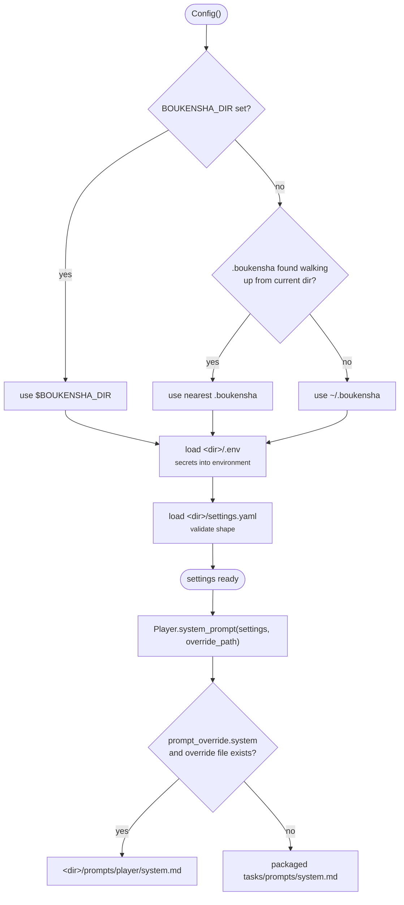

# 00 · Configuration

A single class, `Config`, is the source of truth for every setting and secret,
and a small `Task` layer resolves a task's provider, model, and system prompt.
Every later component reads its configuration through this. Configuration is
organised by **task**, a role in the agent bound to its own model. This step
drives one task, the `player`, and the shape allows more tasks (a full
multi-task agent) later.

## New Files

This is the first step, so every file is new.

| File | What it does |
|------|--------------|
| `boukensha/config.py` | `Config` and `ConfigError`: resolve the `.boukensha/` directory, load `.env` and `settings.yaml`, expose settings and MUD accessors |
| `boukensha/tasks/base.py` | `Task`: stateless resolution of a task's provider, model, and system prompt over a settings dict |
| `boukensha/tasks/player.py` | `Player(Task)`, the only concrete task this step |
| `boukensha/tasks/prompts/system.md` | default system prompt shipped inside the package |
| `boukensha/__init__.py` | package exports: `Config`, `ConfigError`, `Player`, `Task` |
| `boukensha/tasks/__init__.py` | tasks subpackage exports |
| `pyproject.toml` | uv project: Python ≥3.12, deps PyYAML and python-dotenv |
| `examples/example.py` | offline demo and smoke test |
| `../../bin/00_config` | launcher: runs the example from `week1_baseline/` |

## Updated Files

None. Step 00 has no prior step to update.

## How it works



`Config` loads the directory once at construction: `.env` first (secrets into
the environment), then `settings.yaml` (validated). A missing file is tolerated,
a malformed one is not. `Task` never holds state, it reads a task's settings
dict on demand.

## Config directory

`Config` reads a `.boukensha/` directory, resolved in this order:

1. `BOUKENSHA_DIR`: explicit override, points at any directory.
2. the nearest existing `.boukensha/` walking up from the current directory to
   the filesystem root, so a project-local config works with no environment
   setup, like git's repo discovery.
3. `~/.boukensha`: the default outside any project tree.

Resolution runs before `.env` loads, so `BOUKENSHA_DIR` cannot be set from
inside `.env`. The trade discovery accepts: resolution depends on where you run,
and the found directory's `.env` is loaded into the environment, so you trust
the tree you run in.

```
.boukensha/
├── settings.yaml         # non-secret settings, in the repo
├── .env                  # secrets, local only, gitignored
├── .env.example          # template of required keys, in the repo
└── prompts/
    └── <task>/system.md  # optional per-task prompt override
```

Path ownership is deliberate: `Config` owns every path under the user's
`.boukensha/` (via `user_prompt_path`), the tasks package owns the assets it
ships (its default prompt, resolved with `importlib.resources`, so it works
installed as well as from source).

## Secrets

Secrets live only in `.env` and load into the environment, `settings.yaml` holds
none. `ANTHROPIC_API_KEY` and the MUD password (`MUD_PASSWORD`) come from `.env`.
Copy `.env.example` to `.env` and fill in the values. The real `.env` is
gitignored, so nothing in the assertion path requires a key to be present.

## Tasks

`Task` is stateless: class methods over a task's settings dict, no instances. A
concrete task sets `task_name`, and forgetting it fails at class-definition
time. `Player` is the only concrete task. A task reads the keys it needs from
its settings dict and ignores any it does not.

| Method | Returns |
|--------|---------|
| `Player.provider(settings)` | provider name, required, raises `ConfigError` naming the task if absent |
| `Player.model(settings)` | model id, required, same guard |
| `Player.prompt_override(settings)` | `True` when `prompt_override.system` is set |
| `Player.system_prompt(settings, override_path)` | resolved prompt text, override first, else packaged default |

```python
from boukensha import Config, Player

config = Config()
settings = config.tasks("player")
Player.provider(settings)                                  # "anthropic"
Player.model(settings)                                     # "claude-haiku-4-5"
Player.system_prompt(settings,
    config.user_prompt_path(Player.task_name))             # resolved prompt text
```

## System prompt resolution

Per task, in order:

1. `.boukensha/prompts/<task>/system.md`: used when the task's
   `prompt_override.system` is `true` and the file exists.
2. `boukensha/tasks/prompts/system.md`: the default shipped inside the package.

Override is per task via `prompt_override.system`, not a single top-level
switch, so one task can override its prompt while others take the default.

## Settings schema

```yaml
tasks:
  player:
    provider: anthropic
    model: claude-haiku-4-5
    prompt_override:
      system: true
mud:
  host: localhost
  port: 4000
  username: dummy
```

- `tasks.<name>.provider` / `model`: required per task.
- `tasks.<name>.prompt_override.system`: when `true`, the task's override file
  replaces the default system prompt.
- `mud.host` / `port` / `username`: MUD connection, non-secret. The password is
  `MUD_PASSWORD` in `.env`.

A missing `settings.yaml` or `.env` is not an error, everything falls back to
defaults so a fresh install runs. A malformed `settings.yaml` raises
`ConfigError` naming the offending key:

```
ConfigError: settings.yaml: 'tasks.player' must be a mapping (provider, model, ...), got str
```

## Example output

`bin/00_config` prints the resolved configuration, then walks the guarantees,
directory resolution, tolerance to an empty directory, the malformation guard,
and override-vs-default prompt resolution, before its assertions:

```
=== boukensha · step 00: configuration ===

-- resolved configuration --
Config dir:      /home/you/Claude-Code-Camp/.boukensha
Tasks:           player
Provider:        anthropic
Model:           claude-haiku-4-5
Prompt override: True
System prompt:   # Role

You are a MUD Journey Player Agent. You play a text-...
MUD target:      localhost:4000 as dummy
API key set?     False
MUD password?    False
<boukensha.Config dir=/home/you/Claude-Code-Camp/.boukensha tasks=player>

-- directory resolution --
BOUKENSHA_DIR set   -> /tmp/tmp6zf98f0y   (explicit override)
walking up from cwd -> /home/you/Claude-Code-Camp/.boukensha   (nearest .boukensha)
neither of the above -> ~/.boukensha   (default install location)

-- empty config directory (fresh install runs on defaults) --
tasks:      (none)
MUD target: localhost:4000   (defaults, no settings.yaml)

-- malformed settings.yaml names the offending key --
ConfigError: settings.yaml: 'tasks.player' must be a mapping (provider, model, ...), got str

-- system prompt resolution: override wins, else the packaged default --
override on, no file -> default:  'You are a MUD player agent. Use the tool'...
override file present -> override: 'CUSTOM: you are the override prompt.'

-- assertions --
  ✓ 1 the resolved system prompt is non-empty
  ...
  ✓ 5 a malformed settings.yaml raises ConfigError

assertions passed (5) ✓
```

The assertions pin: the system prompt resolves non-empty, walking up from the
step directory finds the repo's `.boukensha`, `BOUKENSHA_DIR` overrides
discovery, a missing `settings.yaml` runs on defaults, and a malformed one
raises `ConfigError`.

## Considerations

- Resolution depends on where you run: walk-up finds the nearest `.boukensha`
  above the current directory, and that tree's `.env` is loaded into the
  environment. Run from inside a tree you trust.
- `settings.yaml` only, not `settings.yml`. The `.yml` spelling is not searched.
- A missing override file is silent: with `prompt_override.system: true` but no
  `prompts/<task>/system.md`, resolution falls back to the packaged default
  rather than erroring, which is convenient but hides a misplaced file.

## Run

From `week1_baseline/`:

```bash
bin/00_config
```

or directly (this folder is a [`uv`](https://docs.astral.sh/uv/) project):

```bash
uv run examples/example.py
```
