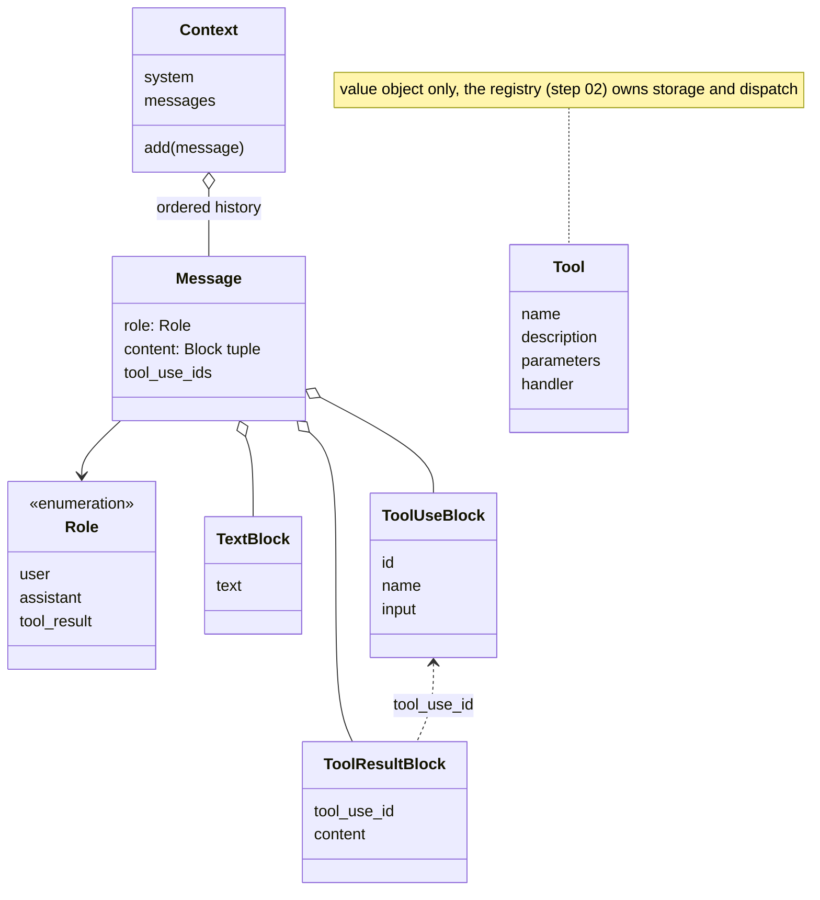

# 01 · Struct skeleton

The data every later component passes around: a `Message` (one conversation
entry), a `Tool` (a callable capability), and a `Context` (the live
conversation state). The data is plain, but a `Message` checks its invariants
at construction, so a conversation that could never form a valid request fails
here instead of as a provider error at request time. The example sources a real
system prompt through step 00's `Config`.

## New files

| File | What it adds |
|---|---|
| `boukensha/message.py` | `Role`, the typed content blocks (`TextBlock`, `ToolUseBlock`, `ToolResultBlock`), and `Message` with its construction-time invariants |
| `boukensha/tool.py` | `Tool`, a frozen value object: `name`, `description`, `parameters`, `handler` |
| `boukensha/context.py` | `Context`, the mutable holder of the system prompt and message history |

## Updated files

| File | Change vs step 00 |
|---|---|
| `boukensha/__init__.py` | exports the new types: `Message`, `Role`, the three blocks, `Tool`, `Context` |
| `examples/example.py` | builds the data model, prints the conversation, shows the invariants rejecting bad data |

`config.py`, `tasks/`, `pyproject.toml`, and `uv.lock` are carried forward from
step 00 unchanged.

## How it works



## Content blocks

Message content is always a tuple of typed blocks, never a bare string:

| Block | Fields | Represents |
|---|---|---|
| `TextBlock` | `text` | plain text |
| `ToolUseBlock` | `id`, `name`, `input` | the model requesting a tool call |
| `ToolResultBlock` | `tool_use_id`, `content` | a tool's output, linked to its call |

- One shape for every component that reads content.
- Each backend translates to its wire format at its own edge, nowhere else.
- Stored history is provider-neutral, so the backend can change between turns.
- Plain text normalizes to a single `TextBlock`, so `Message.user("look")`
  needs no hand-built block list.

## Message

A frozen entry: a `Role` (`user`, `assistant`, `tool_result`) and a tuple of
blocks. Four invariants are checked at construction, each rejecting data that
could never form a valid request:

| Invariant | Rule |
|---|---|
| tool results carry their linkage | a `tool_result` holds only `ToolResultBlock`s, each with a non-empty `tool_use_id` |
| results stay on their own role | no other role may carry a `ToolResultBlock` |
| calls come only from the model | a `ToolUseBlock` appears only in an `assistant` message |
| content holds only typed blocks | every element is a `TextBlock`, `ToolUseBlock`, or `ToolResultBlock` |

The call-to-result link lives in one place, `ToolResultBlock.tool_use_id`, and
is read back through `Message.tool_use_ids`. That accessor returns a tuple,
plural because one message answers several calls when the model issues them in
parallel.

Constructors: `Message.user(text)`, `Message.assistant(text_or_blocks)`,
`Message.tool_result(tool_use_id, content)`.

## Tool

A frozen value object. Registration and dispatch belong to the next step's
registry.

| Field | Purpose |
|---|---|
| `name` | the name the model calls it by |
| `description` | what the model reads to decide when to use it |
| `parameters` | parameter name to schema |
| `handler` | the callable that executes the tool |

## Context

The one mutable holder:

- A system prompt, set at construction.
- An ordered message history, appended through `add(message)`, which accepts
  only a `Message`.

Deliberately not here, each defined once in the component that owns it:

| Left out | Owner |
|---|---|
| a tool table | the registry (step 02) |
| token counts | context management (step 12) |
| a turn counter | whoever runs the conversation, derivable from the history |

Each of these lives with its owner rather than on `Context`, so state has one
home and `Context` stays the conversation and nothing else.

## Immutability

| Structure | Mutability |
|---|---|
| blocks, `Message` | frozen, content stored as a tuple |
| `Tool` | frozen |
| `Context` | mutable, only through its methods |

A conversation entry or a tool definition never changes after creation, and an
accidental in-place edit fails loudly.

## Sample output

The example resolves the player system prompt through step 00's `Config` (see
step 00 for the settings schema), builds one message of each shape, prints the
conversation, then shows each invariant rejecting bad data:

```
=== boukensha · step 01: struct skeleton ===

Config:   <boukensha.Config dir=/path/to/repo/.boukensha tasks=player>

-- conversation --
Context:  <Context turns=4>
Tool:     <Tool name=move description='Move the player in a direction.' params=['direction']>
Messages:
  <Message role=user content=[TextBlock('Explore north and tell me what you find.')]>  tool_use_ids=()
  <Message role=assistant content=[TextBlock('Heading north to look around.')]>  tool_use_ids=()
  <Message role=assistant content=[ToolUseBlock(move)]>  tool_use_ids=()
  <Message role=tool_result content=[ToolResultBlock(call_1)]>  tool_use_ids=('call_1',)

-- invariants (bad data rejected at construction) --
  ✓ invalid role                  rejected: role must be a Role, got 'user'
  ✓ tool_result without linkage   rejected: a tool_result message requires a non-empty tool_use_id
  ✓ tool result on another role   rejected: only a tool_result message may carry a ToolResultBlock, not role user
  ✓ tool call outside assistant   rejected: a ToolUseBlock may only appear in an assistant message, not role user
  ✓ untyped content element       rejected: content elements must be typed blocks, got str
  ✓ Context.add non-Message       rejected: Context.add expects a Message, got str

assertions passed (9) ✓
```

## Considerations

- Content is a tuple, not a list: frozen, so an accidental `append` fails
  loudly instead of mutating history that other code holds.
- `tool_use_ids` is plural on purpose. One `tool_result` message answers every
  call the model issued in parallel, so later compaction must move a call and
  its results as a set, never split them.
- Validation covers structure, not quality. An empty `TextBlock` or a nonsense
  tool name is allowed. Only conversations that can never form a valid request
  are rejected.
- A malformed tool pairing becomes a local `ValueError` naming the offending
  block, not a provider 400 discovered on the wire.
- Reaching for `ctx.tools` here is one step early. Tools live in the registry
  from step 02 on.

## Run

From `week1_baseline/`:

```bash
bin/01_struct_skeleton
```

or directly (this folder is a [`uv`](https://docs.astral.sh/uv/) project):

```bash
uv run examples/example.py
```
