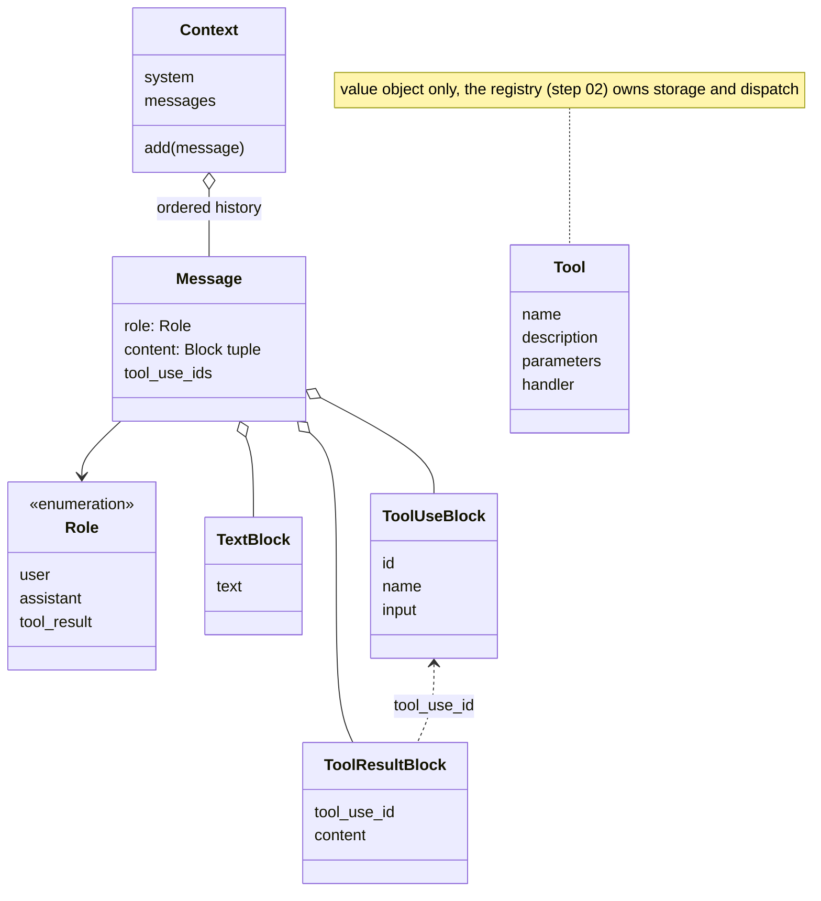

# 01 · Struct skeleton

The core data the agent is built on, carried forward from step 00:

- `Message`: one conversation entry, made of typed content blocks
- `Tool`: a callable capability
- `Context`: the live conversation state

Plain data, with the invariants that keep an invalid conversation out of a
request enforced at construction.



## Run

From `week1_baseline/`:

```bash
bin/01_struct_skeleton
```

The example builds a context, a tool, and one message of each shape, then
runs nine assertions:

```
=== boukensha · step 01: struct skeleton ===

Context:  <Context turns=4>
Tool:     <Tool name=move description='Move the player in a direction.' params=['direction']>
Messages:
  <Message role=user content=[TextBlock('Explore north and tell me what you find.')]>  tool_use_ids=()
  <Message role=assistant content=[TextBlock('Heading north to look around.')]>  tool_use_ids=()
  <Message role=assistant content=[ToolUseBlock(move)]>  tool_use_ids=()
  <Message role=tool_result content=[ToolResultBlock(call_1)]>  tool_use_ids=('call_1',)

  ✓ 1 invalid role rejected
  ...
assertions passed (9) ✓
```

## Content blocks

Message content is always a tuple of typed blocks, never a bare string:

- One shape for every component that reads content
- Each backend translates to its wire format at its own edge, nowhere else
- Stored history is provider-neutral, so the backend can change between turns
- Plain text normalizes to a single `TextBlock`: `Message.user("look")` needs
  no hand-built block list

| Block | Fields | Represents |
|---|---|---|
| `TextBlock` | `text` | plain text |
| `ToolUseBlock` | `id`, `name`, `input` | the model requesting a tool call |
| `ToolResultBlock` | `tool_use_id`, `content` | a tool's output, linked to its call |

## Message

A frozen entry: a `Role` (`user`, `assistant`, `tool_result`) and a tuple of
blocks.

Four invariants are checked at construction, each rejecting data that could
never form a valid request:

| Invariant | Rule |
|---|---|
| tool results carry their linkage | a `tool_result` holds only `ToolResultBlock`s, each with a non-empty `tool_use_id` |
| results stay on their own role | no other role may carry a `ToolResultBlock` |
| calls come only from the model | a `ToolUseBlock` appears only in an `assistant` message |
| content holds only typed blocks | every element is a `TextBlock`, `ToolUseBlock`, or `ToolResultBlock` |

The call-to-result link:

- Lives in one place, `ToolResultBlock.tool_use_id`
- Read back through `Message.tool_use_ids`, a tuple, plural because one
  message answers several calls when the model issues them in parallel

Constructors: `Message.user(text)`, `Message.assistant(text_or_blocks)`,
`Message.tool_result(tool_use_id, content)`.

## Tool

A frozen value object:

| Field | Purpose |
|---|---|
| `name` | the name the model calls it by |
| `description` | what the model reads to decide when to use it |
| `parameters` | parameter name to schema |
| `handler` | the callable that executes the tool |

Registration and dispatch belong to the next step's registry.

## Context

The one mutable holder:

- A system prompt, set at construction
- An ordered message history, appended through `add(message)`, which accepts
  only a `Message`

Deliberately not here, each defined once in the component that owns it:

- A tool table: belongs to the registry
- Token counts: added by context management
- A turn counter: a concept of whoever runs the conversation, derivable from
  the history

## Immutability

| Structure | Mutability |
|---|---|
| blocks, `Message` | frozen, content stored as a tuple |
| `Tool` | frozen |
| `Context` | mutable, only through its methods |

A conversation entry or a tool definition never changes after creation, and
an accidental in-place edit fails loudly.
