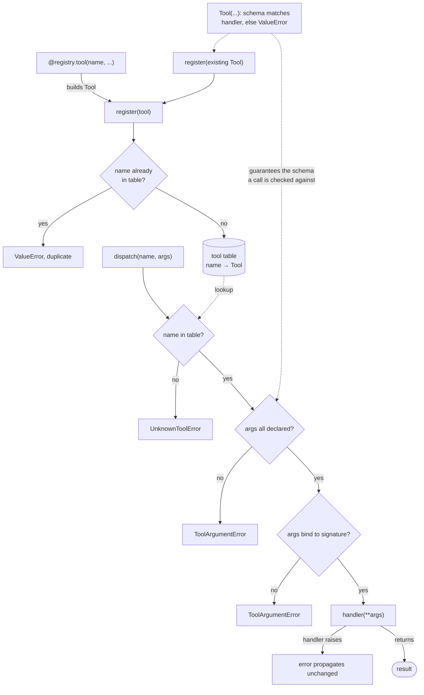

# 02 · The registry

The component that holds the agent's tools and dispatches a model's tool call
to the right handler. Carries step 01 forward and adds a shared `errors`
module.

## Run

From `week1_baseline/`:

```bash
bin/02_the_registry
```

The example registers tools, dispatches them, and runs nine assertions:

```
=== boukensha · step 02: the registry ===

Config:   <boukensha.Config dir=/path/to/repo/.boukensha tasks=player>
Registry: <Registry tools=['boom', 'move', 'shout']>
move -> You move north.
shout -> DRAGON SPOTTED

  ✓ 1 registered tool dispatches and returns its result
  ✓ 2 decorator registers and returns the function callable
  ✓ 3 unknown tool raises UnknownToolError
  ✓ 4 duplicate name is rejected at registration
  ✓ 5 undeclared argument raises ToolArgumentError
  ✓ 6 missing argument raises ToolArgumentError
  ✓ 7 Context exposes no tool table
  ✓ 8 handler's own TypeError propagates unrelabeled
  ✓ 9 schema that omits a required handler argument is rejected at build

assertions passed (9) ✓
```

## Ownership

The registry owns the tool table, a `name -> Tool` mapping. `Context` holds no
tools.

- One owner for the whole tool lifecycle: registration, lookup, dispatch.
- Nothing reaches through `Context` to find a tool.

The table at the center, registration writing into it and dispatch reading from
it:



Construction validates that a tool's schema matches its handler, so every tool
in the table can be called correctly, and the `args all declared?` guard checks
a call against a schema the model can actually satisfy.

## Tool coherence

A tool's declared `parameters` are the schema the model sees, so they must
match its handler. `Tool` checks this at construction, since the data is the
tool's own and the invariant holds whether or not the tool is registered.

- Every required handler argument must be declared in `parameters`.
- Every declared parameter must be accepted by the handler, unless it takes
  `**kwargs`.
- A mismatch raises `ValueError`, naming the tool and the arguments.

A schema that omits a required argument would hand the model a call it can
never make valid, so such a tool is rejected before it exists.

## Registration

Two ways in, both landing in the same table:

- `register(tool)`: add an already-built `Tool`.
- `@registry.tool(name, description, parameters)`: build the `Tool` from the
  decorated function and register it, returning the function unchanged.

A duplicate name is rejected at registration. Two tools under one name is
never-valid data, because dispatch could not choose between them.

## Dispatch

`dispatch(name, args)` resolves a call to a result, with a named error at each
failure the model can cause:

| Situation | Result |
|---|---|
| known tool, valid arguments | the handler runs, its return value is the result |
| unknown name | `UnknownToolError`, naming the tool |
| an undeclared argument | `ToolArgumentError`, naming the tool and the argument |
| a missing required argument | `ToolArgumentError`, naming the tool |
| a bug inside the handler's body | the handler's own error propagates unchanged |

Arguments are checked by name and then bound to the handler's signature with
`inspect.signature`. The handler runs only after binding succeeds, so a
`TypeError` from a real bug in its body is never relabeled as an argument
error. The name check and the bind give a tool-specific error at the dispatch
boundary, which the agent loop can hand back to the model for self-correction.

Schema-based type and required-ness checks are deliberately not here. The
parameter schema does not carry that information yet, so those wait for the
component that enriches it.

## Errors

`errors.py` holds the exception types more than one component raises:

| Error | Raised when |
|---|---|
| `ConfigError` | a configuration file is malformed |
| `UnknownToolError` | dispatch is asked for an unregistered tool |
| `ToolArgumentError` | a tool is called with arguments that do not match |

Each type is defined once, so no component reaches into another to raise a
shared error.
