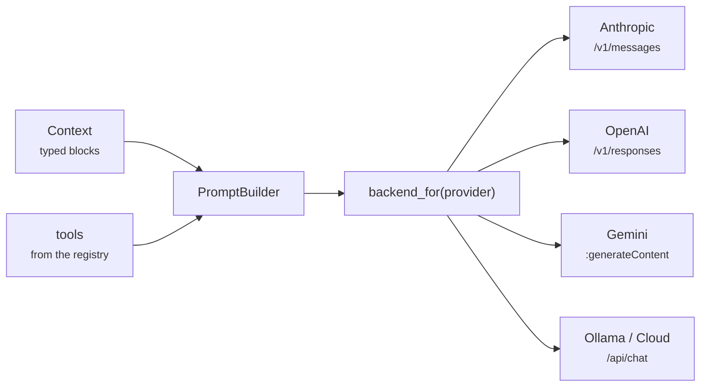

# 03 · Prompt builder

Turns a `Context` into the request each provider expects, behind one interface.
Five backends (Anthropic, OpenAI, Gemini, Ollama, Ollama Cloud) each confine one
provider's wire format to one file. The builder only serializes the request, it
does not send it: that is step 04. Carries step 02 forward.

## New files

| File | What it adds |
|---|---|
| `boukensha/prompt_builder.py` | `PromptBuilder`, binds a context, a backend, and a toolset into one request surface |
| `boukensha/backends/base.py` | `Backend`, the abstract surface (`build_request`/`headers`/`url`) plus model-metadata accessors |
| `boukensha/backends/anthropic.py` | Anthropic `/v1/messages` wire format |
| `boukensha/backends/openai.py` | OpenAI Responses API wire format |
| `boukensha/backends/gemini.py` | Gemini `generateContent` wire format |
| `boukensha/backends/ollama.py` | Ollama `/api/chat` wire format |
| `boukensha/backends/ollama_cloud.py` | `OllamaCloud`, subclasses `Ollama`, overriding only URL and auth |
| `boukensha/backends/__init__.py` | `backend_for(provider, model)`, the name to backend selector |
| `boukensha/models.py` | `ModelCatalog`, loads the model data and the thinking-level vocabulary |
| `boukensha/models.yaml` | bundled catalog: per model window, cost, usage unit, thinking capability |

## Updated files

| File | Change vs step 02 |
|---|---|
| `boukensha/message.py` | `ToolResultBlock` now carries `tool_name` beside the call id, both required at construction |
| `boukensha/tool.py` | adds `required_parameters`, the declared parameters whose handler argument has no default |
| `boukensha/tasks/base.py` | adds `Task.thinking(settings)`, reading and validating the per-task thinking level |
| `boukensha/config.py` | `resolve_dir` made public, adds `user_models_path` for the catalog override |
| `boukensha/__init__.py` | exports `PromptBuilder`, `Backend`, `backend_for`, `ModelCatalog`, `default_catalog` |
| `examples/example.py` | builds one conversation and serializes it for all five providers, contrasting the shapes |

`context.py`, `registry.py`, `errors.py`, `tasks/player.py`,
`tasks/prompts/system.md`, `pyproject.toml`, and `uv.lock` are carried forward
from step 02 unchanged.

## How it works



The conversation is stateless: every request carries the whole history from the
start, and the builder is what assembles it into the shape one provider reads.

## One interface

`Backend` is an abstract base with one uniform surface:

- `build_request(context, tools, max_output_tokens, thinking=None) -> dict`
- `headers() -> dict`
- `url() -> str`

`PromptBuilder(context, backend, tools)` binds the trio and delegates to it:

| Method | Delegates to |
|---|---|
| `build_request(max_output_tokens, thinking)` | the backend's `build_request`, with the bound context and tools |
| `headers()` | the backend's `headers` |
| `url()` | the backend's `url` |

The caller supplies the tools from the registry, so a request carries exactly
the toolset it was built with. `backend_for(provider, model)` selects the
backend and reads its API key from the environment variable the backend names.

## Backends

Each backend owns its endpoint and auth. `OllamaCloud` subclasses `Ollama`,
overriding only the URL and auth.

| Provider | Endpoint | API key |
|---|---|---|
| `anthropic` | `https://api.anthropic.com/v1/messages` | `ANTHROPIC_API_KEY`, `x-api-key` header |
| `openai` | `https://api.openai.com/v1/responses` | `OPENAI_API_KEY`, `Bearer` |
| `gemini` | `.../v1beta/models/{model}:generateContent` | `GEMINI_API_KEY`, `x-goog-api-key` header |
| `ollama` | `http://localhost:11434/api/chat` | none, `ollama serve` running locally |
| `ollama_cloud` | `https://ollama.com/api/chat` | `OLLAMA_API_KEY`, `Bearer` |

Set the named key for your task's provider in `.boukensha/.env` (copy it from
`.env.example`). Local Ollama needs none.

## Translation

Each backend maps the typed blocks to its wire format, the only place any
provider shape appears:

| Concern | Anthropic | OpenAI Responses | Gemini `generateContent` | Ollama / Cloud |
|---|---|---|---|---|
| system prompt | top-level `system` | top-level `instructions` | `systemInstruction` | `role: system` message |
| conversation | `messages` | `input` item array | `contents` | `messages` |
| assistant role | `assistant` | `assistant` | `model` | `assistant` |
| tool declaration | `input_schema` | flattened `function` item | `functionDeclarations` | nested `function` object |
| tool call carries | `input` object | `arguments` JSON string, `call_id` | `args` object, `id` | `arguments` object, no id |
| tool result | `tool_result` blocks in a user message, by `tool_use_id` | `function_call_output` item, by `call_id` | `functionResponse` part, name plus id echo | `role: tool` message, `tool_name` |
| several results in one message | one message, N blocks | one item per result | one message, N parts | one message per result |
| max output tokens | `max_tokens` | `max_output_tokens` | `generationConfig.maxOutputTokens` | `options.num_predict` |
| streaming | off | off | off | defaults on, `stream: false` always sent |
| auth | `x-api-key` + version header | `Bearer` | `x-goog-api-key` header | none / `Bearer` |

Two rules keep the tool linkage sound across formats:

- A `ToolResultBlock` carries the call id and the tool's name, both set when the
  result is created and both required. Gemini and Ollama key results by the name
  and read it directly from the block, and Gemini gets the id echoed as well.
- One `Message` may carry several tool results. Anthropic and Gemini keep them
  in one wire message. OpenAI and Ollama get one item or message per result.

## Tool schemas

Generated schemas mark as required only the handler arguments without a default,
read from the signature `Tool` already inspects at construction.
`Tool.required_parameters` exposes the list, so an optional parameter never
blocks a call the model could validly make.

## Model catalog

Model metadata is configurable data, in two layers:

- `boukensha/models.yaml` ships with the package: per provider and model, the
  context window, the USD cost per million input and output tokens, and the
  usage unit (`tokens`, `local_compute`, or `subscription`), each value taken
  from that model's own provider page. Subscription models carry null costs, so
  an unknown price reports as no estimate rather than as free.
- `models.yaml` in the `.boukensha` directory overrides or extends it per model,
  so a new model is a configuration edit, never a code change. The directory
  resolves exactly as `Config` resolves it: `BOUKENSHA_DIR`, else the nearest
  `.boukensha` walking up from the current directory, else `~/.boukensha`.

An override entry is keyed by provider then model. Only `context_window` and
`cost_per_million` are required. The rest tune thinking and are optional:

```yaml
anthropic:
  claude-next-5:
    context_window: 1000000
    cost_per_million: {input: 5.00, output: 25.00}
    usage_unit: tokens          # tokens | local_compute | subscription
    thinking: adaptive          # adaptive | budget | effort | level | level_string | flag
    thinking_default: off       # off | on | always_on
    thinking_levels: [low, medium, high, xhigh, max]
```

Backends expose the data as `context_window`, `usage_unit`, `usage_level`, and
`estimate_cost(input_tokens, output_tokens)`, `None` when the model has no
per-token price. For a local Ollama model the token cost is `0.0`. A model
missing from the catalog raises `ConfigError` at backend construction, naming
the model and pointing at the user catalog:

```
ConfigError: model 'claude-nonexistent' is not in the model catalog for
provider 'anthropic'. Known anthropic models: claude-fable-5, claude-haiku-4-5,
... . Add 'claude-nonexistent' to models.yaml in your .boukensha directory
(context_window, cost_per_million).
```

The catalog header lists the provider pages each value came from, verified
2026-07. Review the prices whenever the selected model set changes.

## Configuration

The player task owns its provider, model, prompt override, and thinking level,
read through `config.tasks("player")`:

```yaml
tasks:
  player:
    provider: anthropic        # selects the backend
    model: claude-haiku-4-5    # must be in the catalog for that provider
    prompt_override:
      system: true             # use prompts/system.md from .boukensha
    thinking: medium           # optional, none|minimal|low|medium|high|xhigh|max
```

`Player.provider`, `Player.model`, and `Player.thinking` resolve the backend and
its depth dial from these settings.

## Thinking

An optional per-task setting,
`tasks.<task>.thinking: none | minimal | low | medium | high | xhigh | max`,
read through `Task.thinking(settings)`. The value is a ceiling on thinking
depth, one dial that stays valid across model swaps. `none` is the floor and
turns thinking off where a model supports it. It differs from leaving the
setting unset: unset uses the model's own default, `none` asks for none.

- Unset sends nothing: no thinking and no sampling fields, each model's own
  default applies.
- Set, the level flows through `build_request(thinking=...)`. Each model's
  thinking form is a `thinking` field on its catalog entry, and the backend maps
  the mode to its provider's shape. A model without the field gets nothing sent.

| Catalog mode | Models | Sent when set |
|---|---|---|
| `adaptive` | Claude Fable 5, Opus 4.6+, Sonnet 4.6+ | `thinking: {type: adaptive}` + `output_config: {effort: <level>}`, `none` → `{type: disabled}` unless always-on |
| `budget` | Claude Haiku 4.5, Opus 4.5 and earlier | `thinking: {type: enabled, budget_tokens}`, budgets 1024/4096/16384, field omitted for `none` |
| `effort` | OpenAI models | `reasoning: {effort: <level>}` |
| `level` | Gemini 3 and 2.5 families | `thinkingConfig.thinkingLevel` |
| `level_string` | `gpt-oss` | `think: "<level>"` |
| `flag` | qwen3, deepseek | `think: true`, `false` for `none` |
| absent | gemma4 and others without documented support | nothing |

Each entry also lists `thinking_levels`, the values its documentation names, and
the requested level clamps onto that list:

- The model gets its highest supported level at or below the request, never
  above it, so `xhigh` on Haiku 4.5 sends the `high` budget.
- When every supported level sits above the request, the model's lowest is used,
  since a set level always means some thinking.
- Entries without a list pass the request through unchanged.

`none` means no thinking, expressed as each provider and model allows: an off
value (`effort: none`, `think: false`), an explicit `thinking: {type: disabled}`
on the Anthropic adaptive models that can be disabled (required for the
on-by-default Sonnet 5, where omitting would leave thinking on), an omitted
field on the opt-in budget models, or the model's minimum where off is
inexpressible (the always-on Fable 5 and the level models). The Anthropic case
is chosen from the model's catalog `thinking_default`.

Per-model clamping is what lets the dial expose the full range: any value is safe
on any model, so the setting need not be limited to the levels every provider
shares. Thinking capability sits in the catalog because it is per-model provider
data, like a context window: a model with different behavior is a configuration
edit.

## Sample output

The example builds one conversation (text turns, a parallel double tool call,
both results), prints the full request for the configured provider, then
contrasts the same tool result and the same thinking dial across all five
providers before the assertions:

```
=== boukensha · step 03: prompt builder ===

Config:   <boukensha.Config dir=/path/to/repo/.boukensha tasks=player>
anthropic     <Anthropic model=claude-haiku-4-5>  url=https://api.anthropic.com/v1/messages
openai        <OpenAI model=gpt-5.4>  url=https://api.openai.com/v1/responses
...

-- built request for the configured provider (anthropic) --
{
  "model": "claude-haiku-4-5",
  "max_tokens": 1024,
  "messages": [ ... typed blocks rendered to Anthropic's shape ... ],
  "system": "You are a MUD player agent.",
  "tools": [ ... ]
}

-- top-level request keys per provider --
  anthropic     ['model', 'max_tokens', 'messages', 'system', 'tools']
  openai        ['model', 'input', 'max_output_tokens', 'instructions', 'tools']
  gemini        ['contents', 'generationConfig', 'systemInstruction', 'tools']
  ollama        ['model', 'stream', 'messages', 'options', 'tools']
  ollama_cloud  ['model', 'stream', 'messages', 'options', 'tools']

-- the same tool result, one wire shape per provider --
  anthropic     user message, tool_result block by tool_use_id=call_1
  openai        function_call_output item by call_id=call_1
  gemini        user message, functionResponse part name=move id=call_1
  ollama        role:tool message, tool_name=move

-- thinking dial at 'medium', mapped per provider --
  anthropic (budget)    thinking={'type': 'enabled', 'budget_tokens': 4096}
  openai (effort)       reasoning={'effort': 'medium'}
  gemini (level)        thinkingConfig={'thinkingLevel': 'medium'}
  ollama (level_string) think='medium'
  fable-5 (adaptive)    thinking={'type': 'adaptive'} output_config={'effort': 'medium'}

  ✓ 1 anthropic: top-level system, tool_result in user message by tool_use_id
  ...
  ✓ 23 a level outside the dial vocabulary is rejected, naming the valid values

assertions passed (23) ✓
```

## Considerations

- The conversation is stateless. The model keeps no memory between turns, so
  every request includes the whole history from the start. Carrying that state
  is the builder's job, not the provider's.
- Tool results are user messages on Anthropic. The result came from the agent,
  not the human, but the Anthropic API models it as a `user` turn. OpenAI,
  Gemini, and Ollama each have a dedicated result message or part instead.
- The model only ever sees the tool schema. A tool's `description` and
  `parameters` are the whole basis it decides a call on, the handler never
  leaves the process. A vague description is a bug the model cannot route around.
- Examples build request bodies but never send them, so the demo and the
  assertions run offline with no API keys. Sending is step 04.

## Run

From `week1_baseline/`:

```bash
bin/03_prompt_builder
```

or directly (this folder is a [`uv`](https://docs.astral.sh/uv/) project):

```bash
uv run examples/example.py
```
