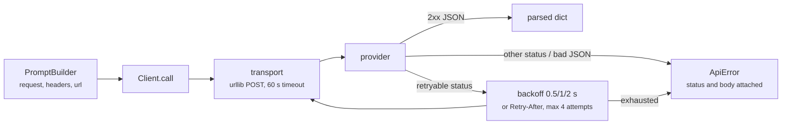

# 04 · API client

Sends the request the `PromptBuilder` assembles and returns the provider's
parsed JSON reply. One POST with retries for the failures providers document
as transient, no tool loop and no response normalization yet. Carries step 03
forward.

## New Files

| File | Description |
|---|---|
| `boukensha/client.py` | `Client`: POSTs the built request, retries transient failures, parses the JSON reply. Ships a stdlib `urllib` transport as the default. |

## Updated Files

| File | Change |
|---|---|
| `boukensha/errors.py` | Adds `ApiError` for a call that failed for good: exhausted retries or a hard status. |
| `boukensha/__init__.py` | Exports `Client`, `default_transport`, and `ApiError` at the package root. |
| `examples/example.py` | Reworked around a real round trip: the client posts the built request to the configured provider and prints the raw parsed reply. A short offline block then checks the retry schedule, the error paths, and the per-provider auth wiring over scripted transports. |

Everything else (`config.py`, `context.py`, `message.py`, `registry.py`,
`prompt_builder.py`, the five backends, the model catalog, the tasks) carries
forward from step 03 unchanged.

## How it works



## The client

`Client(builder, transport=None, sleep=None)` binds the `PromptBuilder` plus
two injection points:

- `transport`: a callable `(url, headers, body) ->
  (status, body_text, response_headers)`. The default POSTs with stdlib
  `urllib.request` on a 60 second timeout, so the HTTP call stays visible and
  the step adds no dependency. Response headers are in the contract so the
  retry loop can read `Retry-After`.
- `sleep`: the delay function between retries, `time.sleep` by default.

| Method | Behavior |
|---|---|
| `call(max_output_tokens=1024, thinking=None)` | Builds the request through the bound builder, POSTs it, returns the parsed JSON as a dict. `thinking` is the same optional dial the builder exposes, passed through. |

The client is provider-blind: URL, headers, and body all come from the
builder, so one client serves all five backends.

## Retry policy

| Rule | Behavior |
|---|---|
| retryable statuses | 408, 409, 429, 500, 502, 503, 504, 529 |
| transient exceptions | `OSError`, `http.client.HTTPException`, or `EOFError` from the transport |
| attempts | at most 4: the initial call plus 3 retries |
| backoff | 0.5 s, then 1.0 s, then 2.0 s |
| `Retry-After` | a numeric value on a retryable response replaces that wait, capped at 60 s |
| exhaustion | `ApiError` naming the attempt count and the last status and body, or the last exception |
| non-retryable status | `ApiError` immediately, no retry, status and body named |

- 529 is retried because Anthropic documents `overloaded_error` (529) as a
  retry-with-backoff condition, and `Retry-After` is honored because the
  provider SDKs document doing so.
- `OSError` covers connection, timeout, DNS, and SSL failures in one class.
  `http.client.HTTPException` (an `IncompleteRead`) and a bare `EOFError` both
  cover a connection that closes mid-response. Neither is an `OSError`, and
  both escape `urllib` unwrapped, so a cut connection retries instead of
  crashing.
- In the default transport an HTTP error status is a response, not an
  exception: `urllib.error.HTTPError` carries a real status and is returned
  as one, so a 401 is never blindly retried just because `HTTPError` is an
  `OSError`.

## Errors

- `ApiError` joins the family in `boukensha/errors.py`, exported at the
  package root.
- A non-2xx outcome always surfaces as `ApiError` with the status and body,
  never as `None` or a partial result.
- A 2xx body that is not valid JSON raises `ApiError` with a body preview, so
  a broken proxy or an HTML error page fails with the evidence attached.
- An unsupported model needs no client-side check: the catalog already raises
  `ConfigError` at backend construction, before a client exists.

## What comes back

`call` returns the provider's response parsed and otherwise untouched. The
raw shape differs per provider, and reading it is the agent loop's job in
step 05, not the client's.

```jsonc
// Anthropic /v1/messages
{ "id": "msg_01XY", "role": "assistant",
  "content": [{ "type": "text", "text": "..." }],
  "stop_reason": "end_turn",
  "usage": { "input_tokens": 42, "output_tokens": 18 } }

// Ollama /api/chat
{ "model": "gpt-oss:20b",
  "message": { "role": "assistant", "content": "..." },
  "done_reason": "stop", "done": true }
```

A tool call changes the shape again: Anthropic switches `stop_reason` to
`tool_use` and adds a `tool_use` block, Ollama adds a `tool_calls` array,
OpenAI Responses returns `output` items, Gemini returns `candidates`.
Normalizing those four shapes into one is step 05's work, where the first
reader of a response lives.

## Task configuration

The example resolves the player task from `.boukensha/settings.yaml`, the
task config the earlier steps introduced:

```yaml
tasks:
  player:
    provider: anthropic
    model: claude-haiku-4-5
    prompt_override:
      system: true
```

- `Player.provider(settings)` and `Player.model(settings)` pick the backend
  and model. `backend_for(provider, model)` reads that backend's API key from
  `.boukensha/.env` (copy it from `.env.example`). Local Ollama needs none.
- `prompt_override.system: true` reads the live system prompt from
  `.boukensha/prompts/player/system.md`. Without it the packaged
  `prompts/system.md` is the fallback.
- The client itself reads no settings. It posts whatever the builder built,
  so swapping the provider is a config edit, never a client change.

## Sample output

`bin/04_api_client` shows the built request, then runs the offline invariants.
The request is the endpoint, the auth headers (secrets redacted), and the JSON
body the builder assembled, printed with no network needed. With
`BOUKENSHA_LIVE=1` and the provider's key it posts that request and prints the
raw parsed reply. The exact reply varies with the model, and a tool-use reply
like the one below is what step 05 normalizes.

```
=== boukensha · step 04: api client (real round trip) ===

Config:            <boukensha.Config dir=.../.boukensha tasks=player>
Provider / model:  anthropic / claude-haiku-4-5

Built request:     POST https://api.anthropic.com/v1/messages
  headers:
    content-type: application/json
    x-api-key: ***redacted***
    anthropic-version: 2023-06-01
  body:
    {
      "model": "claude-haiku-4-5",
      "max_tokens": 1024,
      "messages": [ { "role": "user", "content": [ ... ] } ],
      "system": "You are a MUD player agent exploring a text world.",
      "tools": [ { "name": "look", "description": "...", "input_schema": {...} } ]
    }

Posting it. The client returns the provider's raw parsed reply:

{
  "id": "msg_011...",
  "role": "assistant",
  "content": [
    { "type": "tool_use", "id": "toolu_01...", "name": "look", "input": {} }
  ],
  "stop_reason": "tool_use",
  "usage": { "input_tokens": 569, "output_tokens": 35 }
}

-- offline invariants (no key, scripted transport) --
  PASS a 429 then a 200 returns the parsed reply on the second attempt, one 0.5 s sleep
  PASS a persistent 429 sleeps 0.5, 1.0, 2.0 over 4 attempts, then raises naming the status
  PASS a 401 raises on the first attempt with no sleep, status and body named
  PASS a numeric Retry-After replaces the wait and is capped at 60 s
  PASS a 2xx body that is not JSON raises ApiError with a body preview
  PASS a connection cut mid-response is transient: retried, then returns
  PASS five backends each POST to their endpoint with their auth form
```

Without `BOUKENSHA_LIVE=1` the real call is gated behind a one-line notice and
the offline block runs alone. Those invariants cover the client's real
substance, the retry and error behavior a single live call cannot show on
demand.

## Considerations

- TLS uses the stdlib default SSL context, which finds the system CA store.
  A missing or corporate-proxy certificate surfaces as an `SSLError`, an
  `OSError` the retry loop treats as transient, so it retries three times and
  then raises `ApiError`. The fix is the machine's certificates, not the
  client.
- Ollama's base URL is hardcoded to `http://localhost:11434`. A non-default
  host needs a code edit, which keeps this step simple.
- Retries assume the provider's documented statuses are safe to replay. The
  client trusts that guidance rather than tracking idempotency itself.

## Run

From `week1_baseline/`:

```bash
bin/04_api_client
```

The offline invariants always run, with no keys, sockets, or waiting, and are
the part under assertion. The real round trip is gated behind `BOUKENSHA_LIVE=1`
and needs the configured provider's key in `.boukensha/.env` (local Ollama needs
none):

```bash
BOUKENSHA_LIVE=1 bin/04_api_client
```
