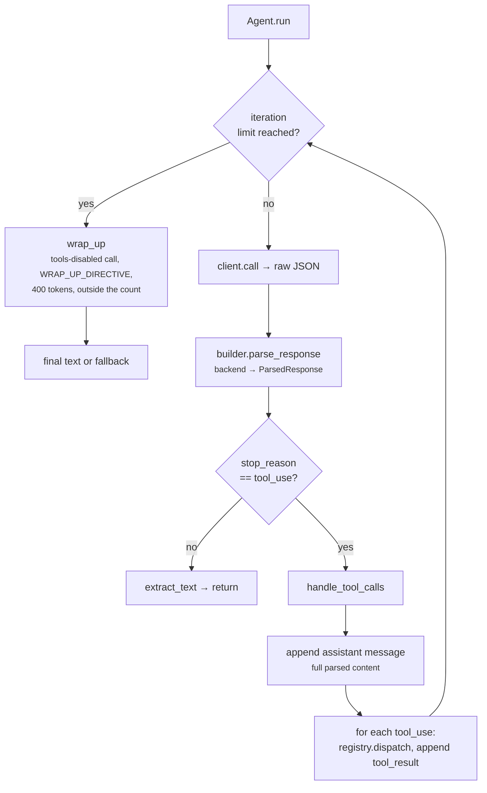

# 05 · Agent loop

The agent loop is where the agent does work. Everything before it was setup: the
typed blocks, the registry, the prompt builder, the client. `Agent.run` drives one
turn: call the model, normalize the reply, dispatch every tool the model asks for,
feed the results back, and repeat until the model ends the turn or the iteration
ceiling is reached. Response normalization lands here too, as each backend gains a
`parse_response`. Carries step 04 forward.

## New Files

| File | Description |
|---|---|
| `boukensha/agent.py` | The turn loop: model call, tool dispatch, stop detection, and a bounded wind-down at the ceiling |

## Updated Files

| File | Change vs step 04 |
|---|---|
| `boukensha/message.py` | Added `ParsedResponse`, the typed normalized reply shape (`stop_reason` + `content` of typed blocks) |
| `boukensha/prompt_builder.py` | Added `parse_response`, delegating to the backend |
| `boukensha/client.py` | Added `for_builder`, a rebound client sharing the original's transport and sleep |
| `boukensha/backends/base.py` | Declared `parse_response` on the backend interface every backend now implements |
| `boukensha/backends/anthropic.py` | Added `parse_response`. Lifts wire `max_tokens` to `budget + max_output_tokens` for budget thinking |
| `boukensha/backends/openai.py` | Added `parse_response` for the Responses `output` shape |
| `boukensha/backends/gemini.py` | Added `parse_response` for `functionCall` parts |
| `boukensha/backends/ollama.py` | Added `parse_response`, inherited by `OllamaCloud` |
| `boukensha/tasks/base.py` | Added `max_iterations` and `max_output_tokens` over the task settings |
| `boukensha/errors.py` | Added `LoopError` for the error family (unraised this step) |
| `boukensha/__init__.py` | Exported `Agent`, `LoopError`, `ParsedResponse` at the package root |
| `examples/example.py` | Reworked around a real run: the agent explores a small MUD world with `look` and `move` tools, driving the loop live against the configured provider. A short offline block then pins the tool_result wiring, the wind-down, and every provider's parse over a scripted transport. |

Note: the extra backends (`openai`, `gemini`, `ollama_cloud`), the tasks, and
`prompts/system.md` already exist from earlier steps, so they are not new here.
This table lists only what this step changes.

## How It Works



## The loop

`Agent(context, registry, builder, client, *, task=None, task_settings=None,
max_iterations=None, max_output_tokens=None, thinking=None)` binds the turn's
collaborators and resolves its limits and thinking level. `run()` returns the
final text. Everything but `run` and the three constants is private.

- Each work iteration calls the model, parses the reply, and either dispatches
  the requested tools or returns the text.
- `context`, `registry`, and `builder` are separate owners: the registry owns
  the tools, the builder holds the request-time view of them, the context holds
  the system prompt and message history. The agent holds the task and resolves
  the limits itself, so the context is not asked to carry it.
- On a tool-use reply the assistant message carrying the tool_use blocks is
  appended before any tool_result. The provider rejects the next request if a
  tool_result has no preceding tool_use, so the order is enforced, not incidental.

## The normalized shape

Five providers reply in five formats. Each backend converts its raw reply into
one shape so the loop never learns any provider's wire format.

- `ParsedResponse(stop_reason, content)` is a frozen dataclass in `message.py`.
- `stop_reason` is `"tool_use"` or `"end_turn"`. Any other provider value maps
  to `"end_turn"`.
- `content` holds the same `TextBlock` and `ToolUseBlock` instances the data
  model already uses, so the loop builds an assistant `Message` from `content`
  directly with no dict-to-block step.
- `PromptBuilder.parse_response(raw)` delegates to `backend.parse_response`. The
  client is unchanged: it still returns the raw parsed JSON.

Empty text yields no `TextBlock`. OpenAI `arguments` arrive as a JSON string and
are parsed to a dict for `ToolUseBlock.input`.

### parse_response per provider

| Provider | text source | tool call source | call id |
|---|---|---|---|
| Anthropic | `content[]` `type=="text"` | `content[]` `type=="tool_use"` (`id`, `name`, `input`) | block `id` |
| OpenAI | `output[]` message items, `output_text` parts | `output[]` `type=="function_call"` (`call_id`, `name`, `arguments` JSON string) | `call_id` |
| Gemini | `candidates[0].content.parts[].text` | same parts `.functionCall` (`name`, `args`) | name reused |
| Ollama / OllamaCloud | `message.content` | `message.tool_calls[].function` (`name`, `arguments`) | name reused |

- OpenAI parses the Responses API shape, matching the step-04 write path, not
  the Chat Completions shape.
- `OllamaCloud` inherits `parse_response` from `Ollama`: identical wire format,
  only auth and URL differ.
- Gemini, Ollama, and OllamaCloud assign no call id, so the tool name doubles as
  `ToolUseBlock.id`. The loop sets the `ToolResultBlock`'s `tool_use_id` and
  `tool_name` both to that name, which is how those providers match a result to
  its call. Two calls to the same tool in one reply would collide on the shared
  id: the provider's own matching constraint, carried, not introduced. Anthropic
  and OpenAI assign real ids and do not collide.

## Turn limits

The ceiling is a trigger threshold, not a hard cap.

- `MAX_ITERATIONS = 25` is the default. The enforced value is resolved in the
  constructor: an explicit `max_iterations` argument, then
  `task.max_iterations(settings)`, then the constant.
- A ceiling of `0` or `None` disables the limit.
- Each work iteration increments the counter and prints `[iteration N/max]`.
- On reaching the ceiling the loop does not raise. It makes exactly one
  tools-disabled wind-down call and returns its text.

### wrap_up

- Appends a user message, `WRAP_UP_DIRECTIVE` (stop calling tools, summarize what
  was done, what is unfinished, and the single next action).
- Issues one call with the toolset disabled and `WRAP_UP_OUTPUT_TOKENS = 400`.
- Runs outside the counted loop: it never rechecks the limit and never
  increments the counter, so it cannot re-trigger.
- Returns the model's text, or a deterministic fallback naming the limit and
  reason when the reply is empty or the call raises `ApiError`.

The tools-disabled call carries no `tools` override on `Client.call`. The agent
builds a wrap-up `PromptBuilder` with an empty toolset and issues the call through
`Client.for_builder(wrap_builder)`, a new client sharing the original's transport
and sleep. This keeps the step-04 `call` signature intact and stays
offline-testable, since the shared transport is the injected one.

## Task configuration

The example gets provider, model, and limits from the `tasks.player` block that
the earlier steps established:

```yaml
tasks:
  player:
    provider: anthropic
    model: claude-haiku-4-5
    prompt_override:
      system: true
    max_iterations: 25
    max_output_tokens: 1024
    thinking: high        # optional, unset means the model default applies
```

`Task` gains two class methods over its settings dict, both read by the agent
from the task it is handed, not from the context:

- `max_iterations(settings)`: `int`-coerced, default 25.
- `max_output_tokens(settings)`: `int`-coerced, default 1024.

A non-integer value raises `ConfigError` naming the key.

## Thinking

The agent is the only originator of `client.call`, which is the only path to each
backend's `build_request`, the sole consumer of the thinking dial. So the agent
resolves and passes the level, or the dial never takes effect.

- The constructor resolves `thinking` in the same order as the limits: an
  explicit `thinking` argument, then `task.thinking(settings)`, then `None`.
- `None` is unset: `_call_opts` omits the field, the backend sends nothing, and
  the model default applies.
- A set level rides on every work-iteration call, so `tasks.player.thinking:
  high` in settings is honored rather than silently dropped.

On a budget-thinking model (the default `claude-haiku-4-5`) Anthropic counts
thinking tokens toward `max_tokens` and rejects a request unless `budget_tokens <
max_tokens`.

- Every budget (1024/4096/16384) is at or above the default `max_output_tokens`
  of 1024, so sending the cap unchanged as `max_tokens` would 400 on every level.
- The Anthropic backend treats `max_output_tokens` as the response allowance and
  sets wire `max_tokens = budget_tokens + max_output_tokens`, so the budget fits
  and the response room is preserved on top of it.
- The lift lives in the backend, where the wire rule and the budget table are.
  The agent passes the level and the cap and does not know provider budget sizes.

## Errors

`LoopError` joins the family in `boukensha/errors.py`, exported at the package
root. The loop winds down rather than raising, so nothing raises it in this step.
It exists for a stable error family and is caught by the REPL added in a later
step.

## Deliberately not here

- Reasoning blocks: `parse_response` emits only text and tool_use here. A typed
  `ReasoningBlock`, its parsing, and its rendering arrive at step 12, where the
  reference introduces reasoning and the first consumers (the REPL and the log
  viewer) live. Front-loading it here would diverge from the reference for no
  consumer.
- A `tools=` override on `Client.call`: the wind-down rebinds the client to an
  empty-toolset builder instead, so the call surface stays closed.
- Live-call assertions: the real run is never asserted against. Its output
  depends on the model, so the offline block carries the deterministic,
  secret-free checks instead.
- Thinking on the wind-down: the wrap-up call omits the resolved level. It is a
  short, cheap summary bounded to 400 output tokens, and spending a thinking
  budget on it defeats that purpose. The model default applies there instead.

## Sample output

`bin/05_agent_loop` runs the offline invariants. With `BOUKENSHA_LIVE=1` and the
provider's key it first drives the real turn: the model calls `look`, moves
between rooms, recovers from a blocked exit, and reports a map. The trace below
is one such run, and the exact text varies with the model.

```
=== boukensha · step 05: agent loop (real run) ===

Config:            <boukensha.Config dir=.../.boukensha tasks=player>
Provider / model:  anthropic / claude-haiku-4-5
Max iterations:    25
Tools:             look, move
Start room:        clearing

Running the loop live. The model calls tools and iterates until done:

[iteration 1/25]
  tool call -> look({})
  tool result -> A sunlit forest clearing. A path leads north and a stream ru
[iteration 2/25]
  tool call -> move({'direction': 'north'})
  tool result -> A mossy grove ringed with standing stones. The path goes on
  tool call -> move({'direction': 'east'})
  tool result -> You cannot go east from here. Exits: north, south.
...

=== final response ===
Forest Clearing connects north to the Mossy Grove and east to the Shallow
Brook. The grove leads north to a dead-end Dark Cave. The brook is a dead end.

-- offline invariants (no key, scripted transport) --
  PASS a tool_use reply then end_turn dispatches the tool and returns the final text
  PASS after a tool call the history is user, assistant (tool_use), tool_result carrying the call's id and name
  PASS two tool_use blocks in one reply are both dispatched before the next call
  PASS reaching max_iterations winds down once with tools disabled and returns its text
  PASS an empty wind-down reply falls back to a message naming the limit
  PASS every backend normalizes its tool call into a ToolUseBlock named move
  PASS the constructor resolves the iteration limit explicit over task setting over default (25)
  PASS a task thinking level reaches the request body as a provider-valid block (budget < max_tokens); unset sends none
  PASS LoopError is exported from the package root and is an Exception
```

Without `BOUKENSHA_LIVE=1` the real run is gated behind a one-line notice and
the offline block runs alone. Those invariants cover the parts a single live run
cannot guarantee on its own: the tool_result wiring, the wind-down at the
ceiling, every provider's parse, the limit resolution, and the thinking level
reaching the wire body through a full run.

## Considerations

- The assistant message must be stored before the tool result. Anthropic (and the
  common shape here) requires the assistant's tool_use block to precede its
  tool_result in history. `handle_tool_calls` appends the assistant message first,
  every time. Get the order wrong and the next request is rejected.
- The model can call multiple tools in one reply. The loop dispatches every
  tool_use block in a response before making the next model call, not one per
  round trip.
- `MAX_ITERATIONS` is a turn ceiling, not a crash. A poorly prompted agent can
  loop while the model keeps calling tools. At 25 iterations the loop stops
  starting new work and makes one short tools-disabled wind-down call, so the turn
  stays bounded while still returning a useful final response.
- The agent has no way to stop itself. The model signals it is done via
  `stop_reason: "end_turn"`. The loop watches for that and exits. The agent never
  decides unilaterally to stop.

## Run

From `week1_baseline/`:

```bash
bin/05_agent_loop
```

The offline invariants always run, with no keys, sockets, or waiting, and are
the part under assertion. The real run is gated behind `BOUKENSHA_LIVE=1` and
needs the configured provider's key in `.boukensha/.env` (local Ollama needs
none):

```bash
BOUKENSHA_LIVE=1 bin/05_agent_loop
```
