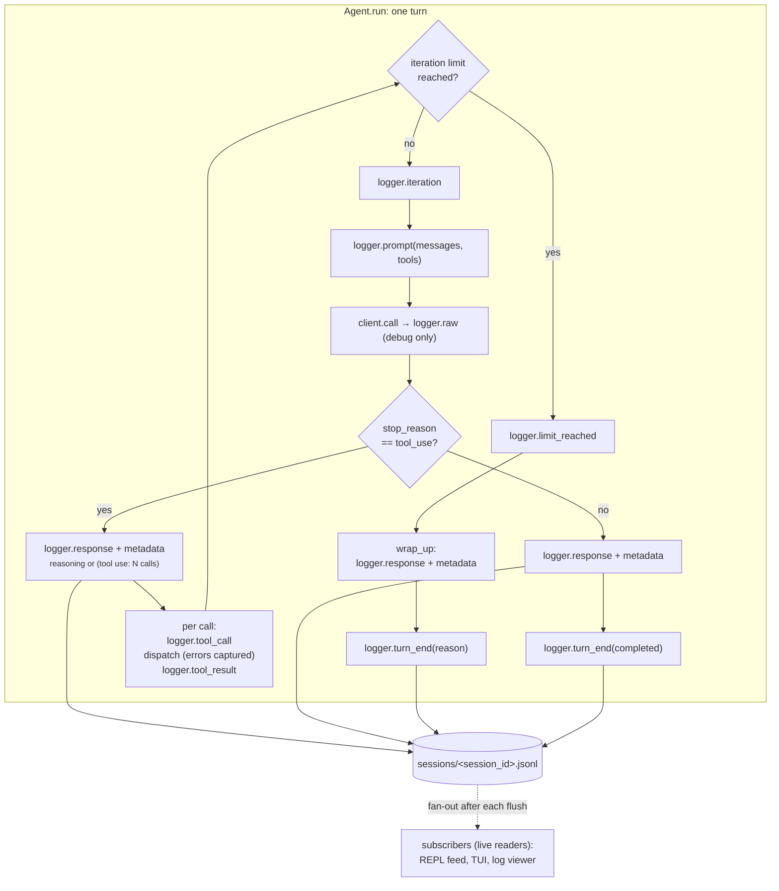
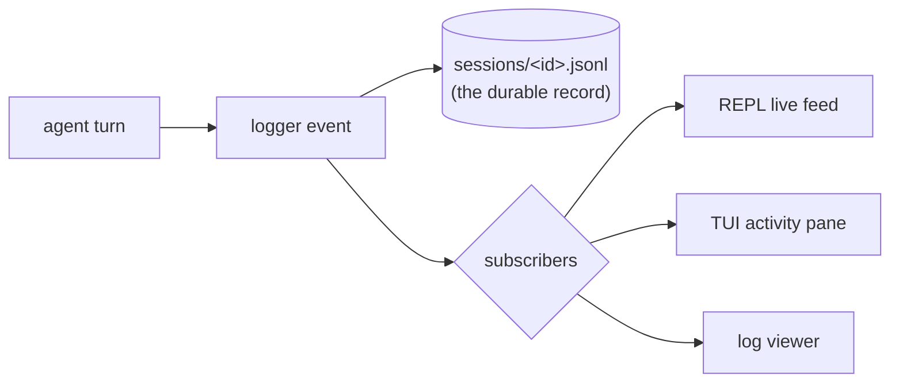

# 06 · The Logger

`Logger` records each agent run as structured JSON Lines, one complete JSON
object per line under `sessions/<session_id>.jsonl`. It is a file logger for
machine reading and `tail`/`grep`, not user-facing display. Step 05's bare
`print` calls become logger phase events, and the response event now carries
execution metadata: the active task, provider, model, normalized token counts,
and an estimated USD cost when the model has per-token pricing. Carries step 05
forward.

## New Files

| File | Description |
|---|---|
| `boukensha/logger.py` | `Logger`: opens one session file, writes a tagged JSON line per phase, attaches the response event's execution metadata, and gates raw provider dumps behind a debug flag. |

## Updated Files

| File | Change |
|---|---|
| `boukensha/agent.py` | Takes a `logger` (builds a default when none is passed), emits every phase event instead of printing, and wraps tool dispatch so a raising tool becomes an `ERROR:` result logged `ok=False` and the turn continues. Adds `_normalized_usage` to pick the raw usage object per provider. |
| `boukensha/__init__.py` | Exports `Logger` at the package root. |
| `examples/example.py` | Reworked around a real run: the agent explores a MUD world with a logger attached, then prints the session log it wrote, phase by phase, on real tokens and cost. A short offline block then checks the phase ordering, field serialization, tool-error capture, cost accounting, and default-directory safety over scripted transports. |

Everything else (`config.py`, `context.py`, `message.py`, `registry.py`,
`prompt_builder.py`, `client.py`, the five backends, the model catalog, the
tasks) carries forward from step 05 unchanged.

## How it works



## Headline design: one log, many live readers

The `Logger` is not only a file writer. `subscribe(callback)` registers a
callback that receives every event the moment it is written, so anything that
wants to watch the session live reads the same stream the file records, with no
polling and no second code path.



- Fan-out happens after the file write and flush, so a subscriber never delays
  or corrupts the durable record.
- Each callback is called inside its own guard, so one bad subscriber can never
  break logging or the agent turn.
- This one hook is what later steps build their live surfaces on: the REPL's
  activity feed and running cost, the TUI's activity pane, and the log viewer all
  subscribe rather than re-read the file. Defining it here, with the full phase
  vocabulary, is why the logger never forks across steps.

## The session file

- One file per `Logger`, one JSON object per line, appended and flushed as each
  event is written so a crash leaves a complete prefix.
- Path: `log` when given verbatim, else `<dir or default_dir>/<session_id>.jsonl`.
- Default directory: `Config.resolve_dir() / "sessions"`. The logger uses the
  pure path resolver, not a `Config` instance or a global, so it finds the same
  `.boukensha/` every other component does without owning config state.
- Every line carries `session_id`, `at`, and `phase`. `at` is a timezone-aware
  ISO 8601 timestamp in the local zone. The `session_start` line also carries
  `schema`, the log schema version, so a later reader can detect the vocabulary.
- A generated `session_id` is `<UTC YYYYMMDDTHHMMSSZ>-<8 hex chars>`: UTC-stamped
  and collision-resistant. An explicit `session_id` is used verbatim.
- Logging never crashes the agent turn. A serialization or write failure is
  recorded as a `log_error` line naming the original phase, not raised; an
  unknown block type is recorded as `{"type": "unknown", ...}` rather than
  raising. If even the `log_error` write fails, the event is counted and dropped.

Three lines from one session, session start through a final answer:

```json
{"phase":"session_start","schema":1,"host":"localhost","port":4000,"session_id":"20260528T143011Z-a1b2c3d4","at":"2026-05-28T10:30:11-04:00"}
{"phase":"iteration","n":1,"max":25,"session_id":"20260528T143011Z-a1b2c3d4","at":"2026-05-28T10:30:11-04:00"}
{"phase":"response","text":"You are in a forest clearing.","usage":{"input_tokens":1200,"output_tokens":80},"stop_reason":"end_turn","task":"player","provider":"anthropic","model":"claude-haiku-4-5","usage_unit":"tokens","input_tokens":1200,"output_tokens":80,"cost_usd":0.0016,"session_id":"20260528T143011Z-a1b2c3d4","at":"2026-05-28T10:30:11-04:00"}
```

## Phase events

One method per phase, each writing one line.

| Method | Phase | Fields beyond session_id/at/phase |
|---|---|---|
| `iteration(n, max)` | `iteration` | `n`, `max` |
| `limit_reached(kind, n, max)` | `limit_reached` | `kind`, `n`, `max` |
| `turn_end(reason, iterations, tokens=None, ...)` | `turn_end` | `reason`, `iterations`, `tokens`, and the turn's summed `input_tokens`/`output_tokens`/`cost_usd`/`duration_ms` when the agent computed them |
| `prompt(messages, tools)` | `prompt` | `message_count`, `messages`, `tool_count`, `tools` |
| `tool_call(name, args, id=None)` | `tool_call` | `name`, `args`, `id` when known |
| `tool_result(name, result, ok=True, error=None, tool_use_id=None)` | `tool_result` | `name`, `result` (stringified), `ok`, `error`, `tool_use_id` when known |
| `response(text, usage, stop_reason, task, backend, duration_ms=None)` | `response` | `text` (stripped), `usage`, `stop_reason`, `duration_ms`, metadata block |
| `retry(attempt, wait, status=None, error=None)` | `retry` | `attempt`, `wait`, and one of `status` or `error` |
| `raw(data)` | `raw` | `data`, written only in debug mode |

- The constructor writes a `session_start` line, carrying `schema` (the log
  schema version) merged with any `snapshot` dict passed to it.
- The agent passes each tool-use block's `id` to `tool_call` and `tool_result`,
  so a call pairs to its result even when one tool is called twice in an
  iteration.
- `response` carries `duration_ms` (the model call's wall-clock), and `turn_end`
  carries the turn's summed tokens, cost, and duration, so a reader has per-call
  and per-turn timing and totals without re-summing the stream.
- `retry` records each transient-failure retry the client makes before it sleeps,
  so provider flakiness (a 429, a dropped connection) is visible in the log.
- `PHASES` is the tuple of every phase name the logger emits, so a consumer (the
  log viewer) validates or routes events without hard-coding the vocabulary.
- `close()` closes the file handle and is idempotent under `with Logger(...)`.
- The `Logger` also defines `turn`, `compaction`, `reasoning`, and `plan`, its
  full recording vocabulary. Their first callers arrive in later steps (the REPL,
  context management), so they are documented there.

## Message and tool serialization

`prompt` logs the tool names from the registry (the owner), reached through the
agent. Step 05 keeps Context to the system prompt and message history, so the
tool view comes from the registry, not from Context.

`serialize_message` emits `{role, content}` where `role` is the role's string
value and `content` is a list of explicit block dicts:

- `TextBlock` → `{"type": "text", "text"}`
- `ToolUseBlock` → `{"type": "tool_use", "id", "name", "input"}`
- `ToolResultBlock` → `{"type": "tool_result", "tool_use_id", "tool_name", "content"}`

Our content is typed frozen blocks, so the logger serializes them to these
dicts, which is the JSONL form the model's blocks take anyway.

## Execution metadata on the response event

`response` fires once per model round-trip, not only on the final text
iteration. On a tool-use iteration the agent emits `response` before the
`tool_call`/`tool_result` events, carrying the reasoning text, or the synthetic
`(tool use — N calls)` placeholder when reasoning is empty, plus the metadata
block below. The final text iteration and `wrap_up` emit it the same way. Every
model call records its provider, model, token counts, and cost, not just the
last answer.

| Field | Source | Notes |
|---|---|---|
| `task` | `task.task_name` else `str(task)` | `player` for the player task |
| `provider` | `backend.provider_name` | the backend's declared name |
| `model` | `backend.model` | |
| `usage_unit` | `backend.usage_unit` | `tokens`, `local_compute`, or `subscription` |
| `usage_level` | `backend.usage_level` | subscription burn tier, often null |
| `context_window` | `backend.context_window` | the model's window, so a reader gets percent-of-context used without re-resolving the catalog |
| `input_tokens` | `usage_tokens(usage)` | first present across provider keys |
| `output_tokens` | `usage_tokens(usage)` | first present across provider keys |
| `cost_usd` | `backend.estimate_cost(...)` | null when the model has no per-token price |

- Null fields are dropped, so an unknown cost is absent rather than reported as
  zero, and `usage_level` vanishes when the catalog states none.
- When task, backend, and usage are all absent the block is empty.
- `provider`, `usage_unit`, `usage_level`, and `cost_usd` read the backend's
  accessors directly. The `Backend` base always defines them (defaults `tokens`
  / null / price-or-null) and the model catalog is their single source, so no
  capability guards are needed.

## Normalized token counts

`usage_tokens` reads the first present integer across each provider's field
names, so one metadata shape covers every backend.

| Direction | Keys tried in order |
|---|---|
| input | `input_tokens`, `prompt_tokens`, `promptTokenCount`, `prompt_eval_count` |
| output | `output_tokens`, `completion_tokens`, `candidatesTokenCount`, `eval_count` |

- The first key with a non-null value decides the result. `first_integer`
  coerces with `int(...)` and yields null on a missing or non-integer value
  rather than raising or falling through to a later key.
- `estimate_cost` runs only when both token counts are present. A priced model
  (Anthropic `claude-haiku-4-5`, 1.00/5.00 USD per million) at 1000 input and
  100 output tokens costs `(1000*1 + 100*5)/1e6 = 0.0015`. A null-price model
  (Ollama Cloud, subscription billing) omits `cost_usd`.
- On the agent side `normalized_usage` selects the raw usage object: `usage`
  (Anthropic, OpenAI Responses), else `usageMetadata` (Gemini), else the two
  top-level Ollama counts, else null.

## Debug gates raw

`raw` records the full provider response only when the logger is in debug mode.
Debug is a per-`Logger` constructor flag, not a global toggle: the logger is the
single owner of whether it records raw events, and a per-instance flag avoids
global mutable module state.

## Tool-dispatch error capture

The agent wraps `registry.dispatch` so a raising tool no longer aborts the turn.
This is a behavior change introduced at this step.

- The result becomes `ERROR: <ExceptionType>: <message>`.
- That string is fed back to the model as the tool result, so the turn
  continues.
- The `tool_result` event is logged with `ok=False` and the error message.

## Configuration

The logger reads no task settings. Its only config touch is the default session
directory, resolved from the same walk-up every component uses:

```
sessions dir = Config.resolve_dir() / "sessions"
```

`Config.resolve_dir()` honours `BOUKENSHA_DIR` when set, else walks up from the
step to the repo's `.boukensha/`. Pass `dir=` or `log=` to override, and
`debug=True` to record `raw` lines. The example never relies on the default so
it never writes into the repo's `.boukensha/sessions/`. The task-provider yaml
that picks the model is documented in step 00's config README.

## Sample output

`bin/06_the_logger` runs the offline invariants. With `BOUKENSHA_LIVE=1` and the
provider's key it first records a real turn and prints the session log it wrote,
phase by phase, so the ordered record shows on real tokens and cost. The trace
below is trimmed from one such run, and the exact text varies with the model.

```
=== boukensha · step 06: the logger (real run) ===

Config:            <boukensha.Config dir=.../.boukensha tasks=player>
Provider / model:  anthropic / claude-haiku-4-5
Tools:             look, move

Recording the turn to /tmp/boukensha-step06-live-.../20260724T065832Z-318529d6.jsonl

=== final response ===
Forest Clearing connects north to the Mossy Grove and east to the Brook. The
grove leads north to a dead-end Dark Cave. The brook is a dead end.

the session log it wrote, phase by phase (20260724T065832Z-318529d6.jsonl):
  session_start host=localhost port=4000
  iteration n=1/25
  prompt 1 msgs, tools=['look', 'move']
  response "I'll start by looking around."  |  player/anthropic/claude-haiku-4-5  654+52 tok  $0.000914
  tool_call look({})
  tool_result ok look -> A sunlit forest clearing. A path leads north and a s
  iteration n=2/25
  prompt 3 msgs, tools=['look', 'move']
  response "..."  |  player/anthropic/claude-haiku-4-5  740+76 tok  $0.00112
  tool_call move({'direction': 'north'})
  tool_result ok move -> A mossy grove ringed with standing stones. The path
  ...
  turn_end completed after 5 iter

-- offline invariants (no key, scripted transport) --
  PASS dir composes <dir>/<session_id>.jsonl; session_start carries the snapshot; every line is JSON with session_id and an ISO at
  PASS an explicit log= path is used verbatim, overriding dir composition
  PASS iteration, limit_reached, and turn_end write their phase and fields
  PASS prompt writes message_count, tool_count, tool names, and messages serialized to block dicts
  PASS tool_call logs name and args; tool_result logs the result with ok=True; a raising tool yields ok=False, the error, and an ERROR: result
  PASS response writes stripped text, usage, a metadata block, and cost for a priced model; a null-price model omits cost and marks subscription
  PASS usage tokens are picked across each provider's key names; missing or non-integer counts drop to None
  PASS raw writes nothing when debug is off and one raw line with its data when debug is on
  PASS a full run writes the ordered phases, response before tool_call/tool_result, ending completed
  PASS a wind-down writes limit_reached (with its kind), then the wrap_up response, then turn_end(max_iterations)
  PASS the default directory resolves to Config's dir/sessions, never the repo
```

## Considerations

- A default `Logger` opens a session file the moment it is constructed. The
  agent builds one only when no `logger` is passed, so a loop that spins up many
  agents should inject a shared or temp logger rather than let each open its own
  file. The default is built in the constructor, not as a def-time argument, to
  dodge Python's mutable-default trap.
- The response event fires on tool-use turns too, so a session with several tool
  rounds holds several `response` lines. Read the one before `turn_end` for the
  final answer, not the first `response` you find.
- Cost is present only when the model has a per-token price and both token
  counts parsed. Absence means unpriced or unknown, never zero. Subscription and
  local models log `usage_unit` but no `cost_usd`.
- `result` on `tool_result` is stringified. A tool returning a dict or list is
  logged as its `str(...)`, not as nested JSON.
- Defined here, consumed later: `turn`, `compaction`, `reasoning`, and `plan`
  have no caller until the REPL and context steps, and `subscribe` (see the
  headline section) is first read by the REPL's live feed. The recorder's
  vocabulary is defined once, so the file never forks across steps.
- The typed `reasoning` block in `parse_response` and its rendering arrive at
  step 12, where the reference introduces reasoning; until then the model's
  reasoning text is folded into the response text.
- Improvement over the reference: `debug` (and, in later steps, `quiet`/`loud`)
  is per-instance state on the `Logger`/`Repl`, not a global module toggle. The
  reference flips module-level globals. Per-instance state is testable in
  isolation and cannot cross-contaminate two sessions in one process, which
  globals can.

## Run

From `week1_baseline/`:

```bash
bin/06_the_logger
```

The offline invariants always run with no keys or sockets: loggers write to a
temp directory or an explicit `log=` path, and agent runs replay provider-shaped
JSON through a scripted transport. The real run is gated behind `BOUKENSHA_LIVE=1`
and needs the configured provider's key in `.boukensha/.env` (local Ollama needs
none). It logs to a temp directory too, so no run writes into the repo's
`.boukensha/sessions/`:

```bash
BOUKENSHA_LIVE=1 bin/06_the_logger
```
