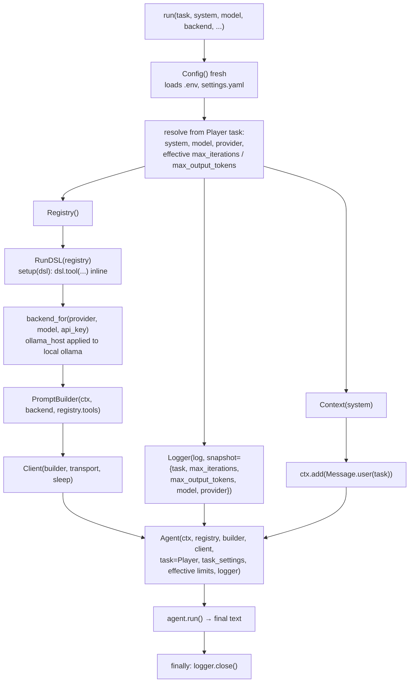

# 07 · The Run DSL

`run` is one top-level entry point that hides every primitive. Given a task and
an optional `setup` callable, it resolves configuration, builds the whole chain
(Context, Registry, backend, PromptBuilder, Client, Logger, Agent), seeds the
task as the first user message, runs one turn, and returns the final text. Every
prior step made the caller assemble that chain by hand; this reduces it to
describing what to do. Carries step 06 forward.

## New Files

| File | Description |
|---|---|
| `boukensha/run_dsl.py` | `run(task, *, setup=None, ...)` wires and runs one turn; `RunDSL(registry)` is the narrow host passed to `setup`, exposing only `tool` for inline registration. |

## Updated Files

| File | Change |
|---|---|
| `boukensha/__init__.py` | Exports `run` and `RunDSL` at the package root. |
| `examples/example.py` | Reworked around a real run: one `run()` call with MUD tools explores live and returns a map, gated behind `BOUKENSHA_LIVE=1`. A short offline block then drives `run` over a scripted transport to check the wiring, config resolution, overrides, inline tools, and the error path. |

Everything else (`config.py`, `context.py`, `message.py`, `registry.py`,
`prompt_builder.py`, `client.py`, `agent.py`, `logger.py`, the five backends,
the model catalog, the tasks) carries forward from step 06 unchanged.

## How it works



## Headline design: a polymorphic configure_host hook

`ollama_host` is a local-Ollama concern, but only the `Ollama` backend cares
about it. Rather than branch on the provider name, `run` hands the host to every
backend through one method and lets each decide:

- `Backend.configure_host(host)` is a no-op on the base class.
- `Ollama.configure_host` sets its `BASE_URL`, so `url()` targets `<host>/api/chat`.
- `OllamaCloud.configure_host` ignores it, keeping its fixed hosted URL.

So `run` calls `be.configure_host(ollama_host)` unconditionally, with no
`if provider == "ollama"` branch and no reaching from the DSL into a backend's
internals. This beats both our earlier code and the reference, which each carried
that string branch plus a cross-package `BASE_URL` write. Adding a backend that
needs host configuration is a one-method override, not an edit to `run`.

## Before and after

Step 06 wired the chain by hand every time:

```python
ctx = Context(system=Player.system_prompt(task_settings, ...))
registry = Registry()
backend = backend_for("anthropic", "claude-haiku-4-5")
builder = PromptBuilder(ctx, backend, tuple(registry.tools.values()))
client = Client(builder)
logger = Logger(snapshot={...})
agent = Agent(ctx, registry, builder, client, task=Player, logger=logger)
registry.tool("move", "Move the player", {"direction": {"type": "string"}})(handler)
ctx.add(Message.user("Scout the area."))
text = agent.run()
```

Step 07 is one call describing what to do:

```python
def setup(dsl):
    @dsl.tool("move", description="Move the player",
              parameters={"direction": {"type": "string"}})
    def move(direction):
        return f"You move {direction}."

text = run(task="Scout the area.", setup=setup)
```

## The entry point

`run(task, *, system=None, model=None, backend=None, api_key=None,
ollama_host="http://localhost:11434", log=None, max_iterations=None,
max_output_tokens=None, thinking=None, setup=None, transport=None, sleep=None)`.
Returns the agent's final text.

- `task` is the only required argument, the user message handed to the agent.
- Each override applies only when its argument `is None`, so an explicit empty
  `system` is honored rather than replaced. `or` would swallow a deliberate
  empty value.

| Option | Default source |
|---|---|
| `system` | `Player.system_prompt(task_settings, override_path=cfg.user_prompt_path("player"))` |
| `model` | `Player.model(task_settings)` |
| `backend` | `Player.provider(task_settings)` (a provider-name string) |
| `api_key` | filled by `backend_for` from the backend's `api_key_env` |
| `max_iterations` | argument if given, else `Player.max_iterations(task_settings)` |
| `max_output_tokens` | argument if given, else `Player.max_output_tokens(task_settings)` |
| `thinking` | argument if given, else the task's level, resolved in the Agent, symmetric with the two caps |
| `log` | `Config.resolve_dir()/sessions/<session-id>.jsonl` |
| `ollama_host` | `http://localhost:11434`, applied to the local `ollama` backend only |
| `transport`, `sleep` | live `default_transport` and `time.sleep` (offline seam) |

## RunDSL: one method

`RunDSL(registry)` stores the registry privately and exposes exactly one public
method, `tool(name, *, description, parameters=None)`, delegating to
`Registry.tool`, the decorator this codebase already uses for inline
registration.

- The registry is the tool owner (established architecture); `RunDSL` is a
  narrowing view over it, not a second owner.
- Its only public (non-underscore) attribute is `tool`, so a caller cannot reach
  the registry, context, or backend through the DSL.
- Ruby's `instance_eval(&block)` swaps `self` to the DSL inside the block. Python
  has none, so `run` passes the `RunDSL` to `setup(dsl)` explicitly. The host is
  visible rather than swapped in behind the caller's back. `setup=None` runs a
  turn with no ad-hoc tools.

## Wiring order and ownership

The established ownership rules reshape the reference's assembly.

- `Context(system)` holds the system prompt and history only. The task class is
  not stored on it; it goes to the `Agent` as `task=Player`, so the response
  event still reports `task=player`.
- `Registry()` takes no context (tools are owned by the registry, never by
  context). `setup` runs against the registry through `RunDSL` before the builder
  is built.
- `PromptBuilder(ctx, backend, tuple(registry.tools.values()))` captures the
  toolset at construction, so `setup` must register every tool first. The `Agent`
  still receives the registry for dispatch.
- `run` reads a fresh `Config()` per call, not a memoized module global, so a
  varied `BOUKENSHA_DIR` is never served a stale `.env`/`settings.yaml`. Config is
  read once at assembly and passed down (the REPL does not re-read per turn), so
  the reference's memoization solves a repeated-read problem this design does not
  have; fresh reads give correctness under a varying `BOUKENSHA_DIR` at negligible
  cost. A settled choice.

## Backend selection and keys

`run` calls `backend_for(provider, model, api_key=api_key)`.

- The factory owns provider-to-backend selection and fills a missing key from the
  backend's named environment variable, so `run` has no inline `ENV[...]` block.
- An unknown provider raises `ValueError` naming the provider, from the factory.
- Building a backend never requires a key, so an absent key does not block the
  offline path. A real request would fail at call time, not construction.
- `ollama_host` applies to the local `ollama` backend only. `run` calls
  `backend.configure_host(ollama_host)` on every backend (see the headline
  section below): `Ollama` sets its `BASE_URL`, which `Ollama.url()` reads as
  `<host>/api/chat`, while every other backend ignores it. This honors the option
  without changing the step-03 backend constructor or the factory.

## Effective limits, the snapshot, and lifecycle

`run` computes the effective `max_iterations` and `max_output_tokens` once,
passes them to the `Agent`, and writes them into the `Logger` snapshot, so the
session-start line records the same limits the loop enforced.

- Snapshot keys: `{task, max_iterations, max_output_tokens, model, provider}`.
- Thinking is not a `run` option (the reference exposes none). It flows from
  `task_settings`, which `run` passes to the `Agent`, which resolves the level.
- `run` closes the logger in a `finally`, guarded by `if logger is not None` so a
  failure before the logger exists does not raise a second error.

## Offline verification seam

`run` builds the `Client` internally, so with no seam its only path is a live
call needing a network and a key, which the offline-assertion standard forbids in
the assertion path.

- `run` accepts optional `transport` and `sleep`, defaulting to `None` (the live
  `default_transport` and `time.sleep`), passed straight to the `Client`.
- The example injects a `StubTransport` scripted with provider-shaped JSON, so
  the full end-to-end wiring is asserted with no network and no key. Same pattern
  steps 04–06 use on the `Client`. The default path is unchanged for real use.

## Configuration

`run` reads the same `.boukensha/settings.yaml` every component walks up to. The
`tasks.player` block picks the provider and model used when `model`/`backend` are
unset:

```yaml
tasks:
  player:
    provider: anthropic
    model: claude-haiku-4-5
    prompt_override:
      system: true
```

- `provider` and `model` become the defaults for `backend` and `model`.
- `prompt_override.system: true` lets a `player/system.md` under the config
  directory override the bundled task prompt; `run` passes that override path.
- `max_iterations` and `max_output_tokens` come from the task defaults when the
  yaml sets none. The provider yaml and its resolution are documented in step
  00's config README.

## Sample output

`bin/07_the_run_dsl` runs the offline invariants. With `BOUKENSHA_LIVE=1` and the
provider's key it first drives a real turn: one `run()` call registers `look`/
`move`, explores, and returns a map. The trace below is trimmed from one such run.

```
=== boukensha · step 07: the run DSL (real run) ===

Config:            <boukensha.Config dir=.../.boukensha tasks=player>
Provider / model:  anthropic / claude-haiku-4-5

One run() call wires the whole chain and drives the turn live:

=== final response ===
Forest Clearing connects north to the Mossy Grove and east to the Brook. The
grove leads north to a dead-end Dark Cave. The brook is a dead end.

The turn was logged under .boukensha/sessions/.

-- offline invariants (no key, scripted transport) --
  PASS one run() call returns the final text and writes the ordered turn phases
  PASS unset system/model/backend/limits resolve from settings.yaml and task defaults
  PASS inline tools registered through RunDSL become the registry tools on the prompt
  PASS the RunDSL exposes only a callable tool, nothing else public
  PASS explicit model, backend, max_iterations, and max_output_tokens override the snapshot
  PASS the seeded task is the first user message on the prompt line
  PASS an unknown backend raises, naming the provider
  PASS setup=None runs a turn with zero tools
```

## Considerations

- `run` executes exactly one turn per call and returns the final text. It keeps
  no `Context` between calls, so there is no cross-turn history. Multi-turn
  conversation arrives with the REPL step, which consumes a persistent `Context`.
- `setup` must register every tool before `run` builds the `PromptBuilder`, which
  captures the toolset once. Registering a tool after `run` returns has no effect
  on that call.
- `max_iterations` and `max_output_tokens` both resolve explicit arg, then task
  setting, then the `Task` default, so a caller can cap either at the call site
  for a smoke test or cost control without editing `settings.yaml`.
- A default logger writes under `Config.resolve_dir()/sessions`. The offline
  invariants pass an explicit `log=` temp path to keep out of the repo's
  `.boukensha/sessions/`; the real run logs there deliberately.
- A fresh `Config()` per call replaces the reference's memoized `Boukensha.config`
  (a settled choice: config is read once at assembly, so there is no repeated read
  to memoize, and fresh is correct under a varying `BOUKENSHA_DIR`).
- Improvement over the reference: `quiet`/`loud`/`debug` are per-instance state
  (a per-`Logger`/`Repl` flag), not global module toggles. Per-instance state is
  testable in isolation and cannot cross-contaminate sessions in one process.
- A context-window `token_budget` option arrives with context management at step
  12, where the reference introduces it.

## Run

From `week1_baseline/`:

```bash
bin/07_the_run_dsl
```

The offline invariants always run with no keys or sockets: `run` builds the
Client internally, so each scenario injects a scripted `StubTransport` and a temp
`log=`. The real run is gated behind `BOUKENSHA_LIVE=1` and needs the provider's
key in `.boukensha/.env`:

```bash
BOUKENSHA_LIVE=1 bin/07_the_run_dsl
```
