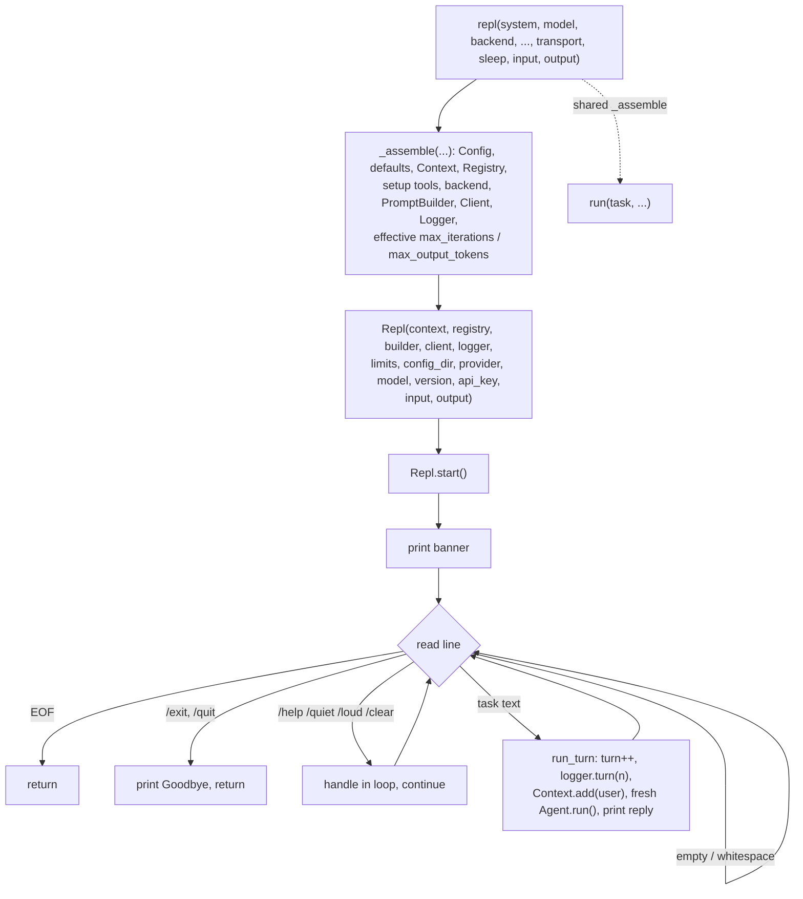

# 08 · The REPL Loop

An interactive session that stays alive across turns. `repl(...)` wires the same
primitives as `run`, then hands them to a `Repl` that prints a banner, reads a
task, runs a fresh `Agent`, prints the reply, and loops. One `Context` is shared
across every turn, so history accumulates and the agent sees the whole transcript
each time. Carries step 07 forward.

| | Step 07 (`run`) | Step 08 (`repl`) |
|---|---|---|
| Entry point | `run(task=...)` | `repl()` |
| Turns | one, then exit | many, until the user leaves |
| History | discarded after the turn | accumulates across turns |
| User input | the `task` argument | read from a prompt each turn |

## New files

| File | What it adds |
|---|---|
| `boukensha/repl.py` | The `Repl` class: the banner, the read loop, a command-table dispatch, a live activity feed via `logger.subscribe`, per-turn Ctrl-C and error isolation, and a public API a front-end drives. One fresh `Agent` per turn over the shared `Context`. |
| `boukensha/version.py` | `__version__ = "0.8.0"` in its own module so the REPL wiring can read it without importing the package root (a cycle). Re-exported from `__init__.py`. |

## Updated files

| File | Change vs step 07 |
|---|---|
| `boukensha/run_dsl.py` | Adds the `repl(...)` entry point and a shared `_assemble(...)` that both `run` and `repl` call, so the wiring lives once. `repl` wraps the loop in a `KeyboardInterrupt` handler and closes the logger in `finally`. |
| `boukensha/agent.py` | Persists the final assistant text to `Context` on all three terminal paths (completed, wind-down, wind-down `ApiError` fallback), so the next turn carries the prior reply. |
| `boukensha/client.py` | HTTP `401` now raises `ApiError("authentication failed (401) — check your API key")` instead of the generic message. |
| `boukensha/context.py` | New `clear_messages()` (drop history, keep the system prompt) backing `/clear`, and `drop_last_turn()` (remove the most recent user message and after) backing `/undo` and `/retry`. |
| `boukensha/logger.py` | New `turn(n)`: writes a `turn` phase event. The REPL logs one before each interactive turn's iterations. |
| `boukensha/__init__.py` | Exports `Repl`, `repl`, and `__version__`. |
| `pyproject.toml` | Version `0.1.0` → `0.8.0`. |
| `examples/example.py` | Reworked around a real session: `repl` runs the interactive loop live with MUD tools, printing the banner, the typed lines, the model's replies, and the live feed. A short offline block then drives scripted sessions over a stub transport to check the loop and every new feature (the feed and its `/quiet` toggle, `/cost`/`/tokens` accumulation, `//` escape and unknown-command rejection, Ctrl-C abort, error isolation, `/undo`/`/retry`, `/model` switch, plus the baseline commands and 401 recovery). |

## How it works



## The entry point

`repl(*, system=None, model=None, backend=None, api_key=None,
ollama_host="http://localhost:11434", log=None, max_output_tokens=None,
setup=None, transport=None, sleep=None, input=None, output=None)`.

- Options mirror `run` exactly, minus the required `task`: the user supplies
  tasks interactively.
- Returns nothing. It runs until the user leaves or input ends.
- `input`/`output` default to `sys.stdin`/`sys.stdout`. They are injectable so an
  otherwise interactive, live-API loop has a deterministic, key-free assertion
  path, which is what the example uses.
- `KeyboardInterrupt` around the loop prints `Interrupted.`; the logger closes in
  a `finally`.

Register tools the same way `run` does, through `setup`:

```python
from pathlib import Path
from boukensha import repl

def setup(dsl):
    @dsl.tool("read_file", description="Read a file",
              parameters={"path": {"type": "string"}})
    def read_file(path):
        return Path(path).read_text()

repl(setup=setup)  # then type tasks at the boukensha> prompt
```

## The shared assembler

`run` and `repl` wire an identical chain, so the wiring lives once in a private
`_assemble(...)` that each entry point calls.

- `_assemble` returns the wired components, the effective limits, and the banner
  values (config directory, provider, model, resolved api key).
- The offline seam (`transport`, `sleep`) is carried into the `Client` inside
  `_assemble`, so both entry points stay verifiable offline.
- This is one divergence from the reference, which copies the whole wiring
  verbatim between `run` and `repl`. One home means a future change to defaults
  resolution or backend selection updates a single place.

## Built-in commands

Commands live in a table (`dict[str, Command]`), not an if/elif chain, so `/help`
is generated from the table and a new command is one entry plus one handler. Each
is handled in the loop and never reaches the agent. A line starting with a single
`/` that is not a known command is rejected with a notice rather than sent to the
model. A line starting with `//` drops one slash and is sent to the agent verbatim,
so an in-character line beginning with `/` still works.

| Command | Behavior |
|---|---|
| `/help` | print the command list (generated from the table) |
| `/tools` | list the registered tools |
| `/system` | show the system prompt |
| `/history` | show the conversation so far |
| `/cost` | show the running USD cost, accumulated across turns |
| `/tokens` | show the running input/output token totals |
| `/quiet`, `/loud` | suppress or restore the live activity feed (accounting stays on) |
| `/reasoning` | toggle showing model reasoning (inert until the context step emits it) |
| `/model [provider] <model>` | show, or switch, the provider/model mid-session, keeping history |
| `/mud` | show the configured MUD target |
| `/undo` | drop the last turn from history |
| `/retry` | drop and rerun the last turn |
| `/save [path]` | save the transcript to a file, default beside the session log |
| `/clear` | wipe conversation history (tools stay), reset the turn counter |
| `/exit`, `/quit` | print `Goodbye.`, end the loop |

An empty or whitespace-only line is skipped. EOF (Ctrl-D) ends the loop cleanly.
Ctrl-C aborts the current turn (recording a synthetic assistant note so history
stays well-formed) and returns to the prompt rather than ending the session, and
any unexpected error in a turn is isolated so the session survives.

## The live activity feed

The REPL subscribes to the logger once (`logger.subscribe`) and prints a feed as
a turn runs, so a long tool-using turn is not silent:

- `[iteration n/max]`, `-> tool(args)`, `<- tool: result` (truncated), so a user
  watches the agent `look`, `move`, and act live.
- A failed tool result (`ok=False`) always prints, even under `/quiet`.
- `/quiet` suppresses the feed, `/loud` restores it. Cost and token totals
  accumulate from every `response` event regardless, so `/cost` and `/tokens` are
  never wrong because the feed was quiet.

## Driving the REPL from a front-end

The `Repl` exposes a public surface so a display front-end (the TUI step) drives
the same logic with its own I/O: `banner()`, `handle_command(line)` (returns
`"quit"` when the session should end), `run_turn(text)`, `on_output(callback)` to
route output, and read access to `logger`, `context`, `registry`, `version`,
`model`. A `servers` argument (MCP server name to tool count) shows in the banner.

## Per-turn execution

`run_turn(text)` runs one interactive turn:

- Increment the turn counter and log `logger.turn(n=<turn>)`.
- `Context.add(Message.user(text))`.
- Build a fresh `Agent` for the turn (`task=Player`, `task_settings`, the
  effective limits) and call `agent.run()`. A new `Agent` per turn resets the
  per-turn iteration counter, so one turn's iterations never carry into the next.
- Print a blank line and the reply, outside any logging path so it is always
  visible.
- Catch `ApiError` and `LoopError`, print `[error] ...`, and continue, so one
  failed turn does not end the session.

Two behaviors make the multi-turn conversation real:

- The `Agent` adds the final assistant text to `Context` on all three terminal
  paths. Without it the next turn's request omits the previous reply, so history
  would not accumulate and providers that require the assistant turn would reject
  the follow-up. It is also correct for one-shot `run`: the text is added just
  before the return, then the process ends.
- `Context.clear_messages()` drops history but keeps the system prompt. Tools are
  owned by the registry, so they survive a `/clear` with no re-registration.

## The banner and version

- The banner reads `__version__`, the resolved config directory (with a
  `(directory not found)` marker when absent), the provider and model, and an
  api-key status line (`api key set` / `api key not set`) from the key the
  backend resolved. Offline the key is absent and shown as not set.
- `__version__` lives in `boukensha/version.py`, its own module so the wiring can
  read it without importing the package root. `pyproject.toml` is aligned to
  `0.8.0`.

## Run

From `week1_baseline/`:

```bash
bin/08_the_repl_loop
```

The offline invariants always run, with no key, network, or waiting: scripted
sessions drive the loop over a `StubTransport`, `BOUKENSHA_DIR` is pinned, and
`log=` points at a temp file, so nothing writes into the repo's
`.boukensha/sessions/`. The real session is gated behind `BOUKENSHA_LIVE=1` and
needs the configured provider's key in `.boukensha/.env`:

```bash
BOUKENSHA_LIVE=1 bin/08_the_repl_loop
```

With the flag set, `repl` runs the loop live. The typed lines are scripted, the
banner, the model's replies, and its tool calls are live. The trace below is
trimmed from one run.

```
=== boukensha · step 08: the REPL loop (real session) ===

==================================================
  BOUKENSHA MUD Assistant  (v0.8.0)
==================================================
  config:    .../.boukensha
  provider:  anthropic (claude-haiku-4-5)  api key set
  tools:     2 registered
  servers:   none

  /help             show all commands
  /quiet or /loud   toggle the live activity feed
  /exit or /quit    leave the REPL

boukensha> look around
  [iteration 1/25]
  -> look({})
  <- look: A sunlit forest clearing. A path leads north and a stream runs east. ...
  [iteration 2/25]

I'm in a sunlit forest clearing. Exits lead north and east.
boukensha> /cost
running cost: $0.000914
boukensha> /exit
Goodbye.

-- offline invariants (no key, scripted transport) --
  PASS the banner prints first with version, provider, model, config dir, and tools line
  PASS plain lines run turns: replies written, history carries prior turns, one iteration per turn
  PASS /help is generated from the command table (lists /quit, the aliased exit)
  PASS an unknown /word is rejected with no turn; // sends a literal /line to the agent
  PASS the live feed shows tool calls, and /quiet suppresses it
  PASS /cost and /tokens accumulate across turns
  PASS Ctrl-C aborts one turn, the loop continues, and history stays well-formed
  PASS an unexpected error is isolated and the session continues
  PASS /undo drops the last turn; /retry drops and reruns it
  PASS /model switches the backend mid-session (request goes to the new backend)
  PASS /clear wipes history and resets the counter to 1
  PASS /exit and /quit end the loop, later lines unprocessed
  PASS a 401 turn surfaces the error and the loop continues to the next turn
```

## Considerations

- `/quiet` and `/loud` are real here: they gate the live activity feed the REPL
  prints from `logger.subscribe`. Cost and token totals still accumulate while
  quiet, since accounting and display are separate. The flag is a `Repl` instance
  field, not a module global (this codebase rejected global logging state in step
  06).
- The REPL builds a fresh `Agent` every turn rather than reusing one. That is
  deliberate here: a new `Agent` resets the per-turn iteration counter, and the
  `Context` (the state that must persist) is shared and owned separately. If a
  later step needs per-`Agent` state to persist across turns, this is the line to
  revisit.
- The `401` message names the most common misconfiguration (a missing or wrong
  key) rather than echoing the raw provider body. Other non-2xx statuses keep the
  generic message.

## Multi-line input

The REPL reads a logical input, not a single physical line. A line ending in a
backslash drops the backslash and continues on the next line (with a `.........`
continuation prompt), so a pasted block or a long instruction is one turn:

```
boukensha> tell me a story \
......... about a dragon
```

The two lines join into one message before the loop classifies it, so the `//`
escape and the slash-command check still see the whole input.

## Design choices

- Improvement over the reference: `quiet`/`loud`/`quiet?` are a `Repl` instance
  field, not module-global toggles as in the reference. Per-instance state is
  testable in isolation and cannot cross-contaminate two sessions in one process.
- A `Config` cwd-discovery edit: this codebase's `Config` already walks up from
  the current directory, so the reference change is already subsumed.
- Token streaming is a committed post-step-13 pass across all five backends (see
  `reworks_report.md`, "Committed future work"). Until it lands, the REPL shows
  the whole reply after one blocking POST, with Ctrl-C interruptibility as the
  responsiveness feature.
- A public command-registration API is on the journal's "Explore later" list
  (trigger: a real plugin or second front-end that adds commands), recorded with
  its reasoning rather than silently dropped.
