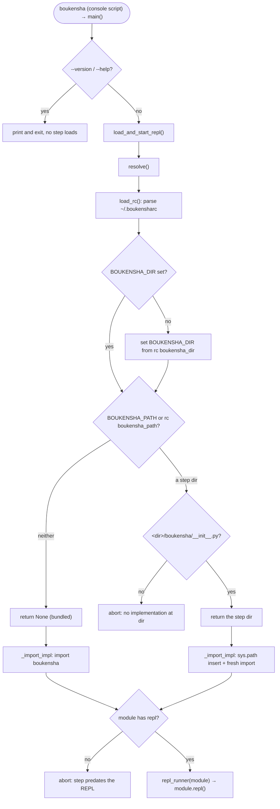

# 09 · The Global Executable

Make `boukensha` a command that runs from anywhere. The step adds a console-script
entry point and a loader that resolves which implementation to run and which config
directory to read, then boots the REPL. No agent capability is added: the command is
a wrapper and a default, and every step folder stays exactly as it was. Carries step
08 forward.

## Usage

Install the command so `boukensha` runs from any directory:

```bash
uv tool install ./week1_baseline/agent/09_global_executable
```

That puts a `boukensha` executable on your PATH. From anywhere:

```bash
boukensha --version   # report the installed version, no boot
boukensha             # boot the REPL (reads config and a provider key)
```

The command needs a config directory holding `.env` (your provider key) and
`settings.yaml`. By default it runs its own bundled implementation and finds config
through `Config`'s own resolution.

To run a different step's code, or point at a config directory, without reinstalling,
set environment variables or `~/.boukensharc`:

```bash
# one-off, resolved from where you stand
BOUKENSHA_PATH=week1_baseline/agent/10_standard_tool_library boukensha
```

```yaml
# persistent, in ~/.boukensharc
boukensha_path: ~/path/to/week1_baseline/agent/10_standard_tool_library
boukensha_dir:  ~/path/to/.boukensha
```

Without installing, run it in place from a checkout:

```bash
uv run boukensha      # inside a step folder, via its own environment
python -m boukensha   # same entry point, no console script needed
```

## New files

| File | What it adds |
|---|---|
| `boukensha/loader.py` | The loader: `load_rc`/`expand_rc_path`/`resolve` pick the implementation and config directory, `load_and_start_repl` imports the resolved package and starts the REPL, and `main` is the console-script entry point (answering `--version`/`--help` before any step loads). |
| `boukensha/__main__.py` | Enables `python -m boukensha`, targeting the same `loader:main` as the console script. |

## Updated files

| File | Change vs step 08 |
|---|---|
| `pyproject.toml` | Version `0.8.0` → `0.9.0`, and a `[project.scripts]` entry `boukensha = "boukensha.loader:main"` so the installer writes the `boukensha` executable on `PATH`. |
| `boukensha/version.py` | `__version__` `0.8.0` → `0.9.0`. The REPL banner reads it, so the command reports `v0.9.0`. |
| `boukensha/__init__.py` | Exports `load_and_start_repl` and `main` from the loader. |
| `examples/example.py` | A gated live boot (`BOUKENSHA_LIVE=1` resolves this step, shadow-imports it, and runs one live REPL turn), then an offline block that drives the real loader through every scenario and asserts the guarantees, including a boot of this step's own package against a stub transport. |

## How it works



## The installed command

One line in `pyproject.toml` makes `boukensha` a real command:

```toml
[project.scripts]
boukensha = "boukensha.loader:main"
```

- The installer writes the `boukensha` executable on `PATH` from this entry point, so
  no hand-written shebang wrapper or packaging script is needed.
- `main()` parses top-level flags first: `boukensha --version` reports the installed
  command's version and `boukensha --help` prints usage, each answered by the loader
  before any step resolves. An unknown flag is rejected by argparse rather than reaching
  the REPL as a first typed line.
- With no flags, `main()` calls `load_and_start_repl()` with the real streams. After
  `uv run boukensha` (or an install), the command boots the bundled REPL, banner
  reporting `v0.9.0`.
- `python -m boukensha` runs the same entry point through a `boukensha/__main__.py`
  that imports `loader:main`, so a checkout launches without installing the console
  script and the two paths never diverge (`python -m boukensha --version` reports
  the same version as `boukensha --version`).

The repo launcher `bin/09_global_executable` runs the offline example. That is how the
step is verified, same as every prior step. The console script is the shipped command
and needs a terminal and a key, so it is not on the assertion path.

## `~/.boukensharc`

The rc file configures both the implementation to load and the directory holding
`.env`, `settings.yaml`, and `prompts/`:

```yaml
boukensha_path: ~/Sites/boukensha/08_the_repl_loop
boukensha_dir: ~/Sites/boukensha/.boukensha
```

`load_rc()` parses it with `yaml.safe_load`, which constructs no arbitrary Python
objects. Accepted shapes:

| rc content | Result |
|---|---|
| a YAML mapping (`boukensha_path`, `boukensha_dir`) | used as-is |
| a mapping with an unknown key | abort, naming the offending key and the allowed keys |
| a bare string | legacy single-path format, treated as `boukensha_path` |
| empty or absent | no settings (`{}`) |
| any other shape (a list, a number) | abort, naming the file and expected shape |
| invalid YAML | abort, naming the file and the parser message |

## Independent resolution

The two settings resolve independently, each in the same three-tier order.

| Setting | First priority | Second priority | Default |
|---|---|---|---|
| Implementation | `BOUKENSHA_PATH` env | `boukensha_path` in `~/.boukensharc` | bundled (installed) package |
| Config directory | `BOUKENSHA_DIR` env | `boukensha_dir` in `~/.boukensharc` | `Config`'s own resolution |

- An explicit environment variable always wins over the rc file.
- The config directory is applied by setting `os.environ["BOUKENSHA_DIR"]` before the
  implementation loads, and only when the env var is unset, so `Config` inside the
  loaded step reads it.
- Rc-file paths expand relative to the home directory (the rc file's directory). An env
  `BOUKENSHA_PATH` expands relative to the current directory, since it is a value the
  user typed where they stand.

## Resolving the implementation, Python-style

Python imports a package by name rather than a file by path, so a selected step folder
is made importable rather than required directly.

- Bundled (no path selected): `resolve()` returns `None`, and `_import_impl` imports
  the installed `boukensha` package by name.
- A step folder: `resolve()` returns that directory. A valid step folder contains
  `boukensha/__init__.py`, this repo's layout for a runnable step. Missing that file,
  the loader aborts naming the directory and the single source that set the bad path
  (`the BOUKENSHA_PATH environment variable`, or `boukensha_path in <rc file>`), so the
  user knows exactly which knob to turn.
- To load a resolved step, its directory is inserted at the front of `sys.path` and any
  cached `boukensha` module tree is dropped, so a fresh import binds the step's own
  package, shadowing the installed one.

## Boot and the REPL guard

`load_and_start_repl(*, repl_runner=None, out=None, err=None)`:

- `resolve()` the implementation, applying the `BOUKENSHA_DIR` side effect.
- `_import_impl` imports the resolved package.
- If `BOUKENSHA_DEBUG` is set, print `[boukensha] loading from: <dir>` to stderr. For
  the bundled case the directory is the installed package's own location.
- If the loaded module has no `repl` attribute, abort telling the user the step predates
  the REPL (added in step 08 here) and how to run its example instead, or to point
  `BOUKENSHA_PATH` at step 08 or later. The guard is real: steps 04 through 07 in this
  port expose no `repl`.
- Call the runner, which by default is `module.repl()`. `KeyboardInterrupt` during the
  session prints `Interrupted.` to the output stream and returns cleanly.

Aborts write the message to stderr and exit with status 1. The `repl_runner`, `out`,
and `err` parameters are the offline seam:
`resolve`, `load_rc`, and `expand_rc_path` are pure functions of `HOME`, the
environment, and the current directory, so the example asserts them directly, while an
injected runner and captured streams drive the interactive boot path (the guard, the
debug line, the dispatch) with no network and no key. The default runner and real
streams keep the shipped command's behavior.

## Run

From `week1_baseline/`:

```bash
bin/09_global_executable
```

With `BOUKENSHA_LIVE=1` and a provider key the example opens with a real boot: the
loader resolves this step, shadow-imports it, and runs one live REPL turn, the exact
path the installed `boukensha` command takes. Gated off, it stays offline and drives
the real loader through every scenario the command hits (an rc that names a step, an
env var overriding it, the bundled default, a boot that dispatches to a step's `repl`,
a step that predates the REPL, the debug line, and the rc error messages), printing the
loader's actual abort and debug output. Each scenario pins a temporary `HOME` with a
crafted `~/.boukensharc` and step-shaped directories. The assertions pin those
guarantees, one of them booting this step's own package through the loader against a
stub transport to prove the shadowed module actually works (a fresh module object,
config crossing the boundary, a completed turn).

```
=== boukensha · step 09: the global executable ===

  package version: 0.9.0   pyproject version: 0.9.0
  console script:  boukensha = boukensha.loader:main

Real boot gated: set BOUKENSHA_LIVE=1 (with a provider key) to have the
loader resolve this step, shadow-import it, and boot one live REPL turn.
The offline block below drives the same loader through every scenario.

-- the loader through every scenario (offline) --
  ...
-- an ~/.boukensharc names a step and a config directory --
  ~/.boukensharc:
    boukensha_path: $HOME/07_the_run_dsl
    boukensha_dir: config
  resolve()            -> $HOME/07_the_run_dsl
  BOUKENSHA_DIR set to -> $HOME/config   (rc path, expanded from $HOME)

-- an environment variable overrides the rc file --
  rc says   boukensha_path: $HOME/07_the_run_dsl
  env says  BOUKENSHA_PATH=$HOME/08_the_repl_loop  BOUKENSHA_DIR=/explicit/config
  resolve()     -> $HOME/08_the_repl_loop   (env won)
  BOUKENSHA_DIR -> /explicit/config   (env won)
  ...
-- boot dispatches to the resolved step's repl --
  repl_runner called with 'boukensha' from $HOME/with-a-repl
  (the real command starts the interactive session here)

-- a step that predates the REPL aborts with guidance (real stderr) --
  boukensha: the step at .../05_agent_loop
         does not support the interactive REPL (added in step 08).
         Run its examples directly, e.g.:
           uv run .../05_agent_loop/examples/example.py
         Or point BOUKENSHA_PATH at step 08 or later.

-- BOUKENSHA_DEBUG prints the loading-from line to stderr (real stderr) --
  [boukensha] loading from: .../debug-step
  ...
-- assertions (offline) --
  PASS 1 rc mapping resolves the step dir and sets BOUKENSHA_DIR to the home-relative path
  ...
  PASS 13 booting a real package shadows the module, crosses config, completes a turn
  PASS 14 an rc with an unknown key aborts, naming the offending key, before loading
  PASS 15 `boukensha --version` reports the version and exits without booting

all loader guarantees hold
```

## Considerations

- The command copies nothing. `boukensha` is a wrapper and a default: the teaching
  material stays in the numbered step folders, and the loader just knows where to look.
  Point `BOUKENSHA_PATH` at any step folder to run that lesson's implementation.
- `BOUKENSHA_DEBUG` prints to stderr. A user piping the command's stdout gets a clean
  stream, with the diagnostic where diagnostics belong.
- The REPL guard is not decorative. Steps 04 through 07 in this port expose no `repl`,
  so pointing the command at one of them aborts with guidance rather than a bare
  `AttributeError`.
- A selected step shadows the installed package by `sys.path` insertion plus dropping
  the cached `boukensha` module tree. One process loads one implementation: switching
  implementations means a new invocation, not a re-import mid-session.
