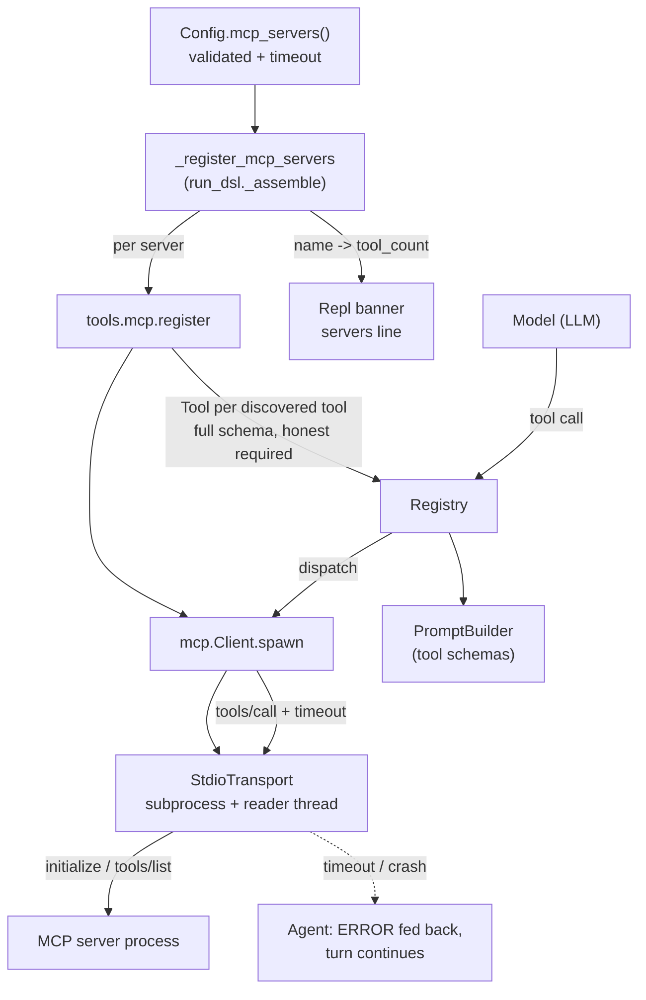

# 10 · The Standard Tool Library (MCP host)

Boukensha ships no tools of its own. It becomes an MCP host: every tool the
agent can call arrives from an MCP server declared in `settings.yaml`'s
`mcp_servers:` block, so swapping what the agent can do is a config edit, not a
code change. This step adds an MCP-over-stdio transport and client, a generic
host layer that turns a server's discovered tools into boukensha tools, config
parsing and validation for `mcp_servers:`, the startup wiring that spawns those
servers, and a REPL banner line reporting what the agent can actually do. The
transport reads on a background thread, so a per-call timeout bounds a hung tool
call and a server crash surfaces at once instead of hanging. Step 09 carried forward.

## Usage

Install the command so `boukensha` runs from any directory:

```bash
uv tool install ./week1_baseline/agent/10_standard_tool_library
```

That puts a `boukensha` executable on your PATH. From anywhere:

```bash
boukensha --version   # report the installed version, no boot
boukensha             # boot the REPL (reads config and a provider key)
```

The command needs a config directory holding `.env` (your provider key) and
`settings.yaml`, whose `mcp_servers:` block wires the MUD and any other tool servers.
By default the command runs its own bundled implementation and finds config through
`Config`'s own resolution.

To run a different step's code, or point at a config directory, without reinstalling,
set environment variables or `~/.boukensharc`:

```bash
# one-off, resolved from where you stand
BOUKENSHA_PATH=week1_baseline/agent/10_standard_tool_library boukensha
```

```yaml
# persistent, in ~/.boukensharc
boukensha_path: ~/path/to/week1_baseline/agent/10_standard_tool_library
boukensha_dir:  ~/path/to/.boukensha
```

Without installing, run it in place from a checkout:

```bash
uv run boukensha      # inside a step folder, via its own environment
python -m boukensha   # same entry point, no console script needed
```

## New Files

| File | What it is |
|---|---|
| `boukensha/mcp/transport.py` | `Transport` (a protocol) and `StdioTransport`: spawn a server, read its stdout on a reader thread, correlate responses by id, enforce a per-call timeout, detect a crash by exit code. |
| `boukensha/mcp/client.py` | `Client`, the MCP protocol over an injected transport: handshake, `tools/list`, `tools/call`, raising on any JSON-RPC error. |
| `boukensha/mcp/__init__.py` | Exports `Client`, `Transport`, `StdioTransport`, `DEFAULT_TIMEOUT`. |
| `boukensha/tools/mcp.py` | The generic host layer: register a server's discovered tools into a registry, with optional name prefixing and collision detection. |
| `boukensha/tools/__init__.py` | The `tools` package marker. |
| `examples/mcp_stub_server.py` | A minimal generic MCP server (test fixture) with env-gated failure modes (init error, slow call, crash), so the example runs the full path and every failure path offline. |
| `examples/mcp_mud_server.py` | A tiny MUD served as a real MCP server, a domain-shaped fixture the offline block round-trips through the host. |

## Updated Files

| File | Change vs step 09 |
|---|---|
| `boukensha/errors.py` | Adds `McpError`, `McpToolCollisionError`, `McpServerError`, and `McpTimeoutError` (a subclass of `McpError`). |
| `boukensha/tool.py` | Adds an optional explicit `required` frozenset so a `**kwargs` handler marks only genuinely-required parameters. |
| `boukensha/config.py` | Adds `mcp_servers()` (parsing the block with defaults and a per-server `timeout`) and `_validate_mcp_servers` (rejecting malformed entries at load). |
| `boukensha/run_dsl.py` | Adds `_register_mcp_servers`, wired into `_assemble` before `setup` and before the prompt builder snapshots the tools, threading each server's `timeout`. |
| `boukensha/repl.py` | Adds the `servers` parameter and the banner's `servers:` line. |
| `boukensha/__init__.py` | Exports the `mcp` host module and the four MCP errors. |
| `boukensha/version.py`, `pyproject.toml` | Version `0.9.0` → `0.10.0`. |
| `examples/example.py` | The real-interop headline (Ruby mud-manager over our host, no LLM), then a narrated offline demo of the host path. |
| `tests/` | The step's guarantees as a stdlib unittest suite (34 tests over the client, transport, host layer, config, and wiring), spawning the same fixture servers. |

## How it works



## The transport and the client

The connection and the protocol are two layers, the same split the HTTP client
(`boukensha/client.py`) uses. `StdioTransport` owns the process and moves
messages, `Client` speaks JSON-RPC over it. A test can drive a `Client` over a
fake transport, and a non-stdio transport could slot in later.

`StdioTransport(command, args=(), env=None)` spawns the server and reads its
stdout on one background thread, routing each response to the caller waiting on
its request id. That reader thread is what a blocking read loop cannot give:

- a per-call timeout, so one hung tool call cannot hang the agent turn, and
- prompt, exit-code-aware failure when the server crashes or closes the pipe,
  waking every blocked caller at once instead of one dead read at a time.

`boukensha/mcp/client.py` is the protocol, verified against the MCP specification
2025-06-18. It knows nothing about any server: `command`, `args`, and `env` are
the standard stdio transport config.

- `Client.spawn(command, args=(), env=None, timeout=DEFAULT_TIMEOUT)` spawns a
  transport and returns a connected client. `DEFAULT_TIMEOUT` is 30 s.
- `server_info`: the server's advertised `serverInfo` (name, version).
- `tools`: the raw list of tool dicts from `tools/list`. Discovery is the
  server's word, the client invents nothing.
- `call_tool(name, arguments=None)` returns `{"text", "error"}`. Content `text`
  blocks are joined by newlines, `isError` maps to `error`.
- `close()` / `closed`: idempotent shutdown, and whether the connection is down.

The wire exchange is JSON-RPC 2.0 over the child's stdin/stdout: `initialize`
(protocolVersion `2025-06-18`, clientInfo name `boukensha`), then a
`notifications/initialized` notification, then `tools/list`, then `tools/call`
on demand. Every request goes through one `_request` method, the single place
that applies the timeout and rejects a JSON-RPC `error` response (or one carrying
neither `result` nor `error`) by raising `McpError`, so a handshake or discovery
failure surfaces instead of degrading to a silently empty client.

| Mechanism | Behavior |
|---|---|
| extra `env` | merged over `os.environ`, never a replacement, so a server still finds `PATH` |
| server stderr | inherited by the host, not captured in an undrained pipe |
| missing command | `FileNotFoundError` at spawn |
| tool-level failure (`isError`) | returned as `{"error": True}` data, never raised |
| a call past its `timeout` | raises `McpTimeoutError`, fires a best-effort `notifications/cancelled`, leaves the connection open |
| a JSON-RPC error / crash | raises `McpError`, and a crash names the exit code and marks the client `closed` |

## Resilience: a crashed server respawns

A server that crashes mid-session should not permanently lose its tools. When a
`tools/call` fails because the transport closed (a crash), a spawn-created client
respawns the server and retries the call once:

- Respawn rebuilds the transport, re-handshakes, and re-discovers tools. The
  registered `Tool`s call back into the same client, so recovery is transparent to
  the registry, the tool the model called just works on the next try.
- Backoff between respawns is exponential (0.5, 1.0, 2.0 s), capped at
  `MAX_RESPAWNS` (3), so a crash loop cannot hammer the process table.
- The budget resets on any clean call, so a server that recovers is not
  permanently capped. A server that crashes on every call hits the cap, and then
  the error surfaces to the agent as a normal `ERROR` tool result, never a hang.
- A client over an injected transport (a test) has no spawn config, so it does not
  respawn: the crash raises straight away.

## The host layer

`boukensha/tools/mcp.py` turns any MCP server's tools into boukensha tools.
Stateless module-level functions: the client and registry are passed in.

- `register(registry, command, args=(), env=None, prefix=None, timeout=...,
  allow=None, deny=())` spawns a client, registers an `atexit` close hook,
  registers its (filtered) tools, returns the client. `timeout` is the per-call
  ceiling, and `allow`/`deny` scope which tools register.
- `register_client(registry, client, prefix=None, allow=None, deny=())` registers
  an already-spawned client's tools, returning the count that registered.
  `allow`/`deny` match the server's bare tool names.
- `prefixed(name, prefix)` is `prefix + "__" + name` for a non-blank prefix,
  else the bare name.
- `to_boukensha_params(input_schema)` keeps each property's full JSON Schema
  fragment (an array's `items`, an object's nested `properties`, a `format` or
  bounds), not just `type` and `description`, so a structured parameter reaches
  the model intact. An `enum` stays a real schema key, which every backend passes
  to the wire so the provider enforces it, and is also appended to the
  description for models that weight prose over the strict schema.

Each discovered tool becomes a `Tool` whose `**kwargs` handler calls
`client.call_tool(remote_name, ...)`. The bare (remote) name is captured in the
closure, so the server always sees its own name on the wire even when the
agent-side name is prefixed. Prefixing is agent-side policy from config, never
sent on the wire.

## Collision detection is a hard error

Two tools claiming one agent-side name is a config contradiction, never
excused, because silently dropping the loser is the expensive failure to debug.
Before registering each tool the host checks the name against the registry's
current tools and the names registered so far in this call. A clash raises
`McpToolCollisionError` naming the tool and pointing at the `prefix:` fix. It
covers both a clash between two servers and a clash against a tool already held
(an inline tool, or another server's). `required: false` never excuses it.

## Honest required-ness

MCP-derived tools mark only genuinely-required parameters as required in the
wire schema. An MCP handler is `**kwargs`, so deriving required-ness from the
signature would mark every parameter required, telling the model it must supply
an optional one.

- `Tool` gains an optional `required` field (a frozenset, default `None`).
- `None`: `required_parameters` derives from the handler signature, unchanged
  for every existing tool.
- Set: `required_parameters` returns the declared parameters in the set, in
  declared order. Construction validates the set is a subset of the declared
  parameters, naming any required name the model was never shown.

The host passes `frozenset(inputSchema["required"])` intersected with the
declared properties. An MCP handler is `**kwargs`, so signature-derived
required-ness would mark every parameter required. Honoring `inputSchema.required`
tells the model exactly which parameters it must supply and which it may omit.

## Config: `mcp_servers`

Adding a capability is a config edit. `Config.mcp_servers()` returns
`{name: {command, args, env, prefix, required, timeout, allow, deny}}`.

```yaml
mcp_servers:
  mud:
    command: mud-manager
    args:    [--mcp]
    prefix:  tbamud            # the daemon's `look` registers as `tbamud__look`
    allow:   [look, move]      # only these of the server's tools register
    env:                       # a stdio server's credentials travel by environment
      MUD_HOST:     localhost
      MUD_PORT:     4000

  filesystem:
    command:  npx
    args:     [-y, "@modelcontextprotocol/server-filesystem", /tmp]
    prefix:   fs
    deny:     [write_file]     # everything except this one
    required: false            # can't start? warn and carry on
```

`allow` (when given) is the only tool names admitted, and `deny` names tools to
exclude. Both match the server's own (bare) names, so a permission policy reads
the same whatever prefix the tools take agent-side. A read-only journey is
`allow: [look, examine, read]` on the MUD server, config not code.

| Key | Default | Notes |
|---|---|---|
| `command` | `""` | stringified, resolved by the OS, so a relative path depends on your cwd |
| `args` | `[]` | list of strings |
| `env` | `{}` | string to string, values stringified (a YAML port survives) |
| `prefix` | `None` | scopes discovered names (`fs` → `fs__read_file`) |
| `required` | `True` | `required: false` lets a server fail to spawn without taking the agent down |
| `timeout` | `30.0` | per-call ceiling in seconds, so one hung tool call cannot hang the agent |
| `allow` | `None` | list of the server's tool names to register, or all when unset |
| `deny` | `[]` | list of the server's tool names to exclude |

An absent `mcp_servers:` block yields `{}`, and a bare `name:` (no body) means all
defaults. A malformed entry is rejected at load by `_validate_mcp_servers`, naming
the server and the field: `args` as a bare string, `env` as a list, or a
non-positive `timeout` fails loudly rather than mangling silently or crashing deep
in spawn, the same fail-loudly-naming-the-thing voice as the `tasks` validation.

## Startup wiring

`_register_mcp_servers(registry, servers, err=sys.stderr)` in `run_dsl.py` is
called from `_assemble` after the registry is created and before the prompt
builder snapshots the toolset, so MCP tools are present in the request. It runs
before the `setup` callable, so an inline tool a setup callable adds collides
against an MCP tool exactly as two servers would.

- Each server is spawned in config order, recorded as `{name: tool_count}`.
- A `McpToolCollisionError` always propagates.
- Any other spawn failure raises `McpServerError` naming the server when it is
  required, or warns to `err` and continues when it is optional.

The `err` stream is injectable so the optional-server warning is assertable
offline, the same seam the prior steps use for interactive output.

## The banner's servers line

`Repl` gains a `servers` parameter (the `{name: tool_count}` summary). Every
tool the agent has came from one of these servers, so this line doubles as
"what can I actually do?".

- With servers: `servers:   mud (26)  filesystem (11)`.
- Empty or `None`: `servers:   none`.

## Sample output

`bin/10_standard_tool_library` runs the headline, the demo, then the test suite.
Abridged:

```
=== boukensha · step 10: the standard tool library (MCP host) ===

Real cross-language interop, no LLM, no key: the Ruby mud-manager
daemon over our MCP host, against its own FakeMud.
  handshake: mud-manager   tools: 26
  look -> 'You do: look\r\n<100hp 50m 30v>'   error=False

-- 1. spawn a server and handshake -----------------------------------
  server_info: {'name': 'stub-mud', 'version': '0.1.0'}
  protocol:    2025-06-18   clientInfo name: boukensha

-- 2. discover its tools (tools/list) --------------------------------
  say    params: message (required), volume (optional, one of: whisper, normal, shout)
  boom   params: (none)

-- 3. call a tool over the wire --------------------------------------
  say {message: 'hello there', volume: 'shout'}
    -> '[shout] you say: hello there'   error=False
  boom
    -> 'kaboom'   error=True (returned as data, not raised)

-- 4. register into a Registry with a prefix -------------------------
  prefix 'tbamud' -> agent sees: tbamud__boom, tbamud__say
  bare 'say' registered? False
  dispatch tbamud__say {message: 'hi'}  ->  '[normal] you say: hi'
  the server received the bare name 'say' on the wire (prefix is agent-side)

-- 5. capability from config, not code -------------------------------
  mud: {'command': 'mud-manager', 'args': ['--mcp'], 'env': {'MUD_HOST': 'localhost', 'MUD_PORT': '4000'}, 'prefix': 'tbamud', 'required': True, 'timeout': 30.0}
  opt: {'command': 'other', 'args': [], 'env': {}, 'prefix': None, 'required': False, 'timeout': 30.0}

-- 6. startup wiring -------------------------------------------------
  two servers spawned in order -> {'north': 2, 'south': 2}
  optional server that can't spawn -> summary {}, warning:
    [boukensha] optional MCP server 'ghost' failed to start: ..., continuing without its tools
  name collision (fatal even for an optional server) -> boukensha: MCP tool name collision on 'say' ...

-- 7. the REPL banner's servers line ---------------------------------
  servers:   mud (2)  fs (11)
  servers:   none

Every guarantee behind this demo is pinned by the test suite:
  uv run python -m unittest discover -s tests -t .

Ran 34 tests in 1.6s

OK
```

## Considerations

- Servers spawn eagerly at boot: every `mcp_servers:` entry costs a subprocess
  and a handshake even if the model never calls it. Fine at two servers,
  revisit past that.
- Non-text MCP content blocks (an image, an embedded resource) render as a
  described placeholder, `[image: image/png]` or `[resource: <uri>]`, rather than
  being dropped, so the model sees that something came back and what kind instead
  of a silently empty result. No MUD tool returns one, but a general MCP host
  should not swallow it.
- `command` is resolved by the OS against `PATH` and the cwd. A relative command
  path depends on where the agent was launched, and nothing hunts for a binary
  for you. A missing binary is a `FileNotFoundError` at spawn (fatal for a
  required server, a warning for an optional one).
- The server's stderr is inherited by the host, so a chatty server's diagnostics
  interleave with the agent's output. That is deliberate: capturing stderr in an
  undrained pipe backpressure-deadlocks the server once the buffer fills.
- One reader thread runs per spawned server, daemonized so it can never block
  interpreter exit. A timeout abandons only its own call and leaves the connection
  open for the next one. A crash marks the client closed and every later call on
  it fails fast. Servers are independent processes, so one crashing never touches
  another's tools.
- `command` and `args` come only from local `settings.yaml` and are passed to the
  OS as a list, never through a shell, so a tool argument from the model can never
  reach a shell. An MCP server still inherits the full environment, so do not point
  this config at an untrusted server.

## Design choices

- The agent owns no tools of its own: every capability is an MCP server. There are
  no built-in filesystem, shell, or MUD modules, so there is nothing to build in.
- `working_dir:` on `run` / `repl` and `Context` is not carried: it has zero
  consumers, and the tools that once read it are not part of an MCP host. A keyword
  that does nothing is a misleading interface.
- MCP host extras: auto-respawn and allow/deny tool lists are built (see the two
  sections above). Dynamic re-discovery, fully concurrent calls, and an in-process
  transport are recorded in `docs/journal/1_baseline.md` under "Explore later",
  each with a trigger, since none has a caller or is a reference gap.

## Run

From `week1_baseline/`:

```bash
bin/10_standard_tool_library
```

The example needs no env vars, no API key, and no LLM. Step 10's subject is the
host layer underneath the model, so its real run is a real foreign server, not a
model turn. It opens with the headline, real cross-language interop: the Ruby
`mud-manager` daemon (`week0_explore/mud_manager`, invoked directly as
`ruby <bin> --mcp`, no install), auto-booting its own `FakeMud`, then our host
handshakes, discovers all 26 tools, and dispatches a real `look`:

```
Real cross-language interop, no LLM, no key: the Ruby mud-manager
daemon over our MCP host, against its own FakeMud.
  handshake: mud-manager   tools: 26
  look -> 'You do: look\r\n<100hp 50m 30v>'   error=False
```

The example finds a ruby >= 3.0 by itself: PATH first, then a mise-managed
install (`mise which ruby`), then Homebrew, so a version-managed Ruby works even
in shells where its shims are not active. It skips cleanly, saying why, only
when no such ruby or the in-repo gem is absent. The narrated demo then walks the
host path against `examples/mcp_stub_server.py`, and the launcher finishes by
running `tests/`, where every guarantee lives as a unit test (34 tests: client,
transport, host layer, config, wiring, spawning the same fixture servers).
Playing the MUD with a live model is what the installed `boukensha` command
does, not a step-10 test.
