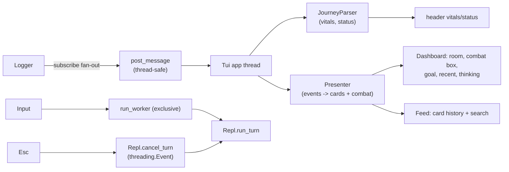

# 11 · The Journey (TUI)

boukensha is a Player Journey Agent: it plays the MUD, and this step puts a
readable, live view of that journey in front of the REPL. `Tui` wraps a `Repl`
in a two-tab Textual app. The Dashboard shows the current state at a glance, the
Feed is the readable story of the run, and both are human-first: MUD prose,
humanized actions, the agent's thinking, and a fight box, never a raw debug log.
The plain REPL stays reachable with `tui=False` and `--no-tui`. Step 10 carried
forward.

## Headline design: a journey view, not a trace

The full end-to-end technical trace (tool plumbing, tokens, iterations, prompt
sizes, raw tool names) is deliberately absent from the TUI. It lives in the
JSONL session log and the step-13 log viewer, which own "where did my message
go" debugging. The TUI shows only what a human wants while watching the agent
play. Three ideas carry that:

- Presentation by meaning: a framework-free `Presenter` turns logger events
  into readable cards, a Room card (title, exits, description), an Action card
  (humanized), a Thinking card (the agent's reasoning or summary), and a Combat
  card (a resolved fight). Plumbing events produce no card, so the noise cannot
  reach a widget by construction.
- Live, never stale: the Thinking view tracks the agent's latest text from
  every response (its per-iteration commentary and its final summary), so it
  follows the agent instead of freezing on an old summary. Vitals, status, and
  the current goal update in place.
- Combat handled the week0 way: a fight is detected by windowed line-matching
  (real combat verbs), so it turns itself off when the fighting stops and a
  reconnect menu or an error can never leak into the fight box.

## New files

| File | What it is |
|---|---|
| `boukensha/journey/` | The MUD layer, a package grouped as the reusable domain the front-end builds on (it grows in week 2 with the map and findings UI). `present.py`: `Presenter`, the `Card` model, `humanize_action`, the combat tracker, the boundary that turns events into readable beats and keeps the raw trace out. `parser.py`: `JourneyParser`, parsing vitals, character, and status (stance, hunger, thirst) for the header. |
| `boukensha/tui.py` | `Tui`, the Textual app (the generic renderer over the journey layer): two tabs, header vitals/status strip, splash screen, combat box, heartbeat pulse, state badge, goal panel, command palette, real Esc cancellation. |

## Updated files

| File | Change vs step 10 |
|---|---|
| `boukensha/repl.py` | Front-end surface: `on_output`, `handle_command`, `run_turn`, `classify_input`, `cancel_turn`, a `quiet` property, plus `turn`/`cost`/`servers`/`commands`/`context_window` readers and `banner()`. |
| `boukensha/logger.py` | `subscribe(callback)` fan-out after each flushed line (the step-06 event-stream design, first consumed here). |
| `boukensha/run_dsl.py` | `repl(tui=True)` launches `Tui(session)`. Textual imports stay lazy. |
| `boukensha/loader.py` | The default runner reads `--no-tui` and calls `module.repl(tui=...)`. |
| `examples/example.py` | Thin launcher: TTY boots the real TUI, no TTY falls back to the plain REPL, `--replay` streams a recorded real session. |
| `boukensha/version.py`, `pyproject.toml` | Version 0.11.0, the `textual` dependency. |

## Layout

```
+-- mud(26) ok · HP 24/24 · Mana 100 · Moves 63 · Lv 1 · standing · hungry --+
+--[ Dashboard ]--[ Feed ]---------------------------------------------------+
| MUD (main, largest)                    | GOAL                              |
|   [ ⚔ combat box when fighting ]       |   find and defeat the minotaur    |
|   Poor Alley   exits: east, west       | 🧍 standing   (state badge)       |
|   You are on Poor Alley...             | RECENT                            |
|   · a one-off MUD message              |   -> move west                    |
|                                        | THINKING                          |
|                                        |   the agent's latest view,        |
|                                        |   markdown, scrollable            |
+----------------------------------------------------------------------------+
| ⠹ playing: move west · 4s      (a liveness spinner, not a trace)           |
| boukensha> input                                                           |
+----------------------------------------------------------------------------+
```

Vitals and status ride in the header, so both tabs carry them. The Feed tab is
the history, so there is no separate drawer, and search lives on the Feed tab.

## How it works



- One exclusive worker per submission, so the app thread never blocks.
- Cross-thread updates arrive only as Textual messages. The parser and the
  presenter mutate on the app thread.
- The TUI silences the REPL's own activity feed (`repl.quiet = True`), because
  it renders the trace from logger events itself. So `on_output` carries only
  the agent's reply, and the feed's plumbing never pollutes the cards.
- Esc sets the REPL's cancel event, so the agent stops at the next iteration
  boundary. It is not a discarded task.
- Cards render through `rich.text.Text` (thinking through `rich.markdown`),
  never interpolated markup, and terminal color escapes are stripped at the
  presenter, so bracket-laden MUD prose is always safe.

## The dashboard panels

- GOAL: the standing objective, pinned at the top of the right column, taken
  from the latest instruction you gave.
- State badge: an animated unicode glyph reading the stance (🧍 standing, 🧘
  resting, 😴 sleeping with cycling z's, ⚔️ fighting). A terminal cannot embed
  a real sprite, so this is the honest ceiling, a glyph that degrades to a word.
- RECENT: the last three humanized actions.
- THINKING: the agent's latest reasoning or summary, rendered as markdown
  (a table stays a table) and scrollable.

## The combat box

When a fight starts, a red-bordered box streams the blow-by-blow and shows the
outcome, and the screen edge pulses like a heartbeat while the fight is live.

- Detection is windowed and line-matched (`COMBAT_LINE_RE` of real combat
  verbs), lifted in spirit from week0's visualizer: a fight is "on" only while
  combat lines keep arriving.
- Only genuine combat lines enter the box, so a room that merely mentions a mob
  fighting you does not dump its description, and a reconnect menu or an error
  can never leak in.
- A result with no combat lines and no death ends the fight (retiring an
  unresolved box), and a kill or a death sets the outcome (Victory / Defeat) and
  drops a combat card into the Feed. Walking to a peaceful room retires the box.

## Humanized actions

`present.humanize_action(name, args)` maps a tool call to a short phrase: strip
the MCP prefix (`tbamud__`), drop the JSON, read the verb plus its key argument.

| Tool call | Shown |
|---|---|
| `tbamud__move({'direction':'w'})` | `-> move west` |
| `tbamud__look({})` | `-> look` |
| `tbamud__attack({'target':'fido'})` | `-> attack the fido` |
| unknown tool | the bare verb plus its first argument value |

The mapping is generic presentation of the call, never game knowledge.

## The splash screen and loud tool status

Boot opens a start screen: themed ASCII art plus the session card (version,
provider, model, config dir, each MCP server with its tool count, context
window). Zero registered tools renders as a bold red warning and a header
`NO TOOLS`. `/info` reopens the card any time. In `settings.yaml` the `mud`
server is `required: true`, so a failed spawn stops boot with a clear error.

## Deferred (kept honest, not silently dropped)

- The world map and vnum-true room identity, to week 2 with the web visualizer.
  Room identity here is the week0 title+exits heuristic (honestly approximate).
  The `.wld` parser and belief-set localizer were built and validated this
  session, then removed from the step as unused, preserved in git history and
  journaled for week 2 with the trigger.
- The findings engine (confusion, blocked, bored, over/underpowered, death), to
  week 2. Its code stays in `journey.py` and stays unit-tested, it is just not
  rendered yet.

## Keys and commands

| Key | Action |
|---|---|
| type text | a turn: the model plays (`//` sends a literal slash line) |
| `/command` | every step-08 command, same `classify_input` routing |
| `Ctrl+T` | switch Dashboard / Feed |
| `Ctrl+F` | jump to the Feed tab and focus search |
| `Esc` | cancel the running turn, or close the splash |
| `Ctrl+P` | command palette, fed from the REPL's table plus `/info` |
| `Ctrl+L` | `/clear`. `Ctrl+C`/`Ctrl+D` quit |

## Run

### One-time setup

1. The mud-manager gem (needs Ruby >= 3.0, e.g. via mise or Homebrew):

   ```bash
   cd week0_explore/mud_manager
   gem build mud_manager.gemspec && gem install ./mud_manager-0.2.0.gem
   ```

   This puts `mud-manager` on PATH, which `.boukensha/settings.yaml` names in
   its `mcp_servers:` block (no machine paths in config).

2. A provider key in `.boukensha/.env` (`ANTHROPIC_API_KEY=...`).

3. The game server, week0's dockerized CircleMUD on port 4000:

   ```bash
   cd week0_explore/infrastructure && docker compose up --build -d
   ```

### Play

From the repo root:

```bash
./week1_baseline/bin/11_tui
```

The example boots the splash card, then the real full-screen TUI: the agent
gets its tools from the mud-manager and plays the actual game while the
Dashboard and Feed fill in. On quit, the launcher runs the test suite. The
installed `boukensha` command (step 09) boots the same TUI.

### Other modes

- `--no-tui`: the plain line REPL, same session logic.
- `--replay`: a recorded REAL session (no key, no MUD): captured events stream
  through the real TUI, so the Dashboard and Feed populate.
- Tests alone: `uv run python -m unittest discover -s tests -t .` from the step
  directory. 64 tests, hermetic: they pin their own config and only ever spawn
  Python stub fixtures. The presenter's humanizer, de-noise boundary, combat
  detection, and thinking behaviour are unit-tested, every interactive surface
  is driven headless (splash, tabs, feed search, combat box, palette), and the
  golden fixtures are verbatim real tbaMUD output, ANSI and CRLF intact.

## Decisions

- The TUI is the readable live journey, the logs and the step-13 viewer are the
  system of record. That separation is why the raw trace is absent here.
- Presentation by meaning is enforced at one boundary (`present.py`), so the
  noise cannot leak into a widget even as new event kinds are added.
- The animated character is a unicode state badge, the honest ceiling for a
  terminal, and one deletion to remove if it reads as gimmicky.
- The replay is a labeled recorded demo of a real session, not a simulation: it
  drives the same widgets the live run uses.
