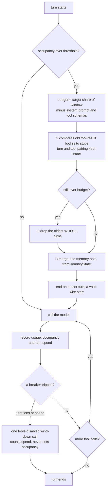

# 12 · Context Management

The agent takes charge of its own context window. Calling an LLM directly means
no auto-compaction happens for you: the input grows past the model's window and
the next call fails. This step adds accurate token tracking, a second per-turn
circuit breaker measured in spend, structure-aware compaction, a reasoning-block
round-trip, and a context indicator, on top of the MCP-host tool model and the
journey TUI carried forward from steps 10 and 11.

## How it works

Two counters, two breakers, and one pipeline. The trigger is measured at turn
start, and the budget is set against the true prompt size, not just the history:



## Run

```
./week1_baseline/bin/12_context                  # launch the TUI against the configured MUD
./week1_baseline/bin/12_context --window 8000    # small window, so compaction fires while you play
./week1_baseline/bin/12_context --no-tui         # the plain line REPL instead
uv run python -m unittest discover -s tests -t . # every systematic check
```

The launcher starts the application and hands over control. It scripts nothing and
asserts nothing: `tests/` is the single home for systematic checks, including the
deterministic proof that a multi-turn session compacts.

Watching this step work is a matter of playing for a few turns. The header's `ctx`
figure climbs as history accumulates, and once it crosses the threshold the next
turn opens by compacting: a card appears in the Feed naming what was dropped,
compressed, and whether a memory note was kept. `/compact` forces one at any time,
and the footer always names why a turn ended.

The window normally comes from the backend catalog. `--window N` overrides it, which
is how a short session can be made to cross the threshold. Setting it below the
fixed prefix (the system prompt plus every tool schema) leaves compaction nothing it
can win, and the launcher says so rather than letting it look broken.

```
boukensha v0.12.0 · step 12: context management
config:  <your .boukensha>
servers: mud
window:  8000 tokens, so compaction fires at 6800

Launching the journey TUI. Play a few turns and watch the header's ctx
figure climb: a compaction card appears in the Feed once it crosses.
(Ctrl+T: tabs · Ctrl+F: search · Ctrl+P: commands · /compact forces one
· /info session card · Esc cancels a turn · Ctrl+D quits)
```

A live run needs a provider key in `.boukensha/.env` and an `mcp_servers` entry to
play against. The plain REPL fallback runs automatically without a TTY, so a piped
or CI invocation never tries to open a full-screen app.

## Commands

Typed in the input line, in the TUI or the plain REPL. `/help` lists them and
Ctrl+P opens a searchable palette. A command's result appears as its own card in the
Feed, distinct from the agent speaking, and also as a notification, so it reaches you
on whichever tab you are on. Long output is summarized in the notification and kept
whole in the Feed.

| Command | What it does |
|---|---|
| `/help` | show this message |
| `/tools` | list the registered tools |
| `/servers` | show the MCP servers and their tool counts |
| `/system` | show the system prompt |
| `/history` | show the conversation so far |
| `/cost` | show the running USD cost |
| `/tokens` | show the running token totals |
| `/quiet` | suppress the live activity feed |
| `/loud` | restore the live activity feed |
| `/reasoning` | toggle showing model reasoning |
| `/model` | show or switch the provider/model |
| `/mud` | show the configured MUD target |
| `/compact` | compact the conversation to fit the context window |
| `/undo` | drop the last turn from history |
| `/retry` | drop and rerun the last turn |
| `/save` | save the transcript to a file |
| `/clear` | wipe conversation history (tools stay) |
| `/exit` | leave the REPL |
| `/quit` | alias of `/exit` |
| `/info` | reopen the session card (TUI only) |

`//` at the start of a line escapes it, so `//hello` sends a literal `/hello` to
the agent instead of being read as a command. `/clear` drops the model's history
and clears the screen with it, so the display and the model never disagree about
what was said.

## Headline design: structure-aware compaction

When the window fills, the naive fix drops the oldest messages, and the agent
forgets whatever scrolled off. The session is already parsed into a
`JourneyState` for the observatory, so compaction here is structure-aware and
loses far less:

- Compress, don't drop: old tool-result bodies, the verbose room descriptions
  that dominate the window, become one-line stubs. The turn and its
  tool_use/tool_result pairing stay intact, so it is wire-safe by construction
  and reclaims most of the tokens without losing the skeleton.
- Drop whole turns only, and only if still over a token budget, advancing the
  cut to the next user turn so a tool_result is never orphaned and the survivor
  prefix always starts on a valid wire role.
- Summarise what is shed into one deterministic memory note from `JourneyState`
  (rooms explored, current room, vitals, level, deaths, recent kills), merged
  into the first surviving user turn. No extra model call, because the data is
  already parsed, so the agent keeps its memory across a compaction.

The same parser that draws the journey UI is the agent's memory engine. It lives
on `Context`, so both auto-compaction and `/compact` read it.

## New files

| File | What it is |
|---|---|
| `boukensha/compaction.py` | The structure-aware pipeline: `summarize(state)` and `compact(messages, state, ...)` returning a `CompactionResult`. Framework-free, unit-tested. |

## Updated files

| File | Change |
|---|---|
| `boukensha/context.py` | Token and window state (`current_tokens`, `turn_tokens`, `usage_fraction`, `needs_compaction`), the `JourneyParser` as the agent's memory, and `compact_messages` delegating to the pipeline. |
| `boukensha/agent.py` | Turn-start compaction, the `max_turn_tokens` work breaker, reasoning capture, feeding the journey memory, and the Esc cancellation seam. |
| `boukensha/message.py` | A fourth typed block, `ReasoningBlock`, allowed only in an assistant message. |
| `boukensha/backends/*.py` | The reasoning round-trip: Anthropic and Gemini echo the block verbatim so signatures round-trip, OpenAI and Ollama parse it and drop it on rebuild. |
| `boukensha/config.py`, `boukensha/tasks/base.py`, `boukensha/run_dsl.py` | The top-level `agent:` config block, layered: explicit arg, then per-task, then `agent:`, then the code default. |
| `boukensha/logger.py` | A `compaction` event (with `dropped`/`compressed`/`summarized`), `reasoning` and `plan` events, `context_window` on the `prompt` event. |
| `boukensha/repl.py` | `/compact` runs the pipeline and emits the compaction log event. |
| `boukensha/journey/present.py`, `boukensha/tui.py` | A compaction card in the Feed and a dashboard notice, and the context indicator reading the shared `Context` occupancy. |

## Two token counters

Neither derives from the other, so the window occupancy and the turn spend are
never conflated:

- `current_tokens`: the window occupancy, set to the last call's input size.
  Drives `usage_fraction`, the indicator, and the compaction trigger.
- `turn_tokens`: the running input + output for the turn. Drives the spend
  breaker.

## Two circuit breakers

Both are trigger thresholds, not hard caps: reaching one makes exactly one
tools-disabled wind-down call, so the turn ends in character rather than raising.

- `max_iterations` (default 25): the turn's step ceiling.
- `max_turn_tokens` (default 60000, `0` disables): the turn's work ceiling.
  It counts input plus output, cache reads included, so it measures volume
  processed rather than money.

## Compaction, triggered and logged

Auto-compaction runs at turn start when `usage_fraction >= compaction_threshold`
(default 0.85). `/compact` runs it on demand. Both emit one event:

```json
{"phase": "compaction", "before": 172000, "dropped": 12, "compressed": 5, "summarized": true, "context_window": 200000}
```

The TUI renders a compaction card and flashes a notice, so a watcher sees memory
being freed rather than history silently vanishing.

## Reasoning round-trip

A provider's thinking output is normalized to a `ReasoningBlock` (text, an
optional opaque `signature`, a `redacted` flag). Backends that require the block
echoed back unchanged do so (Anthropic thinking signature, Gemini
`thoughtSignature`), the rest drop it on rebuild. Without this, a thinking plus
tool-use turn drops the thinking block on the follow-up request and Anthropic
returns a 400. The TUI shows reasoning as a thinking card.

## The `agent:` config block

Agent-wide circuit breakers live in a top-level `agent:` block, with per-task
overrides retained:

```yaml
agent:
  max_iterations: 25
  max_output_tokens: 1024
  max_turn_tokens: 60000
  compaction_threshold: 0.85
tasks:
  player:
    max_turn_tokens: 40000   # a task may still override
```

Resolution is explicit arg, then the task value, then the `agent:` value, then
the code default. The context window is not a config key: it is a model fact
read from the backend catalog.

## Deliberately not here

- Cross-session persistent memory, an adaptive compaction threshold, and an
  LLM-summarised rolling summary. The structure-aware pipeline is the local,
  in-session foundation these would extend, planned for a later step with a
  persistence layer.
- Full salience retention (keeping an old event-bearing turn verbatim over old
  navigation) and a predictive cold-start trigger. The memory note already
  captures older events, so nothing important is lost, and these remain
  refinements.

