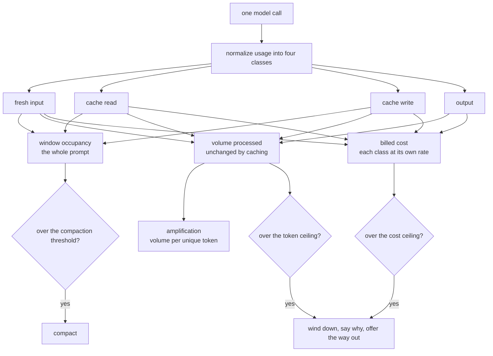

# 13 · Context economics

The agent stops paying repeatedly for the same tokens, measures spend in the four
quantities that actually differ, and shows its ceilings while it plays. Step 12
taught it to stay inside the context window. This step is about what that costs.

## How it works

A stateless chat API re-sends the whole conversation on every call, so a turn of
eleven tool calls pays for its history eleven times. Caching does not reduce the
tokens sent, it reduces their price, which is why measurement has to separate work
from money:



## Run

```
./week1_baseline/bin/13_context_economics                  # launch the TUI
./week1_baseline/bin/13_context_economics --window 8000    # small window, to watch compaction
./week1_baseline/bin/13_context_economics --no-tui         # the plain line REPL
uv run python -m unittest discover -s tests -t .    # every check
```

The launcher starts the application and hands over control. It scripts nothing and
asserts nothing: `tests/` is the single home for checks, including the live-gated
comparison that is this step's evidence.

Caching needs no flag. It is on wherever the provider supports it, and the header
says what is happening. Play a few turns and the ceilings read as current over
limit, with the one closest to tripping marked.

## The evidence: identical work, a fraction of the money

`tests/test_cold_vs_warm.py` sends one prompt twice and asserts what caching does
and does not change. A real run:

```
anthropic/claude-haiku-4-5: caching on
cold  fresh=3 read=0     volume=8461  cost=$0.0106
warm  fresh=3 read=8453  volume=8461  cost=$0.0009
```

Volume is identical both times and cost falls by more than 90 percent. That is the
whole claim of the step, measured rather than described.

Two things make that test honest, and both were mistakes first:

- It compares the PROMPT, not prompt plus output. A live model does not generate
  the same number of tokens twice, so including output would test the model's
  determinism instead of caching. The warm call's four classes are also asserted to
  sum to the same prompt, so narrowing this made it stricter, not looser.
- Its prompt is unique per run. A provider's cache outlives a test run, so a
  five-minute entry from two minutes ago turns the next "cold" call into a cache
  hit and the comparison measures nothing. It costs one cache write per run to make
  cold mean cold.

## Four token classes

One number cannot describe a call once caching exists, because a cached token is
processed like any other and billed differently.

| Class | What it is |
|---|---|
| fresh input | processed at the full input rate |
| cache read | served from a cache, at a reduced rate |
| cache write | stored into a cache, at a premium |
| output | generated by the model |

Providers report these under different names and disagree on one thing that
matters: Anthropic's prompt total EXCLUDES its cached tokens while OpenAI's and
Gemini's INCLUDE them. `boukensha/usage.py` normalizes that once, so the same
1,000-token prompt reads the same everywhere. Without it, fresh input is double
counted and occupancy is inflated.

## Four metrics, none derived from another

| Metric | Question | Read from |
|---|---|---|
| volume processed | how much work did this turn do | every input class plus output |
| window occupancy | how full is the context | the whole prompt |
| billed cost | what did this turn cost | each class at its own rate |
| amplification | how much of that was genuinely new | volume per unique token |

Volume counts every input class, so switching caching on does not move it. That is
what lets a ceiling measured in volume keep its meaning, and it is the correction
this step makes: counting fresh input alone would have made the same work look
smaller once cached.

Amplification is the number that explains a surprising bill, and a real turn shows
why. In session `20260726T064403Z-6a76dbf5` a single turn ran to the 125-iteration
ceiling over 126 model calls:

| Measured | Value |
|---|---|
| volume processed | 2,153,935 tokens |
| of which cache reads | 2,088,889, or 97 percent |
| fresh input | 4,799 |
| billed cost | $0.0481 |

Two million tokens processed for under five cents, because 97 percent of them had
been sent before. Reading fresh input alone would have reported that turn as 4,799
tokens of work, and reading volume without the class split would have made it look
like a runaway bill.

## Cached tokens still occupy the window

Caching changes a token's price, never its presence, so occupancy is the whole
prompt. This ships with caching and not after it: a provider that reports its
prompt total excluding cached tokens would make a cached session look nearly empty,
compaction would stop firing, and history would grow until the request was
rejected. Measured on a 9,500 token prompt of which 9,000 were cache reads,
occupancy reads 9,500 and compaction fires. Read from fresh input alone it would
have read five percent.

## Rates are data, per class

`models.yaml` carries a rate per class per model, never a multiplier on the input
rate. A multiplier would encode one provider's economics:

- Anthropic prices two cache lifetimes differently, 1.25x base input for five
  minutes and 2x for an hour, and reads at 0.1x.
- OpenAI discounts cached input.
- Gemini's explicit cache also bills STORAGE by the hour, a time dimension no
  per-token multiplier can express. This step uses its implicit caching, which has
  no storage charge.

Cost is computed once, where the model, the usage and the rates are all in hand,
and logged as a fact. Nothing downstream recomputes it.

Unknown and zero stay apart, because reporting an unpriced model as `$0.00` would
claim it was free:

| Case | Reports |
|---|---|
| priced model | the money |
| local model, priced at an explicit zero | a known `$0.0000` |
| model with no published rate | `cost unavailable` |
| rate table missing a class in play | the total, naming the unpriced class |

## Caching is a per-model capability, not a global one

A provider caches nothing below a minimum prompt length and returns NO error, and
that minimum is a per-model fact spanning an eightfold range on one provider alone.
Nothing here assumes a model or a provider: `Backend.caches` says whether caching
exists, `cache_min_tokens` comes from the catalog, and `cache_status(prompt_tokens)`
returns the reason in words, one of `on`, `not supported by this provider`, or
`prompt N below this model's M minimum`. A silent miss would look exactly like
caching that never pays off.

| Provider | Caching |
|---|---|
| Anthropic | one top-level `cache_control`, the provider moves the breakpoint forward as history grows |
| OpenAI | automatic, reports the reused portion |
| Gemini | implicit, reports the reused portion |
| Ollama | none, declared rather than silently ignored |

## Three ceilings, and a way out of each

Each caps a different thing, and none subsumes another:

| Ceiling | Caps | Holds when |
|---|---|---|
| `max_iterations` | steps in a turn | always |
| `max_turn_tokens` | work processed | always, including an unpriced model |
| `max_turn_cost` | money | the model has rates |

A ceiling is a pause, not a dead end. Reaching one makes a single tools-disabled
wind-down call, and the turn then says how to carry on:

```
[stopped: cost limit 0.26/0.25] · /continue or /limits turn_cost N
```

- `/limits` shows every ceiling with its usage against it. A numerator with no
  denominator cannot warn anyone.
- `/limits <name> <value>` sets one for the next turn, and `0` disables it.
- `/continue` resumes a turn a ceiling cut short. The history is intact and the
  agent recorded why it stopped, so retyping the instruction would be a design
  failure. It appends a short continuation instruction, written into the transcript
  rather than injected invisibly, because a provider needs the last message to be a
  user turn and the wind-down leaves an assistant message.

`max_turn_cost` defaults to disabled: a spend limit is a judgment about someone's
budget, so it is opted into, and the other two ceilings still apply meanwhile. On an
unpriced model the money ceiling cannot bind, and no boot failure is needed because
the work and step ceilings still stop a runaway turn.

It is set per task or agent-wide, like every other ceiling. It was the one that read
task settings alone, so a person wanting a single budget across every task had nowhere
to put it while the settings table said otherwise:

```yaml
agent:
  max_turn_cost: 0.25     # every task, unless a task sets its own
```

### Disabling a ceiling turns off the limit, never the measurement

Setting a ceiling to `0` removes the LIMIT. The number stays on screen:

| Setting | Header reads |
|---|---|
| `max_turn_tokens: 60000` | `tok 69.9k/60.0k`, marked when it is the closest to tripping |
| `max_turn_tokens: 0` | `tok 69.9k`, no denominator because none exists |

Volume processed is a metric in its own right, and this step's argument is that it
stays meaningful once caching is on. Hiding it when its ceiling is off would
contradict that. The same holds for iterations and for cost, so all three
measurements are always present and only the denominators come and go.

## Two lines, two domains, and overflow that says so

The header carried thirteen items across three unrelated domains on one line, and
`height: 1` with no overflow handling meant a narrow terminal clipped it mid item.
Silent truncation is the defect: a reader cannot tell that something is missing.

| Line | Carries | Watched |
|---|---|---|
| header | HP, conditions, Moves, stance, Mana, Lv, Gold | continuously, while playing |
| footer | the run state, then iter, ctx, tokens, cost, amplification | glanced at |

Four rules fall out of the split:

- Economics sit beside the stop reason they explain. A turn that ended on a ceiling
  ended on one of the numbers next to it.
- A condition is an alert, not a stat. `hungry` rendering identically to `Mana 100` is
  how a run ends on "You are too exhausted" with the warning sitting unremarked in a
  row of dots. It now reads `⚠ hungry thirsty`.
- Working tools are a dot. `mud(26) ok` earns its width only when it is not ok, and
  then it says `NO TOOLS`.
- No clock. The terminal has one, and it was competing with HP for width.

Overflow drops the lowest priority first and states the loss, so the same session
reads down cleanly rather than being cut:

```
w=120  header | ● · HP 24/24 · ⚠ hungry thirsty · Moves 2 · resting · Mana 100 · Lv 1 · Gold 0
       footer |  [ready] · 0 turns · iter 4/25 · ctx 4% · tok 8.4k/60.0k · $0.100/$0.25
w= 70  header | HP 24/24 · ⚠ hungry thirsty · Moves 2 · resting · Mana 100 · +3…
       footer |  [ready] · 0 turns · iter 4/25 · ctx 4% · tok 8.4k/60.0k · +1…
w= 34  header | HP 24/24 · ⚠ hungry thirsty · +6…
       footer |  [ready] · 0 turns · +4…
```

Drop order, highest priority first: HP, conditions, Moves, stance, Mana, Lv, Gold for
the header, and the run state, iter, ctx, tokens, cost, amplification for the footer.
The run state is never dropped. A width the app cannot read drops nothing, because
guessing a terminal is narrow and hiding real information is the worse error.

## Deliberately not here

- Retiring `max_turn_tokens`. It was proposed and rejected: the defect was its
  calculation, not its existence. Corrected to count every input class, it is stable
  under caching.
- Token streaming, a committed separate pass after the log viewer.
- Trimming the tool surface. Savings scale with schema size rather than tool count,
  so dropping rarely-called tools buys little and costs real capability.
- Cross-session memory, an adaptive compaction threshold, and LLM-summarised
  compaction, all journaled for a later step.

## New files

| File | What it is |
|---|---|
| `boukensha/usage.py` | the four classes, `normalize` across every provider shape, `amplification` |
| `boukensha/pricing.py` | per-class rates to money, and the difference between free, unknown, and partly known |

## Updated files

| File | Change |
|---|---|
| `boukensha/models.yaml` | a rate per class per model, plus `cache_min_tokens`, every figure taken from the provider's own page |
| `boukensha/backends/base.py` | `caches`, `cache_min_tokens`, `cache_status`, `rates`, `cost_of` |
| `boukensha/backends/anthropic.py` | one top-level `cache_control` |
| `boukensha/backends/ollama.py` | declares no caching |
| `boukensha/backends/gemini.py`, `boukensha/backends/openai.py` | declare implicit caching, reported as reused tokens with no request field |
| `boukensha/agent.py` | four-class recording, occupancy from the whole prompt, the cost ceiling |
| `boukensha/context.py` | `turn_usage`, `turn_cost`, unique-token tracking, `amplification` |
| `boukensha/repl.py` | `/limits`, `/continue`, the cost ceiling forwarded per turn |
| `boukensha/run_dsl.py` | the session snapshot records the rates it was billed at, so no reader owns a second price table |
| `boukensha/logger.py` | `turn_end` carries the four classes, the exact cost, and amplification |
| `boukensha/journey/present.py` | stop messages name the way out |
| `boukensha/tui.py` | header is game state, footer carries the economics, explicit overflow, conditions as alerts, the live iteration counter |

## Commands

The step-12 surface plus two for recovery. `/help` lists them and Ctrl+P opens a
palette.

| Command | What it does |
|---|---|
| `/limits` | show every ceiling with its usage, or set one |
| `/continue` | resume a turn a ceiling cut short |
