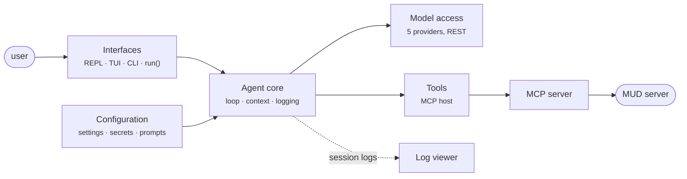

# boukensha · the MUD journey agent

boukensha is a Python agent that plays a MUD game server under
natural-language instruction. This package is the week 1 baseline carried
forward: the complete agent loop with multi-provider model access, MCP-hosted
tools, context management, cost accounting and session logging.



## Running

```bash
../bin/agent          # from anywhere: environment sync, then the REPL
uv run boukensha      # the same, from this folder
```

Arguments pass through to the app. The TUI, CLI and programmatic `run()`
entry points are described in the module docstrings under `boukensha/`.

## Configuration

Everything is in `.boukensha/settings.yaml` at the repository root, which is
self-documenting: active values are set, every optional key is shown commented
with its default. Secrets live in `.boukensha/.env`. `BOUKENSHA_DIR` points
the agent at a different configuration directory.

First run, in order:

1. Create `.boukensha/.env` next to `settings.yaml` with the secrets for the
   provider you use and the MUD character:

   | Variable | For |
   |---|---|
   | `ANTHROPIC_API_KEY` | the anthropic provider |
   | `GEMINI_API_KEY` | the gemini provider |
   | `OPENAI_API_KEY` | the openai provider |
   | `OLLAMA_API_KEY` | the ollama_cloud provider (local ollama needs none) |
   | `MUD_PASSWORD` | the MUD character password |

2. Pick the model in `settings.yaml` under `tasks.player`: set `provider` and
   `model`. The alternatives are present as commented lines, switching is
   uncommenting one pair.

3. Have the game side ready: the MUD server running, and the MCP server named
   by `mcp_servers.mud.command` installed on PATH. Its `env` block carries the
   connection settings (host, port, character name).

4. `bin/agent` from `week2_capable/`, then type a goal at the prompt.

The full `tasks.<name>` reference (the agent plays the `player` task):

| Key | Default | Meaning |
|---|---|---|
| `provider` | (required) | `anthropic`, `gemini`, `openai`, `ollama`, or `ollama_cloud` |
| `model` | (required) | a model in the catalog (`boukensha/models.yaml` or a `.boukensha` override) |
| `prompt_override.system` | `false` | use `prompts/<task>/system.md` when present |
| `thinking` | unset | reasoning effort: `none`, `minimal`, `low`, `medium`, `high`, `xhigh`, `max` |
| `max_iterations` | `25` | tool-call rounds per turn (`0` disables) |
| `max_output_tokens` | `1024` | per-call output-token cap |
| `max_turn_tokens` | `60000` | per-turn work ceiling across every token class (`0` disables) |
| `max_turn_cost` | disabled | per-turn money ceiling in dollars |
| `compaction_threshold` | `0.85` | window fraction that triggers auto-compaction |

`agent:` holds agent-wide defaults for the five limits. Resolution is the
per-task value first, then `agent:`, then the code default.

The `mcp_servers.<name>` reference (every tool the agent has comes from an
entry here, so the game connection is configuration, not code):

| Key | Default | Meaning |
|---|---|---|
| `command` | (required) | an executable on PATH |
| `args` | `[]` | arguments passed to it |
| `env` | `{}` | environment for the spawned server |
| `prefix` | none | agent-side tool-name prefix (`tbamud__look`) |
| `required` | `true` | `true` stops boot on a failed spawn, `false` warns and continues |
| `timeout` | `30` | per-call ceiling in seconds |
| `allow` / `deny` | none / `[]` | restrict or drop tool names |

The context window is not a setting: it is a model fact read from the catalog.

## Tests

```bash
uv run python -m unittest discover -s tests -t .
```

## Organization

```
agent/
├── boukensha/       the package: loop, context, backends, MCP host, logging
├── tests/           unit tests
├── pyproject.toml   project + pinned dependencies (uv.lock)
└── README.md        this file
```

Session logs land in `.boukensha/sessions/`, readable with the
[log viewer](../log_viewer/).
