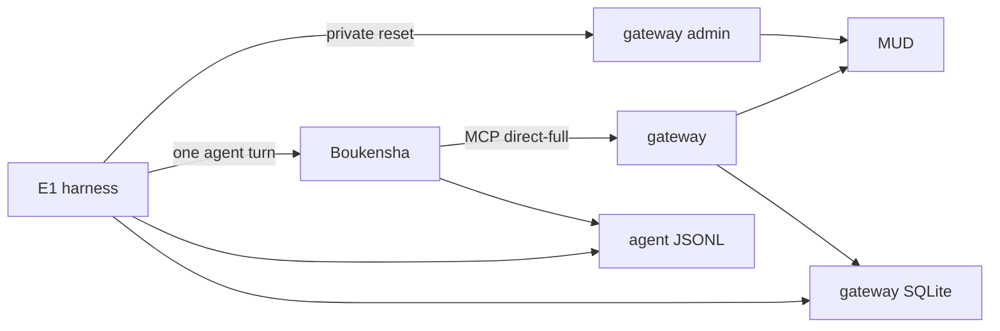

# Gateway journey benchmark

The benchmark measures correct game journeys and total model cost through the
same installed gateway used by the agent REPL and TUI.



## Setup

Install the gateway and benchmark as isolated user tools from the repository
root:

```console
uv tool install --editable ./week2_capable/gateway --force
uv tool install --editable ./week2_capable/benchmark --force
```

The repository `.boukensha/.env` supplies provider and MUD credentials to a
live run. The benchmark overlay copies public settings only.

## Run

The default command is free. It proves the installed 25-tool `direct-full`
surface and audits the tracked Week 1 corpus:

```console
boukensha-e1
```

A live attempt requires both an explicit spend flag and a cumulative cap:

```console
uv run --no-project --env-file .boukensha/.env boukensha-e1 --spend --cap 10
```

`--result-mode raw|minimal|full` selects the model-facing result shape for an
isolated run. The gateway journal always retains the complete typed envelope.
Use a fresh `--output-dir` for every measured mode.

Runtime artifacts go under `.boukensha/benchmarks/e1/`. A reset failure blocks
the agent process. An unpriced attempt is recorded for diagnosis but stops the
paid sequence and never enters aggregates.

Schema bytes are measured from the generated MCP JSON. The token field is an
explicit four-bytes-per-token estimate, so it is useful for comparing stable
profiles without pretending to be a provider tokenizer bill.
