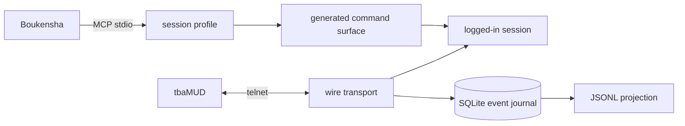

# MUD gateway

The gateway is the instrumented Python interface between Boukensha and the
game. It provides transport, login, wire capture, and a durable event journal.



## Layout

The project and its Python package use different names to keep their roles
clear.

```text
gateway/
├── mud_gateway/
│   ├── wire.py
│   ├── session.py
│   ├── journal.py
│   ├── commands.py
│   ├── profiles.py
│   ├── raw.py
│   ├── results.py
│   └── mcp_server.py
├── scripts/
│   └── live_smoke.py
├── tests/
├── pyproject.toml
└── uv.lock
```

`mud_gateway` is the import namespace. The outer `gateway` directory is the
application project.

## Behavior

- The transport preserves arbitrary socket chunk boundaries.
- Telnet negotiation bytes are filtered from game text and answered safely.
- Login follows name, password, MOTD, menu choice, then the vitals prompt.
- The password is replaced with a length-preserving redacted event before
  anything is persisted.
- SQLite runs in WAL mode with one journal writer.
- Events commit before subscribers receive them.
- Unknown journal schema versions are refused.
- JSONL export provides a supported projection for file-based consumers.
- One typed registry generates command validation and every MCP projection.
- A deny-by-default profile fixes the advertised tools for the whole session.
- Direct and grouped surfaces are generated from the same capabilities.
- Disabled capabilities are rejected by the server as typed errors.
- Profile identity, capability digest, coverage, and schema bytes are recorded.
- Named profiles deny `send_raw`. An explicit allowlist can enable it, and
  every use records a capability-gap event with its reason.
- Immortal credentials and typed admin operations stay outside this process.

## Verification

Run the hermetic suite:

```bash
uv sync --extra dev
uv run pytest
```

Run the live smoke test against the local game:

```bash
MUD_PASSWORD='...' uv run python scripts/live_smoke.py --player poucet
```

The live smoke test logs in, runs `look`, `score`, and `exits`, reconstructs inbound
traffic from the journal, and checks that no credential reached persisted
evidence.

Measure the named candidate profiles:

```bash
uv run python -m mud_gateway.mcp_server --measure
```

Prove one configured surface:

```bash
uv run python -m mud_gateway.mcp_server --prove
uv run python -m mud_gateway.mcp_server \
  --profile direct-full --allow look,move,send_raw --prove
```
