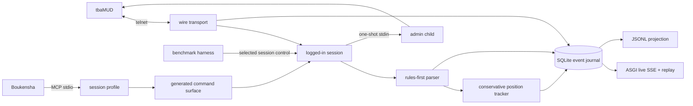
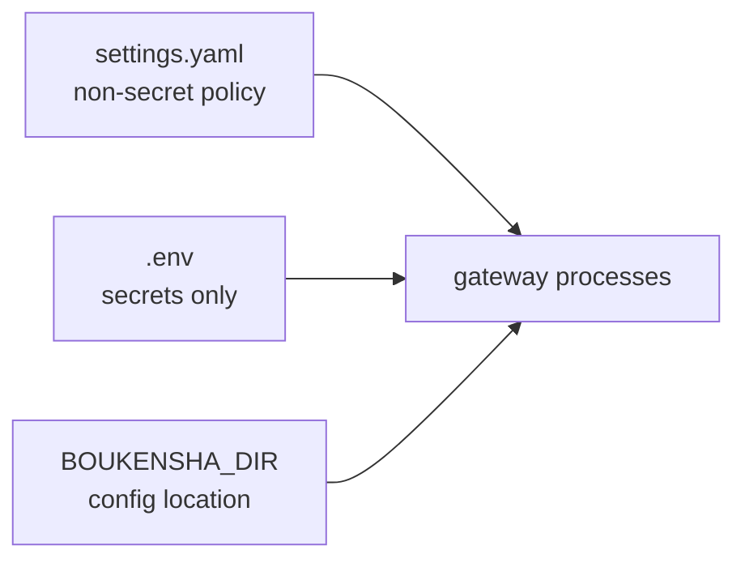

# MUD gateway

The gateway is the instrumented Python interface between Boukensha and the
game. It provides transport, login, wire capture, structured observations, and
a durable event journal.



## Layout

The project and its Python package use different names to keep their roles
clear.

```text
gateway/
├── admin_process/
│   ├── reset.py
│   └── server.py
├── mud_gateway/
│   ├── admin.py
│   ├── baseline.py
│   ├── reset_client.py
│   ├── reset_control.py
│   ├── wire.py
│   ├── session.py
│   ├── journal.py
│   ├── contracts.py
│   ├── commands.py
│   ├── observe.py
│   ├── observation_pipeline.py
│   ├── position.py
│   ├── stream.py
│   ├── api.py
│   ├── profiles.py
│   ├── raw.py
│   ├── results.py
│   └── mcp_server.py
├── scripts/
│   └── live_smoke.py
├── tests/
├── pyproject.toml
└── uv.lock
```

`mud_gateway` is the import namespace. The outer `gateway` directory is the
application project.

## Installation

Install the gateway as an isolated user-level command from the repository
root:

```bash
uv tool install --editable ./week2_capable/gateway
```

The editable install follows source changes without reinstalling:

```bash
boukensha-gateway --prove
boukensha-gateway-admin --help
boukensha-gateway-reset --help
boukensha-gateway-api --help
```

Run the install command again with `--force` after dependency or entry-point
changes. Do not install into the system Python and do not use `sudo`.

## Configuration

The gateway uses the repository's `.boukensha/settings.yaml`. Only secrets
belong in `.boukensha/.env`.



The `gateway:` block owns these durable settings:

| Settings key | Default | Purpose |
| --- | --- | --- |
| `connection.host` | `localhost` | MUD host |
| `connection.port` | `4000` | MUD port |
| `connection.player_profile` | `default` | Default configured mortal identity |
| `players.<id>.character` | profile id | MUD character for one player profile |
| `players.<id>.password_env` | `MUD_PASSWORD` | Secret name for that profile |
| `journal` | `.boukensha/gateway/gateway.db` | Fallback journal for a direct standalone launch |
| `surface.profile` | `direct-full` | Session-static projection preset |
| `surface.enable` | `[]` | Capabilities added to the preset |
| `surface.disable` | `[]` | Capabilities removed from the preset |
| `surface.allow_raw` | `false` | Explicitly permit reason-gated `send_raw` |
| `api.host` | `127.0.0.1` | Live API bind address |
| `api.port` | `8765` | Live API bind port |
| `admin.character` | `admin` | Immortal reset character |
| `admin.password_env` | `MUD_ADMIN_PASSWORD` | Secret name for the immortal identity |
| `reset.pause_timeout_seconds` | `15` | Wait for an in-flight mortal command |
| `reset.child_timeout_seconds` | `30` | Bound one privileged reset child |
| `reset.client_timeout_seconds` | `45` | Bound a control request |

The four surface presets are `direct-full`, `direct-core`, `hybrid-full`, and
`hybrid-core`. `disable` wins over `enable`. `send_raw` is controlled only by
`allow_raw`, so it cannot be enabled accidentally in a general list.

Valid typed capability names are:

```text
attack, cast_spell, channel_say, check, consider, consume_item, drop_item,
equip_item, examine, flee, get_item, look, move, mud_status, poll, practice,
put_item, save_character, say, set_position, shop, skill_strike, tell, track,
use_magic_item
```

Player identity is selected at runtime. A normal launch uses
`connection.player_profile`, while a one-off launch can override it:

```bash
boukensha-gateway --player-profile tester
```

An agent launch supplies an immutable runtime envelope. That envelope overrides
the default player profile and places the journal at
`.boukensha/profiles/<player>/sessions/<session>/gateway.db`. The gateway
validates the launcher-created gateway session id and gives reconnecting Telnet
connections separate transport ids.

Public identities stay in `settings.yaml`:

```yaml
gateway:
  connection:
    player_profile: poucet
  players:
    poucet:
      character: poucet
      password_env: MUD_PASSWORD
    tester:
      character: tester
      password_env: MUD_PASSWORD_TESTER
```

The matching secrets may live in the shared `.env` or in a profile-specific
`.boukensha/profiles/<id>/.env`. Process environment values take precedence.

| Secret | Used by |
| --- | --- |
| `MUD_PASSWORD` | Example `poucet` profile |
| `MUD_PASSWORD_TESTER` | Example `tester` profile |
| `MUD_ADMIN_PASSWORD` | One-shot administrator reset child |

Player and administrator identities use distinct secret names. The
administrator block never contains a player target. Reset targets are selected
per operation rather than stored as installation-level configuration. During a
launcher-managed reset, the gateway reads the named admin value from the shared
secret file only when it creates the one-shot child. The admin value never
enters the mortal agent or gateway process environment.

`BOUKENSHA_DIR` is the only configuration environment variable. It points to
the directory containing `settings.yaml` and `.env`. Without it, the gateway
finds the nearest `.boukensha` directory, then falls back to
`~/.boukensha`.

Runtime paths are fixed conventions because changing one side independently
would break identity and evidence joins:

| Convention | Location or rule |
| --- | --- |
| registry | `.boukensha/registry.db` |
| character locks | `.boukensha/locks/<character-digest>.lock` |
| session evidence | `.boukensha/profiles/<player>/sessions/<session>/` |
| control token | `control.token` inside the protected session |
| control socket | short system-temporary path derived from the session id |
| gateway journal | `gateway.db` inside the selected session |
| reset baseline | versioned manifest in `mud_gateway.baseline` |
| legacy import source | explicit path passed to `boukensha-sessions import-legacy` |

These are not environment configuration knobs. The launcher creates and binds
them atomically. `BOUKENSHA_*` values used between supervised child processes
are internal runtime metadata, not settings users should export by hand.

CLI profile and allowlist flags remain available for one-off surface proofs.
Normal agent and API launches read YAML and need no repeated settings:

```bash
boukensha-gateway --prove
boukensha-gateway-api
```

## Behavior

- The transport preserves arbitrary socket chunk boundaries.
- Telnet negotiation bytes are filtered from game text and answered safely.
- Login follows name, password, MOTD, menu choice, then the vitals prompt.
- The password is replaced with a length-preserving redacted event before
  anything is persisted.
- SQLite runs in WAL mode with one journal writer.
- A runtime journal has one live writer lock. A second writer is refused, while
  a replacement gateway can reopen it after the prior process exits.
- A corrupt journal is preserved with a timestamped suffix and reported as a
  capture gap. It is never silently replaced.
- Live readers see only committed events.
- Unknown journal schema versions are refused.
- JSONL export provides a supported projection for file-based consumers.
- One typed registry generates command validation and every MCP projection.
- A deny-by-default profile fixes the advertised tools for the whole session.
- Direct and grouped surfaces are generated from the same capabilities.
- Disabled capabilities are rejected by the server as typed errors.
- Profile identity, capability digest, coverage, and schema bytes are recorded.
- Named profiles deny `send_raw`. An explicit allowlist can enable it, and
  every use records a capability-gap event with its reason.
- Reset pauses the selected authenticated mortal session at a command boundary.
- A one-shot admin child receives one typed stdin request and only the admin
  secret.
- Mortal `save`, reconnect, `score`, and `look` verify the reset on that same
  session.
- Failure before mutation resumes with a receipt. Partial mutation quarantines
  the session until a linked retry succeeds or the session stops.
- Gateway control state is projected beside the session evidence. Discovery
  labels it separately from launcher-owned process state.
- Live SSE and historical replay use one deterministic event serializer.
- Live readers tail committed sequence cursors across process boundaries.
- `Last-Event-ID` resumes from the durable journal sequence.
- Slow readers catch up from SQLite without an in-memory event backlog.
- `/contracts` publishes canonical event, capability, query, and projection
  schemas.
- `/capabilities` identifies the exact contract and delivery guarantees.
- Canonical wire replay reconstructs exact captured bytes, including
  length-preserving zeroes for credentials redacted before persistence.
- ANSI colour and line shape produce typed room, exit, vital, and state
  observations.
- Every observation records confidence, method, parser version, and its source
  wire range.
- Unknown lines remain `unparsed` events and contribute to the parse-miss rate.
- Position uses arrival paths, exits, and neighbourhoods. A duplicate title is
  never sufficient evidence to merge two places.
- The agent-facing `observe` and `navigate` capabilities remain disabled.
- Agent and gateway records preserve launcher-created player, agent, session,
  and gateway session identity without filename or time inference.

## Verification

Run the hermetic suite:

```bash
uv sync --extra dev
uv run pytest
```

Run the live smoke test against the local game:

```bash
uv run python scripts/live_smoke.py --player-profile poucet
```

The live smoke test logs in, runs `look`, `score`, and `exits`, reconstructs inbound
traffic from the journal, and checks that no credential reached persisted
evidence.

Measure the named candidate profiles:

```bash
uv run python -m mud_gateway.mcp_server --measure
```

Replay every retained session and report parser coverage:

```bash
uv run python scripts/replay_observations.py
```

Prove one configured surface:

```bash
uv run python -m mud_gateway.mcp_server --prove
uv run python -m mud_gateway.mcp_server \
  --profile direct-full --allow look,move,send_raw --prove
```

Run the repeatable live reset gate against a selected active session:

```bash
uv run python scripts/reset_smoke.py \
  --session-dir ../../.boukensha/profiles/poucet/sessions/<session-id>
```

Serve live and replay views locally:

```bash
boukensha-gateway-api
```

Verify a retained journal replays deterministically:

```bash
uv run python scripts/stream_smoke.py \
  --journal ../../.boukensha/gateway/live-smoke.db
```

Report capability and argument-shape coverage:

```bash
uv run python scripts/capability_report.py
```
