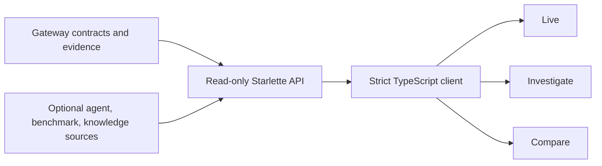

# Boukensha observatory

The observatory is a local, read-only flight recorder and experiment studio for
the agent. Its first shell establishes the product language and source
capability boundary. Live session projection follows in the next increment.



## Current interface

- Three modes only: Live, Investigate, and Compare.
- A living-world canvas is the spatial anchor.
- Belief and observed state remain visually separate.
- Diagnostics link failures to evidence moments.
- The Chronicle aligns causal events with model cost.
- Ask and search share one keyboard-accessible entry point.
- Source health distinguishes ready, disabled, and unavailable.
- Desktop and narrow layouts use the same information hierarchy.

The representative J2 data currently demonstrates the intended interaction and
visual states. It is not presented as a live session.

## Layout

```text
observatory/
├── observatory_api/
│   ├── app.py
│   ├── capabilities.py
│   ├── contracts.py
│   ├── settings.py
│   └── sources/
├── tests/
├── web/
│   ├── src/
│   │   ├── app/
│   │   └── components/
│   ├── package.json
│   └── vite.config.ts
├── pyproject.toml
└── README.md
```

## Install

From `week2_capable/observatory`:

```bash
uv sync --extra dev
cd web
npm install
npm run build
```

The Python and JavaScript dependencies are pinned. Frontend build output and
package directories remain uncommitted.

## Launch

From the repository root:

```bash
./week2_capable/bin/observatory
```

Open <http://127.0.0.1:8787>. The launcher binds to loopback by default.

For frontend development, run both processes:

```bash
./week2_capable/bin/observatory
cd week2_capable/observatory/web
npm run dev
```

Open <http://127.0.0.1:5174>. Vite proxies `/api` to the local read API.

## Configure

The API uses explicit environment variables:

| Variable | Default | Purpose |
| --- | --- | --- |
| `OBSERVATORY_GATEWAY_URL` | `http://127.0.0.1:8765` | Gateway HTTP and SSE source |
| `OBSERVATORY_AGENT_EVENTS` | disabled | Agent event source |
| `OBSERVATORY_BENCHMARK_ROOT` | disabled | Benchmark evidence root |
| `OBSERVATORY_KNOWLEDGE_DB` | disabled | Knowledge-store database |
| `OBSERVATORY_WEB_DIST` | `web/dist` | Built frontend location |

Unavailable or disabled sources remain visible with an explanation. The
observatory never invents data to fill an absent source.

## Verify

```bash
uv run pytest
uv lock --check
cd web
npm test
npm run build
```

UI changes require rendered checks at desktop and narrow widths. The shell has
been verified at both, including keyboard focus, capability fallback, and
reduced-motion behavior.
