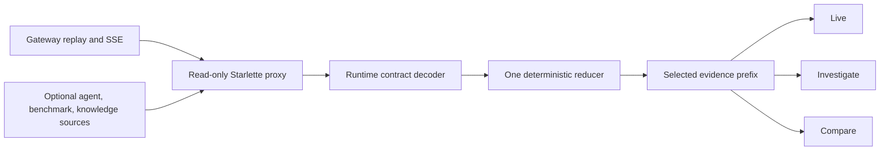

# Boukensha observatory

The observatory is a local, read-only flight recorder and experiment studio for
the agent. It follows committed gateway evidence live and reconstructs any
selected historical prefix through the same deterministic reducer.



## Current interface

- Three modes only: Live, Investigate, and Compare.
- Live ingestion and replay use the same canonical event envelope.
- Sequence cursors deduplicate at-least-once delivery and expose gaps.
- Pausing selects an immutable prefix while live ingestion continues.
- Session and sequence live in the URL for a shareable evidence moment.
- Unknown event kinds remain available instead of being discarded.
- Investigate joins benchmark outcomes to their agent causal trace.
- A waterfall separates plans, model responses, tool calls, results, and cost.
- The evidence lens keeps wire, parsed, rendered, believed, and truth forms
  distinct.
- Diagnostics explain their trigger and cite the evidence behind each finding.
- Structured filters and saved views narrow long traces without a model call.
- A living-world canvas is the spatial anchor.
- Belief and observed state remain visually separate.
- Diagnostics link failures to evidence moments.
- The Chronicle aligns causal events with model cost.
- Ask and search share one keyboard-accessible entry point.
- Source health distinguishes ready, disabled, and unavailable.
- Desktop and narrow layouts use the same information hierarchy.

When gateway evidence is available, the interface labels and renders it as
such. The representative J2 state appears only when no gateway session is
available.

Configured benchmark evidence adds recorded runs to Investigate. Local paths
and credentials never enter the browser contract.

## Layout

```text
observatory/
├── observatory_api/
│   ├── app.py
│   ├── capabilities.py
│   ├── contracts.py
│   ├── settings.py
│   └── sources/
├── tests/
├── web/
│   ├── src/
│   │   ├── app/
│   │   ├── components/
│   │   └── data/
│   ├── package.json
│   └── vite.config.ts
├── pyproject.toml
└── README.md
```

## Install

From `week2_capable/observatory`:

```bash
uv sync --extra dev
cd web
npm install
npm run build
```

The Python and JavaScript dependencies are pinned. Frontend build output and
package directories remain uncommitted.

## Launch

From the repository root:

```bash
./week2_capable/bin/observatory
```

Open <http://127.0.0.1:8787>. The launcher binds to loopback by default.

For frontend development, run both processes:

```bash
./week2_capable/bin/observatory
cd week2_capable/observatory/web
npm run dev
```

Open <http://127.0.0.1:5174>. Vite proxies `/api` to the local read API.

## Configure

The API uses explicit environment variables:

| Variable | Default | Purpose |
| --- | --- | --- |
| `OBSERVATORY_GATEWAY_URL` | `http://127.0.0.1:8765` | Gateway HTTP and SSE source |
| `OBSERVATORY_AGENT_EVENTS` | disabled | Agent event source |
| `OBSERVATORY_BENCHMARK_ROOT` | disabled | Benchmark evidence root |
| `OBSERVATORY_KNOWLEDGE_DB` | disabled | Knowledge-store database |
| `OBSERVATORY_WEB_DIST` | `web/dist` | Built frontend location |

Unavailable or disabled sources remain visible with an explanation. The
observatory never invents data to fill an absent source.

Relative source paths are resolved from the repository root by the launcher.
For the local benchmark evidence:

```bash
OBSERVATORY_BENCHMARK_ROOT=.boukensha/benchmarks \
  ./week2_capable/bin/observatory
```

The selected evidence moment is encoded as `?session=<id>&seq=<number>`. Opening
that URL reconstructs the same prefix, then continues ingesting newer events
without moving the historical cursor.

Investigations also encode the mode, run, causal sequence, diagnostic, and
structured query in the URL. Reloading returns to the same evidence-backed
view.

## Verify

```bash
uv run pytest
uv lock --check
cd web
npm test
npm run build
```

UI changes require rendered checks at desktop and narrow widths. The shell has
been verified against a real gateway journal and at narrow width, including
historical selection, keyboard focus, capability fallback, and reduced-motion
behavior.
