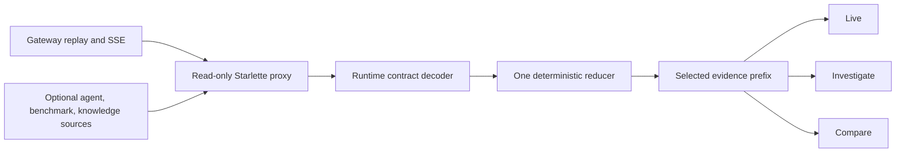

# Boukensha observatory

The observatory is a local, read-only flight recorder and experiment studio for
the agent. It follows committed gateway evidence live and reconstructs any
selected historical prefix through the same deterministic reducer.



## Current interface

The current product shell establishes the visual and interaction system:

- Four destinations: Live, Sessions, Experiments, and Knowledge.
- One context-aware header with player, applicable session, Load, and theme.
- Persistent dark and light themes.
- Comfortable and dense design tokens.
- Representative Live workspace with world, objective, attention, economics,
  activity, and evidence forms.
- Scoped Ask entry inside the active workspace.
- Agent-control preview only in Live.
- Wire, Parsed, Rendered, Believed, and Truth remain distinct evidence forms.
- Truth and unavailable sources remain visibly missing or incomplete.
- Desktop and narrow layouts retain the same information and actions.
- Keyboard focus returns to the invoking control after dialogs close.
- Forced colors, reduced motion, and 200 percent layout remain operable.

The shell uses representative evidence. Live delivery, deterministic replay,
Sessions investigation, Experiments execution, and Knowledge workflows land in
their owning increments.

### Reset boundary

The product surface is new. Proven infrastructure remains:

| Classification | Content |
| --- | --- |
| Retained | Typed read API, evidence contracts, capability transport, build setup, pinned dependencies, and test harness |
| New | App entry, product shell, destination hierarchy, tokens, styles, responsive behavior, and accessible primitives |
| Adapted | Capability state consumed by contextual workspace status |
| Obsolete | Earlier presentation components not imported by the new entry |

## Layout

```text
observatory/
├── observatory_api/
│   ├── app.py
│   ├── capabilities.py
│   ├── contracts.py
│   ├── incidents.py
│   ├── settings.py
│   ├── projections/
│   └── sources/
├── tests/
├── web/
│   ├── src/
│   │   ├── app/
│   │   ├── components/
│   │   └── data/
│   ├── package.json
│   └── vite.config.ts
├── pyproject.toml
└── README.md
```

## Install

From `week2_capable/observatory`:

```bash
uv sync --extra dev
cd web
npm install
npx playwright install chromium
npm run build
```

The Python and JavaScript dependencies are pinned. Frontend build output and
package directories remain uncommitted.

Playwright provides reproducible browser workflows. Axe runs semantic
accessibility checks inside the same Chromium matrix.

## Launch

From the repository root:

```bash
./week2_capable/bin/observatory
```

Open <http://127.0.0.1:8787>. The launcher binds to loopback by default.

For frontend development, run both processes:

```bash
./week2_capable/bin/observatory
cd week2_capable/observatory/web
npm run dev
```

Open <http://127.0.0.1:5174>. Vite proxies `/api` to the local read API.

## Configure

The API uses explicit environment variables:

| Variable | Default | Purpose |
| --- | --- | --- |
| `OBSERVATORY_GATEWAY_URL` | `http://127.0.0.1:8765` | Gateway HTTP and SSE source |
| `OBSERVATORY_AGENT_EVENTS` | disabled | Agent event source |
| `OBSERVATORY_BENCHMARK_ROOT` | disabled | Benchmark evidence root |
| `OBSERVATORY_KNOWLEDGE_DB` | disabled | Knowledge-store database |
| `OBSERVATORY_WEB_DIST` | `web/dist` | Built frontend location |
| `OBSERVATORY_COPILOT_MODEL` | disabled | Optional Anthropic translator model |
| `OBSERVATORY_COPILOT_ENDPOINT` | Anthropic messages API | Translator REST endpoint |
| `OBSERVATORY_COPILOT_SPEND_CAP` | `0` | Process-local translator cost ceiling |
| `OBSERVATORY_COPILOT_INPUT_RATE` | `0` | Input dollars per million tokens |
| `OBSERVATORY_COPILOT_OUTPUT_RATE` | `0` | Output dollars per million tokens |
| `OBSERVATORY_REVISION` | launcher revision | Repository revision recorded in capsules |
| `OBSERVATORY_DISABLED_FEATURES` | empty | Comma-separated features hidden by policy |

Unavailable or disabled sources remain visible with an explanation. The
observatory never invents data to fill an absent source.

Model translation also requires `ANTHROPIC_API_KEY`. The key remains
server-side. A user must enable model translation for the individual question,
and the deterministic planner always runs first.

Relative source paths are resolved from the repository root by the launcher.
For the local benchmark evidence:

```bash
OBSERVATORY_BENCHMARK_ROOT=.boukensha/benchmarks \
  ./week2_capable/bin/observatory
```

The active destination is encoded as `?space=<name>`. Player and session remain
explicit shell context. The live and replay increments add stable evidence
selection to the URL.

The read API already includes sanitized incident-capsule contracts. The
Knowledge and incident increment adds their product workflow and offline reopen.

## Verify

```bash
uv run pytest
uv lock --check
cd web
npm test
npm run build
npm run test:budget
npm run test:e2e
```

UI changes require rendered checks at desktop and narrow widths. The product
shell verifies keyboard focus, source failure, theme persistence, 200 percent
layout, forced colors, reduced motion, and root overflow behavior.

## Product hardening

The production surface keeps these gates executable from a fresh clone:

| Gate | Enforced behavior |
| --- | --- |
| Unit | Components, preferences, capability contracts, redaction, and imports |
| End to end | Desktop and 390-pixel flows in Chromium |
| Accessibility | Automated semantic audit, forced colors, and reduced motion |
| Failure | Unavailable and disabled sources remain explicit |
| Policy | Named capabilities disappear from discovery and navigation |
| Performance | JavaScript under 300 KB raw and 90 KB gzip |
| Performance | CSS under 60 KB raw and 12 KB gzip |

The architecture and feature acceptance contracts live in
`docs/plans/week2_observ/observatory.md` and `product_spec.md`.
