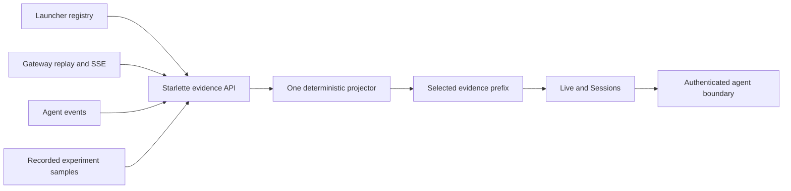
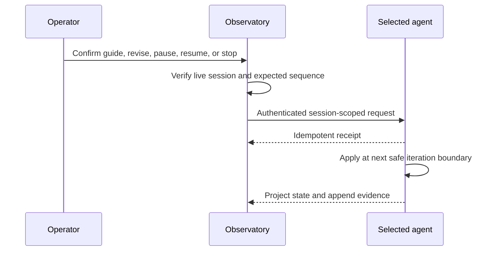

# Boukensha observatory

The observatory is a local flight recorder and experiment studio for the
agent. Its evidence plane is read-only. A narrow authenticated control plane
can direct one selected live agent. Every historical prefix is reconstructed
through the same deterministic projector.



## Current interface

Live is connected to registered runtime evidence:

- Four destinations: Live, Sessions, Experiments, and Knowledge.
- One context-aware header with player, applicable session, Load, and theme.
- Persistent dark and light themes.
- Comfortable and dense design tokens.
- Registered players and sessions discovered without scanning by file time.
- Live SSE and recorded replay pass through one deterministic event reducer.
- World, objective, cost, tokens, iterations, activity, and source completeness.
- One causal clock reconstructs every panel at a selected sequence.
- Pause, scrub, bookmark, and return-to-live controls.
- Grow, Focus, and Lantern world modes.
- One evidence-backed world surface shared by Live and Sessions.
- Duplicate room identities, candidate explanations, sightings, and objective beacons.
- An isolated observer atlas with overview and zone level-of-detail.
- A structured list equivalent for both the journey graph and atlas canvas.
- Scoped Ask entry inside the active workspace.
- Authenticated guidance, goal revision, pause, resume, and stop in Live.
- Wire, Parsed, Rendered, Believed, and Truth remain distinct evidence forms.
- Truth and unavailable sources remain visibly missing or incomplete.
- Player switching replaces every session-bound evidence projection.
- Desktop and narrow layouts retain the same information and actions.
- Keyboard focus returns to the invoking control after dialogs close.
- Forced colors, reduced motion, and 200 percent layout remain operable.

Sessions turns an explicitly selected experiment sample into an investigation:

- Agent, gateway, Telnet wire, parsed state, and verified outcome stay distinct.
- Story, sequence, evidence, cost, and diagnostic lenses share one selection.
- Event, turn, and milestone replay expose only the selected evidence prefix.
- Every retained record opens exact sanitized fields, ancestry, and correlations.
- Structured filters and saved views narrow evidence without hiding its source.
- Wire, Parsed, Rendered, Believed, and Truth expose missing forms as gaps.
- Ten deterministic diagnostics show rules, thresholds, alternatives, and evidence.
- Cache-aware per-response costs reconcile to the retained attempt cost curve.
- Raw response cost fields remain visible beside the reconciled ledger.
- Ask uses local typed operations, the selected run, and the replay moment.
- Benchmark outcome enters only through the selected experiment-sample link.
- Stable URLs restore the player, run, lens, room, and selected record.

The browser tests use deterministic representative evidence. The launched
product reads the local runtime registry and selected session journals.
Sessions reads explicitly correlated benchmark evidence. Experiments execution
and Knowledge workflows land in their owning increments.

### Reset boundary

The product surface is new. Proven infrastructure remains:

| Classification | Content |
| --- | --- |
| Retained | Typed read API, evidence contracts, capability transport, build setup, pinned dependencies, and test harness |
| New | App entry, product shell, destination hierarchy, tokens, styles, responsive behavior, and accessible primitives |
| Adapted | Capability state consumed by contextual workspace status |
| Obsolete | Earlier presentation components not imported by the new entry |

## Layout

```text
observatory/
├── observatory_api/
│   ├── app.py
│   ├── capabilities.py
│   ├── contracts.py
│   ├── incidents.py
│   ├── settings.py
│   ├── projections/
│   └── sources/
├── tests/
├── web/
│   ├── src/
│   │   ├── app/
│   │   ├── components/
│   │   └── data/
│   ├── package.json
│   └── vite.config.ts
├── pyproject.toml
└── README.md
```

## Install

From `week2_capable/observatory`:

```bash
uv sync --extra dev
cd web
npm install
npx playwright install chromium
npm run build
```

The Python and JavaScript dependencies are pinned. Frontend build output and
package directories remain uncommitted.

Playwright provides reproducible browser workflows. Axe runs semantic
accessibility checks inside the same Chromium matrix.

## Launch

From the repository root:

```bash
./week2_capable/bin/observatory
```

Open <http://127.0.0.1:8787>. The launcher binds to loopback by default.

For frontend development, run both processes:

```bash
./week2_capable/bin/observatory
cd week2_capable/observatory/web
npm run dev
```

Open <http://127.0.0.1:5174>. Vite proxies `/api` to the local read API.

## Configure

Durable non-secret policy lives in `.boukensha/settings.yaml`. Environment
variables provide process-local source paths and overrides:

| Variable | Default | Purpose |
| --- | --- | --- |
| `BOUKENSHA_DIR` | nearest `.boukensha` ancestor | Registered player sessions and runtime evidence |
| `BOUKENSHA_WORLD` | `observatory.world.path` | One-run override for the observer atlas source |
| `OBSERVATORY_GATEWAY_URL` | `http://127.0.0.1:8765` | Gateway HTTP and SSE source |
| `OBSERVATORY_AGENT_EVENTS` | disabled | Agent event source |
| `OBSERVATORY_BENCHMARK_ROOT` | disabled | Benchmark evidence root |
| `OBSERVATORY_KNOWLEDGE_DB` | disabled | Knowledge-store database |
| `OBSERVATORY_WEB_DIST` | `web/dist` | Built frontend location |
| `OBSERVATORY_COPILOT_MODEL` | disabled | Optional Anthropic translator model |
| `OBSERVATORY_COPILOT_ENDPOINT` | Anthropic messages API | Translator REST endpoint |
| `OBSERVATORY_COPILOT_SPEND_CAP` | `0` | Process-local translator cost ceiling |
| `OBSERVATORY_COPILOT_INPUT_RATE` | `0` | Input dollars per million tokens |
| `OBSERVATORY_COPILOT_OUTPUT_RATE` | `0` | Output dollars per million tokens |
| `OBSERVATORY_REVISION` | launcher revision | Repository revision recorded in capsules |
| `OBSERVATORY_DISABLED_FEATURES` | empty | Comma-separated features hidden by policy |

Unavailable or disabled sources remain visible with an explanation. The
observatory never invents data to fill an absent source.

The atlas parser retains room numbers, titles, zones, and exits. Atlas truth is
quarantined from agent belief. A live or recorded room is not correlated to an
atlas room unless its evidence includes the stable world room number.

The durable atlas path belongs in `.boukensha/settings.yaml`:

```yaml
observatory:
  world:
    path: week0_explore/circlemud-world-parser/assets/wld
```

Model translation also requires `ANTHROPIC_API_KEY`. The key remains
server-side. A user must enable model translation for the individual question,
and the deterministic planner always runs first.

Relative source paths are resolved from the repository root by the launcher.
For the local benchmark evidence:

```bash
OBSERVATORY_BENCHMARK_ROOT=.boukensha/benchmarks \
  ./week2_capable/bin/observatory
```

The active destination is encoded as `?space=<name>`. Player and session remain
explicit shell context.

### Live control boundary

Live control does not send game commands from the browser. The launcher gives
each agent process an authenticated local operator endpoint:



- The browser sends no credential.
- The API reads the selected session token server-side.
- Player, session, endpoint, and expected sequence must all match.
- Guidance and revisions enter context as labelled operator messages.
- Pause and stop cannot interrupt a provider request already in flight.
- A stale, ended, mismatched, or unavailable target is rejected.
- Operator state and applied directives become observable evidence.

The read API already includes sanitized incident-capsule contracts. The
Knowledge and incident increment adds their product workflow and offline reopen.

## Verify

```bash
uv run pytest
uv lock --check
cd web
npm test
npm run build
npm run test:budget
npm run test:e2e
```

UI changes require rendered checks at desktop and narrow widths.

- Live gates time travel, return to combat, player isolation, and control.
- Sessions gates replay, exact source reachability, Ask scope, and cost.
- Shared gates cover focus, source failure, themes, accessibility, and overflow.

## Product hardening

The production surface keeps these gates executable from a fresh clone:

| Gate | Enforced behavior |
| --- | --- |
| Unit | Components, preferences, capability contracts, redaction, and imports |
| End to end | Desktop and 390-pixel flows in Chromium |
| Accessibility | Automated semantic audit, forced colors, and reduced motion |
| Failure | Unavailable and disabled sources remain explicit |
| Policy | Named capabilities disappear from discovery and navigation |
| Performance | JavaScript under 300 KB raw and 90 KB gzip |
| Performance | CSS under 60 KB raw and 12 KB gzip |

The architecture and feature acceptance contracts live in
`docs/plans/week2_observ/observatory.md` and `product_spec.md`.
