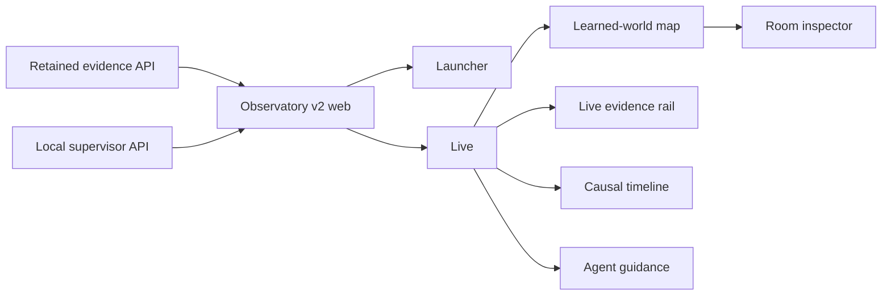

# Boukensha Observatory v2

## What it is

Observatory v2 is the current Observatory frontend. It rebuilds the product
surface on the retained Observatory Python data layer, typed evidence
contracts, and read API. The local supervisor API adds typed start, stop, and
agent-message actions without changing the evidence boundary.



Detailed behavior and acceptance contracts live in the
[Observatory plans](../../docs/plans/week2_observ/observatory/).

## Layout

```text
observatory_v2/
├── api/
│   ├── observatory_v2_api/
│   │   └── server.py
│   ├── tests/
│   ├── pyproject.toml
│   └── uv.lock
├── web/
│   ├── src/
│   │   ├── live/
│   │   ├── App.tsx
│   │   ├── Launcher.tsx
│   │   └── contracts.ts
│   ├── package.json
│   ├── tsconfig.json
│   └── vite.config.ts
└── README.md
```

- `api/` owns the loopback-only session supervisor used by launcher and
  lifecycle controls.
- `web/` owns the React application, strict TypeScript contracts, theme,
  launcher, Live shell, map, room inspector, and component tests.
- [`../observatory/`](../observatory/) remains the typed evidence API and
  static application host.

## Install

From `week2_capable/observatory_v2`:

```bash
uv sync --project ../observatory --extra dev
uv sync --project api
cd web
npm ci
npm run build
```

Python and JavaScript dependencies are pinned. Virtual environments,
`node_modules`, and frontend build output remain uncommitted.

## Launch

Build the frontend, then run the supervisor and retained Observatory host in
separate terminals from the repository root:

```bash
cd week2_capable/observatory_v2/web
npm run build
```

```bash
uv run --project week2_capable/observatory_v2/api \
  python -m observatory_v2_api.server
```

```bash
./week2_capable/bin/observatory
```

Open <http://127.0.0.1:8787>. The launcher is served at `/`. A Live deep link
uses `/live?player=<player>&session=<session>`.

For frontend development, keep both Python processes running and start Vite:

```bash
cd week2_capable/observatory_v2/web
npm run dev
```

Open <http://127.0.0.1:8791>. Vite proxies evidence requests to port `8787`
and lifecycle requests to port `8792`.

## Configure

Durable non-secret source policy lives in `.boukensha/settings.yaml`. These
environment variables affect the v2 launch directly:

| Variable | Default | Purpose |
| --- | --- | --- |
| `BOUKENSHA_DIR` | repository `.boukensha` | Player profiles, registered sessions, and supervisor state |
| `BOUKENSHA_OBSERVATORY_IDLE_TIMEOUT_SECONDS` | `1800` | Stop a persistent session after this many idle seconds. `0` disables the timeout. |

The `week2_capable/bin/observatory` command always selects the v2 production
build for the retained static host. It exits with a build instruction when the
v2 output is unavailable.

The retained API accepts additional evidence-source settings documented in
the [Observatory README](../observatory/README.md#configure). Missing sources
remain visibly unavailable. Neither API invents replacement evidence.

## Screens

### Launcher

The launcher lists registered players and sessions, starts a supervised run,
and opens an existing live session. Session state and available actions come
from typed runtime contracts. An optional first goal starts turn one through
the persistent plain REPL. Completing that turn leaves the session available
for later instructions. The supervisor stops it after the configured idle
timeout, 30 minutes by default. Starting owns the launcher with a named
connecting state until Live opens or a typed failure restores the form.

### Live shell

The Live shell keeps player, lifecycle state, and session identity in one
context control. It provides theme, scoped Ask, valid lifecycle actions, and
navigation without changing the selected evidence source. The objective strip,
evidence rail, active-combat panel, and thought age expose retained state
without claiming that a stale observation is current. Message agent retains
one authenticated Goal or Nudge, makes it available at the next active
iteration boundary, and also queues a persistent wake envelope. An active turn
consumes the directive and later ignores the wake. An idle agent uses the wake
to start a turn whose first checkpoint consumes the directive. This removes
the turn-end race without placing internal wake data in model context.
The active-combat panel follows the initial Live mock's left-side spotlight,
streams retained MUD combat lines in sequence order, and follows the newest
line as the fight grows. Unsolicited combat frames update the stream and prompt
vitals without a `score` probe. It participates in Focus camera occlusion, so
the panel does not hide the current room.
The objective strip always renders: structured current metadata wins, retained
compatibility text remains visible for older sessions, and an unset objective
is stated directly. Applied replacements carry their revision count, while
Nudge guidance never becomes the displayed goal.
The rail keeps navigation progress in one stable block, emphasizes retained
friction rules when they fire, and states lifecycle or capture conditions when
measurements would be unsafe. The causal timeline keeps a current snapshot
beside any selected historical prefix, so room and level-up landmarks can step
backward and forward without losing the route back to live. Pause becomes
Resume while a prefix is held. Step buttons enable only when an adjacent
retained event exists, and Jump to live enables only outside the live edge.
Its cost curve comes only from retained response economics. Quiet room markers
establish the journey baseline. Emphasized level-up, fired-friction, and
applied operator-message markers select the first prefix that contains their
evidence. Combat boundaries remain absent until typed episode history exists.

### Learned-world map

The map renders the agent's retained room, traversal, frontier, visit, mob,
object, and thought evidence inside the final Live map pane. Grow, Focus, and
Lantern change presentation without changing learned coordinates. Follow,
Manual, Fit, drag, and zoom operate against the map viewport while the thought
dock and legend remain overlays. Reflow compares evidence-order and topology
layouts, swaps rooms and relocates them into free lattice cells to minimize
connection crossings, keeps compass direction as a soft constraint, and fits
the result without changing evidence. The soft constraint keeps non-Euclidean
CircleMUD mazes readable instead of forcing impossible compass geometry.
Follow holds the camera while the current room stays inside its central dead
zone, then catches up without overshoot. An unconnected position jump snaps
instead of imitating observed traversal.

### Room inspector

Selecting a room opens its retained description, exits, visits, sightings,
cost, confidence, and provenance. Agent observations remain distinct from the
separately labelled Atlas reference, and the selected room is restorable from
the `room` URL parameter.

## Verify

From `week2_capable/observatory_v2/web`:

```bash
npm test
npm run build
```

The frontend suite contains 157 tests across 21 files. `npm run build` runs
strict TypeScript checking with `tsc --noEmit` before producing the Vite
production bundle.

The supervisor boundary has a separate Python suite:

```bash
uv run --project ../api --with pytest==9.1.1 pytest ../api/tests
```

## Dependencies

- React and React DOM provide the component application.
- Lucide React provides accessible interface icons.
- Vite builds and serves the frontend.
- TypeScript checks the public frontend contracts in strict mode.
- Vitest, jsdom, and React Testing Library verify behavior and routing.
- The supervisor API uses the Python standard library and has no runtime
  package dependencies.
