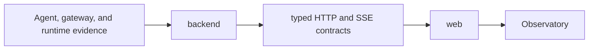

# Observatory v3

Observatory v3 is the single production home for the rebuilt application.



## Ownership

- `backend/` owns all new Observatory backend production code.
- `web/` owns the React application and its verification gates.
- No production source imports or executes code from `observatory/` or
  `observatory_v2/`.
- The older packages are temporary executable references only.
- Deleting both older packages must not affect v3 build, test, or runtime
  behavior.

## Current state

- The web foundation is implemented under `web/`.
- The backend boundary is reserved for the B1 implementation.
- The B0 comparison harness is transition tooling outside production code.

## Commands

Run frontend commands from `web/`.

```bash
cd week2_capable/observatory_v3/web
npm run check
npm run dev
```
