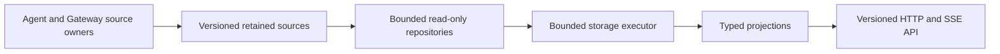
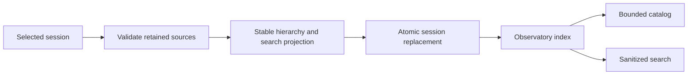
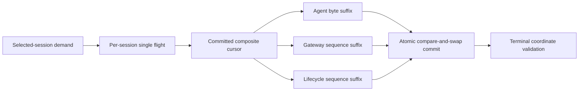
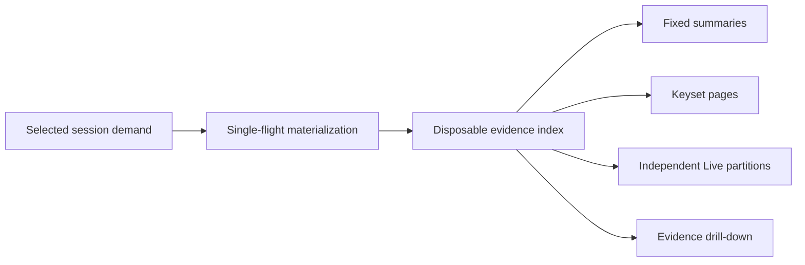
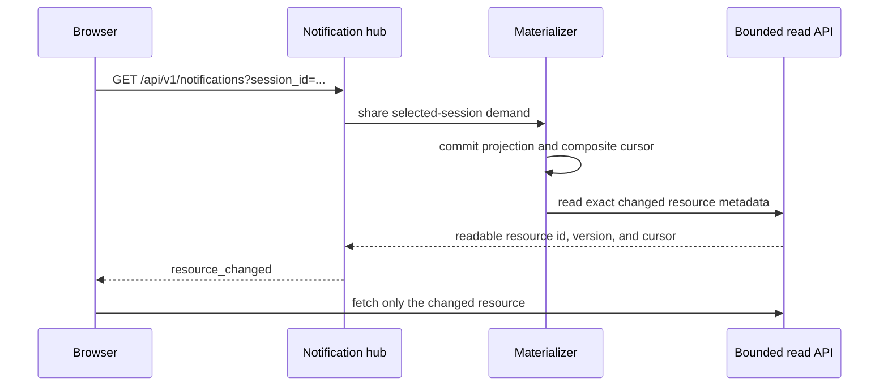
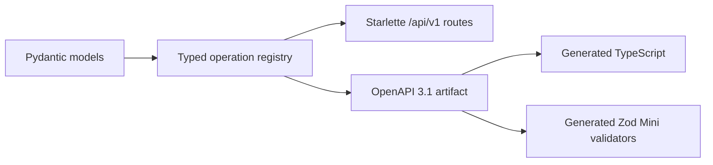

# Observatory v3 backend

This package owns the standalone Observatory backend.



## Source boundary

- The launcher owns registry schema version 1 and its migration from version 0.
- Gateway journals own schema version 1.
- The Observatory validates source schemas without mutating them.
- Unknown schemas fail without changing source bytes.
- Selected-session lookup uses the indexed registry identity.
- Evidence reads never widen to unrelated sessions.

## Repository responsibilities

| Module | Responsibility |
|---|---|
| `registry.py` | bounded catalog and direct session lookup |
| `events.py` | bounded gateway event pages |
| `agent.py` | byte-cursor agent JSONL pages |
| `operator.py` | bounded retained Goal and Nudge snapshots |
| `lifecycle.py` | launcher lifecycle history |
| `control.py` | effective control state without credential reads |
| `storage_executor.py` | bounded cancellation-aware off-loop execution |

`/api/v1` is the canonical bounded read contract. The `/api/ask` Live and
runtime-session query paths are retired. Recorded-session, experiment, and
knowledge compatibility questions remain available until their owning bounded
replacement gate.

## Disposable index



- `.boukensha/observatory/index-v1.sqlite3` is derived and disposable.
- Startup creates an empty schema and never scans retained sessions.
- An explicit rebuild reads one selected session before opening its transaction.
- UUIDv5 identities use retained source anchors, not display counters.
- Catalog reads use keyset pagination and never compute a total count.
- Full-text search indexes an explicit sanitized allowlist.
- The launcher registry and gateway journals remain query-only.
- Unknown or corrupt index schemas require explicit recreation.

## Incremental materialization



- The cursor covers source identities, native offsets, revisions, and optional
  knowledge state.
- Client tokens are versioned digests and expose no local source identity.
- Concurrent consumers share one off-loop advancement.
- Active work and queued sessions have fixed limits.
- Partial JSONL records remain behind the committed byte cursor.
- Replacement, truncation, and malformed evidence preserve the prior
  generation and record a capture fault.
- Atomic operator snapshots must retain their prior request count and
  immutable request history.
- A pending operator request may become applied once. Its committed Iteration
  and timestamp cannot move afterward.
- Source identity is confirmed after each retained read and before commit.
- Terminal demand validates registry, agent size, gateway and lifecycle high
  water, operator identity, and experiment correlation.
- Unchanged terminal demand rereads no retained payload. New coordinates resume
  incremental materialization.

## Bounded read resources



- `/api/v1/sessions` returns at most 50 catalog entries from registry keysets.
- Catalog entries mark projection state as available, pending, or fault.
  Projection-owned counts remain null until materialization makes them known.
- First selected-session summary, Goal, or evidence demand may return a typed
  `202 materialization_pending` resource while the canonical B4 single flight
  advances. Later reads converge to indexed content or a typed capture fault.
- Completed one-shot demands retire their handler bookkeeping. Bootstrap faults
  are retained in the disposable index and remain visible in the catalog.
- A read after cold materialization revalidates native source coordinates before
  serving indexed content, including evidence appended after the cold flight.
- Goal and Turn pages return at most 20 items. Iteration and one-level evidence
  child pages return at most 100 items.
- Evidence records preserve sanitized fields, ancestry, provenance, source
  routes, integrity digests, and bounded related identities.
- Oversized evidence fields, lifecycle details, and knowledge assertion values
  remain exactly reachable through explicit 65,536-byte base64 content chunks.
- Oversized registry display labels are bounded in summaries and catalogs with
  explicit capture gaps.
- Trace, search, cost, experiment, and knowledge growth uses opaque keyset
  cursors.
- Map responses contain at most 200 nodes, 400 edges, and 100 recent path
  identities. Backward cursors reach older windows without skipping nodes.
- Wire bodies require one SHA-256 identity and an explicit limit of at most
  65,536 bytes.
- Live publishes eight independently replaceable partitions with a 128 KiB
  payload budget.
- Missing retained sources appear as capture gaps. Derived index upgrades
  invalidate earlier projections before bounded reads resume.

## Resource notifications



- Event ids use `<server-epoch>:<change-counter>`.
- `Last-Event-ID` replays changes inside the current server epoch.
- Epoch mismatch and replay exhaustion return one bounded `reconcile` event.
- Restart reconciliation waits for the selected session's committed targets.
- Notifications identify readable resources and never carry raw evidence.
- Identical resource versions and cursors coalesce before publication.
- One watcher and one materializer flight serve every tab for a selected session.
- Disconnect removes only the subscriber. In-flight shared work reaches its safe
  boundary.
- Cold and post-bootstrap capture faults publish a readable faulted catalog.
- Terminal and capture-fault publications bypass identical-cursor suppression.
- Successful retained control receipts wake the selected-session watcher.

The transport has fixed in-memory bounds.

| Bound | Limit |
|---|---:|
| Shared replay records | 256 |
| Current resource identities | 256 |
| Reconciliation targets | 64 |
| Subscribers | 32 |
| Demanded sessions | 16 |
| Committed root targets per session pass | 14 |
| SSE retry hint | 1,000 ms |

## Public contract



- `/api/v1/openapi.json` publishes the local canonical schema.
- `/api/v1/health` and `/api/v1/capabilities` are the first callable resources.
- Resource notification and reconciliation shapes are reusable components on
  the callable SSE route.
- Future optimistic command and durable receipt shapes follow the same rule.
- `openapi/observatory-v1.json` is the deterministic generation input.
- `openapi/operations.json` is the stable operation manifest.
- Unknown prior and future API versions return typed JSON errors.
- B5-replaced Live and runtime-session compatibility queries are not callable.

## Development

Use the pinned Python and locked dependencies.

```bash
uv sync
uv run ruff format --check src tests
uv run ruff check src tests
uv run mypy
uv run pytest
uv run observatory-v3-openapi
```

## Dependencies

| Dependency | Role |
|---|---|
| Python `ThreadPoolExecutor` | owned fixed-capacity storage workers |
| AnyIO 4.14.2 | concurrency and cancellation tests |
| Pydantic 2.13.4 | typed runtime contracts |
| Starlette 1.3.1 | current stable local ASGI surface |
| Uvicorn 0.52.1 | local ASGI server |
| HTTPX 0.28.1 | ASGI and upstream contract tests |
| PyYAML 6.0.3 | shared settings parsing |
| openapi-spec-validator 0.9.0 | independent OpenAPI 3.1 contract gate |

The complete backend architecture and performance budgets are in
[the backend architecture plan](../../../docs/plans/week2_observ/observatory/backend_architecture.md).
