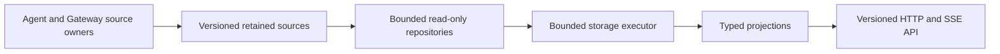
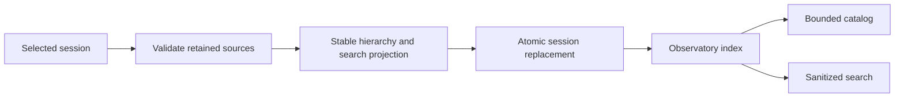
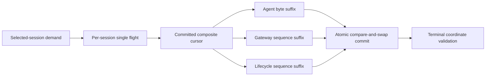
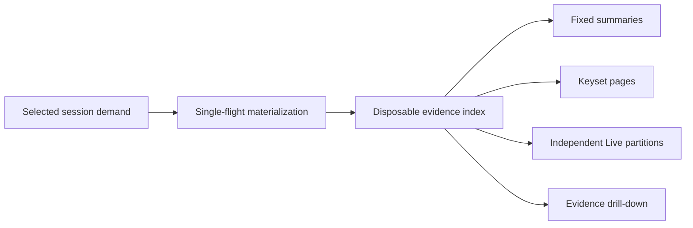
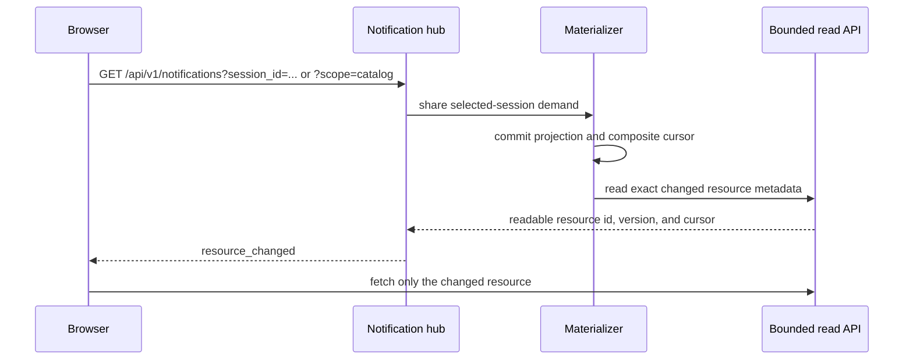
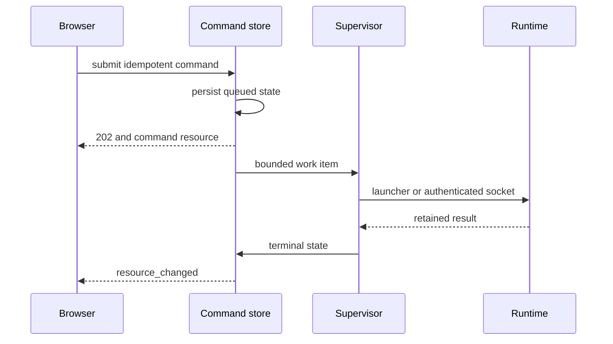
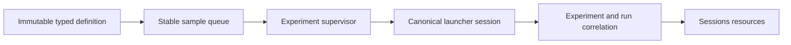
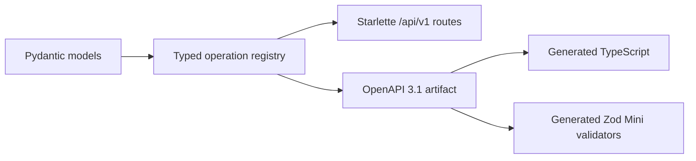
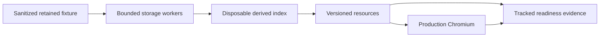

# Observatory v3 backend

This package owns the standalone Observatory backend.



## Source boundary

- The launcher owns registry schema version 1 and its migration from version 0.
- Gateway journals own schema version 1.
- The Observatory validates source schemas without mutating them.
- Unknown schemas fail without changing source bytes.
- Selected-session lookup uses the indexed registry identity.
- Evidence reads never widen to unrelated sessions.

## Repository responsibilities

| Module | Responsibility |
|---|---|
| `registry.py` | bounded catalog and direct session lookup |
| `events.py` | bounded gateway event pages |
| `agent.py` | byte-cursor agent JSONL pages |
| `operator.py` | bounded retained Goal and Nudge snapshots |
| `lifecycle.py` | launcher lifecycle history |
| `control.py` | effective control state without credential reads |
| `storage_executor.py` | bounded cancellation-aware off-loop execution |

`/api/v1` is the canonical bounded read contract. The `/api/ask` Live and
runtime-session query paths are retired. Recorded-session, experiment, and
knowledge compatibility questions remain available until their owning bounded
replacement gate.

## Disposable index



- `.boukensha/observatory/index-v1.sqlite3` is derived and disposable.
- Startup creates an empty schema and never scans retained sessions.
- An explicit rebuild reads one selected session before opening its transaction.
- UUIDv5 identities use retained source anchors, not display counters.
- Catalog reads use keyset pagination and never compute a total count.
- Full-text search indexes an explicit sanitized allowlist.
- The launcher registry and gateway journals remain query-only.
- Unknown or corrupt index schemas require explicit recreation.

## Incremental materialization



- The cursor covers source identities, native offsets, revisions, and optional
  knowledge state.
- Client tokens are versioned digests and expose no local source identity.
- Concurrent consumers share one off-loop advancement.
- Active work and queued sessions have fixed limits.
- Partial JSONL records remain behind the committed byte cursor.
- Replacement, truncation, and malformed evidence preserve the prior
  generation and record a capture fault.
- Atomic operator snapshots must retain their prior request count and
  immutable request history.
- A pending operator request may become applied once. Its committed Iteration
  and timestamp cannot move afterward.
- Source identity is confirmed after each retained read and before commit.
- Terminal demand validates registry, agent size, gateway and lifecycle high
  water, operator identity, and experiment correlation.
- Unchanged terminal demand rereads no retained payload. New coordinates resume
  incremental materialization.

## Bounded read resources



- `/api/v1/sessions` returns at most 50 catalog entries from registry keysets.
- `/api/v1/live/{session_id}/vitals` derives the observed player state from a
  bounded journal tail, without materialization, for roster stat bars.
- Catalog entries mark projection state as available, pending, or fault.
- Catalog event counts and latest sequences read the session journal directly.
  Turn and iteration counts come from the committed projection and stay null
  until materialization makes them known.
- Catalog players merge registry history with the configured gateway
  identities. `start_available` is authoritative: configured and not live.
- First selected-session summary, Goal, or evidence demand may return a typed
  `202 materialization_pending` resource while the canonical B4 single flight
  advances. Later reads converge to indexed content or a typed capture fault.
- Completed one-shot demands retire their handler bookkeeping. Bootstrap faults
  are retained in the disposable index and remain visible in the catalog.
- A read after cold materialization revalidates native source coordinates before
  serving indexed content, including evidence appended after the cold flight.
- Goal and Turn pages return at most 20 items. Iteration and one-level evidence
  child pages return at most 100 items.
- Evidence records preserve sanitized fields, ancestry, provenance, source
  routes, integrity digests, and bounded related identities.
- Oversized evidence fields, lifecycle details, and knowledge assertion values
  remain exactly reachable through explicit 65,536-byte base64 content chunks.
- Oversized registry display labels are bounded in summaries and catalogs with
  explicit capture gaps.
- Trace, search, cost, experiment, and knowledge growth uses opaque keyset
  cursors.
- Map responses contain at most 200 nodes, 400 edges, and 100 recent path
  identities. Backward cursors reach older windows without skipping nodes.
- Wire bodies require one SHA-256 identity and an explicit limit of at most
  65,536 bytes.
- Live publishes eight independently replaceable partitions with a 128 KiB
  payload budget.
- Missing retained sources appear as capture gaps. Derived index upgrades
  invalidate earlier projections before bounded reads resume.

## Resource notifications



- Event ids use `<server-epoch>:<change-counter>`.
- `Last-Event-ID` replays changes inside the current server epoch.
- Epoch mismatch and replay exhaustion return one bounded `reconcile` event.
- Restart reconciliation waits for the selected session's committed targets.
- Notifications identify readable resources and never carry raw evidence.
- Identical resource versions and cursors coalesce before publication.
- One watcher and one materializer flight serve every tab for a selected session.
- Disconnect removes only the subscriber. In-flight shared work reaches its safe
  boundary.
- Cold and post-bootstrap capture faults publish a readable faulted catalog.
- Terminal and capture-fault publications bypass identical-cursor suppression.
- Successful retained control receipts wake the selected-session watcher.

The transport has fixed in-memory bounds.

| Bound | Limit |
|---|---:|
| Shared replay records | 256 |
| Current resource identities | 256 |
| Reconciliation targets | 64 |
| Subscribers | 32 |
| Demanded sessions | 16 |
| Committed root targets per session pass | 14 |
| SSE retry hint | 1,000 ms |

### Catalog scope

- `GET /api/v1/notifications?scope=catalog` needs no session identity. One
  shared watcher publishes the catalog change target, the hub suppresses
  unchanged versions, and subscribers hear only real roster transitions:
  a session appearing, going live, or ending.
- A transient catalog read failure does not end the stream. The next tick
  retries against the source.

## Durable lifecycle commands



- `.boukensha/observatory/commands-v1.sqlite3` owns command identity and results.
- Command database reads and writes run off the event loop with a bounded busy
  timeout and typed unavailable responses.
- Start, stop, Goal, Nudge, pause, and resume persist before their effects.
- Start runs the agent through its own uv project with a persistent stdin
  objective and typed reset modes: none, temple, baseline.
- Start succeeds only when the new session is running, its control state is
  running, and any requested reset produced a successful receipt. The launcher
  stderr tail becomes the failure detail.
- The launched process and its stdin pipe are retained for the session
  lifetime. Stop closes and reaps them. Goal and Nudge wake an idle agent
  through the retained stdin envelope.
- Repeated idempotency keys return the original command without applying twice.
- Session commands validate the selected player and expected cursor.
- Command status remains readable at `/api/v1/commands/{command_id}` from the
  first queued start state through its terminal result.
- Notification targets carry explicit session and player association while
  keeping the command resource identity stable and readable.
- API restart reconciles queued and running work with the launcher registry.
- A registry created by the first start attaches read and notification services
  once before the command becomes terminal-visible.
- Cooperative control reuses the authenticated per-session operator socket.
- Forced stop requires a live registry PID that is its own process-group leader.
- Command resources expose no control token, credential, or local socket path.

## Durable experiments



- `experiments-v1.sqlite3` owns definitions, jobs, queue order, outcomes, and
  spend accounting.
- Definitions lock when execution starts. A changed payload needs a new version.
- Every sample id exists before launch and becomes the canonical run id.
- Runner input is typed direct argv. Arbitrary command fragments are rejected.
- The installed model catalog and numeric definition limits constrain every
  effective runner configuration before process creation.
- Definition-owned concurrency is bounded from one to four sample processes.
- A sample becomes terminal before its job can expose a terminal state.
- Success completion excludes unneeded queue entries after active processes
  exit.
- Restart marks uncertain in-flight work interrupted and never launches it
  twice.
- Stop and resume preserve sample identity, queue position, and retained spend.
- Stop sends TERM, waits for a bounded interval, and escalates to KILL when an
  owned process does not exit.
- Spend is rebuilt from retained sample rows. A per-sample or total overspend
  permanently blocks further launches.
- The launcher retains the complete experiment and run identity pair.
- Session links become visible only when the launcher registry contains the
  canonical pair.
- Aggregates are derived from retained sample rows and can be rebuilt.
- Catalog, job, definition, and queue growth use indexed keyset pages with one
  lookahead row.
- Experiment resource notifications share the existing bounded SSE replay and
  reconciliation channel.
- Dry-run and acceptance tests construct commands without model or external
  service calls.

## Public contract



- `/api/v1/openapi.json` publishes the local canonical schema.
- `/api/v1/health` and `/api/v1/capabilities` are the first callable resources.
- Resource notification and reconciliation shapes are reusable components on
  the callable SSE route.
- Optimistic command and durable status shapes follow the same rule.
- `openapi/observatory-v1.json` is the deterministic generation input.
- `openapi/operations.json` is the stable operation manifest.
- Unknown prior and future API versions return typed JSON errors.
- B5-replaced Live and runtime-session compatibility queries are not callable.

## Browser readiness evidence

One reproducible fixture carries backend work from retained sources through the
production browser gate.



- The fixture contains 38 sessions, 5,000 agent records, and 2,000 gateway
  events.
- Cold, warm, concurrent, reconnect, restart, running, stopped, partial, and
  long-session paths use retained local evidence.
- Each distribution excludes one warmup and records 20 samples.
- The report records p50 as the median and p95 as nearest rank.
- Payload, compressed payload, request, source-work, memory, event-loop, and
  layer measurements have no invented latency threshold.
- Resetting the derived index preserves resource identity, cursor, totals, and
  lifecycle from retained sources.
- Fifteen replaced legacy method and path pairs return a typed bounded `410`
  response before any retained source or streaming fallback.
- `readiness/retired-endpoints.json` records each retired method, path, route
  status, and versioned replacement.
- `tests/readiness/measure.py` generates the tracked JSON evidence.
- `tests/test_readiness.py` gates provenance, bounds, semantic rebuild, terminal
  route responses, zero source work, and canonical browser paths.

Generate the backend evidence from a fresh temporary fixture.

```bash
uv run python -m tests.readiness.measure \
  --output ../web/src/dev/backend-readiness.json
uv run pytest -q tests/test_readiness.py
```

## Development

Use the pinned Python and locked dependencies.

```bash
uv sync
uv run ruff format --check src tests
uv run ruff check src tests
uv run mypy
uv run pytest
uv run observatory-v3-openapi
```

## Dependencies

| Dependency | Role |
|---|---|
| Python `ThreadPoolExecutor` | owned fixed-capacity storage workers |
| AnyIO 4.14.2 | concurrency and cancellation tests |
| Pydantic 2.13.4 | typed runtime contracts |
| Starlette 1.3.1 | current stable local ASGI surface |
| Uvicorn 0.52.1 | local ASGI server |
| HTTPX 0.28.1 | ASGI and upstream contract tests |
| PyYAML 6.0.3 | shared settings parsing |
| openapi-spec-validator 0.9.0 | independent OpenAPI 3.1 contract gate |

The complete backend architecture and performance budgets are in
[the backend architecture plan](../../../docs/plans/week2_observ/observatory/backend_architecture.md).
